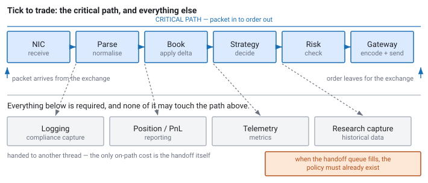

<!--
chapter: a1-system-data-flow
title: From Exchange Packet to Trade — Anatomy of an Electronic Trading System
state: revised
revision: r1 — author feedback: replace the per-stage bold-label template with flowing prose
governed by: standards/chapter-contract.md section 0 (front matter exemption — chapter 1 rules)
supersedes: chapter-v0-dataflow.md
-->

# From Exchange Packet to Trade

## The Anatomy of an Electronic Trading System

**Prerequisites:** none. Read the preface first if you have not.

---

## One packet

A market-making firm is quoting both sides of NVDA on Nasdaq: an offer to buy at one price, an offer to sell slightly higher. It earns the difference, in small amounts, many times a day.

Someone lifts their offer — buys the shares the firm was selling. That trade is now a fact about the world, and the exchange announces it to everyone at once.

The firm's remaining quotes are immediately suspect. It has just sold, so it holds less inventory than it planned to. And if that trade was the leading edge of real buying pressure, its resting bid is now offering to buy at a price the market has already moved past. Every microsecond until replacement quotes reach the matching engine is a microsecond in which someone else can trade against a price the firm would no longer choose to offer.

This chapter follows that one packet from the exchange's wire to the firm's replacement order. At each step the interesting question is not really what the software does — it is what makes that step *hard*, and why the answer keeps turning out to be something you already studied.

Because that is the honest shape of this field. There is very little in a trading system that is not a textbook concept under production pressure. Operating systems, computer architecture, networks, data structures, concurrency, distributed systems: you have met all of it. What you have probably not met is what happens when the acceptable answer is *always*, and the budget is microseconds.

Read this chapter for the map, not the mechanisms.

*Figure a1-1 — The path from packet to order, and everything that must stay off it. Off-path work runs concurrently, not afterwards; the only on-path cost is the handoff.* Almost everything named here gets a full chapter later; the point now is to know what exists and why it will matter.

---

## The exchange publishes

The matching engine executes the trade and records it, and its market-data system broadcasts a message describing what happened, along with any resulting change to the order book.

The word doing the work there is *broadcast*. The exchange is not replying to a request from you — it is announcing the same information to every participant simultaneously, and it has neither the capacity nor the desire to hold a separate conversation with each of the hundreds of firms listening. Fairness makes this more than an efficiency concern: a venue that reached some participants before others would have a regulatory problem, not merely a slow one.

So the request-response model most software is built around is off the table before we begin. What replaces it is one-to-many delivery, and that carries a consequence you will spend a whole chapter on later. Retransmitting individually to hundreds of receivers means some of them get their data later than others, which is precisely the unfairness the design exists to avoid. The broadcast is therefore *unreliable by design* — fire and forget, with the responsibility for noticing loss pushed out to you. ([d1], [d2])

## The network delivers

The message crosses from the exchange's infrastructure to yours: fibre, switches, and over longer distances possibly a microwave link, because light moves faster through air than through glass.

Distance is latency here, and latency is competitive position, which is why firms pay to place their servers inside the exchange's own building. Once everyone is colocated, the remaining variable is what happens inside your own rack. Every switch hop costs time, and — more importantly — switches under load cost *variable* time.

That distinction between fixed propagation delay and variable queueing delay is straight out of a networks course, where it is usually a paragraph. In this industry the first is a real estate decision and the second is a jitter source you will spend real effort hunting down. ([d2])

## The NIC receives

The network card pulls the packet off the wire and writes it into host memory. Between that moment and your code seeing the data lies more machinery than most engineers expect.

On the conventional path the card writes into a kernel buffer, raises an interrupt, the kernel processes the packet, and your application makes a system call to fetch it — a mode switch, at least one copy, and an interrupt handler, all sitting on the critical path with variance attached. The alternative is to cut the kernel out entirely: map the card's memory into your process and read the packets yourself. That is faster, and it means you have quietly signed up for a set of responsibilities the kernel had been handling on your behalf.

Everything in that paragraph is from your operating systems course — DMA, interrupts, the user/kernel boundary, the real cost of a system call. What the course probably did not convey is that a copy has a price proportional to size *and* a variance nobody budgeted for, or that the familiar polling-versus-interrupts tradeoff becomes, in this setting, a decision about how many CPU cores you are willing to burn doing nothing at all. ([d6], [c6], [b5])

## The feed handler parses

The bytes on the wire are in a venue-specific binary format, and the feed handler decodes them into whatever representation the rest of the system uses.

This code runs on every single message, so whatever it costs is multiplied by the message rate — and rates in equities and options are high enough that per-message costs which look negligible in isolation come to dominate everything. Two rules follow immediately and are close to universal in this industry: do not allocate, and do not copy anything you can avoid copying.

The prohibition on allocation is worth pausing on, because it is not really about speed. `malloc` is fast on average. It is *occasionally* slow, in ways you cannot predict — it may take a lock, walk a free list, or fault in a fresh page — and an operation that is usually fine and sometimes terrible is exactly the shape of problem this industry cares most about. Your data structures course treated allocation as free. Much of Module C is about arranging never to do it while the market is open. ([d1], [c2], [c3], [a5])

## Detecting what you did not receive

Every message carries a sequence number, and the handler checks it. Sequence 148,203 arriving right after 148,199 means three messages are gone.

This is the stage that most surprises people arriving from general software, so it is worth being blunt about what has happened: the order book you are building is now wrong, and nothing about it looks wrong. An incremental feed sends deltas rather than state, so three missing messages do not leave three gaps — they desynchronise the accumulator. Every price level is still populated, the spread still looks sensible, and the data is silently incorrect. It stays incorrect, too, because subsequent updates modify levels that are already wrong.

Recovering means obtaining the missing data or a fresh snapshot, and doing it while packets continue arriving at full rate, which rules out anything that blocks. You are, in effect, implementing the loss detection and recovery TCP would have given you for free — in the application, over a protocol that deliberately does not provide it, with a recovery design you chose yourself. ([d3])

## Handing the data across

The thread reading the network is rarely the thread making trading decisions, so something has to move data between them.

The obvious answer, a queue behind a mutex, fails twice over. It allocates on every push, which the previous stage already ruled out. And the producer can be descheduled while holding the lock, at which point your strategy thread is waiting on the operating system's scheduling decisions rather than on data, for an interval that nobody chose and nothing bounds.

What replaces it is a preallocated ring buffer with no locks at all, whose correctness rests not on mutual exclusion but on memory ordering: on establishing that a consumer which has observed the producer's index advance is *guaranteed* to see the data written before that advance. This is producer-consumer from your concurrency course with its usual comforts removed, and it drags two more pieces of the machine into view. Variables that merely happen to share a cache line will make two threads contend in hardware even when they share nothing in the program — a performance bug with no visible cause. And a consumer that finds the queue empty must do *something*: sleep and pay a wake-up cost, or spin and burn a core permanently. ([b1], [b2], [b3], [a6], [b5])

## Building the book

The order book holds resting buy and sell interest organised by price. The incoming message is a delta, and applying it keeps the book current.

Choosing the structure is a genuine engineering decision. You need fast updates at arbitrary prices, fast reads of the best bid and offer, and ordered iteration near the top of the book. A `std::map` gives you the right semantics and a pointer chase for every level. A hash map gives you lookup but no ordering. An array indexed by an offset from some reference price gives you both, at the cost of memory and a bounded price range.

What decides it, more often than not, is not algorithmic complexity but how many cache lines a typical operation touches. Big-O will not usefully separate these options at the sizes involved; the memory hierarchy will. Contiguous data can be prefetched and pointer chasing cannot, so a structure with worse asymptotics and better locality routinely wins. If there is one place where a data structures course and production performance work diverge sharply, it is here. ([e2], [a5])

## The strategy decides

The strategy reads the updated book and decides whether to act.

Two things about this stage tend to surprise people, and neither is the thing they expect. The first is that this is often *not* where the time goes. A market-making decision can amount to a handful of comparisons against precomputed values, and new engineers consistently overestimate its cost relative to the parsing and book maintenance surrounding it.

The second is that when many strategies sit behind an abstract interface, the dispatch mechanism itself lands on the critical path. Virtual calls, CRTP, variants, and type erasure differ here in ways that matter and that will not matter anywhere else in your career. The vtable indirection you learned about becomes an indirect branch the processor has to predict, and branch prediction becomes a live concern in its own right: a hot loop whose branches are predictable is much cheaper than one whose branches are not, which occasionally makes a branchless formulation faster despite doing more arithmetic. ([b6], [a4])

## Pre-trade risk

Before anything leaves the building it is checked: within position limits, within price sanity bounds, within message rate limits.

This is the one thing on the critical path that cannot be moved off it. An asynchronous risk check is not a risk check — by the time it fires, the order is at the exchange and may already have filled. So the requirement is not that it be fast on average but that it be *bounded*: every check completes within a known worst case, with no lookup that might be slow and no structure that might resize at an inconvenient moment.

There is an ordering consequence here too, easy to get wrong and expensive when you do. Exposure has to be counted before the order is sent rather than when the acknowledgement comes back, because between those two moments the order is live at the exchange and can trade. Worst-case bounded computation was a theoretical property in your algorithms course; here it is a design requirement with a regulator attached. ([e3], [a2])

## The gateway sends

The decision becomes a wire-format message on a session to the exchange.

Order entry is stateful and sequenced, and usually runs over TCP, because unlike market data you genuinely do need to know your order arrived. That is the opposite tradeoff from the one at the start of this chapter: you get reliability, and you pay for it with retransmission and congestion behaviour that will show up in your tail.

And the moment the message leaves, you enter a period of not knowing. The exchange's view of your order is the authoritative one and you cannot see it directly; what you hold is a belief, lagging by a network round trip, capable of being wrong in ways you cannot detect from the inside. That is a distributed systems problem wearing a trading costume — your local order state is a replica of the venue's, updated by messages that may be delayed, duplicated, or reordered — and it needs exactly the tools that problem always needs: idempotency, at-least-once delivery, and reconciliation after failure. ([a2], [e1], [d2])

## Everything else, at the same time

While all of that happens, the system is also logging every message for compliance, writing market data for research, maintaining positions and P&L, publishing telemetry, and answering the monitoring dashboard.

Every one of those is required, and none of them may touch the critical path. So the structural decision that shapes the entire architecture is simply this: what has to happen *before the order can be sent*? Everything else gets handed to another thread, and the only cost the critical path pays is the handoff itself.

Moving work off the path does not make it free, though — it converts a latency problem into a capacity problem. When the logging queue fills, you need to have decided already whether to block (which puts the disk back on your critical path), to drop and count, or to size the queue for the worst burst you expect. A system that has never considered the question has chosen "block" by default, and will find that out during its busiest minute of the year.

Underneath the compliance requirement sits an idea from databases that turns out to be one of the most useful in this business: if you write down everything that happened, in order, you can reconstruct later what the system saw and why it did what it did. That is how incidents get explained, and how changes get tested against history. ([d4], [e4], [b2])

## Underneath all of it

Some problems do not belong to any single stage. They belong to the machine.

Your threads run on particular cores and your memory lives on particular hardware. On a multi-socket host memory has a home node, and a thread reading memory attached to the other socket pays an interconnect crossing on every access — with the node chosen not by whoever called `malloc` but by whichever thread first writes to the page. Which core a thread runs on determines what it shares cache with, what preempts it, and whether a sibling hyperthread is competing for its execution resources. Leave that to the scheduler and you have left your tail latency to the scheduler.

Then there is time itself. Every timestamp came from some clock, and comparing one from the exchange against one from your NIC against one from your application only means something if you know what each clock is and how closely they agree.

None of this is knowable without measurement — and the first tool most engineers reach for, the sampling profiler, is structurally poor at finding rare events. Which is unfortunate, because rare events are exactly what tail latency is made of. ([c1], [c5], [c4], [d5], [a3], [a4])

---

## Your CS curriculum, mapped

The same information arranged the other way round: what you already studied, and where it lands.

| What you studied | Where it shows up | Chapters |
|---|---|---|
| Interrupts, system calls, mode switches | Getting a packet from the NIC into your code | [d6], [c6] |
| Virtual memory, page faults | Latency spikes at session start; where memory physically lives | [c1], [c5] |
| Scheduling, preemption | Why a lock-free queue exists; why threads are pinned | [b3], [c4] |
| Cache hierarchy, locality | Order book layout; every hot data structure | [a5], [e2] |
| Cache coherence | False sharing between threads that share nothing | [a6] |
| Memory consistency models | Correctness of every lock-free handoff | [b1], [b2] |
| Branch prediction, dynamic dispatch | Strategy dispatch on the hot path | [b6] |
| DMA | NIC receive, kernel bypass | [d6] |
| UDP, TCP, multicast | Market data in, orders out — and why they differ | [d1], [d2] |
| Reliable delivery, sequence numbers | Gap detection and recovery | [d3] |
| Producer-consumer | Every inter-thread handoff in the system | [b2], [b4] |
| Mutual exclusion vs lock-free | What the feed-to-strategy handoff can afford | [b3] |
| Dynamic allocation | Why the hot path never calls it | [c2], [c3] |
| Data structure selection | Book representation, order tables | [e2], [a5] |
| At-least-once delivery, idempotency | Duplicate fills, retries, reconnection | [e1] |
| State machine replication | Order lifecycle against an authoritative venue | [a2] |
| Clock synchronisation | Timestamp semantics, latency attribution | [d5] |
| Write-ahead logging | Capture, replay, incident reconstruction | [e4] |
| Columnar storage | Historical market data for research | [f2, release 2] |
| Worst-case analysis | Pre-trade risk; anything on the critical path | [e3], [a3] |

Two things are worth noticing about that table.

Nothing in it is exotic. There is no secret body of knowledge behind the door — there is a familiar body of knowledge applied under an unusual constraint, and the constraint is that the answer has to be right *every time*, quickly, including on the day when everything happens at once.

And that constraint changes which answer is correct. A hash map is the right choice in most software and sometimes the wrong one here. A mutex is the right choice in most software and sometimes the wrong one here. What you are learning is not a new set of facts but a different objective function — one that weights the worst case far above the average, because the worst case arrives when the market is moving, which is when the decisions are worth the most.

## The number that matters

The interval between the packet arriving at your NIC and the order leaving it is **tick-to-trade**. It is what the business buys, what you will be asked to reduce, and what every technique in this book is ultimately aimed at.

The implication is worth being precise about. Making an off-path stage twice as fast changes tick-to-trade by exactly nothing, and a great deal of wasted optimisation effort in this industry has gone into code that was never on the path at all. Before optimising anything, establish that it is on the path; before assuming where the time goes, measure.

It also helps to write the boundary down. Systems accumulate on-path work by accretion — a check here, a lookup there — and nobody notices until the number moves.

## Where to go from here

The chapters ahead fill in this map. Reading in order works, and each one names its prerequisites so you can also cut across to what you need.

Whenever you find yourself deep inside a memory-ordering argument, a placement decision, or a recovery state machine, the question that makes it matter is the one this chapter opened with: does this shorten the interval between the packet arriving and the order leaving — and does it still hold on the busiest day of the year?

**Related:** [a2] order lifecycle · [a3] latency and tail latency · [a4] measurement and profiling · [a5] cache locality · [a6] coherence and false sharing · [b1] memory model · [b2] SPSC ring buffers · [b5] waiting strategies · [b6] hot-path dispatch · [c1] virtual memory · [c2] preallocation · [c4] thread affinity · [c5] NUMA placement · [c6] mmap and zero copy · [d1] market data and protocols · [d2] transports · [d3] gap recovery · [d4] backpressure · [d5] clocks · [d6] kernel bypass · [e1] idempotency · [e2] order-book construction · [e3] pre-trade risk · [e4] deterministic replay

## References

*(Orientation chapter. Claims are practitioner framing per the taxonomy in `PROJECT_PLAN_V3.md` §5; sources belong on the specific chapters this one anchors. No figures are quoted here deliberately — the ones that matter are hardware- and venue-specific, and each is established in its own chapter.)*
