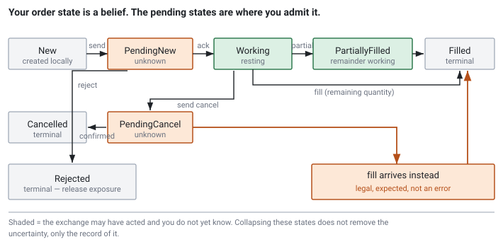

<!--
chapter: a2-order-lifecycle
state: draft_created
contract: standards/chapter-contract.md
include_measurement_plan: false | include_quizzes: true | primary_artifact_mode: pseudocode
unresolved_markers: 0
-->

# The Order You Cannot See

## Order Lifecycle and State Machines

**Prerequisites:** [a1] Trading-system data flow
**Focus:** your order state is a *belief* about the exchange's state, not the state itself — and the pending states exist to make the gap between them visible

---

## The cancel that was too late

A firm has a resting buy order on Nasdaq: 500 shares of NVDA at $178.40, sitting in the book, waiting.

News breaks. The strategy wants out, so the gateway sends a cancel.

While that cancel is travelling down the wire, someone hits the order. It fills. The exchange's matching engine — which has not yet seen the cancel — does what it is supposed to do and executes the trade.

For a few hundred microseconds:

- The **exchange** believes: order filled, 500 shares traded.
- The **firm** believes: order cancelled, no position, no exposure.

Both are acting on those beliefs. One of them is wrong, and it is not the exchange.

Now: the firm's system is about to receive two messages, in some order, and it does not control which. A fill for 500 shares. And a rejection of the cancel, because you cannot cancel an order that no longer exists. **Neither message is an error.** Both describe a completely normal outcome, and a system that treats either as an exception has a bug that will surface on a busy day.

## Where you will actually meet this

Every order gateway, execution management system, and pre-trade risk engine is built around this state machine. If you work anywhere near execution you will read it, extend it, or debug it.

*"What happens if you send a cancel and it fills first?"* is close to a mandatory interview question for execution roles. It is asked because the answer sorts people cleanly: engineers who have sent live orders answer it as routine, and engineers who have only read about trading treat it as a puzzle or an error case.

## The mental model

Here is the idea the whole chapter rests on.

**The exchange's view of your order is authoritative. You cannot see it.**

What you have is a local model — a belief — updated by messages that arrive after a network delay. Your belief lags reality by roughly one network trip, and during that window it can be wrong in ways you cannot detect from the inside.

That reframes what the state machine is for. It is not bookkeeping. It is a structured representation of *what you currently believe and how much you trust it.*

Which is why the states that matter most are the ones that mean **"I do not know yet."**

## Part 1 — The states, and why the pending ones exist

A simplified lifecycle. Real venues expose more, but these carry the ideas:

| State | Meaning | Confidence |
|---|---|---|
| `New` | Created locally, not yet sent | Certain — nothing exists anywhere else |
| `PendingNew` | Sent, no acknowledgement yet | **Unknown** |
| `Working` | Acknowledged, resting at the venue | High, but one round trip stale |
| `PartiallyFilled` | Some quantity executed, remainder working | High, same staleness |
| `PendingCancel` | Cancel sent, not yet answered | **Unknown** |
| `Filled` | Fully executed | Terminal |
| `Cancelled` | Confirmed cancelled | Terminal |
| `Rejected` | Venue refused it | Terminal |

The three interesting states are the pending ones, and beginners routinely try to remove them.

The temptation is understandable. You send a cancel; surely you can mark the order `Cancelled` and move on? It is what you asked for, and it makes the code simpler.

But you did not cancel the order. **You requested a cancellation.** The order is at the exchange, it is live, and until the exchange responds it can still trade. Marking it `Cancelled` records a belief you have no evidence for — and worse, it *erases the fact that you are uncertain*. The pending state is not an inconvenience in the model; it is the model's way of telling you there is a live order you may still be on the hook for.

Collapse those states and you have built a system that is confidently wrong for a few hundred microseconds at a time, several thousand times a day.


*Figure a2-1 — The shaded states are the ones where the exchange may already have acted and you do not yet know. Collapsing them removes the record of the uncertainty, not the uncertainty.*

---

**Quiz 1**

You send a cancel for a working order. Your state machine moves it to `PendingCancel`. The next message you receive is a **fill for the full quantity**.

What is the correct new state, what do you do with the pending cancel, and what does your position look like?

> **Answer**
>
> **State: `Filled`.** It is terminal. The order executed and no longer exists at the venue.
>
> **The pending cancel resolves as a no-op.** A cancel-reject will likely follow, saying the order was unknown or already complete. **That reject is not an error.** It is the venue correctly reporting that your request arrived after the order was gone. If your system logs it as a failure, alerts on it, or retries, you have built noise into your busiest days.
>
> **Your position changed.** You own 500 shares. The strategy asked to cancel and got a fill instead — so any logic that assumed the cancel would succeed is now operating on a false premise, and it must find out from the fill, not from the cancel request.
>
> The trap: treating the fill as arriving "too late" to matter. It is not late. **You do not get to choose between the cancel and the fill** — the exchange already chose, before your cancel arrived, and it is telling you what happened. Your job is to accept it.
>
> The general lesson: a cancel is a *request*, and every request has at least two normal outcomes. Design for both, not for the one you wanted.

---

## Part 2 — Transitions, as conditions and behaviour

The form you need for an interview is the mapping from *event* to *transition*, and specifically what is legal from where.

```
on send_order:
    state = PendingNew
    // exposure was already counted — see the ordering rule below

on acknowledgement:
    PendingNew        -> Working
    anything else     -> protocol error, investigate; do NOT silently ignore

on fill (partial):
    Working | PartiallyFilled | PendingCancel | PendingReplace
                      -> PartiallyFilled
    // legal from the pending states: the order was live the whole time

on fill (remaining quantity):
    any non-terminal   -> Filled          (terminal)

on rejection:
    PendingNew        -> Rejected         (terminal)
    // the order never existed at the venue; release the exposure you counted

on send_cancel:
    Working | PartiallyFilled  -> PendingCancel

on cancel_accepted:
    PendingCancel     -> Cancelled        (terminal)

on cancel_rejected:
    PendingCancel     -> back to the state before the request
    // usually because the order already filled — expect the fill to arrive
    // around the same time, in either order

on session_disconnect:
    every non-terminal order -> state is now UNTRUSTED
    // see Part 3 — you must reconcile, not assume
```

Two rules that are easy to state and easy to get wrong.

**A fill is legal from a pending state.** `PendingCancel` does not protect the order. It records that you asked; the order kept trading while you waited. A state machine that rejects fills from `PendingCancel` will drop real executions.

**Terminal states are terminal.** Once `Filled`, `Cancelled`, or `Rejected`, no transition leaves. Late duplicate messages arrive routinely — network retries, session recovery, venue resends — and the machine must absorb them without changing anything ([e1]).

### The ordering rule that costs money

There is one sequencing hazard in this chapter, and it is the most expensive mistake in the whole lifecycle. When sending an order:

1. **Increment your risk exposure locally.**
2. **Send the message to the venue.**
3. **Await the acknowledgement.**

Not: send, then count exposure when the acknowledgement arrives.

The reason is the same reason the pending states exist. Between step 2 and step 3 the order is **live at the exchange**. It can fill in that window. If you only count exposure on acknowledgement, then during that window the order exists, can trade, and your risk engine believes you have no exposure from it.

One order, once — probably survivable. But it fails in exactly the situation you built the limit for: a strategy firing a burst of orders, each one live and uncounted while the next is being sent. Your position limit is checked against a number that systematically understates reality, precisely when it is doing the most work.

And the failure is **silent**. Nothing errors. Nothing logs. The limit simply permits more than it should, and you find out from the position at the end of the day.

Count first, then send. If the order is rejected, release the exposure — a brief overstatement is a safe error, and an understatement is not.

---

**Quiz 2**

Your trading process crashes mid-session and restarts in four seconds. Local order state was in memory and is gone.

What do you know about your working orders, and what must the system do before it resumes trading?

> **Answer**
>
> **You know nothing.** And crucially, *nothing* is not the same as *none*.
>
> Orders you sent before the crash are still resting at the exchange. They are still live. They can still fill — and they have been filling, unwatched, for four seconds. The exchange did not notice your restart and had no reason to care.
>
> Before trading resumes, the system must **reconcile against the venue**: request the current state of all orders for the session, or read the drop-copy feed, and rebuild local state from what the venue says rather than from what you remember.
>
> The trap is assuming a fresh process means a flat position. It is the single most dangerous assumption in this chapter, because everything looks clean: no orders in memory, no position, no exposure, all systems green. The system will happily send new orders while old ones it does not know about are trading against it — and the risk limit, checked against a position of zero, permits all of them.
>
> There is a matching hazard on the way out: an order sent right before the crash may have no local record at all, so you cannot even ask about it by ID unless the ID was recorded *before* the send. Which is why client order IDs are assigned and persisted first, and never reused after a send whose outcome is unknown ([e1]).
>
> The general lesson: **local state is a cache of the venue's state, and caches do not survive crashes.** The venue is the source of truth, and reconnection means reconciliation.

---

## Common mistakes

**Treating a cancel as a command.** It is a request with at least two normal outcomes.

**Collapsing the pending states.** They exist to make uncertainty explicit. Removing them does not remove the uncertainty; it hides it.

**Treating a cancel-reject as an error.** It usually means the order filled — a normal, expected sequence that will fire constantly on busy days if you alert on it.

**Counting exposure on acknowledgement rather than on send.** The silent one. Costs money in bursts.

**Assuming a restart means flat.** Quiz 2. Reconcile, do not assume.

**Assuming fills arrive in the order the trades happened.** They may not, particularly across a reconnect. Sequence numbers and venue timestamps order events; arrival order does not ([d3], [d5]).

**Treating a rejection as a no-op.** A rejection is a transition to a terminal state, and it must release the exposure you counted before sending. "Nothing happened" is wrong — you counted something, and now you must un-count it.

**Modelling fewer states than the venue exposes** because the smaller machine is easier to write. The venue's states exist because those situations occur. If you do not model one, you will encounter it anyway, without a name for it.

## Operational behaviour

- **Alert on orders stuck in a pending state.** A pending state past a threshold is *unknown exposure*, which is the worst kind. This is one of the most valuable alerts in an execution system.
- **Reconcile continuously, not only at startup.** Compare your count of live orders against the venue's. A divergence is a serious defect and you want to find it in the afternoon, not at settlement.
- **Log every transition with venue timestamps.** Post-trade reconstruction, regulatory enquiry, and your own incident analysis all depend on being able to replay what the system believed and when ([e4]).
- **Have a defined kill path.** When state is untrustworthy, the correct action is usually to cancel everything the venue reports as live and stop, rather than to reason about it live. Most venues offer a bulk cancel; know how yours works before you need it.

## When to model less than this

- **Fire-and-forget flows** with no cancellation, where the machine collapses to sent / filled / rejected.
- **Venues that acknowledge synchronously** on the same connection before anything can trade — the pending window still exists, but it is not observable, and modelling it buys nothing.
- **Backtests and simulations**, where fills are decided by your own model and there is no remote authority to disagree with. Note this is precisely why a backtest cannot tell you whether your live order handling is correct.

## Interview mapping

- **Draw the state machine including pending states**, unprompted. Omitting them is the most common weak answer.
- **Answer the cancel/fill race as routine.** Both outcomes are normal, the cancel-reject is expected, and neither is an error. This is the question, and it is worth having a crisp answer ready.
- **Say when exposure is incremented, and why.** On send. Volunteering this is a strong signal.
- **Explain what you know after a restart.** "Nothing — I'd reconcile against the venue" separates people who have operated these systems from people who have not.
- **Use the word *belief*, or something like it.** Framing local state as a lagging model of an authoritative remote state is the underlying insight, and interviewers notice when a candidate has it.

## Summary

An order exists at the exchange, and everything your system holds is a belief about it, lagging by one network trip and revised by messages you do not control the arrival order of. The pending states are the honest representation of that lag: they say *I have asked, and I do not yet know.* Removing them does not make the uncertainty go away, it only makes it invisible.

Every consequence follows from that. A cancel is a request with more than one normal outcome. A fill from `PendingCancel` is legal, because the order was live the whole time you were waiting. Exposure is counted before the send, because the order can trade before you hear back. And after a disconnect your beliefs are worthless — not empty, worthless — so you reconcile against the venue rather than assuming a clean slate.

This machine sits inside the order gateway from [a1], at the far end of the critical path. Everything upstream exists to decide what to send; this chapter is about honestly tracking what happened next.

**Related:** [a1] system data flow · [e1] idempotency and duplicate handling · [e3] pre-trade risk · [e4] deterministic replay · [d1] market data and protocols · [d3] sequence numbers and gap recovery · [d5] clocks and timestamps

## References

*(Foundation chapter; claims are practitioner framing per the taxonomy in `PROJECT_PLAN_V3.md` §5. A Stage 1 source pack should add a publicly redistributable venue order-handling specification to make the state names concrete — a candidate for the venue-specific appendix permitted by contract §3.12.)*
