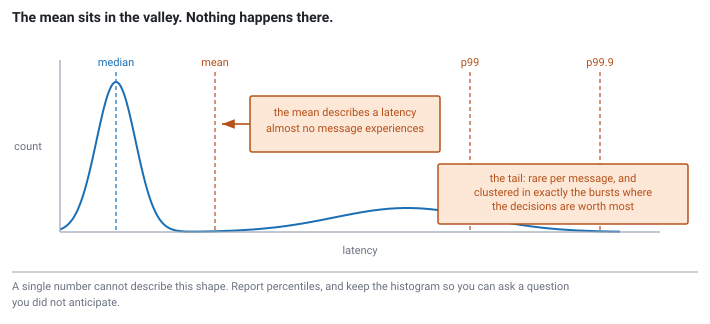

<!--
chapter: a3-latency-throughput
state: draft_created
contract: standards/chapter-contract.md
include_measurement_plan: true | include_quizzes: true | primary_artifact_mode: none
unresolved_markers: 0
-->

# The Worst Microsecond of the Day

## Latency, Tail Latency, Jitter, and Throughput

**Prerequisites:** [a1] Anatomy of an electronic trading system
**Focus:** the tail is the product — this system is judged on its worst microseconds, not its average ones

---

## Two systems, one desk

A firm builds two versions of its execution path and benchmarks them side by side on the same feed, same hardware, same trading day replayed.

System A has a median tick-to-trade a third lower than system B. On almost every message it wins.

The desk runs system B.

The reason is not in the medians, because the medians were never the question. System A is faster nearly always and occasionally very slow — and the occasions cluster, because the same conditions that make it slow are the conditions that produce them: bursts of market data, thousands of messages arriving in a few hundred milliseconds. Which is to say system A is at its worst precisely when the market is moving. Precisely when the firm's decisions are worth something.

System B is slightly slower all the time and does not have that behaviour. Over a trading day it makes more money.

An average hid the only thing that mattered.

## Where you will actually meet this

Every performance conversation in this industry is conducted in percentiles. Not as a formality — because the average genuinely does not describe these systems, and everyone involved knows it.

The practical consequence for you is immediate: **a candidate who reports a mean latency in an interview has told the room they have not worked on a latency-sensitive system.** It is one of the fastest tells there is. Not because the mean is a stupid number, but because reaching for it signals you have not internalised what these systems are optimised for.

The vocabulary in this chapter is also the vocabulary every later chapter argues in. When [b5] weighs spinning against blocking, or [c5] explains why remote memory access hurts, the argument lands in terms defined here.

## The mental model

Four words that get used interchangeably by people who should know better.

**Latency** is how long one operation takes. Not a number — a *distribution*. Every message that flows through your system produces one sample, and the collection of them has a shape.

**Tail latency** is the slow end of that distribution: the 99th percentile, the 99.9th, the maximum. "p99 of 40 microseconds" means 1% of messages took longer than 40 microseconds.

**Jitter** is the variability itself — how spread out the distribution is. A system with a 20µs median and a 22µs p99 has low jitter. One with a 5µs median and a 90µs p99 has high jitter, even though it is faster most of the time.

**Throughput** is how many operations complete per unit time. Related to latency, but not its reciprocal, and frequently in tension with it.

The single most useful habit in this chapter is to stop thinking of performance as a number and start thinking of it as a shape.


*Figure a3-1 — A real latency distribution is bimodal and right-skewed, so the mean lands between the modes and describes a latency almost nothing experiences.* <!-- CALLBACK: a1 -->

## Part 1 — Why the tail is the product

Three reasons, and they compound.

**The distribution is not symmetric.** Latency has a floor — the work genuinely takes some minimum time — and no ceiling. Nothing goes faster than the fast path, but a page fault, a cache miss cascade, a scheduling delay, or a lock held by a descheduled thread can each make one operation dramatically slower. So the distribution is heavily right-skewed, and the mean sits above the bulk of the samples, describing a value that almost never occurs. In a bimodal distribution — fast path and slow path, which is what most of these systems really are — the mean lands in the empty valley between the two modes, describing neither.

**The tail is not rare in absolute terms.** "p99" sounds like an edge case until you multiply by volume. A system handling a million messages a day has ten thousand of them in the p99 tail. That is not an anomaly you can shrug at; it is a routine occurrence, several times a minute.

**The tail is correlated with the moments that matter.** This is the argument that makes the other two decisive. Slow events cluster during bursts, and bursts happen when the market moves. So your worst latency arrives when prices are changing fastest — when quotes go stale quickest, when the opportunity is largest, and when being late is most expensive. The tail is over-weighted economically relative to its frequency, and by a lot.

Put those together and the conclusion is not "also watch the tail." It is that for a trading system, **the tail is closer to being the product than the median is.** The median describes how the system behaves when nothing is happening.

---

**Quiz 1**

Two implementations of the same order gateway:

- **System X:** median 5µs, p99 60µs, p99.9 400µs
- **System Y:** median 9µs, p99 12µs, p99.9 15µs

X is faster on the typical message by a wide margin. Which would you put on a market-making desk, and what would change your answer?

> **Answer**
>
> **System Y**, and it is not close.
>
> X is quicker on the quiet messages, which are the ones where speed is worth least. On its worst messages it is roughly seven times slower than Y at p99 and nearly thirty times slower at p99.9 — and those slow messages are not distributed randomly across the day. They cluster in bursts, which is when quotes go stale and the firm is exposed. X is fast when it does not matter and slow when it does.
>
> Y is also predictable, and predictability has value of its own: you can build a latency budget around a system whose worst case you know. You cannot build one around X without provisioning for 400µs, at which point X's median advantage buys you nothing.
>
> **What would change the answer:** if this path were not latency-critical at all — an end-of-day process, a research pipeline, a control-plane interface — then the median is a reasonable thing to optimise and X is a fine choice. The tail argument is specific to paths where being late has a cost that scales with market activity.
>
> The general lesson: 4µs of median improvement is not worth 348µs of p99.9 degradation on a hot path. Trades in that shape look attractive in a benchmark summary and are usually the wrong call.

---

## Part 2 — Latency and throughput are different questions

These get conflated constantly, and the confusion produces real design errors.

**Latency** asks: how long does *this one* message take?
**Throughput** asks: how many messages can I get through per second?

A system can be excellent at one and poor at the other. The clearest illustration is batching, which is the canonical trade in this space.

Suppose your handler can process messages individually, or wait to accumulate a hundred and process them together. Batching amortises per-operation overhead across many messages: one system call instead of a hundred, one pass over a data structure that stays cache-warm, fewer branch mispredictions. **Throughput goes up, often substantially.**

And the first message in every batch now waits for ninety-nine more to arrive before anything happens to it. **Latency goes up**, by exactly the accumulation time.

Neither direction is right in general. A research pipeline processing a day of history wants throughput and does not care that any individual message waited. A quoting engine wants the first message handled now. Most of the interesting cases sit between: adaptive batching that processes immediately when quiet and batches under load, which is a real design and a real chapter ([d4]).

The point to carry forward is that **"make it faster" is not a specification.** Faster in which sense? Nearly every optimisation in this book improves one of these at some cost to the other, and knowing which one you are buying is half of the engineering.

### Jitter as a first-class property

There is a design instinct worth naming, because it runs against the grain of most performance work: **a slower, more predictable system is often better than a faster, erratic one.**

That is what the opening scenario is really about. It sounds like a compromise and it is not — it is a direct consequence of everything in Part 1. Determinism lets you build a budget, reason about worst cases, and know what your system will do on the day it matters. That is why so much of Modules B and C is spent eliminating *variance* rather than reducing averages: preallocating so you never fault, pinning threads so the scheduler cannot surprise you, avoiding locks so a descheduled thread cannot stall a running one. <!-- CALLBACK: a1 -->

Most of those techniques barely improve the median. They are all about the tail.

### What determinism looks like in code

That argument stays abstract until you see the shape of a program that has an unnecessary tail. Three patterns, all common, all easy to recognise once you know to look. None of the mechanisms are explained here — each has its own chapter — but the *property* is visible from the code alone.

**Amortised is not the same as predictable.**

```cpp
// code-a3-1 | ILLUSTRATIVE — the property, not the mechanism
std::vector<Order> live;
for (auto& o : incoming)
    live.push_back(o);          // amortised O(1)
```

`push_back` is amortised constant time, and that is a true statement about the average. It is achieved by occasionally allocating a larger block, copying everything across, and freeing the old one. So most calls are a pointer bump and a few are a multi-microsecond stall — and the stalls happen when the container grows, which is when messages are arriving fastest.

```cpp
live.reserve(MAX_LIVE_ORDERS);  // one allocation, at startup
```

The total work barely changes. The *distribution* changes completely: one large cost moved off the trading path and onto startup, and every subsequent `push_back` is now the same cost as every other. The same argument applies to any amortised structure — hash maps rehash, deques allocate blocks, strings reallocate ([c2]).

**Periodic work on the hot path becomes the tail.**

```cpp
// code-a3-2 | ILLUSTRATIVE
void on_message(const Message& m) {
    process(m);
    if (++count % 1000 == 0)
        flush_statistics();     // 999 fast messages, then one slow one
}
```

Nine hundred and ninety-nine messages pay nothing and one pays for all of them. The mean is barely affected — which is exactly the problem, because it means a mean-based benchmark will report that this code is fine. The thousandth message is a tail event you built deliberately, and it fires during bursts more often simply because bursts contain more messages.

The fix is not to make `flush_statistics` faster. It is to hand it to another thread so no message pays for it ([a1], [b2]).

**Wall-clock branching makes latency unreproducible.**

```cpp
// code-a3-3 | ILLUSTRATIVE
void on_message(const Message& m) {
    process(m);
    if (now() - last_flush > std::chrono::seconds(1)) {   // time-dependent
        flush();
        last_flush = now();
    }
}
```

This is the previous pattern with an extra problem. Which message pays the cost now depends on wall-clock time, so it is different on every run — and a stall you cannot reproduce is a stall you cannot bisect. Reading the clock on the hot path is itself not free, and its cost varies by platform and configuration ([d5]).

The general principle behind all three: **a hot path should do the same amount of work every time it runs.** Where that is impossible, the variable part belongs on another thread. When you meet preallocation in [c2], lock-free handoffs in [b2], or waiting strategies in [b5], this is the property they are all serving.

---

**Quiz 2**

A team benchmarks their order gateway with a load generator that sends a message, waits for the response, then sends the next. It runs for ten minutes at roughly 10,000 messages per second and reports a p99 of 30µs.

During the run, the gateway stalls completely for 10 milliseconds — a page fault storm during a burst.

How many samples in that report reflect the stall, and what is wrong with the resulting p99?

> **Answer**
>
> **One sample.** The harness was waiting for a response, so it sent nothing during the stall. When the gateway recovered, one message recorded roughly 10ms and the harness carried on. Out of about six million samples, a single outlier moves the p99 not at all.
>
> But look at what actually happened in production terms. At 10,000 messages a second, a 10ms stall means **around a hundred messages should have been sent during that window** — and every one of them would have been delayed, by amounts ranging up to the full 10ms. The correct measurement records a hundred bad samples. The harness recorded one.
>
> This is **coordinated omission**: the measurement harness is throttled by the very stall it is trying to measure, so it systematically fails to sample the periods when the system is worst. The bias is not random and it does not average out. It always understates the tail, and it understates it most severely when the tail is worst.
>
> The fix is to send on a schedule rather than on completion — decide when each message *should* go, and if the system is not ready, count the delay from the intended send time rather than the actual one.
>
> The general lesson: a benchmark that waits for the system it is measuring will report that the system is fine. When someone shows you a tail latency number, the first question is how the load was generated.

---

## Common mistakes

**Reporting a mean.** It describes a value that rarely occurs in a skewed distribution, and in a bimodal one it describes nothing at all.

**Averaging percentiles.** You cannot take the p99 from each of sixty one-minute buckets and average them to get the hour's p99. Percentiles are not additive. You need the underlying samples, or a structure that merges properly — which is why latency is usually recorded as a histogram rather than as summary statistics.

**Treating p99 as an edge case.** At a million messages a day it is ten thousand events.

**Optimising the median because it is easier to move.** The median responds to almost any change, which makes it satisfying to work on and a poor guide.

**Assuming latency and throughput move together.** They frequently oppose each other, and batching is the mechanism that makes the opposition explicit.

**Benchmarking with a closed-loop harness.** Quiz 2. Extremely common, and it always flatters the system.

**Optimising the tail of an off-path stage.** The whole framework applies to the critical path. The logging thread's p99.9 is not interesting ([a1]).

## Operational behaviour

- **Record histograms, not summaries.** Once you have thrown away the samples you cannot recompute percentiles, merge across hosts, or ask a question you did not anticipate. Store the distribution.
- **Report the percentiles that reflect your worst case**, which usually means going further out than p99 — p99.9 and maximum both carry information the p99 hides.
- **Correlate tail events with market activity.** A spike is a mystery until you know that message rates tripled two milliseconds earlier, at which point it is a capacity finding.
- **Alert on the tail, not the average.** An alert on mean latency will fire after the incident is over.
- **Keep a maximum.** It is the least statistically respectable number and often the most operationally useful, because it is the only one that tells you what the system is *capable* of doing to you.

## When this framing does not apply

- **Off-path work.** Logging, telemetry, research capture. Throughput and correctness matter; tail latency does not ([a1]).
- **Batch and research workloads.** A backtest over ten years of data is a throughput problem. Optimising its tail is effort spent on the wrong axis.
- **Lower-frequency strategies.** If positions are held for days, microseconds of execution latency are dominated by everything else. Correctness and capacity are the constraints.
- **Before you know where you are on the path.** The framework tells you what to optimise for, not what is slow. That is [a4].

## Optional — if you want to see it for yourself

*Everything above is an argument about the shape of a distribution. Ten minutes with a histogram of your own will do more than the argument did.*

The single most useful thing you can do with this chapter is **plot a latency distribution instead of summarising it.** Take any path you have instrumented, collect every sample rather than a running average, and draw the histogram. Two things usually become obvious at once: the distribution is not the bell curve people carry in their heads, and there is structure in the tail — distinct bumps that correspond to distinct causes, each of which is a lead worth following.

If you want the second experiment, take a closed-loop benchmark you already trust and rewrite it to send on a fixed schedule, recording delay from intended send time. Compare the two tails. The gap between them is coordinated omission, and seeing it in your own numbers makes it permanently memorable.

Two habits, both transferable:

- **Never report a single number** without saying which percentile it is.
- **State the load generation method** alongside the result. It is as much a part of the measurement as the hardware.

The reasoning pattern an interviewer is probing: know what your measurement can and cannot see, and be specific about what the number establishes. Here it establishes the behaviour of one path under one load pattern on one machine.

## Interview mapping

- **Answer in percentiles**, always, without being asked. This is the single strongest signal in the chapter.
- **Explain why the tail is over-weighted** — the correlation with market activity, not just the arithmetic of skew. Most candidates can say "tails matter"; fewer can say why they matter more than their frequency suggests.
- **Distinguish latency from throughput** with a concrete example, and name batching as the mechanism that trades one for the other.
- **Argue for a slower, more predictable system** where appropriate. Candidates who treat "faster" as unconditionally better reveal how they would make tradeoffs on the job.
- **Spot coordinated omission** if a benchmark is described to you. Volunteering it is a strong move.
- **Say you would look at the distribution.** Not "I'd measure it" — "I'd look at the shape, because the summary statistics will hide the thing I'm looking for."

## Summary

Latency in these systems is a distribution, not a number, and it is skewed: bounded below by the work itself, unbounded above by everything that can occasionally go wrong. The mean therefore describes a value that rarely occurs, and in the bimodal case describes nothing at all.

The tail matters more than its frequency suggests because slow events cluster during bursts, and bursts are when the market moves — so the system is at its worst exactly when its decisions are worth the most. That is why so much of this book is about removing variance rather than reducing averages, and why a slower, more predictable design is often the right call.

Throughput is a separate question, frequently in tension with latency, and batching is where the tension becomes explicit. Knowing which of the two an optimisation buys — and which it spends — is most of what "make it faster" actually means.

Everything downstream argues in these terms. When [b5] weighs a burned core against a wake-up cost, or [c5] explains why an interconnect crossing hurts more than its average cost implies, the argument is the one made here: the worst microsecond of the day is the one you are being paid for.

**Related:** [a1] system anatomy · [a4] measurement and profiling · [b5] waiting strategies · [c5] NUMA placement · [d4] batching and backpressure · [c1] virtual memory · [c4] thread affinity

## References

*(Claims here are practitioner framing per the taxonomy in `PROJECT_PLAN_V3.md` §5. Coordinated omission as a named measurement bias has a well-established literature; a Stage 1 source pack should pin a citable reference for it — it is the one `normative`-adjacent claim in the chapter.)*
