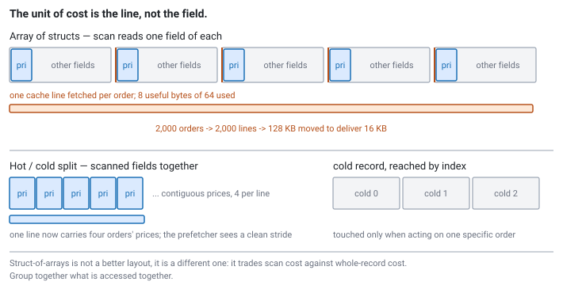

<!--
chapter: a5-cache-locality-and-layout
state: draft_created
contract: standards/chapter-contract.md
include_measurement_plan: true | include_quizzes: true | primary_artifact_mode: code
unresolved_markers: 0
-->

# Fetching a Kilobyte to Read a Price

## CPU Cache Locality and Data-Oriented Layout

**Prerequisites:** [a3] Latency and tail latency · [a4] Measurement and profiling
**Focus:** memory arrives in cache lines, not variables — so your layout decides how much of each fetch you actually use

---

## Two thousand orders, one field

A strategy keeps a table of its live orders. On every book update it scans the table, comparing each order's price against the new best bid to decide which ones need pulling.

There are two thousand orders. Each is a struct: price, quantity, client order ID, symbol, timestamps, venue, a state enum, some flags. Call it 192 bytes — not unreasonable, and nothing in it is waste. Every field is needed by something.

The scan reads one field. The price. Eight bytes out of 192.

But the machine does not fetch eight bytes. It fetches the 64-byte cache line containing them, and then, because the next order is 192 bytes further along, it fetches another line for that one, and another. Two thousand orders, one line minimum each: **128 kilobytes of memory traffic to deliver 16 kilobytes of prices.** Seven eighths of everything the memory system did is discarded on arrival.

The scan is a simple loop. There is no algorithmic inefficiency to find, no unnecessary work being done, and a profiler will show the time spread evenly across a comparison instruction that looks perfectly innocent. The cost is not in what the code does. It is in how the data is arranged.

## Where you will actually meet this

Anywhere a hot path walks over a collection:

- **Order tables**, scanned on every book update — the case above.
- **Instrument and symbol metadata**, consulted per message in the feed handler.
- **Order book levels**, where the representation choice is largely a locality choice ([e2]).
- **Risk state**, checked per order against limits ([e3]).

It is also a favourite interview topic, for a practical reason: the reasoning is testable on a whiteboard. An interviewer can write a struct and a loop, ask how many cache lines a pass touches, and learn a great deal from the answer without needing a machine.

## The mental model

One sentence: **memory moves between DRAM and cache in fixed-size lines — typically 64 bytes — so the unit of cost is the line, not the variable.**

Everything in this chapter is a consequence.

Reading one byte costs a line. Reading eight bytes costs a line. Reading 64 contiguous bytes costs a line. So the question that governs performance is not how much data you *read* but how many *lines you touch*, and the ratio between them — the fraction of each fetched line you actually use — is the number worth optimising.

There is a second mechanism worth having in mind. Hardware prefetchers watch access patterns, and when they detect a regular stride they fetch ahead, so the data arrives before you ask. This is why sequential access over contiguous memory is dramatically cheaper than the same number of accesses scattered around. Prefetchers cannot predict where a pointer points, so **pointer chasing gets no help at all** — every hop is a fresh miss, serialised, waiting.

That is the real reason a linked structure underperforms an array well past the point where its complexity says it should win. It is not the instruction count. It is that an array's misses are prefetched away and a linked list's are not. <!-- CALLBACK: a3 -->

## Part 1 — Counting lines

The useful skill is arithmetic, not intuition. Take the scan above.

**Array of structs.** Two thousand orders × 192 bytes = 384KB, laid out contiguously. The scan reads one 8-byte field from each. Since the stride is 192 bytes, each order's price sits in a different line, so the scan touches **2,000 lines minimum**, and the memory system moves 128KB. Useful bytes: 16KB. **Utilisation: 12.5%.**

Now restructure. Keep the prices in their own array, and everything else in a parallel array:

**Struct of arrays.** The price array is 2,000 × 8 = 16KB, contiguous. At 64 bytes per line that is **250 lines** — eight prices per line, all of them used. **Utilisation: 100%.** And because the access is a perfectly regular stride, the prefetcher handles it.

Two thousand lines against two hundred and fifty. The loop body is unchanged; the comparison is the same comparison. The difference is entirely in where the bytes were.


*Figure a5-1 — The scan is identical in both. What changes is how many lines it must touch to collect the same 16 KB of prices.*

```cpp
// code-a5-1 | RUNNABLE | C++20 | examples/, target: layout_scan

// Array of structs — the natural way to write it.
struct Order {
    double     price;        //  8   <- the only field the scan reads
    uint32_t   quantity;     //  4
    uint64_t   client_id;    //  8
    char       symbol[8];    //  8
    uint64_t   sent_ns;      //  8
    uint64_t   acked_ns;     //  8
    uint32_t   venue_id;     //  4
    uint8_t    state;        //  1
    uint8_t    flags;        //  1
    // + padding
};                           // ~56 bytes here; ~192 with realistic extra fields

std::vector<Order> orders;                       // one line touched per order

// Struct of arrays — the scanned field gets its own contiguous array.
struct OrderTable {
    std::vector<double>   price;                 // scanned every update
    std::vector<uint32_t> quantity;              // scanned sometimes
    std::vector<ColdData> cold;                  // everything else
};
```

### The pragmatic middle: hot/cold splitting

Full struct-of-arrays is often more disruptive than it needs to be. Every piece of code touching a whole order now indexes three arrays instead of dereferencing one pointer, and readability suffers.

The version that usually wins in practice is **hot/cold splitting**: keep the fields that are scanned frequently together, and push the rest into a separate structure referenced by index.

```cpp
// code-a5-2 | RUNNABLE | C++20 | examples/, target: layout_scan
struct OrderHot {          // exactly what the scan needs
    double   price;        // 8
    uint32_t quantity;     // 4
    uint32_t cold_index;   // 4   -> everything else
};                         // 16 bytes: four orders per cache line

std::vector<OrderHot>  hot;    // scanned
std::vector<OrderCold> cold;   // touched only when acting on a specific order
```

Four orders per line instead of one. The scan touches 500 lines instead of 2,000, the code stays close to what it was, and the rare operations that need the full record pay one extra indirection — on a path where they are not the bottleneck.

This is the shape of most real layout work: not a doctrinal conversion to struct-of-arrays, but a decision about which fields the hot path touches and putting those together.

---

**Quiz 1**

A feed handler keeps per-symbol state:

```cpp
struct SymbolState {
    uint64_t last_seq;        // 8   — read and written on EVERY message
    double   last_price;      // 8   — read on every message
    char     name[16];        // 16  — used only when logging
    uint64_t total_volume;    // 8   — updated on trades only
    char     description[64]; // 64  — used only in admin queries
    uint64_t stats[8];        // 64  — read by the stats thread, once a second
};

std::vector<SymbolState> symbols;   // 3,000 symbols
```

The per-message path reads `last_seq` and `last_price`. Assuming 64-byte lines, how many lines does a message touch, how many does it need, and what would you change?

> **Answer**
>
> The struct is **168 bytes**, so it spans three cache lines. `last_seq` and `last_price` are the first 16 bytes, so they land together at the start — meaning the hot path touches **one line per message**, not three. That part is already fine, by luck rather than design.
>
> **What it needs:** 16 bytes of a 64-byte line — **25% utilisation.** Of that line, 48 bytes are `name` and part of `description`, fetched on every single message and never used on the hot path.
>
> **What to change:** split hot from cold.
>
> ```cpp
> struct SymbolHot   { uint64_t last_seq; double last_price; };  // 16 bytes
> struct SymbolCold  { char name[16]; uint64_t total_volume;
>                      char description[64]; uint64_t stats[8]; };
> std::vector<SymbolHot>  hot;    // four symbols per line
> std::vector<SymbolCold> cold;   // same index
> ```
>
> Now four symbols share a line. For a single random symbol lookup that changes nothing — still one line. But 3,000 symbols now occupy 48KB of hot state instead of 504KB, which is the difference between a working set that stays resident in cache and one that does not. **That is the real win, and it is invisible if you only count lines per message.**
>
> The trap: answering "three lines" from the struct size. Layout is about *which* fields are adjacent, not how big the struct is — and the hot fields being at the front is doing more work here than anything else.

---

## Part 2 — When struct-of-arrays is the wrong answer

Splitting is not free, and it is not universally right. The tradeoff is direct.

Struct-of-arrays wins when you touch **few fields across many records** — a scan.

It loses when you touch **many fields of one record** — because those fields are now spread across several distant arrays, and what was one line fetch becomes one per field. Access an order's price, quantity, state, and venue in the fully split layout and you touch four lines where the array-of-structs version touched one.

So the layout follows the access pattern, and the honest version of the rule is:

> **Group together what is accessed together.**

Which is not "always split" and not "always keep it whole." If your dominant hot-path operation is a scan over one field, split. If it is acting on individual complete records, do not. If it is both — which is common — hot/cold splitting is usually the answer, because it optimises the scan while keeping a whole record one indirection away.

A related and cheaper lever: **field ordering**. Struct members are laid out in declaration order with padding inserted for alignment, so declaring fields largest-to-smallest typically shrinks the struct, and putting the hot fields first makes them likely to share a line. Neither costs anything beyond thinking about the order you type them in. Quiz 1's struct benefits from the second by accident; do it on purpose.

---

**Quiz 2**

A team converts their order table to full struct-of-arrays — one array per field — and the book-update scan gets substantially faster, as expected.

But end-to-end tick-to-trade barely improves, and the fill-handling path gets measurably *slower*.

What happened, and what should they have done?

> **Answer**
>
> **Two separate things, and the second is the interesting one.**
>
> **Why fill handling got slower.** Processing a fill touches one specific order and reads most of its fields — price, quantity, client ID, state, venue. In array-of-structs those sat in one or two lines. Fully split, each field lives in its own array at a completely different address, so the same operation now takes **one cache miss per field**, and none of them are prefetchable because they are independent random accesses. The layout was optimised for the scan and pessimised for exactly the operation that needs the whole record.
>
> **Why tick-to-trade barely moved.** The scan got faster, but the scan may not have been on the critical path — or may not have dominated it. This is the [a4] lesson arriving in practice: they optimised something measurable without first establishing it was the constraint. A large improvement to a stage that contributes little to the end-to-end number produces a large improvement to nothing that matters. <!-- CALLBACK: a4 -->
>
> **What they should have done:** hot/cold splitting. Price and quantity in the hot array for the scan; everything else in a cold record reached by index. The scan gets most of the benefit, and fill handling pays one indirection to reach a contiguous record instead of gathering five scattered fields.
>
> The general lesson: **struct-of-arrays is not a better layout, it is a different one.** It trades scan performance for whole-record performance, and if you have both access patterns you need a layout that acknowledges both. Measure the end-to-end number, not the stage you changed.

---

## Going deeper elsewhere

*Optional. Two mechanisms sit just underneath this chapter, and it is worth knowing they are there.*

**Virtual address translation.** This chapter has been quietly treating addresses as if they were memory locations. They are not — every address your program uses is virtual, and the hardware translates it to a physical address on every access, by walking a multi-level page table. That walk is itself cached, in the **TLB**, and a TLB miss costs several dependent memory accesses before your actual access can even begin.

This matters for layout in a way the line-counting arithmetic above does not capture: a scan that strides across many pages can exhaust TLB coverage and start paying translation costs on top of cache misses, which is one reason large-page configurations sometimes help. It also explains the first-touch behaviour that turns out to decide which NUMA node your memory lands on.

[c1] covers page faults, huge pages, and TLB behaviour as they affect latency, and [c5] covers the placement consequences. For the operating-systems groundwork underneath both — page tables, translation, and the memory hierarchy from the OS side — **Arpaci-Dusseau and Arpaci-Dusseau, *Operating Systems: Three Easy Pieces*** is thorough, free online, and the standard recommendation.

**Prefetcher behaviour.** This chapter says prefetchers reward sequential access and cannot follow pointers, which is enough to make the right layout decisions. Real prefetchers are more capable: they detect constant strides, sometimes multiple concurrent streams, and typically stop at page boundaries — that last detail interacting with the translation material above.

Knowing the specifics rarely changes a design and is not usually interview material, but it does explain otherwise puzzling measurements, such as a strided access pattern performing well at one stride and badly at another. The authority is your CPU vendor's optimisation manual for the specific part, which documents what its prefetchers detect. Do not generalise those details across vendors or generations.

## Common mistakes

**Assuming reading one field costs one field.** It costs a line. This single misconception is upstream of everything else in the chapter.

**Reaching for `std::map` or `std::unordered_map` on the hot path.** Their complexity is fine and their locality is not — node-based containers scatter allocations, so every lookup is a pointer chase the prefetcher cannot help with. A sorted array with a linear or binary search often beats them outright at the sizes involved here, despite worse asymptotics.

**Converting to struct-of-arrays doctrinally.** Quiz 2. It is a tradeoff, not an upgrade.

**Ignoring field ordering.** Free, and routinely leaves a struct larger than it needs to be.

**Benchmarking layout changes on a small working set.** If everything fits in L1 the layouts perform identically, and you will conclude the change did nothing. Layout matters at production sizes ([a4]).

**Optimising layout before establishing the scan is on the critical path.** The most expensive version of this mistake, because restructuring data touches a lot of code.

## Operational behaviour

- **Layout is coupled to an access pattern.** When the access pattern changes — a new field added to the scan, a new query — the layout should be revisited. Record why the layout is what it is, or the reasoning is lost and the next engineer will "tidy" it back.
- **Watch the hot working set size.** The most valuable outcome of splitting is often that the hot data now fits in cache. Track its size as symbol counts and order counts grow, because crossing a cache boundary is a cliff, not a slope.
- **Struct sizes are worth asserting.** A `static_assert` on `sizeof` catches the day someone adds a field to a hot struct and silently pushes it over a line boundary.

## When not to bother

- **The working set is small enough to stay resident.** If the whole table lives in L1 regardless of arrangement, layout changes nothing.
- **The access pattern touches whole records.** Then array-of-structs is already right.
- **The collection is small.** Scanning fifty items is not a memory problem however it is laid out.
- **The restructuring cost exceeds a measured benefit.** Splitting a struct touches every site that uses it, and readability is a real cost. Establish the win first ([a4]).
- **It is not on the critical path.** Off-path collections can be laid out for clarity ([a1]).

## Optional — if you want to see it for yourself

*The arithmetic above is convincing on paper. It is considerably more convincing as a graph with a cliff in it.*

The experiment takes twenty minutes and teaches more than the rest of the chapter. Build a table of records with one field you scan and several you do not. Scan it two ways — array-of-structs and hot/cold split — and sweep the record count so the working set grows from comfortably cache-resident to much larger than the last-level cache.

Plot time per element against working set size. Both layouts perform about the same while everything fits in cache, and then they diverge sharply at the point where they no longer do. **That divergence is the entire chapter, visible as a graph.** It also explains why a small benchmark would have told you the change was pointless.

Two habits worth keeping:

- **Sweep the size.** A single-size layout benchmark can support whichever conclusion you already had.
- **Report the environment**, including cache sizes for the machine, since the location of the cliff is a property of that hardware.

If your platform exposes hardware performance counters, cache miss counts per pass make the mechanism explicit rather than inferred — and inferring from timing alone is how people convince themselves of the wrong cause.

## Interview mapping

- **Count lines, not bytes**, when asked about a struct and a loop. Saying "the stride is 192 bytes so each element is a separate line" is the answer being looked for.
- **Ask about the access pattern** before proposing a layout. The right answer genuinely depends on it, and demonstrating that you know it depends is worth more than naming struct-of-arrays.
- **Explain why pointer chasing is expensive** in terms of the prefetcher, not just "indirection is slow."
- **Argue against struct-of-arrays** where whole-record access dominates. Interviewers do ask this, and doctrinal answers fail it.
- **Mention hot/cold splitting.** It is what people actually do and it signals practice rather than reading.
- **Note that node-based containers have a locality problem**, not a complexity problem.

## Summary

Memory arrives in cache lines, so the cost of a data structure is the number of lines a typical operation touches — and the fraction of each line you use is the ratio worth optimising. A scan over one field of a large struct wastes most of every line it fetches; putting the scanned fields together fixes it, either by full struct-of-arrays or, more usually, by splitting hot fields from cold.

But it is a tradeoff, not an improvement. Splitting helps scans over few fields and hurts operations that need whole records, so the rule is to group together what is accessed together — which means knowing the access pattern before choosing the layout. The related lever, field ordering, costs nothing but attention.

Underneath both is the reason the memory hierarchy so often beats algorithmic complexity here: contiguous access is prefetched and pointer chasing is not, so a structure with worse asymptotics and better locality wins routinely at the sizes these systems work with. That is the gap between a data structures course and the order book in [e2], and it is why [a6] — where two threads contend over a line they did not know they shared — follows directly from this one.

**Related:** [a1] system anatomy · [a3] latency and tail latency · [a4] measurement and profiling · [a6] coherence and false sharing · [e2] order-book construction · [e3] pre-trade risk · [c2] preallocation and pools · [b6] hot-path dispatch

## References

- Cache line size and prefetcher behaviour are documented per CPU family in the relevant vendor optimisation guide — the correct source for any specific figure, and the reason this chapter uses 64 bytes as a stated assumption rather than a universal constant. *(Stage 1 source pack to pin editions.)*
- Drepper, U. (2007). *What every programmer should know about memory*. Red Hat. [mechanism and background; dated, and its figures should not be treated as current]
- Arpaci-Dusseau, R. H., & Arpaci-Dusseau, A. C. (2018). *Operating systems: Three easy pieces* (1.00 ed.). Arpaci-Dusseau Books. [address translation, page tables, TLBs — available free online]
