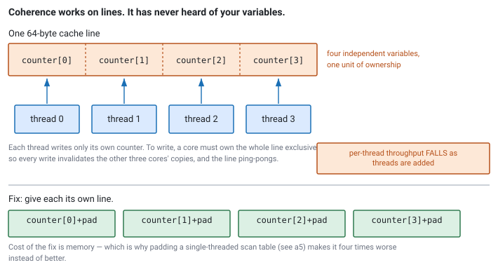

<!--
chapter: a6-coherence-and-false-sharing
state: draft_created
contract: standards/chapter-contract.md
include_measurement_plan: true | include_quizzes: true | primary_artifact_mode: code
unresolved_markers: 0
-->

# Four Threads, One Core's Worth of Work

## Cache Coherence and False Sharing

**Prerequisites:** [a5] Cache locality and data-oriented layout · [a4] Measurement and profiling
**Focus:** coherence works on whole cache lines and knows nothing about your variables — so threads that share nothing can still contend, invisibly

---

## The parallelism that wasn't

A feed handler is split across four threads, one per symbol group. The reasoning is sound: the groups are independent, nothing is shared between them, four cores should process roughly four times the messages.

Each thread keeps a counter of messages processed. The four counters are declared together in a small struct, because they are conceptually related and it is tidy:

```cpp
struct Counters {
    uint64_t group0;
    uint64_t group1;
    uint64_t group2;
    uint64_t group3;
};
Counters counters;   // 32 bytes, comfortably inside one cache line
```

Four threads. Barely more throughput than one. On some runs, less.

The team checks the obvious things. No locks. No shared data structures — each thread touches only its own symbol group and its own counter. No allocation on the path. The profiler shows time spread evenly across the increment instruction in all four threads, which is not a clue so much as a shrug: an increment is an increment.

Nothing in the program is shared. Everything in the hardware is.

Those four counters occupy 32 bytes, which means they live in **one cache line** — and the cache line is the unit the hardware works in. Four cores writing to one line take turns owning it, and the turn-taking costs more than the work.

## Where you will actually meet this

Anywhere threads write to nearby memory, which in practice means everywhere:

- **Per-thread statistics and counters**, exactly as above. The single most common instance.
- **Queue head and tail indices**, where producer and consumer each write one — the reason [b2]'s ring buffer pads them apart.
- **Per-thread state arrays** indexed by thread ID, a pattern that looks clean and puts every thread's state on the same few lines.
- **Any struct with a mutex next to the data it protects**, where the lock and the first fields share a line.

Padding shared structures is standard defensive practice at latency-sensitive firms. It comes up in interviews often, and it separates people cleanly, because a candidate either knows the mechanism or visibly does not — there is no way to reason your way to it from first principles in the room if you have never met it.

## The mental model

Each core has its own cache. Cores must nonetheless agree on the contents of memory: if one core writes a value, another core must not keep reading a stale copy forever. The hardware protocol that maintains that agreement is **cache coherence**, and the essential rule is:

> **To write to a line, a core must own it exclusively. Every other core's copy is invalidated first.**

That is the whole mechanism for our purposes. Reading is cheap and shareable — any number of cores can hold the same line for reading simultaneously, with no traffic between them. Writing is not. A write requires exclusive ownership, and acquiring it means messaging the other cores to invalidate their copies and waiting for that to complete.

Now the consequence that gives this chapter its name. **Coherence operates on lines. It has no idea your line contains four separate variables.** Ownership is all-or-nothing for the whole 64 bytes.

So when thread 0 increments `group0`, it must take exclusive ownership of the line — invalidating the copies held by the three cores that were about to write `group1`, `group2`, and `group3`. Each of those then has to take ownership back, invalidating the others in turn. The line ping-pongs between four cores, and every increment that should have been a register operation on cached data becomes a coherence transaction.

This is **false sharing**: contention created by physical adjacency rather than by logical sharing. The variables are genuinely independent. The hardware cannot tell.


*Figure a6-1 — Four threads, four independent variables, one unit of ownership. The fix separates them; its cost is memory, which is why it is wrong for a single-threaded scan table.* <!-- CALLBACK: a5 -->

## Part 1 — Why nothing will tell you

The reason this bug is worth a chapter rather than a footnote is that the usual tools do not find it.

**A sampling profiler shows you nothing useful.** The cost lands on an ordinary instruction — the increment — which now takes much longer than an increment should. The profiler faithfully reports time spent at that instruction, and the instruction is innocent. There is no function to blame, no lock to see, no system call. Just a cheap operation being inexplicably expensive, distributed evenly across all four threads because all four are equally affected ([a4]). <!-- CALLBACK: a4 -->

**The code review passes.** Every thread touches only its own data. That is exactly what the code says, and the code is right. The problem exists one level below the language, in a layout the source never mentions.

**The correctness tests pass**, because there is no correctness bug. False sharing never changes what your program computes. It only changes how long it takes — which is worth stating precisely, since it means no amount of testing will surface it and no sanitizer will flag it.

What *does* reveal it is a **scaling measurement**: throughput per thread as thread count rises. Real parallelism holds per-thread throughput roughly flat while the total rises. False sharing makes per-thread throughput fall as threads are added, because each additional thread is another contender for the same line. If your aggregate throughput is flat or worse with more threads and there are no locks in sight, this belongs near the top of your hypothesis list.

---

**Quiz 1**

A market-data system keeps per-connection state:

```cpp
struct Connection {
    std::atomic<uint64_t> packets_received;   // written by the receiving thread
    std::atomic<uint64_t> bytes_received;     // written by the receiving thread
    int                   socket_fd;          // read only
    uint32_t              remote_ip;          // read only
    char                  venue_name[16];     // read only
};

std::array<Connection, 8> connections;   // one thread per connection
```

Eight threads, one per connection, each writing only to its own element. Assume 64-byte lines. Where is the false sharing, and what is the fix?

> **Answer**
>
> `Connection` is **40 bytes**, so the array packs roughly 1.6 elements per line — meaning most lines hold parts of two different connections, and every line boundary falls in the middle of somebody's struct.
>
> Thread 0 writing `packets_received` in element 0 takes ownership of a line that also holds part of element 1. Thread 1 writing its own counters invalidates it right back. Eight independent threads contend across seven line boundaries, and no two of them ever agreed to share anything.
>
> **The fix is to make each element occupy whole lines of its own:**
>
> ```cpp
> struct alignas(64) Connection {
>     std::atomic<uint64_t> packets_received;
>     std::atomic<uint64_t> bytes_received;
>     int                   socket_fd;
>     uint32_t              remote_ip;
>     char                  venue_name[16];
> };
> ```
>
> `alignas(64)` on the type aligns each instance *and* rounds its size up to a multiple of 64, so array elements land on separate lines. The array grows from 320 bytes to 512 — the cost of the fix is memory, and here it is trivial.
>
> **Two traps in this question.** First, the read-only fields are not the problem: `socket_fd`, `remote_ip`, and `venue_name` are never written, and read-only sharing costs nothing — any number of cores can hold the line for reading. Only the two counters cause the contention. Second, and more common: the atomics are a red herring. `std::atomic` is not what makes this expensive. **Plain `uint64_t` counters in the same layout would contend identically**, because coherence is a property of the hardware, not of the type you declared.

---

## Part 2 — Fixing it, and not overdoing it

The fix is always the same shape: **get the contended variables onto different lines.** Two ways to say it in C++.

```cpp
// code-a6-1 | RUNNABLE | C++20 | examples/, target: false_sharing

// The problem: four counters, one line, four threads.
struct Counters {
    uint64_t group[4];
};

// Fix A — pad each counter out to a full line.
struct alignas(64) PaddedCounter {
    uint64_t value;
    // the compiler pads to 64 bytes because of alignas on the type
};
std::array<PaddedCounter, 4> counters;

// Fix B — align the members within a struct.
struct HandlerState {
    alignas(64) uint64_t producer_index;   // written by producer only
    alignas(64) uint64_t consumer_index;   // written by consumer only
    alignas(64) std::array<Message, 1024> buffer;
};
```

Fix B is the pattern you will meet again in [b2], where the queue's head and tail indices are separated for exactly this reason — and where the effect is at its most damaging, because it lands on the operation that runs once per market-data message.

Sixty-four bytes is the line size on current x86-64. Some architectures use 128, so the constant is an assumption worth stating in a comment rather than treating as universal.

### When not to pad

The instinct after learning this is to pad everything. Resist it, because padding has a real cost and the cost is not always trivial.

**Padding multiplies memory.** The 16-byte hot struct from [a5] — four orders per cache line — becomes 64 bytes padded, one order per line. If you have two thousand orders, you have just turned a 32KB hot array into 128KB, and quadrupled the number of lines a scan touches. **You have fixed a contention problem you did not have by creating a locality problem you now do.** These two chapters pull in opposite directions, and which one wins depends entirely on whether the data is written concurrently.

The rule that reconciles them:

> **Pack data that one thread scans. Separate data that several threads write.**

So: pad only what is **written by multiple threads concurrently**. Read-only data, single-threaded data, and rarely-written data all pack tightly, and should.

And as everywhere in Module A, establish the problem first. Padding on a hunch is how you end up with a struct that is eight times larger for no measured benefit ([a4]).

---

**Quiz 2**

A team finds false sharing on their per-thread counters and pads them to 64 bytes. Throughput improves substantially.

Encouraged, they apply the same treatment to the strategy's hot order table — padding each 16-byte order record out to a full cache line.

Throughput gets **worse**. Why?

> **Answer**
>
> **The order table is scanned by one thread, not written by several.** There was no contention to remove, so padding bought nothing — and it cost a great deal.
>
> Before: 16-byte records, four per line. A scan over 2,000 orders touches 500 lines.
> After: 64-byte records, one per line. The same scan touches **2,000 lines** — four times the memory traffic for identical work.
>
> Worse, the hot working set grew from 32KB to 128KB. If 32KB fit comfortably in L2 and 128KB does not, the scan has fallen off a cliff rather than down a slope, and the measured regression will be much larger than the 4× line count suggests ([a5]).
>
> The distinction the team missed: **padding fixes concurrent writes; packing fixes scans.** Their counters were the first case — several threads, each writing its own value. Their order table is the second — one thread, reading many records. Applying the counter fix to the table optimised for a problem that was not there and pessimised the one that was.
>
> The general lesson: false sharing and cache locality are the same mechanism seen from two sides, and their remedies are opposites. Ask *who writes this, and how many of them at once* before choosing. If the answer is "one thread," padding is never the answer.

---

## Going deeper elsewhere

*Optional. This chapter stops short of the mechanism underneath it. You do not need it to answer the interview question — but knowing it is a genuine plus, and it is better to know the gap is there than to carry a model with holes you cannot see.*

This chapter uses one rule — a write requires exclusive ownership, which invalidates other copies — and that rule is enough to predict which writes are expensive. The real protocol is a state machine, usually some variant of **MESI**, in which each line in each cache is in one of several states (Modified, Exclusive, Shared, Invalid) and transitions between them are driven by messages between cores.

Knowing it properly sharpens two things this chapter can only assert. It explains why *read-only* sharing is genuinely free — several caches hold the line in Shared and no messages flow — and why the first write to a line you already hold exclusively is cheap while the first write to a line another core holds is not. It also makes the cost model quantitative rather than qualitative.

It is not commonly asked in interviews, which is why the chapter stops. Very few candidates are expected to name protocol states. But the shallow version above is the *consequence* of the protocol, and if you want the mechanism underneath it, the standard reference is **Sorin, Hill, and Wood, *A Primer on Memory Consistency and Cache Coherence*** (Morgan & Claypool / Springer Synthesis Lectures) — a short, rigorous treatment covering exactly this and the memory-consistency material that [b1] uses. Your CPU vendor's architecture manual documents what its specific implementation does.

## Common mistakes

**Assuming independent variables means independent threads.** The premise of the whole chapter. The hardware works in lines.

**Expecting the profiler to find it.** It cannot. The cost lands on an innocent instruction with nothing to attribute it to.

**Blaming atomics.** `std::atomic` makes an operation atomic; it does not make it contended. Plain variables in the same layout contend identically. Conversely, an atomic that no other thread touches is cheap.

**Padding everything.** Quiz 2. It converts a contention fix into a locality regression.

**Padding read-only data.** Sharing a line for reading costs nothing. Only writes require exclusive ownership.

**Adding threads and expecting throughput.** If per-thread throughput falls as you add threads, something is contended — and if there are no locks, this is the first hypothesis.

**Forgetting the line size is an assumption.** 64 bytes today on x86-64, not universally.

**Confusing false sharing with true sharing.** If two threads are genuinely writing the *same* variable, padding changes nothing — the contention is real and the fix is a different algorithm, not a different layout.

## Operational behaviour

- **Track per-thread throughput, not just aggregate.** Aggregate throughput hides the shape of the problem; per-thread throughput falling as threads are added is the signature.
- **Treat poor scaling as a hypothesis, not a mystery.** "We added threads and it did not get faster" has a small number of likely causes, and this is one of the top few.
- **Assert struct sizes** on structures where padding is load-bearing. `static_assert(sizeof(T) == 64)` catches the day someone removes an `alignas` while tidying, which produces a silent performance regression and no test failure.
- **Comment the padding.** Unexplained `alignas(64)` looks like superstition and gets deleted. A one-line comment saying which threads write which field keeps it alive.

## When not to worry about this

- **Single-threaded code.** No coherence traffic, nothing to contend.
- **Read-only shared data.** Costs nothing regardless of layout.
- **Rarely-written data.** Contention scales with write frequency; a counter updated once a second is not a problem however it is laid out.
- **Memory-constrained contexts** where the structure is replicated many times. Padding an 8-byte value to 64 in a large array is an 8× memory cost, and it needs to be worth it.
- **Before you have established that scaling is the problem.** Not every disappointing parallel speedup is false sharing — check for locks, imbalanced work distribution, and memory bandwidth saturation too ([a4]).

## Optional — if you want to see it for yourself

*One of the more satisfying experiments in this book: a single keyword, a large and entirely repeatable difference.*

Write a program that starts N threads, each incrementing its own counter in a tight loop for a fixed duration. Run it with the counters in a plain array — adjacent, sharing a line — and again with each counter `alignas(64)`. Nothing else differs. Sweep N from 1 to the number of physical cores.

Plot **per-thread** throughput against thread count. The padded version stays roughly flat; the unpadded version falls away as threads are added. Seeing that divergence once makes false sharing permanently intuitive in a way that reading about it does not.

Two habits worth keeping:

- **Plot per-thread, not aggregate.** Aggregate throughput can rise slightly even under heavy contention, which obscures what is happening.
- **Pin the threads.** Unpinned threads may be scheduled onto the same physical core, at which point you are measuring the scheduler rather than coherence ([c4]).

If your platform exposes hardware performance counters, the counter for cache line transfers between cores makes the mechanism explicit rather than inferred from timing — worth doing, since inferring cause from timing alone is how people convince themselves of the wrong thing.

## Interview mapping

- **Spot it in a struct declaration.** The classic question is a small struct of per-thread counters. Recognising it immediately is the expected response.
- **Explain the mechanism**, not just the name. Exclusive ownership for writes, invalidation of other copies, ping-ponging between cores. "False sharing" as a label without the mechanism reads as memorised.
- **Say why the profiler will not find it.** A strong differentiator, and it demonstrates you have actually hunted one.
- **Note that atomics are not the cause.** Volunteering this shows you understand where the cost lives.
- **Argue against padding** where it is not warranted, ideally with the locality tradeoff from [a5]. Candidates who treat padding as free reveal they have only read about it.
- **Name the diagnostic**: per-thread throughput versus thread count. Interviewers ask "how would you confirm it?" and this is the answer.

## Summary

Cache coherence keeps cores agreeing about memory, and it does so per line: writing requires exclusive ownership, which invalidates every other core's copy. The hardware has no notion of your variables, so two threads writing different variables that happen to share a line contend as though they were writing the same one — paying full coherence cost for sharing that exists only in the layout.

It is invisible to the tools. No lock to see, no function to blame, no correctness failure, and a profiler that reports time on an innocent increment. The signature is per-thread throughput falling as threads are added, and the fix is to align the contended variables onto separate lines.

But the fix is precisely the opposite of what [a5] asks for, and both chapters are right. Packing tightly is what makes a single-threaded scan cheap; separating is what makes concurrent writes cheap. So the question that decides between them is not about the data but about who touches it: **pack what one thread scans, separate what several threads write.**

That question returns immediately in [b2], where a queue's producer and consumer each write one index — and where getting this wrong costs you on every market-data message that passes through the system.

**Related:** [a5] cache locality and layout · [a4] measurement and profiling · [a3] latency and tail latency · [b1] memory model · [b2] SPSC ring buffers · [b4] MPSC and contention · [c4] thread affinity · [c5] NUMA placement

## References

- Cache coherence protocols and line size are documented per CPU family in the relevant vendor architecture and optimisation guides — the correct source for any specific figure, and the reason this chapter states 64 bytes as an assumption rather than a constant. *(Stage 1 source pack to pin editions.)*
- Herlihy, M., & Shavit, N. (2020). *The art of multiprocessor programming* (2nd ed.). Morgan Kaufmann. [coherence, contention, and their effect on scalability]
- Sorin, D. J., Hill, M. D., & Wood, D. A. (2011). *A primer on memory consistency and cache coherence*. Morgan & Claypool. [the coherence protocol proper, and the consistency material [b1] builds on]
