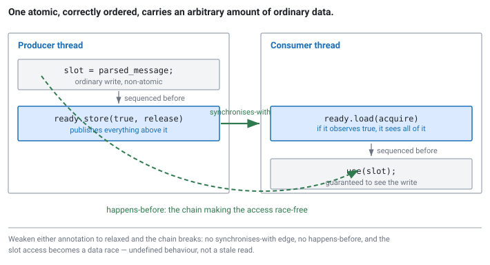

<!--
chapter: b1-cpp-memory-model
state: draft_created
contract: standards/chapter-contract.md
include_measurement_plan: false | include_quizzes: true | primary_artifact_mode: code
carries owed depth pointer dp-b1-01 (atomics/mutex implementation), raised by a6 Quiz 1
unresolved_markers: 0
-->

# What the Other Thread Can See

## C++ Memory-Model Foundations

**Prerequisites:** [b0] Threads, atomics, and locks · [a6] Cache coherence and false sharing
**Focus:** memory ordering is about visibility between threads, and every ordering in a correct program can be derived from asking what one thread must be guaranteed to observe of another's writes

---

## The message that was never written

A feed handler writes a parsed message into a shared slot, then sets a flag to say it is ready. The strategy thread spins until the flag is set, then reads the slot.

```cpp
// Producer                          // Consumer
slot = parsed_message;               while (!ready) { }
ready = true;                        use(slot);
```

Four lines. The logic is obviously correct: you cannot see `ready` set before it was set, and it is only set after `slot` was written.

It works on the developer's laptop. It passes code review — two engineers read it and neither has an objection, because there is nothing to object to in the logic. It runs in production for six weeks.

Then someone rebuilds with a different optimisation level, or ports a component to an ARM host, and the strategy starts occasionally using a message that was never written. Not a stale message. Not a torn one. Garbage — whatever happened to be in that slot from a previous lap around the buffer, or from initialisation.

Nothing about the code changed. What changed is which of the two reorderers decided to reorder.

## Where you will actually meet this

Every lock-free handoff in a trading system rests on this. The feed handler to strategy ring buffer ([b2]). The queue into the order gateway. Per-thread statistics published to a monitoring thread. Anywhere one thread writes something and another reads it without a mutex in between, the correctness argument is a memory-ordering argument, whether or not anyone wrote it down.

It is also among the most reliably asked deep C++ topics at latency-sensitive firms, and for a specific reason: **it cannot be bluffed.** Most C++ topics have a plausible-sounding answer available to someone who has read about them. This one does not. An interviewer asks what breaks if you weaken a particular ordering, and the answer either comes from a model of what is being guaranteed or it does not come at all.

## Why give up the mutex at all

[b0] ended with a tool that solves this cleanly. Put the write and the flag under a mutex and there is no bug: the block is indivisible, and a reader taking the same mutex cannot observe a half-finished handoff.

So it is worth being explicit about why the rest of this module does not do that.

A mutex makes a promise the operating system has to keep. If the thread holding it is descheduled — timeslice expired, interrupt arrived — every other thread waiting on it stops until the scheduler comes back, which can be milliseconds on a general-purpose kernel. On a feed-to-strategy handoff running once per market-data message, during a burst, that is not acceptable ([b3] takes this apart properly).

So the hot path drops the mutex. And in doing so it takes on an obligation the mutex was quietly discharging on your behalf: **the mutex was not only excluding other threads, it was also guaranteeing visibility.** Acquiring one gives you everything the previous holder did before releasing it. That is the same happens-before relationship this chapter is about — you were relying on it all along, and the mutex supplied it for free.

Remove the mutex and nobody supplies it. You do, by hand, with ordering annotations. That is the trade this chapter exists to explain:

| | Mutex | Lock-free with ordering |
|---|---|---|
| **Mutual exclusion** | Yes | Not needed — designs avoid contended writes |
| **Visibility between threads** | Automatic on acquire/release | **Your responsibility** |
| **If a thread is descheduled** | Everyone waits | System keeps moving |
| **Correctness argument** | "It's under the lock" | An explicit happens-before chain |
| **Cost of getting it wrong** | Deadlock — loud, reproducible | Rare wrong values — silent |

That last row is why this chapter is careful. A locking bug tends to announce itself. An ordering bug produces a message processed twice, six weeks from now, on one host class.

## The mental model

Two ideas, and the second is the one people miss.

**First: there are two reorderers, not one.**

The **compiler** reorders. It moves loads and stores, keeps values in registers instead of writing them, merges writes, and deletes reads it believes are redundant. It is allowed to do all of this because the C++ standard defines correctness in terms of a single thread's observable behaviour, and by that standard the reordering is invisible.

The **hardware** reorders. Stores sit in buffers before reaching cache; loads are satisfied out of order; different cores can observe writes in different orders. How much reordering is permitted depends on the architecture — x86 is comparatively strict, ARM and POWER much less so.

Both must be constrained, and this is why "x86 is strongly ordered so I do not need the annotations" is wrong. Even where the hardware would not reorder those two stores, **the compiler will**, and it needs no permission from the architecture to do so.

**Second: the model is about visibility, not about time.**

There is no global "now" in which one thread's write becomes a fact. The question the memory model answers is narrower and more useful: *given that thread B observed this particular value, what else is B guaranteed to see?* Everything in this chapter follows from asking that question about a specific pair of operations. <!-- CALLBACK: a6 -->

### Data races are undefined, not merely risky

Before the mechanics, one thing to be exact about, because it is routinely underestimated.

If two threads access the same memory location, at least one of them writes, and there is no synchronisation between them, that is a **data race**, and a program containing one has undefined behaviour. Not "may read a stale value." Not "may read a torn value." Undefined — the compiler was entitled to assume it could not happen, and may have optimised on that basis in ways with no relationship to the racing access.

The opening example is a data race. `slot` and `ready` are plain variables accessed by two threads without synchronisation. The bug is not that the stores got reordered; the reordering is a symptom. The bug is that the program has no defined meaning.

## Part 1 — Deriving the fix

Do not start from the ordering menu. Start from what must be true.

The consumer reads `slot` after observing `ready == true`. For that read to be well defined, the producer's write to `slot` must **happen-before** the consumer's read of `slot`. Happens-before is the relation the standard uses to define what is visible to whom; where it holds there is no race, and where it does not, there is.

Within a single thread, program order gives it to you: the producer's write to `slot` happens-before its write to `ready`. What is missing is a link *between* the threads.

That link is exactly what release and acquire provide:

- A **release** store publishes everything the storing thread did before it.
- An **acquire** load on the same atomic object, *if it observes that stored value*, makes all of it visible.

So:

```cpp
// code-b1-1 | RUNNABLE | C++20 | examples/, target: publish_consume
std::atomic<bool> ready{false};
Message slot;                       // plain, non-atomic — that is the point

// Producer
slot = parsed_message;                                  // (1)
ready.store(true, std::memory_order_release);           // (2) publishes (1)

// Consumer
while (!ready.load(std::memory_order_acquire)) { }      // (3) observes (2)
use(slot);                                              // (4) sees (1)
```

Chain it: (1) is sequenced before (2) in the producer. (2) synchronises-with (3) because a release store was observed by an acquire load on the same object. (3) is sequenced before (4) in the consumer. Therefore (1) happens-before (4), the access to `slot` is not a race, and the consumer sees the message.

Note what the annotations bought. `slot` is still an ordinary non-atomic `Message`, and copying it is still an ordinary copy. **One atomic variable, correctly ordered, makes an arbitrary amount of ordinary data safe to hand over.** That is the pattern behind every ring buffer, every publish-subscribe handoff, and every "here is the data, here is the flag" design in this book.

The orderings were derived, not chosen from a list. That derivation is the transferable skill.


*Figure b1-1 — Program order within each thread, plus one synchronises-with edge between the atomics, composes into happens-before across the boundary.*

---

**Quiz 1**

An engineer changes the release store to relaxed, reasoning that the target is x86, where the hardware does not reorder stores with other stores:

```cpp
slot = parsed_message;
ready.store(true, std::memory_order_relaxed);   // was release
```

The stress test passes on every run. What is wrong, and why did the test not find it?

> **Answer**
>
> **The reasoning is about the wrong reorderer.** It is true that x86 hardware will not move the store to `ready` ahead of the write to `slot`. It is not true that the code is safe, because **the compiler is under no such constraint** — `slot` is a plain variable, `ready.store` with relaxed ordering imposes no constraint on any other memory, and the compiler is free to sink the write to `slot` past it, or keep it in a register, or defer it entirely.
>
> More fundamentally: with relaxed ordering there is no synchronises-with edge, so no happens-before, so the access to `slot` is a **data race and the program is undefined**. Whether the generated assembly happens to look fine is not the question.
>
> **Why the test passed.** At any given optimisation level, on any given compiler version, the reordering may simply not occur — the compiler is *permitted* to reorder, not obliged to. So the test exercises one particular compilation of the program, and a passing result says nothing about the next one. The bug appears when someone changes a flag, upgrades the toolchain, inlines a function differently, or builds for a weakly ordered target. All of those are routine.
>
> The general lesson: **`memory_order_release` constrains the compiler as much as the hardware**, and on x86 that is the *only* thing it does — a release store compiles to a plain `mov`. The ordering is free at the instruction level and mandatory at the source level. Testing cannot establish its absence is safe.

---

## Part 2 — The ordering menu, and what each one buys

Five orderings in practice. What matters is what each guarantees about *other* memory.

**`relaxed`** — the operation is atomic, and operations on *this one object* have a consistent modification order that all threads agree on. That is all. It says nothing about the visibility of any other memory, in either direction. Correct for a statistics counter nobody uses to publish anything; wrong for a flag that guards data.

**`acquire`** (loads) — nothing that appears after this load in program order may be moved before it, and if it observes a release store, everything before that store becomes visible.

**`release`** (stores) — nothing that appears before this store may be moved after it, and everything before it becomes visible to a thread that observes the value through an acquire.

**`acq_rel`** — both, for read-modify-write operations like `fetch_add` or `compare_exchange`, which are simultaneously a load and a store.

**`seq_cst`** — release/acquire *plus* a single total order over all `seq_cst` operations in the program that every thread agrees on. **This is what you get when you omit the ordering argument**, as [b0] did throughout. That default is deliberate: code written without thinking about ordering is not wrong because of ordering. It is also the most expensive option, and weakening it is what the rest of this chapter licenses you to do.

The first four are about **pairwise** relationships: this store to that load. `seq_cst` is the only one that gives you a **global** ordering, and it is the only reason to reach for it.

### What release/acquire genuinely does not give you

This is the part that separates people who have a model from people who have a mnemonic, and it is the standard follow-up question.

```cpp
// code-b1-2 | ILLUSTRATIVE — the classic store-buffering shape
std::atomic<int> x{0}, y{0};
int r1, r2;

// Thread 1                                    // Thread 2
x.store(1, std::memory_order_release);         y.store(1, std::memory_order_release);
r1 = y.load(std::memory_order_acquire);        r2 = x.load(std::memory_order_acquire);
```

Can both `r1` and `r2` be zero?

Intuitively no: one of the stores must happen first, and the thread that stores second should see the other. That intuition assumes a global timeline, and there isn't one.

Release/acquire creates an edge only when an acquire load **observes the value written by a release store**. Here, neither load observes the other's store — both read zero — so no synchronisation edge is created in either direction, and there is nothing tying the two threads together at all. Both reading zero is permitted, and on real hardware it happens, because each thread's store can still be sitting in a store buffer when the other's load executes.

Making both operations `seq_cst` forbids it, because now all four operations must fit into one total order that every thread agrees on, and no such order has both loads reading zero.

**This is what `seq_cst` is for**, and it is the honest answer to "when do I actually need it": when correctness depends on multiple threads agreeing about the relative order of operations on *different* objects. That is rarer than its default status suggests — and it is not free, because on x86 a `seq_cst` store requires a locked instruction or a fence where a release store is a plain `mov`.

### The orderings, side by side

| Ordering | Applies to | Guarantees about *other* memory | Typical use |
|---|---|---|---|
| `relaxed` | load, store, RMW | **None.** Atomicity and per-object modification order only | Statistics counters, reference counts being incremented, a thread reading its own index |
| `acquire` | load, RMW | Nothing after it moves before; sees everything before the release it observed | Consumer reading a ready flag or peer index |
| `release` | store, RMW | Nothing before it moves after; publishes all prior writes | Producer publishing a filled slot or a ready flag |
| `acq_rel` | RMW only | Both, for one read-modify-write | `fetch_add` that both claims and publishes |
| `seq_cst` | all | Release/acquire **plus a single total order** across all `seq_cst` ops | Multi-object ordering all threads must agree on; the default |

Reading it as a ladder is the wrong picture. `relaxed` and `seq_cst` sit at the ends, but `acquire` and `release` are not "medium strength" — they are *directional*, and they only do anything **in pairs**. A release with no matching acquire synchronises with nothing at all.

### What the pairs look like in practice

Three patterns cover almost everything you will write.

**Publish data, then a flag.** The opening scenario, and the shape of every handoff in this book: write the payload, release-store the flag; acquire-load the flag, read the payload. One atomic carries an arbitrary amount of ordinary data.

**Publish data, then an index.** The same pattern where the flag is a counter. The producer writes slot `n`, then release-stores `n+1`; the consumer acquire-loads the index and reads everything below it. This is exactly [b2]'s ring buffer — and its two release-acquire pairs, running in opposite directions, are this chapter's argument applied twice.

**Reference counting.** Increment with `relaxed` (nothing is being published, only counted); decrement with `release` and, on reaching zero, `acquire` before destroying — because the destroying thread must see everything every other holder did.

The rule underneath all three: **release where data becomes visible to others, acquire where you start depending on someone else's data, relaxed where the value is not standing for anything else.**

---

**Quiz 2**

A queue's consumer publishes how many items it has consumed, for monitoring:

```cpp
std::atomic<uint64_t> items_consumed{0};

// Consumer, once per item
items_consumed.fetch_add(1, std::memory_order_relaxed);

// Monitoring thread, once a second
report(items_consumed.load(std::memory_order_relaxed));
```

A reviewer objects that relaxed is unsafe. Are they right? And what would change the answer?

> **Answer**
>
> **The reviewer is wrong here, and relaxed is exactly correct.**
>
> `fetch_add` is atomic regardless of ordering, so the count is never lost or torn no matter how many threads increment it. Relaxed also guarantees that all threads agree on the modification order of *this object*, so the monitoring thread sees a value that really was the count at some point — never a value that never existed.
>
> What relaxed does not provide is any relationship to other memory. And nothing here needs one: the counter is not guarding anything, not publishing anything, and not being used to infer that some other data is ready. The monitoring thread reads a number and prints it. A stale-by-a-few-increments count in a once-a-second report is not merely acceptable, it is unavoidable anyway.
>
> **What would change the answer:** if anything used the counter to conclude something about other memory. For instance, if the monitoring thread did `if (items_consumed.load() > 0) inspect(last_consumed_item);` — now the counter is publishing the readiness of `last_consumed_item`, the load needs to be `acquire`, and the increment needs to be `release`. The variable did not change. **Its job did.**
>
> The general lesson: the required ordering follows from what the value is *used to conclude*, not from what type it is or how many threads touch it. "Several threads write it, so it needs seq_cst" is not a derivation. Ask what must be visible, and to whom.

---

## Common mistakes

**Assuming x86's strong ordering removes the need for annotations.** It constrains one of the two reorderers. Quiz 1.

**Treating `volatile` as a threading tool.** `volatile` tells the compiler not to optimise away accesses to that object — it was designed for memory-mapped hardware registers. It does not make an access atomic, does not constrain the hardware, and says nothing about other memory. Sharing a `volatile` variable between threads without synchronisation is a data race with the same undefined behaviour as sharing a plain one. (Java's `volatile` does mean something like `seq_cst`, which is a persistent source of confusion for people arriving from that language.)

**Thinking a data race means a stale or torn value.** It means undefined behaviour. The compiler optimised on the assumption it could not happen.

**Defaulting to `seq_cst` and planning to tune later.** "Later" never arrives with better information than you have now, because the derivation in Part 1 is all the information there is. And on the hot path the cost lands on an operation running once per market-data message.

**Weakening an ordering because a benchmark got faster.** If the derivation does not support the weaker ordering, the faster program is wrong. This is the one place where "measure it" is the wrong instinct.

**Assuming a passing test means correct ordering.** It means one compilation on one architecture produced no observable failure. See [b7].

**Using `relaxed` on a flag that guards data.** The most common real bug in this area, and the reason Quiz 2 is worth its space: relaxed is right for a counter and wrong for a flag, and the difference is what the value is used to conclude.

## Going deeper elsewhere

*Optional. Not needed to answer the interview question — but understanding it is a genuine plus, and it answers the obvious next question.*

[a6] pointed out that `std::atomic` is not what makes false sharing expensive, which leaves something unresolved: what does an atomic actually *compile to*, and why is an uncontended one nearly free while a contended one is not?

The short version is that an atomic read-modify-write becomes a single instruction the hardware executes while holding the cache line exclusively — so its cost is the coherence cost from [a6], plus a constraint on the core's own reordering. Loads and stores with acquire and release ordering often need no extra instruction at all on x86; the annotation's whole effect is on the compiler. And a mutex is built from these primitives plus a way to sleep when the lock is unavailable: on Linux, a futex, which stays entirely in user space in the uncontended case and only enters the kernel when a thread actually has to wait.

Knowing this makes the cost model concrete rather than memorised, and it explains why "atomics are slow" is wrong in the uncontended case and right in the contended one. For the algorithms and the hardware primitives together, **Herlihy and Shavit, *The Art of Multiprocessor Programming*** (2nd ed.) is the standard reference; your vendor's instruction-set manual is the authority for what any particular instruction guarantees on your machine. For the memory-consistency theory underneath the C++ model, **Sorin, Hill, and Wood, *A Primer on Memory Consistency and Cache Coherence*** covers it directly.

## Operational behaviour

- **Write the ordering argument down, next to the code.** A comment saying which store publishes what, and which load observes it. Without it, the next person to edit the file has no way to know which annotations are load-bearing, and weakening one produces a bug that will not show up in review or in testing.
- **Memory-ordering bugs do not fail cleanly.** They produce rare wrong values — a message processed twice, a price that was never quoted, a counter that drifts. If you are debugging something that only happens under load and cannot be reproduced, and there is a hand-rolled handoff involved, suspect this early.
- **Record the architecture in incident notes.** A bug that appears only on one host class is a strong signal, and it is easily lost.

## When not to use atomics at all

- **When a mutex is simpler and the path is not hot.** Config reload, session setup, anything off the critical path ([a1]). A mutex is easier to write, easier to read, and easier to get right.
- **When the data structure is complex.** Lock-free correctness arguments do not compose well. If you are reaching for atomics to protect a structure with several invariants, you are probably building something that needs [b3]'s attention and [b7]'s testing.
- **When you cannot state the visibility requirement.** If you cannot say what must be visible to whom, you cannot derive the ordering, and picking one is guessing.

## Interview mapping

- **Derive, do not recite.** "The slot write must happen-before the slot read, so I need a release on the publish and an acquire on the observe" is the answer. "Release-acquire on the flag" is the same conclusion with the reasoning removed, and interviewers can tell.
- **Say what breaks under relaxed** — and specifically that the compiler, not the hardware, is the problem on x86. This is the highest-signal single fact in the chapter.
- **State what relaxed does guarantee.** Atomicity and per-object modification order. Candidates who think relaxed means "no guarantees at all" have a mnemonic, not a model.
- **Know when `seq_cst` is genuinely needed** — multi-object ordering that all threads must agree on — and be able to describe the store-buffering example.
- **Be exact that a data race is undefined behaviour**, not a stale read.
- **Volunteer that `volatile` is not for threading.** It comes up, and getting it right takes five seconds.

## Summary

Two things reorder your program — the compiler and the hardware — and both must be constrained. On x86 the compiler is usually the only one that would have reordered, which is why code that omits the annotations passes every test until the day someone changes a build flag.

The model is about visibility rather than time. A release store publishes everything before it; an acquire load that observes that store makes all of it visible. Chain those with program order and you get happens-before, which is what makes an access race-free — and one correctly ordered atomic can carry an arbitrary amount of ordinary data across the boundary. That pattern is the foundation of every handoff in Module B.

Relaxed gives you atomicity and nothing about other memory, which makes it right for a counter and wrong for a flag. Sequential consistency adds a total order across all such operations, which is what you need when threads must agree about operations on *different* objects — rarer than its default status implies, and not free on the hot path.

The transferable part is the derivation. Ask what must be visible to whom, then pick the weakest ordering that guarantees it — starting from the `seq_cst` default and weakening only where the argument supports it, never the reverse. [b2] applies exactly this to a ring buffer, and every lock-free structure after it is the same argument with more moving parts.

**Related:** [a6] coherence and false sharing · [b2] SPSC ring buffers · [b3] progress guarantees · [b4] MPSC and contention · [b7] testing concurrent code · [a1] system anatomy · [a4] measurement

## References

- ISO/IEC. (2020). *ISO/IEC 14882:2020 — Programming languages — C++*. International Organization for Standardization. [atomics and the memory model]
- Williams, A. (2019). *C++ concurrency in action* (2nd ed.). Manning. [the memory model with worked examples]
- Herlihy, M., & Shavit, N. (2020). *The art of multiprocessor programming* (2nd ed.). Morgan Kaufmann. [hardware primitives beneath atomics and locks]
- Sorin, D. J., Hill, M. D., & Wood, D. A. (2011). *A primer on memory consistency and cache coherence*. Morgan & Claypool. [the consistency theory underneath the C++ model]
