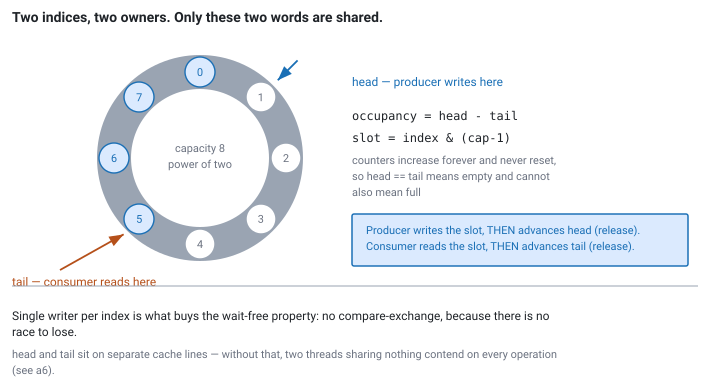

<!--
chapter: b2-spsc-ring-buffer
state: revised
revision: r1 — author feedback: narrow focus to memory ordering + index movement,
           simplify base implementation, layer optional material, add industry anchor
unresolved_markers: 0
-->

# The Handoff That Cannot Block

## SPSC Ring Buffers

**Prerequisites:** [b1] C++ memory-model foundations · [a6] Cache coherence and false sharing
**Focus:** why each memory ordering is what it is, and why the index arithmetic is correct

---

## Where you will actually meet this

The single-producer single-consumer ring buffer is the standard thread-to-thread handoff in low-latency market-data systems. If you join an HFT or market-making firm, you will find one — usually several — on the critical path:

- **Feed handler → strategy.** A thread decoding exchange messages hands normalised updates to the thread that trades on them. This is the canonical case ([d1] market data and exchange protocols).
- **Strategy → order gateway.** Orders leaving the strategy thread toward the session that writes them to the wire.
- **Any hot thread → logging or telemetry.** The hot thread must never wait on a logger, so it pushes to a ring and a background thread drains it.

The mechanism is not exotic and it is not clever. It is standard practice, and interviewers ask about it because it is the smallest complete test of whether you understand the C++ memory model well enough to be trusted with shared state.

The problem it solves: during a burst — the two seconds after an economic release, tens of thousands of messages in a few hundred milliseconds — the producer must never block and must never allocate. A `std::queue` behind a `std::mutex` fails both. It allocates per push, so an occasional page fault turns a 50-nanosecond operation into a 50-microsecond one exactly when it matters. And the producer can be descheduled while holding the lock, at which point the consumer waits on the operating system rather than on data.

## The mental model

A ring buffer is a fixed array plus two indices. The producer owns one, the consumer owns the other, both count upward forever, and the array slot is the index reduced modulo the capacity.

The observation that makes everything else tractable: **only the two indices are genuinely shared.** The array is shared by address, but the producer and consumer never touch the same slot at the same time — the indices are precisely the mechanism that guarantees this. So the entire synchronisation problem reduces to publishing two integers correctly.


*Figure b2-1 — Slots are shared by address but never accessed concurrently. Only the two indices are genuinely shared, and each has exactly one writer.*

Because exactly one thread writes each index, neither index needs a read-modify-write. There is nothing to compare-and-swap, because there is no race to lose. A `fetch_add` here would just be a more expensive way to write the same value. This single-writer property is the reason an SPSC queue is so much cheaper than a multi-producer one — and the reason you cannot turn it into one by swapping in a `fetch_add` ([b4]).

## Part 1 — Correct index movement

Let `head` count total pushes and `tail` count total pops. Neither ever resets.

**Occupancy is `head - tail`.** The queue is empty when `head == tail` and full when `head - tail == Capacity`. That is the whole state.

This is worth dwelling on, because the alternative design — indices that wrap around within `[0, Capacity)` — is what most people reach for first, and it has a genuine problem. If both indices wrap, then `head == tail` is ambiguous: it means empty *and* it means full. The usual fix is to keep one slot permanently empty so the two conditions never coincide, which works but wastes a slot and makes every subsequent piece of arithmetic harder to check. Monotonic counters make the ambiguity impossible: `head - tail` is 0 or `Capacity`, never both.

**The slot is `index & (Capacity - 1)`.** This requires `Capacity` to be a power of two, and it replaces a division with a single AND instruction. The `static_assert` is not decoration — a non-power-of-two capacity silently corrupts the mapping rather than failing to compile.

**Counters overflow, and that is fine.** `head` and `tail` are unsigned, so they wrap at 2⁶⁴. Unsigned wraparound is well defined in C++, and because both counters wrap identically, `head - tail` stays correct across the boundary. Concretely: at a billion operations per second it takes roughly five centuries to get there. Use `std::size_t` or `uint64_t` and stop worrying. (Do *not* use a signed type — signed overflow is undefined behaviour.)

**Each side advances by exactly one, after its work is done.** The producer writes the slot, *then* advances `head`. The consumer reads the slot, *then* advances `tail`. Advancing the index is the act of publishing. That ordering — work first, index second — is what the next section is about.

## Part 2 — The memory ordering, derived

Do not memorise "release on store, acquire on load". Derive it, because that is what an interviewer is actually testing.

There are exactly two things that must not happen:

1. The consumer reads a slot the producer has not finished writing.
2. The producer overwrites a slot the consumer has not finished reading.

Take the first. The producer's sequence is: write the slot, then store `head + 1`. The consumer's sequence is: load `head`, then read the slot. For the consumer's read to be well defined, the producer's slot write must *happen-before* the consumer's slot read.

Release-acquire gives you exactly this edge. A release store publishes everything the storing thread did before it; an acquire load on the same variable, observing that value, makes all of it visible. So:

- Producer: `head_.store(head + 1, std::memory_order_release)` — the slot write is on the "before" side, so it is published.
- Consumer: `head_.load(std::memory_order_acquire)` — if it sees the new value, it sees the slot write too.

Now the second requirement, which is the same argument pointing the other way. The consumer finishes reading a slot, then stores `tail + 1` with **release**. The producer loads `tail` with **acquire** before deciding there is room. If the producer sees the advanced `tail`, it also sees that the consumer's read completed, so overwriting the slot is safe.

**That is the entire synchronisation design: two release-acquire pairs, in opposite directions.** Producer releases `head` / consumer acquires `head`. Consumer releases `tail` / producer acquires `tail`. Everything else in this chapter is performance.

One more access to account for. Each thread also reads *its own* index at the top of the operation. That load is `relaxed`, because a thread cannot race with itself. There is no ordering to establish; the value is simply the last one this thread wrote.

### What breaks if you weaken each one

This is the follow-up question, so have the answers ready.

**Producer's store weakened to `relaxed`:** the compiler (and, on a weakly ordered CPU, the hardware) may move the index advance ahead of the slot write. The consumer observes a valid-looking index, reads the slot, and gets whatever was there before — stale data from an earlier lap around the ring, silently. On x86 this test will pass on your machine almost every time, because x86 hardware does not reorder stores with respect to stores. The compiler still will. This is the most consequential bug in the topic.

**Consumer's load weakened to `relaxed`:** the slot read may be hoisted above the index check, reading a slot before its data was published. Same class of failure.

**Consumer's store or producer's load weakened:** the producer can overwrite a slot the consumer is mid-read. The consumer's element is torn or replaced under it.

**Everything strengthened to `seq_cst`:** correct, but you have paid for a guarantee you never used. On x86 a release store compiles to a plain `mov`; a `seq_cst` store requires a locked instruction or a fence. That cost lands on the operation that runs once per market-data message. This is the "safe default, optimise later" trap — later never arrives with better information than you have right now, because the reasoning above is all the information there is.

## The implementation

```cpp
// code-b2-1 | RUNNABLE | C++20 | examples/, target: spsc_ring
#include <array>
#include <atomic>
#include <cstddef>

template <typename T, std::size_t Capacity>
class SpscRing {
    static_assert(Capacity >= 2 && (Capacity & (Capacity - 1)) == 0,
                  "Capacity must be a power of two");

public:
    // Called only by the producer thread.
    bool try_push(const T& value) noexcept {
        const std::size_t head = head_.load(std::memory_order_relaxed);  // my own
        const std::size_t tail = tail_.load(std::memory_order_acquire);  // peer's

        if (head - tail == Capacity) return false;                       // full

        slots_[head & kMask] = value;
        head_.store(head + 1, std::memory_order_release);                // publish
        return true;
    }

    // Called only by the consumer thread.
    bool try_pop(T& out) noexcept {
        const std::size_t tail = tail_.load(std::memory_order_relaxed);  // my own
        const std::size_t head = head_.load(std::memory_order_acquire);  // peer's

        if (head == tail) return false;                                  // empty

        out = slots_[tail & kMask];
        tail_.store(tail + 1, std::memory_order_release);                // release slot
        return true;
    }

private:
    static constexpr std::size_t kMask = Capacity - 1;

    alignas(64) std::atomic<std::size_t> head_{0};   // written only by producer
    alignas(64) std::atomic<std::size_t> tail_{0};   // written only by consumer
    alignas(64) std::array<T, Capacity> slots_{};
};
```

Twenty lines of logic. If you can write this and justify all four orderings, you can answer the question.

### The `alignas` is not optional

Without it, `head_` and `tail_` almost certainly land in the same 64-byte cache line. Every producer store to `head_` then invalidates that line in the consumer's cache, and every consumer store to `tail_` invalidates it in the producer's — so two threads that logically share nothing pay coherence traffic on every operation. That is false sharing ([a6]), and here it is the largest avoidable cost in the design. Separating the two indices onto their own lines is a one-word change that removes it.

Sixty-four bytes is the cache line size on current x86-64. Some architectures use 128.

## Going deeper — caching the peer's index

*This layer is a refinement on the correct implementation above. Skip it on a first read.*

In `try_push`, the producer loads `tail_` every time — a cache line the consumer is actively writing. When the queue is mostly empty, that load is pure waste: the producer already knows there is room.

The refinement is for each thread to keep a private, possibly stale copy of the peer's index and only consult the real one when its cached value suggests a problem:

```cpp
// producer-private, sits next to head_ inside the same alignas block
std::size_t cached_tail_{0};

bool try_push(const T& value) noexcept {
    const std::size_t head = head_.load(std::memory_order_relaxed);
    if (head - cached_tail_ == Capacity) {                     // looks full
        cached_tail_ = tail_.load(std::memory_order_acquire);  // check for real
        if (head - cached_tail_ == Capacity) return false;
    }
    slots_[head & kMask] = value;
    head_.store(head + 1, std::memory_order_release);
    return true;
}
```

Why this is safe is the part worth understanding: `cached_tail_` is always a **lower bound** on the true `tail_`, because `tail_` only ever increases. A stale lower bound can make the producer think the queue is fuller than it is — a spurious `false` that corrects itself on the next call — but it can never make the producer think there is room when there is not. The consumer's cached `head_` is symmetric and can only produce a spurious "empty". The cached value goes on the owning thread's cache line, not a third one.

## Common mistakes

**Assuming x86's strong ordering makes the annotations unnecessary.** x86 hardware does not reorder stores with other stores. The compiler does, and `memory_order_release` constrains the compiler as much as the hardware. On x86 the ordering is free at the instruction level and mandatory at the source level.

**Treating a full queue as an edge case.** A full queue is not a bug in the queue. It is the queue reporting that the consumer cannot keep up, which is a system-level condition. What to do about it — drop and count, apply backpressure upstream, shed load — is a policy decision ([d4] backpressure and overload). The one unacceptable answer is dropping silently. Export occupancy as a metric; it goes up before anything else visibly breaks.

**Sizing the queue to avoid thinking about it.** Depth buys time for a *transient* burst. If the consumer is persistently slower than the producer, a deeper queue only means the data is staler when you finally notice.

**Assuming it generalises to two producers.** Replacing the store with `fetch_add` does not give you an MPSC queue. Two producers can claim slots and finish writing them out of order, so the consumer can observe an advanced index pointing at a slot nobody has written yet ([b4]).

## When not to use it

- **The consumer is persistently slower than the producer.** A queue defers the problem and hides it. Fix the consumer or shed load.
- **There is, or plausibly will be, more than one producer.** Retrofitting is a rewrite, not a tweak.
- **The element is large.** Copying a kilobyte into the ring can cost more than the synchronisation it saves. Push a small handle — an index into a preallocated pool ([c2]) — instead of the payload.
- **The endpoints are in different processes.** Shared-memory rings bring their own lifetime, trust, and crash-recovery problems ([c6]).
- **It is not on the critical path.** A mutex-protected queue on a config-reload path is fine and easier to read.

## Optional — if you want to see it for yourself

*Nothing below is required to understand the chapter. It is here because performance claims are more convincing when you have watched them happen, and because interviewers frequently ask "how would you know?"*

The most instructive experiment takes ten minutes: build the queue twice, once with `alignas(64)` on the indices and once without, run both under sustained two-thread load, and compare per-operation cost. The difference is caused by nothing but two variables sharing a cache line, and seeing it makes false sharing permanently intuitive.

If you go further, two habits matter more than any number you get:

- **Report the distribution, not the mean.** In this domain the tail is the product. A design with a better median and a worse 99th percentile is usually the worse design.
- **State the environment.** CPU model, whether the two threads were pinned, whether they shared a physical core, compiler and flags. A latency figure without these is not a result.

The reasoning pattern is the transferable part: identify what you think is costing you, construct the smallest comparison that isolates it, and be specific about what the measurement does and does not establish.

## Interview mapping

You may well be asked to write this at a whiteboard. What separates a strong answer:

- **Derive the orderings** from the happens-before requirement rather than reciting them. If you can explain what breaks under `relaxed`, you have demonstrated the thing being tested.
- **Explain why no CAS is needed.** This distinguishes understanding the single-writer property from having memorised an implementation.
- **Spot the false sharing** in an unpadded version and explain the mechanism, not just the name.
- **Answer "what happens when it's full"** with a policy and a metric.
- **Know where it sits in a real system** — feed handler to strategy, strategy to gateway. Answers grounded in the data path land better than answers grounded in the data structure.

## Summary

An SPSC ring buffer is a fixed array and two monotonic counters. Occupancy is `head - tail`; the slot is `index & (Capacity - 1)`; each side does its work and *then* advances its index. Correctness rests on two release-acquire pairs pointing in opposite directions, each derived from a single requirement about what must be visible to whom. Performance rests on keeping the two indices off the same cache line. The restriction to one producer and one consumer is not a limitation to engineer around — it is the source of the simplicity, and it is why this structure sits on the critical path of essentially every low-latency market-data system you will encounter.

**Related:** [b1] memory model · [a6] false sharing · [b4] MPSC and contention · [b5] waiting strategies when empty · [d1] market data and exchange protocols · [d4] backpressure and overload · [c2] preallocation and pools

## References

- ISO/IEC. (2020). *ISO/IEC 14882:2020 — Programming languages — C++*. International Organization for Standardization.
- Williams, A. (2019). *C++ concurrency in action* (2nd ed.). Manning.
- Herlihy, M., & Shavit, N. (2020). *The art of multiprocessor programming* (2nd ed.). Morgan Kaufmann.
