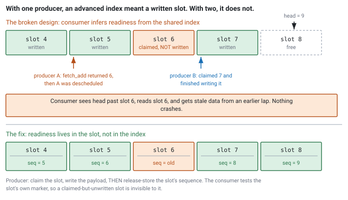

<!--
chapter: b4-mpsc-and-contention
state: draft_created
contract: standards/chapter-contract.md
include_measurement_plan: true | include_quizzes: true | primary_artifact_mode: code
unresolved_markers: 0
-->

# When Everyone Wants the Same Cache Line

## MPSC Queues and Contention

**Prerequisites:** [b3] Progress guarantees · [b2] SPSC ring buffers · [a6] Cache coherence and false sharing
**Focus:** adding producers changes the problem qualitatively, not quantitatively — the design decision is where to put the contention

---

## One more strategy

An order gateway starts simple. One strategy produces orders, the gateway consumes them, and between them sits the SPSC ring buffer from [b2]. It works, it is wait-free, and nobody thinks about it for a year.

Then the desk adds a second strategy. Then a third. Then a fourth.

The obvious move is to let them all push to the same queue. Someone looks at the producer side, sees that the only thing preventing multiple producers is that plain store to `head_`, and changes it to a `fetch_add` — now each producer claims a distinct slot index atomically, so no two producers can write the same slot.

It compiles. It runs. The stress test passes.

It is broken in a way the test cannot see, and separately, throughput per strategy falls with every strategy added — so the fourth one makes the first three slower.

Both problems come from the same place. There is now one memory location that every producer must write, and one index that no longer means what the consumer thinks it means.

## Where you will actually meet this

Any point where several threads feed one:

- **Several strategies into one order gateway** — the scenario above, and the one where ordering semantics matter most.
- **Several feed handlers into one book builder**, when market data is sharded by symbol but consumed centrally.
- **Every thread in the process into one logging or telemetry sink** — the most common instance by count, and the one where the contention is easiest to overlook because the path is off-critical ([a1]).

It also appears in system design interviews, not just code ones. "You have four producers and one consumer, how do you connect them" is a question with two defensible answers and a real tradeoff, which is exactly what makes it useful to an interviewer.

## The mental model

Go back to why SPSC was cheap. Each index had **exactly one writer**, so there was no race to lose: the producer alone advanced `head_`, the consumer alone advanced `tail_`, and neither needed a read-modify-write.

Add a second producer and that property is gone. Two threads now want to advance the same index, and everything follows from it:

- The claim must become atomic, because two producers must not get the same slot.
- **The index stops being a reliable statement about what has been written.** With one producer, an advanced index meant the slot before it was full — the producer wrote the slot and then advanced. With two, producer A can claim slot 5 and producer B claim slot 6, and B can finish writing first. Now the index says 7 while slot 5 is still empty.
- The atomic index is a single cache line that every producer writes, so it becomes a contention point whose cost grows with the number of producers ([a6]).

The first two are correctness problems. The third is a performance problem that does not go away with more cores — it gets worse. <!-- CALLBACK: a6 -->

## Part 1 — Why `fetch_add` alone is broken

The consumer in [b2] does something that is no longer valid:

```cpp
// From b2 — correct for ONE producer, wrong for several
if (tail == head_.load(std::memory_order_acquire)) return false;   // empty?
out = slots_[tail & kMask];                                        // trust the slot
```

That code infers *"the slot is written"* from *"the index is past it."* With one producer that inference holds, because the same thread did both things in that order. With several producers it does not hold at all: the index reflects what has been **claimed**, and claiming is not writing.

So the consumer can read a slot that a producer has reserved and is still filling — or has not started filling, because it was descheduled between the `fetch_add` and the write. The result is garbage, or a stale message from a previous lap, and it happens only when two producers interleave in a particular way. Your stress test will pass for a very long time.

The fix is to stop asking the index and start asking the slot. Each slot carries its own readiness state, written by the producer *after* the payload:


*Figure b4-1 — With one producer the index implied a written slot. With several it implies only a claim, so readiness must move into the slot.*

```cpp
// code-b4-1 | RUNNABLE | C++20 | examples/, target: mpsc_ring
template <typename T, size_t Capacity>
class MpscRing {
    static_assert((Capacity & (Capacity - 1)) == 0, "power of two");

    struct Slot {
        std::atomic<uint64_t> sequence;   // which lap this slot holds
        T                     value;
    };

public:
    MpscRing() {
        for (size_t i = 0; i < Capacity; ++i)
            slots_[i].sequence.store(i, std::memory_order_relaxed);
    }

    // Any producer thread.
    bool try_push(const T& value) {
        uint64_t pos = head_.load(std::memory_order_relaxed);
        for (;;) {
            Slot& s = slots_[pos & kMask];
            const uint64_t seq = s.sequence.load(std::memory_order_acquire);
            const int64_t  diff = (int64_t)seq - (int64_t)pos;

            if (diff == 0) {                              // slot free for this lap
                if (head_.compare_exchange_weak(pos, pos + 1,
                        std::memory_order_relaxed))
                    break;                                // claimed pos
            } else if (diff < 0) {
                return false;                             // full
            } else {
                pos = head_.load(std::memory_order_relaxed);  // someone beat us
            }
        }
        Slot& s = slots_[pos & kMask];
        s.value = value;                                  // write payload
        s.sequence.store(pos + 1, std::memory_order_release);  // THEN publish
        return true;
    }

    // The single consumer thread.
    bool try_pop(T& out) {
        Slot& s = slots_[tail_ & kMask];
        const uint64_t seq = s.sequence.load(std::memory_order_acquire);
        if ((int64_t)seq - (int64_t)(tail_ + 1) != 0) return false;  // not ready
        out = s.value;
        s.sequence.store(tail_ + Capacity, std::memory_order_release); // free it
        ++tail_;
        return true;
    }

private:
    static constexpr size_t kMask = Capacity - 1;
    alignas(64) std::atomic<uint64_t> head_{0};   // written by ALL producers
    alignas(64) uint64_t              tail_{0};   // consumer-private
    alignas(64) std::array<Slot, Capacity> slots_{};
};
```

The per-slot `sequence` is doing all the work. It encodes which lap the slot is on, so a single comparison answers *free for me*, *ready to consume*, or *neither yet* — and the consumer never infers readiness from the shared index. The producer's ordering is the sequencing hazard of this chapter:

1. **Claim** the slot with the compare-exchange.
2. **Write** the payload.
3. **Publish** with a release store to the slot's sequence.

Get 2 and 3 the wrong way round and the consumer reads a slot mid-write. It is [b1]'s publish pattern, one slot at a time — the release store publishes the payload, the consumer's acquire load observes it.

Also note the progress guarantee changed. [b2]'s `try_push` was **wait-free**; this one contains a retry loop and is **lock-free** but not wait-free ([b3]). That is a real downgrade, and it is the price of a shared claim point.

---

**Quiz 1**

An engineer proposes a simpler MPSC: keep [b2]'s design exactly, change the producer's `head_.store(head + 1)` to `head_.fetch_add(1)`, and leave everything else — including the consumer — untouched.

Give a concrete interleaving where the consumer reads bad data.

> **Answer**
>
> Two producers, A and B. The queue is empty, `head_` is 5, `tail_` is 5.
>
> 1. **Producer A** calls `fetch_add`, gets index 5, `head_` is now 6. A is about to write slot 5.
> 2. **A is descheduled** — timeslice expiry, interrupt, anything. Slot 5 holds whatever was there from a previous lap.
> 3. **Producer B** calls `fetch_add`, gets index 6, `head_` is now 7. B writes slot 6 and returns.
> 4. **The consumer** loads `head_` and sees 7. Its `tail_` is 5, so `head != tail` — the queue looks non-empty. It reads **slot 5**.
>
> Slot 5 has never been written by A. The consumer gets stale data from an earlier lap, and it is well-formed stale data — an old but structurally valid message. Nothing crashes; a message that was already processed gets processed again.
>
> **Why the test passes.** The window between A's `fetch_add` and A's write is a handful of instructions. It only matters if B claims *and completes* within that window and the consumer arrives during it. On a lightly loaded machine with two pinned producers, that alignment may not occur in a billion iterations — and it becomes far more likely under production load, where preemption is common.
>
> The lesson: **with one producer, the index is a statement about what has been written. With several, it is only a statement about what has been claimed.** Any design that infers readiness from the shared index alone is broken, and the per-slot sequence exists precisely to make readiness a property of the slot rather than of the counter.

---

## Part 2 — The contention, and the alternative

Correctness fixed, the performance problem remains and it is structural.

`head_` is one cache line. Every producer writes it. By [a6], a write requires exclusive ownership of that line, which invalidates every other core's copy — so with four producers the line ping-pongs continuously, and each producer's compare-exchange is competing against three others. A failed exchange means retrying, which means another attempt on the same contended line.

The cost per operation therefore **grows with producer count**. This is the important part: contention is not a fixed overhead you pay for being multi-producer. Adding a fifth producer makes the other four slower. That is the opposite of how people expect parallelism to behave, and it is why "we'll just add another producer thread" is not a free change.

### The alternative: give every producer its own queue

Rather than sharing one queue, give each producer a private SPSC ring and have the consumer drain all of them.

```cpp
// code-b4-2 | ILLUSTRATIVE — N private SPSC queues, no shared write point
std::array<SpscRing<Order, 1024>, kNumProducers> queues;

// Producer i — wait-free, zero contention with any other producer
queues[i].try_push(order);

// Consumer — round-robin across queues
for (size_t i = 0; i < kNumProducers; ++i) {
    Order o;
    while (queues[i].try_pop(o)) handle(o);
}
```

There is now no memory location that two producers both write. Each producer gets [b2]'s wait-free push back, at full speed, with no coherence traffic from its peers. The contention has not been reduced — it has been **removed**, by removing the sharing that caused it.

The cost moved to the consumer, and it is not only a performance cost.

### Comparing them

| | One MPSC queue | N private SPSC queues |
|---|---|---|
| **Producer cost** | Grows with producer count | Constant, independent of others |
| **Producer progress guarantee** | Lock-free (CAS retry) | Wait-free |
| **Consumer cost** | One queue to drain | N queues to poll |
| **Ordering across producers** | **Global order, defined by claim** | **None — no cross-queue order exists** |
| **Fairness** | Roughly arrival order | Whatever the drain policy chooses |
| **Empty-queue cost** | One check | N checks, mostly wasted |
| **Adding a producer** | Slows every existing producer | No effect on existing producers |
| **Memory** | One buffer | N buffers |

The row that decides most real designs is **ordering**, and it is a semantic difference rather than a performance one.

One MPSC queue defines a total order across all producers: the claim sequence *is* the order, and the consumer sees messages in it. With N queues there is no such thing — the consumer imposes an order by choosing what to drain, and two orders sent at nearly the same instant by different strategies can be consumed in either order depending on the polling loop.

For a logging sink, nobody cares. For an order gateway with a shared risk budget, it may matter a great deal whether the order that reached the claim point first is the one that gets sent. **That question is not a performance tradeoff and cannot be measured away** — decide it before choosing the structure.

The consumer's polling loop also becomes a design surface of its own: strict round-robin is fair but wastes checks on empty queues; draining each queue fully before moving on is cheaper but lets a busy producer starve a quiet one; and with many queues the consumer can spend most of its time checking queues that have nothing in them ([b5]).

---

**Quiz 2**

Two systems, both with four producers and one consumer.

**System 1** — four strategies sending orders to one gateway. All four share a single pre-trade risk budget, and the desk needs orders to reach the venue in the order the strategies committed to them.

**System 2** — four feed-handler threads writing to one compliance log. Every message must be recorded; the file is timestamped and sorted later.

Which structure for each, and why?

> **Answer**
>
> **System 1 — one MPSC queue.** The ordering requirement decides it before performance is considered. A shared risk budget consumed in claim order needs a claim order to exist, and with four private queues there is no fact of the matter about which order was "first" — the answer would be an artefact of the consumer's polling loop, and it would change if someone reordered the loop for unrelated reasons.
>
> Accept the contention. Four producers is a modest count, the contention is bounded and measurable, and this is an order gateway where correctness of sequencing outranks producer throughput. If the contention later proves too costly, the fix is a design change (fewer producers, sharded budgets), not a switch to N queues, because that switch would silently discard the property the system depends on.
>
> **System 2 — four private SPSC queues.** No cross-producer ordering is required: entries are timestamped and sorted afterwards, so the consumer's arrival order carries no meaning. That removes the only reason to share a claim point.
>
> The gain is real. These are feed-handler threads on the critical path ([a1]), so every cycle a producer spends contending is a cycle stolen from packet processing — and the logging path is exactly where you least want to pay for coordination. Each producer gets a wait-free push that no other producer can slow down. The consumer polls four queues, which is fine because it is off the critical path and can afford to be unsophisticated.
>
> The general lesson: **ask about ordering semantics first, contention second.** Contention is a cost you can measure and often absorb. Ordering is a property the structure either has or does not, and discovering you needed it after choosing N queues means redesigning rather than tuning.

---

## Common mistakes

**Making the producer index atomic and stopping there.** Quiz 1. The index describes claims, not writes.

**Marking the slot ready before writing the payload.** The sequencing hazard. Publish last, with a release store.

**Assuming contention is a fixed cost.** It scales with producer count, so each new producer taxes the existing ones.

**Choosing N queues without checking whether cross-producer ordering matters.** The mistake that cannot be fixed by tuning.

**Forgetting the progress guarantee changed.** MPSC with a CAS loop is lock-free, not wait-free ([b3]). If a producer is on a path that needed the wait-free bound, that is a regression.

**Letting the consumer starve a quiet producer.** Drain-fully-then-move-on is cheaper and unfair; with a slow queue and a fast one, the slow one can wait a long time.

**Sharing a queue when each producer could have its own.** The simplest way to avoid this chapter's problems is not to create them.

## Operational behaviour

- **Track per-producer throughput, not aggregate.** Aggregate throughput can look acceptable while one producer is being starved or while all of them are degrading together. Per-producer is where contention is visible ([a6]).
- **With N queues, track per-queue occupancy.** One queue filling while others sit empty is a load-balance or fairness problem, and there is no single number that reveals it.
- **Alarm on producer-side push failures separately per producer.** A full queue means something about that producer's rate or the consumer's drain policy, and aggregating them hides which.
- **Record which design you chose and why**, particularly if the reason was ordering. That constraint is invisible in the code and someone will eventually "optimise" it away.

## When not to use either

- **When each producer could own a private queue and no ordering is needed** — then N SPSC is not an alternative, it is simply the right answer, and MPSC was never a candidate.
- **When the path is cold.** A mutex-protected `std::queue` for a config-update channel is correct, obvious, and adequate ([b3]).
- **When one producer would do.** Several threads producing because the code grew that way, rather than because the work needs parallelism, is a design smell — merging them removes the problem entirely.
- **Before measuring.** Four producers on a queue that sees a thousand messages a second is not a contention problem, whatever the theory says ([a4]).

## Optional — if you want to see it for yourself

*"Contention grows with producer count" is a sentence. As a curve with a visible crossover, it is a design input.*

The experiment: implement both designs behind the same interface, then measure **per-producer** push throughput as you sweep producer count from one to the number of physical cores.

The N-SPSC line stays roughly flat — each producer is independent, so adding one does not affect the others. The MPSC line falls, and the interesting question is how fast and where it crosses below the point where the consumer becomes the bottleneck in the N-queue design. That crossover is the number that should inform your choice, and it is specific to your hardware and message size.

Two habits worth keeping:

- **Plot per-producer, not aggregate.** Aggregate throughput can rise while every individual producer is getting slower, which hides the effect entirely.
- **Pin the producers** ([c4]). Unpinned threads may share physical cores, and you will be measuring the scheduler instead of the coherence protocol.

The reasoning pattern: you are looking for the *shape* of the relationship, not a headline number. Flat versus declining is the finding. The specific values are properties of one machine and do not transfer.

## Interview mapping

- **Say why `fetch_add` alone is insufficient**, with the interleaving. Being able to produce the concrete sequence from Quiz 1 is the difference between having read about this and understanding it.
- **Describe per-slot readiness** as the fix, and note it is [b1]'s publish pattern applied per slot.
- **Volunteer that contention grows with producer count.** Most candidates treat it as a constant overhead.
- **Raise ordering semantics** when asked to choose between designs. This is the strongest move available, because it reframes the question from performance to correctness.
- **Note the progress-guarantee downgrade** from wait-free to lock-free. It shows [b3] is connected in your head rather than memorised separately.
- **Ask whether the producers need to share a queue at all.** The best answer to a hard problem is often that it was avoidable.

## Summary

Going from one producer to two is not an incremental change. The single-writer property that made [b2] cheap and wait-free is gone, and with it goes the inference the consumer depended on — that an advanced index means a written slot. Claims and writes come apart, so readiness has to become a property of each slot rather than of the shared counter.

What remains is a contention problem that does not improve with more cores. The shared claim point is one cache line written by every producer, so per-producer cost grows as producers are added, and the fourth strategy makes the first three slower.

The alternative is to remove the sharing rather than manage it: give every producer a private SPSC queue and let the consumer drain them all. That restores wait-free, contention-free pushes and moves the cost to the consumer — but it also destroys any global order across producers, and that is a semantic loss no amount of measurement will reveal.

So the question to settle first is not which is faster. It is whether anything downstream depends on the order in which producers' messages are interleaved. If yes, you need the shared claim point and should spend your effort making it as cheap as possible. If no, the contention was optional all along.

**Related:** [b1] memory model · [b2] SPSC ring buffers · [b3] progress guarantees · [b5] waiting strategies · [b7] testing concurrent code · [a6] coherence and false sharing · [a1] system anatomy · [a4] measurement · [c4] thread affinity

## References

- Herlihy, M., & Shavit, N. (2020). *The art of multiprocessor programming* (2nd ed.). Morgan Kaufmann. [concurrent queues, contention, and progress conditions]
- Williams, A. (2019). *C++ concurrency in action* (2nd ed.). Manning. [multi-producer queue design in C++]
