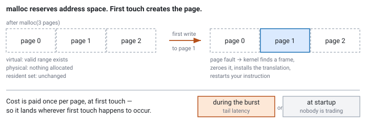
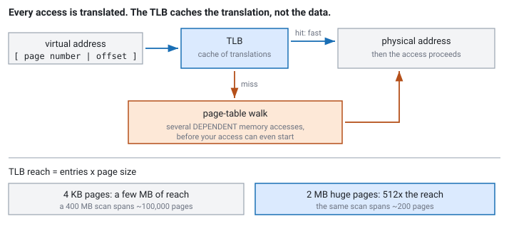

<!--
chapter: c1-virtual-memory
state: draft_created
contract: standards/chapter-contract.md
include_measurement_plan: true | include_quizzes: true | primary_artifact_mode: code
unresolved_markers: 0
-->

# The Latency Spike at 09:30

## Virtual Memory, Page Faults, Huge Pages, and TLBs

**Prerequisites:** [a5] Cache locality and layout · [a4] Measurement and profiling
**Focus:** memory you allocated does not exist until you touch it, and the touch is a trip through the kernel

---

## The first few seconds

A trading system restarts cleanly every morning before the open. For the first few seconds of the session its tail latency is dreadful — spikes of tens of microseconds on a path that normally runs in two — and then it settles and behaves perfectly for the rest of the day.

Every day, the same shape. The team has learned to send synthetic messages through the system before the open, and it works: by the time real trading starts, the spikes are gone. Nobody can quite explain why, and "warm-up" has acquired the status of a ritual that is known to help and not understood.

It is not a ritual. The system is doing real work during those first seconds — work the kernel does on its behalf, which appears in no profile of the process, and which has to happen exactly once for every page of memory the system uses.

The warm-up is doing that work early, on purpose, when nobody is trading.

## Where you will actually meet this

Pre-faulting at startup is standard practice at latency-sensitive firms, and this chapter is what it is for. Beyond that, page behaviour underpins most of Module C:

- **Memory pools** ([c2]) are preallocated *and pre-touched*, and the second half is why they work.
- **NUMA placement** ([c5]) is decided by which thread first writes a page — a rule that only makes sense once you know when pages are allocated.
- **mmap** ([c6]) replaces read calls with page faults, which is only a good trade if you know what a fault costs.

It also explains a class of production mystery — latency that is fine in steady state and terrible after any change in memory usage — that is otherwise very hard to attribute.

## The mental model

Your program does not use physical memory addresses. It uses **virtual addresses**, and the hardware translates each one to a physical address on every access, using tables the kernel maintains.

That indirection is what makes the opening scenario possible. When you call `malloc` for a gigabyte, the kernel does not go and find a gigabyte of RAM. It records that a range of your address space is now valid and returns a pointer. **No physical memory has been allocated and nothing has been written anywhere.**

The physical page appears the first time you touch that address. The access finds no translation, the hardware raises a **page fault**, the kernel takes over, finds a free physical page, wires up the translation, and restarts your instruction. From your code's point of view, one ordinary memory write took a few microseconds and there is nothing at that line of source to explain it.

So the cost of memory is paid on **first use**, once per page, at whatever moment first use happens to occur. If first use happens during your first burst of the morning, that is when you pay.


*Figure c1-1 — Reserving address space and creating physical pages are separate events. The second one has a cost, and it lands wherever first touch happens.*

### Two kinds of fault, very different costs

**Minor fault** — the kernel can satisfy it without disk I/O. It finds a free page, or maps a page already in the page cache, and returns. This is a kernel entry, some page-table work, and typically a zeroing of the page. Microseconds. This is what the morning spike is made of.

**Major fault** — the data must be read from disk. Milliseconds, and on a trading path that is a catastrophe rather than a spike. Major faults mean either swapping or file-backed memory not yet in cache, and the correct number of them on a trading host during the session is zero. Disable swap, or lock the process into memory, and treat a major fault as an incident.

The distinction matters because "page faults" as a single number is not actionable. Millions of minor faults at startup are expected and fine. One major fault at 09:31 is a problem.

## Part 1 — Getting the faults out of the way

If the cost is per page and unavoidable, the move is to pay it at a time you choose. Touch every page you intend to use, at startup, before the session.

```cpp
// code-c1-1 | RUNNABLE | C++20 | examples/, target: prefault
// Reserve, then TOUCH. The second half is the part people leave out.

constexpr size_t kPageSize = 4096;   // query at runtime in production

void prefault(void* base, size_t bytes) {
    auto* p = static_cast<volatile char*>(base);
    for (size_t off = 0; off < bytes; off += kPageSize)
        p[off] = 0;                  // a WRITE — forces a private page
}

// At startup, off the trading path:
auto buffer = std::make_unique<char[]>(kArenaBytes);
prefault(buffer.get(), kArenaBytes);
```

Three details in that small function.

**It writes rather than reads.** For freshly allocated anonymous memory, a read can often be satisfied by mapping a shared zero page — the kernel has one page of zeroes and points everybody at it for reading. No private page is allocated, so nothing is warmed up, and the real fault still happens on your first write, during trading. A write forces the private page to exist now.

**It touches one byte per page.** Pages arrive whole, so touching every byte is wasted work. Stride by the page size.

**It uses `volatile`** so the compiler cannot delete a loop whose results nobody reads — the same optimiser hazard as a benchmark that measures nothing ([a4]). <!-- CALLBACK: a4 -->

Two further tools worth knowing. Some platforms let you ask for the pages up front when the mapping is created, which does the same job without a manual loop. And you can **lock** pages into physical memory so the kernel may not reclaim them — which matters because pre-faulting is not permanent: memory you have not touched for a while can be reclaimed under pressure, and then you fault again. On a dedicated trading host with swap disabled, locking makes the guarantee explicit.

**Warm-up is not only about pages**, which is worth saying since the ritual gets credited for everything. Sending synthetic messages through the system also populates data caches, trains branch predictors ([b6]), and pulls code into the instruction cache. Pre-faulting handles the largest and most predictable component; the rest still argues for exercising the real path before the open.

---

**Quiz 1**

A process allocates a 1 GB buffer at startup with `malloc` and does not touch it. Assume 4 KB pages.

What is the resident memory of the process, and what happens the first time the trading path writes to a fresh part of that buffer during a burst?

> **Answer**
>
> **Resident memory is essentially unchanged** — near zero for that buffer. `malloc` reserved a gigabyte of *virtual* address space; the process's virtual size grows by 1 GB and its resident set does not, because no physical pages exist yet.
>
> **On first write to a fresh page**, the access faults. The kernel finds a free physical page, zeroes it, installs the translation, and restarts the instruction. That is a kernel entry and page-table work — microseconds, on a path budgeted in single-digit microseconds, at the moment the burst is happening.
>
> And it is not one fault. A gigabyte at 4 KB per page is **262,144 pages**, so the first pass over that buffer takes a quarter of a million faults, spread across whenever each page is first touched. That is the morning spike, arriving one page at a time.
>
> **The trap is watching the wrong number.** Virtual size showed the gigabyte immediately, so a memory dashboard looked correct and nothing appeared wrong. Resident set size is the number that tells you whether the memory actually exists yet — and the gap between the two is precisely the work you have not done yet.

---

## Part 2 — Translation has its own cache

Faults are the startup problem. There is a second, steadier cost that persists all session.

Every memory access needs its virtual address translated, and doing a full page-table walk each time would be ruinous — so the hardware caches recent translations in the **TLB** (translation lookaside buffer). A hit is effectively free. A miss requires walking the page tables, which is several *dependent* memory accesses before your actual access can even start.

The critical quantity is **TLB reach**: entries × page size. With 4 KB pages, a TLB with a few hundred entries covers a few megabytes. Beyond that, a working set no longer fits and accesses start missing translation regardless of how well they fit in cache.


*Figure c1-2 — Translation is a separate lookup with its own cache and its own miss cost. A TLB miss is not a cache miss: the data can be in L1 while the translation is absent.*

That produces a genuinely confusing symptom. You have a scan whose cache behaviour is good — contiguous, prefetchable, exactly what [a5] asked for — and it still slows down as the data grows, more than cache misses alone explain. The data was in cache; the *address translation* was not. <!-- CALLBACK: a5 -->

### Huge pages

The fix is to make each TLB entry cover more memory. A huge page — commonly 2 MB — covers 512 times as much as a 4 KB page, so the same TLB reaches 512 times further. For a large, densely accessed structure, this can matter a great deal.

Two ways to get them, with different risks.

**Transparent huge pages** are automatic: the kernel promotes eligible regions without you asking. Convenient, and it carries a hazard worth knowing. Building a huge page requires 2 MB of *contiguous* physical memory, and when memory is fragmented the kernel may compact — moving pages around to create contiguity — which stalls the process doing the allocation. So a feature intended to reduce latency can introduce a spike, at an unpredictable moment. Whether THP is enabled, and in which mode, is something you should know about your hosts rather than discover.

**Explicitly reserved huge pages** are set aside at boot and requested deliberately. More configuration, no compaction surprise, and the memory is committed whether you use it or not.

Huge pages are not free in either form. A 2 MB page for a structure using 100 KB wastes the rest, and lots of small mappings promoted to huge pages inflate memory usage substantially. Like everything in this module, the honest position is: **measure at production working-set size, then decide.**

---

**Quiz 2**

Two versions of a scan over an order table, both perfectly sequential and prefetch-friendly. The only difference is table size.

- 4 MB table: fast, close to memory bandwidth.
- 400 MB table: much slower per element — and hardware counters show the cache miss *rate* per element is roughly the same in both.

Cache behaviour is unchanged. What else is going on, and what would you try?

> **Answer**
>
> **TLB misses.** The cache miss rate per element being flat is the clue that rules out the usual suspect — if this were a locality problem, the miss rate would have risen.
>
> At 4 KB per page, a 4 MB table spans 1,024 pages, which a typical TLB can cover. A 400 MB table spans **102,400 pages**, far beyond TLB reach. So each new page in the scan needs a page-table walk before the access proceeds, and the walk is several dependent memory accesses — which the prefetcher cannot hide, because it prefetches *data* and does not perform translation for pages you have not reached.
>
> **What to try:** huge pages. At 2 MB per page the 400 MB table spans 200 pages instead of 102,400, which comes back within reach of the TLB. This is close to the ideal case for huge pages — a large, contiguous, densely and sequentially accessed structure.
>
> **What to check before believing it:** whether the improvement survives at production working-set size and with the production access pattern, and whether THP compaction introduces stalls elsewhere. A benchmark that gets faster while the tail gets worse is not a win ([a3]).
>
> The general lesson: **the memory hierarchy has two caches, and only one of them is the data cache.** When locality is good and the size still hurts, translation is the other place to look.

---

## Common mistakes

**Believing `malloc` gives you memory.** It gives you address space.

**Pre-faulting with a read instead of a write.** The shared zero page means nothing gets allocated and you have warmed up nothing.

**Watching virtual size instead of resident set.** Quiz 1. The gap between them is exactly the cost you have not paid yet.

**Treating warm-up as superstition.** It is doing real, identifiable work, and if you know what work, you can do it deliberately and verify it.

**Enabling huge pages without measuring.** They can help enormously and can waste memory and introduce compaction stalls.

**Not knowing whether THP is enabled.** It differs between hosts and produces behaviour differences nobody can explain later.

**Leaving swap enabled on a trading host.** A major fault on the hot path is not a spike, it is an outage of that path.

**Assuming pre-faulted stays faulted.** Untouched memory can be reclaimed. If it matters, lock it.

## Going deeper elsewhere

*Optional. Not required for an interview answer; knowing it is a plus, and it makes the cost model concrete rather than asserted.*

This chapter describes a TLB miss as "a page-table walk of several dependent accesses" and leaves the structure vague. Real page tables are multi-level trees — commonly four or five levels on 64-bit systems — so a full walk is that many dependent memory accesses, each of which can itself miss in cache. That is where the cost comes from, and it is also why the walk is partially cached in its own structures.

The same material covers how the kernel decides which physical pages to reclaim under pressure, which is what determines whether your pre-faulted memory stays resident.

**Arpaci-Dusseau and Arpaci-Dusseau, *Operating Systems: Three Easy Pieces*** covers paging, translation, and page replacement thoroughly and is available free online. Your CPU vendor's architecture manual documents the TLB structure and page sizes its parts support.

## Operational behaviour

- **Monitor resident set size, not virtual size.** Virtual size tells you what was reserved and says nothing about what exists.
- **Monitor minor and major faults separately.** Minor faults should spike at startup and be flat during the session; a rising count mid-session means memory is being touched for the first time on a live path. Major faults during the session should be zero and alarmed.
- **Record whether THP is enabled**, in which mode, alongside the host's configuration. A host that silently differs from its peers will behave differently and nobody will know why.
- **Disable swap on trading hosts**, or lock the process into memory. This is a deployment decision, not a code one.
- **Verify the warm-up actually warmed up.** Fault counts before and after are the check. A warm-up that reads instead of writes looks identical and does nothing.

## When not to bother

- **Small working sets.** If the process touches a few megabytes, the startup faults are over before anyone notices and huge pages buy nothing.
- **Cold paths.** A fault in a config loader costs nothing anyone will measure ([a1]).
- **Before establishing that the spike is faults.** The morning-spike symptom has other possible causes — cold caches, untrained predictors, JIT-like first-run effects in other components. Fault counters distinguish them cheaply ([a4]).
- **Huge pages without measurement**, particularly where memory is constrained or the structure is sparse.

## Optional — if you want to see it for yourself

*The rest of this chapter stands without it. This is here because the gap between what you allocated and what actually exists is much more convincing once you have watched it move.*

The demonstration takes ten minutes. Allocate a large buffer, print resident set size, then touch it one page at a time, printing resident size and the process's minor fault count as you go. Resident size climbs in step with the touching, and the fault count climbs with it. Then repeat with a read-only pass first and observe that it changes far less — the zero-page behaviour, visible.

For the TLB half: run the same sequential scan over a working set you sweep from a few megabytes to a few hundred, with and without huge pages, and plot time per element. Two divergences appear at different sizes — one where the data stops fitting in cache, another where the translations stop fitting in the TLB — and seeing them as separate features of the same curve is the point.

Two habits worth keeping:

- **Distinguish minor from major faults** in whatever you report. They differ by three orders of magnitude.
- **State the page size and THP setting** with any result. Without them the numbers are not reproducible.

## Interview mapping

- **Say `malloc` returns address space, not memory.** The cleanest way to demonstrate you know what is happening.
- **Explain the morning spike from first principles** — one fault per page, paid at first touch, invisible in a profile of your process. It is a very common interview scenario.
- **Distinguish minor from major faults** and say what each costs.
- **Explain the TLB and when huge pages help** — large, contiguous, densely accessed working sets. Naming TLB reach is the differentiator.
- **Mention that pre-faulting must write, not read.** A small detail that signals you have actually done it.
- **Raise the THP compaction hazard** if huge pages come up. It shows you know the feature has a cost, which most candidates do not volunteer.

## Summary

`malloc` hands back virtual address space. Physical pages appear one at a time, on first touch, through a page fault the kernel services — so the cost of memory is real, unavoidable, and paid at whatever moment first use occurs. If that moment is your first burst of the morning, the tail latency is the bill.

The fix is to choose the moment: touch every page at startup, with writes rather than reads so the shared zero page does not hide the work, and lock the pages if it matters that they stay. That is what warm-up is doing, and knowing it lets you verify it rather than trust it.

Translation has a second cost that persists all session. The TLB caches translations, its reach is entries times page size, and a working set beyond that reach pays a page-table walk on top of every access — which looks like a memory problem, is invisible to cache miss rates, and is why huge pages sometimes produce large improvements on structures whose locality was already good.

Everything after this chapter depends on it. Pools ([c2]) are preallocated *and* pre-touched. Arenas ([c3]) reuse pages that are already resident. mmap ([c6]) trades explicit copies for faults. And NUMA placement ([c5]) is decided by which thread takes the fault — a rule that only makes sense now that you know when the fault happens.

**Related:** [a5] cache locality · [a4] measurement · [a3] latency and tail latency · [c2] preallocation and pools · [c3] arenas and allocators · [c4] thread affinity · [c5] NUMA placement · [c6] mmap and zero copy · [a1] system anatomy

## References

- Arpaci-Dusseau, R. H., & Arpaci-Dusseau, A. C. (2018). *Operating systems: Three easy pieces* (1.00 ed.). Arpaci-Dusseau Books. [paging, address translation, TLBs, and page replacement — free online]
- Vendor architecture manuals document TLB structure, supported page sizes, and page-walk caching for specific parts. *(Stage 1 source pack to pin editions.)*
- Linux kernel documentation on transparent huge pages and memory locking. *(Stage 1.)*
