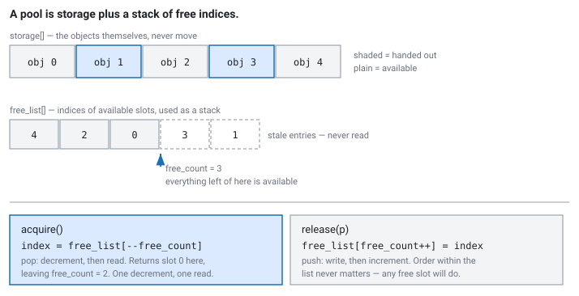

<!--
chapter: c2-preallocation-and-pools
state: draft_created
contract: standards/chapter-contract.md
include_measurement_plan: false | include_quizzes: true | primary_artifact_mode: code
unresolved_markers: 0
-->

# Never Ask the Allocator During Market Hours

## Preallocation and Object Pools

**Prerequisites:** [c1] Virtual memory and page faults · [a3] Latency and tail latency
**Focus:** allocation is banned on the hot path for *determinism*, not speed — and the real design decision in a pool is what happens when it is empty

---

## Forty microseconds, once

An order gateway allocates an order object per order. It has done so for two years without incident. The allocation is fast — someone benchmarked it once, got about thirty nanoseconds, and nobody thought about it again.

During a burst after a rate decision, one allocation takes **forty microseconds**.

The allocator took a slow path. Its thread-local cache was empty, so it went to a shared structure and took a lock; the size class it needed had no free blocks, so it carved a fresh region; and that region had never been touched, so writing the object header took a page fault ([c1]). Three unlikely things, each individually rare, all more likely under exactly the conditions that produced the burst.

That order was late to the venue. The code was not slow. It was slow *once*, at the worst possible moment — and once is the whole problem, because the thirty-nanosecond benchmark was measuring the case that does not matter.

## Where you will actually meet this

"No allocation on the hot path" is a rule you will be expected to state and justify at any latency-sensitive firm. It applies to:

- **Order objects**, one per order, living from creation until terminal state ([a2]).
- **Message buffers** in the feed handler, recycled continuously at very high rates ([d1]).
- **Book nodes** as price levels appear and disappear ([e2]).

In interviews the rule itself is table stakes. The differentiator is the justification — candidates who say "malloc is slow" have the wrong model, and the follow-up question is usually about exhaustion, which is where the real thinking is.

## The mental model

A general-purpose allocator is a remarkable piece of engineering optimised for the average case across all programs. It is fast almost always. The word doing the work is *almost*.

Its cost is **conditional on state you do not control**: how fragmented the heap is, whether this thread's cache has a block of the right size, whether another thread holds the arena lock, whether the region it hands you has been touched before. All of those are fine most of the time and all of them degrade under load — under allocation pressure, under thread contention, under memory growth.

So the distribution of allocation latency has the shape [a3] warned about: excellent median, long tail, and the tail correlated with load. <!-- CALLBACK: a3 -->

The mental shift this chapter asks for:

> You are not avoiding allocation because it is slow. You are avoiding it because its cost is **unbounded and unpredictable**, and you are replacing it with something whose worst case you can state.

That reframing matters because it tells you when preallocation is pointless (cold paths, where an occasional 40µs costs nothing) and what "good" looks like (a bounded worst case, not a smaller average).

## Part 1 — A pool with a bounded worst case

Allocate everything at startup. Then the only question is how to track which slots are in use — and the answer is deliberately the dumbest structure that works.

### The free list, before any code

Keep two arrays.

**`storage`** holds the objects themselves. It is allocated once, never resized, and the objects never move. An object's address is fixed for the life of the process, which means a pointer to a pooled object stays valid until it is returned.

**`free_list`** holds *indices* into `storage` — the slots that are currently available. Alongside it, `free_count` records how many of those entries are meaningful.

The trick is to treat `free_list` as a **stack**, with `free_count` marking the top:

- **Acquire**: decrement `free_count`, read the index now at the top, hand back that slot.
- **Release**: write the returned slot's index at the top, increment `free_count`.

Everything to the left of `free_count` is available. Everything to the right is stale — indices of slots that have since been handed out — and is simply never read. There is no cleanup because there is nothing to clean up.

Three properties fall out, and they are the reason this design is worth its simplicity:

**No search.** Allocation does not look for a free slot; it pops one. Any free slot is as good as any other, because the objects are interchangeable.

**No traversal.** The classic textbook free list threads a linked list through the free objects themselves, so allocation follows a pointer into memory that is, by definition, cold — it has not been touched since it was freed. Storing indices in a separate contiguous array keeps the hot metadata together and out of the objects ([a5]).

**No ordering requirement.** Released slots go back in whatever order they arrive, and the list is never sorted or compacted. Fragmentation cannot occur because every slot is the same size and every slot is interchangeable.


*Figure c2-1 — Acquire pops an index; release pushes one. Entries beyond `free_count` are stale, not free, and are never read.*

### In code

```cpp
// code-c2-1 | RUNNABLE | C++20 | examples/, target: object_pool
template <typename T, std::size_t Capacity>
class ObjectPool {
public:
    ObjectPool() {
        for (std::size_t i = 0; i < Capacity; ++i)
            free_list_[i] = i;              // every slot free
        free_count_ = Capacity;
    }

    // Bounded: a decrement and an array read. No branches into the kernel.
    T* acquire() noexcept {
        if (free_count_ == 0) return nullptr;      // exhausted — caller decides
        return &storage_[free_list_[--free_count_]];
    }

    void release(T* p) noexcept {
        const std::size_t index = static_cast<std::size_t>(p - storage_.data());
        free_list_[free_count_++] = index;
    }

    std::size_t in_use()    const noexcept { return Capacity - free_count_; }
    std::size_t high_water() const noexcept { return high_water_; }

private:
    std::array<T, Capacity>           storage_;    // pre-touch this at startup
    std::array<std::size_t, Capacity> free_list_;
    std::size_t                       free_count_{0};
    std::size_t                       high_water_{0};
};
```

`acquire` is a comparison, a decrement, and an indexed read. There is no free-list walk, no lock, no size class, no syscall — and, critically, **no path that is sometimes slow.** The worst case is the average case. That is the property being bought.

Two things this code assumes and does not show.

**The storage must be pre-touched.** Preallocating without pre-faulting moves the allocator stall and leaves the page fault exactly where it was ([c1]). A pool whose pages have never been written will fault on first use — during trading, one page at a time, which is the morning spike wearing a different hat.

**This version is single-threaded.** If producers and consumers on different threads acquire and release, you need synchronisation, and the [b0] rule applies: `free_count_` and the free list must be updated together, which is more than one atomic can express. Common resolutions are a per-thread pool, or making the free list itself a queue ([b2]), or accepting a mutex if the path allows.

## Part 2 — Empty is a policy question

Here is the part interviews actually probe, and it has the same shape as the full queue in [b2].

The pool returns `nullptr`. What now?

- **Fall back to the allocator.** Tempting, and it silently reintroduces exactly the unbounded latency the pool existed to remove — at the worst moment, since the pool is empty precisely because the system is busy. Worse, it works fine in testing and only appears under the load you cared about. **This is almost always the wrong answer**, and it is the most common one.
- **Reject the operation.** Refuse the order, drop the message, and count it. Honest and bounded. Whether it is acceptable depends entirely on what the operation was: dropping a market-data message is bad, failing to send an order may be worse, and failing to *cancel* an order may be worse still.
- **Wait for a release.** Bounded only if something is guaranteed to release soon, which usually means it is not bounded at all ([b5]).
- **Shed load upstream.** Stop accepting new work until the pool recovers. Usually the right answer for message buffers, and it needs a mechanism that exists before you need it ([d4]).

There is no universally correct choice, and there is a universally wrong one: **not deciding.** A pool with no exhaustion policy has chosen "return `nullptr` and let the caller dereference it" by default.

The corollary is sizing. **Size for the worst case the system must survive, not the average**, because the average never exhausts the pool and tells you nothing. What is the largest number of orders that can be live at once? The deepest burst of unprocessed messages? Size for that, add margin, and then — because the estimate is a guess — export the high-water mark so reality can correct it.

---

**Quiz 1**

Your order pool holds 10,000 objects. During an unusually volatile open it is exhausted, and `acquire` returns `nullptr` on the path that creates a **cancel** request.

Walk through the four policies above. Which do you choose, and what does that tell you about the pool's design?

> **Answer**
>
> **None of them is acceptable, and that is the finding.**
>
> Work through them. *Falling back to malloc* reintroduces unbounded latency during the burst — but note that a late cancel is still better than no cancel, so this is less obviously wrong here than usual. *Rejecting* means the system cannot cancel an order it has live at the venue, which leaves unmanaged exposure and is exactly the situation [a2]'s state machine says you must never be in. *Waiting* is unbounded and the reason you need the cancel is time-critical. *Shedding load* does not apply, since the cancel is not new work — it is the resolution of work already accepted.
>
> **So the design is wrong, one level up.** A cancel is the operation that *reduces* risk, and it must not be able to fail because the system is busy. The fix is not a better exhaustion policy but a **separate reserved pool for cancels**, sized so that every live order can be cancelled, never drawn on by anything else.
>
> That generalises: **operations that reduce risk should not compete for resources with operations that create it.** If sending an order consumes from the same pool as cancelling one, then the moment you most need to cancel is the moment you cannot — because the pool is full of the orders you now want to withdraw.
>
> The trap is treating exhaustion as a question with one answer per pool. It is a question per *operation class*, and the answer sometimes reveals that you need more than one pool.

---

## Part 3 — Return discipline

A pool converts a leak into an exhaustion. That is an improvement — the failure is louder and arrives sooner than a process growing to fill the machine over a week — but only if every acquired object is returned exactly once, **on every path**.

The dangerous paths are the ones nobody exercises: the error branch, the early return, the rejection, the exception. An object acquired at the top of a function and released at the bottom is leaked by every `return` in between.

```cpp
// code-c2-2 | RUNNABLE | C++20 | examples/, target: object_pool
// A handle that returns the object on every exit path, including exceptions.
template <typename T, std::size_t N>
class PoolHandle {
public:
    PoolHandle(ObjectPool<T, N>& pool, T* obj) : pool_(&pool), obj_(obj) {}
    ~PoolHandle() { if (obj_) pool_->release(obj_); }

    PoolHandle(PoolHandle&& o) noexcept : pool_(o.pool_), obj_(o.obj_) { o.obj_ = nullptr; }
    PoolHandle(const PoolHandle&)            = delete;   // no accidental double-release
    PoolHandle& operator=(const PoolHandle&) = delete;

    T* get() const noexcept { return obj_; }
    T* detach() noexcept { T* p = obj_; obj_ = nullptr; return p; }  // ownership moves on

private:
    ObjectPool<T, N>* pool_;
    T*                obj_;
};
```

RAII solves the easy half. The hard half is the case where **ownership genuinely leaves the scope** — an order object acquired by the strategy, handed to the gateway, and released only when the venue reports a terminal state ([a2]). No destructor can know when that is, because the answer depends on messages arriving later.

For those, the discipline has to be explicit: exactly one component owns the object at a time, the ownership transfer is visible in the code, and the terminal-state handler is the single place that releases. Then the pool's in-use count becomes a *check* on that discipline — if the number of live orders the state machine believes in and the number of pool objects checked out ever disagree, one of them is wrong, and that reconciliation is worth running.

---

**Quiz 2**

Your order pool's high-water mark has been climbing steadily for three weeks. It was 3,000 at the start of the month, and it is 7,400 now. Trading volume has not changed materially. The pool holds 10,000.

What is happening, what will happen if you ignore it, and how would you find the cause?

> **Answer**
>
> **A leak — objects acquired and never released.** With volume flat, the number simultaneously in use should be stationary. A steady climb means the release side is losing some fraction of them.
>
> **What happens if ignored:** at the current rate the pool is exhausted in roughly another month, and it will exhaust *during the busiest period* — because the high-water mark is set by peak concurrent use, so the peak reaches capacity before the average does. The failure will therefore arrive at the worst moment, and it will present as sudden total failure rather than gradual degradation, since a pool is fine until the instant it is not.
>
> **Note what the leak did *not* do:** process memory did not grow. The objects were preallocated, so a monitoring system watching RSS sees nothing, and every conventional leak detector is blind to this. The high-water mark is the only signal, which is why it must be exported. This is the cost of the leak-to-exhaustion conversion: earlier and louder, but only if you are listening on the right channel.
>
> **How to find it:** compare the pool's in-use count against the number of orders the state machine believes are live ([a2]). The difference *is* the leak, and its size tells you the rate. To localise it, tag each acquisition with the code path that requested it and dump the tags of long-lived checked-out objects — a leaked object is one whose lifetime far exceeds any order's plausible lifetime, and the tag names the path that lost it. The likely culprits are error paths that return early: rejections, session drops, and timeouts.
>
> The general lesson: **preallocation changes the shape of a leak, not the existence of one.** It trades slow memory growth for sudden capacity failure, which is a good trade only if you monitor the metric that now carries the signal.

---

## Common mistakes

**Justifying preallocation by speed.** The mean allocation cost is fine. The tail is not.

**Preallocating without pre-touching.** The page fault is still there ([c1]).

**Falling back to the allocator when the pool is empty.** Reintroduces the unbounded cost exactly when it hurts.

**Sizing from the average.** The average never exhausts the pool.

**One pool for operations that create and reduce risk.** Quiz 1.

**Assuming RAII covers it.** It covers scope-bound lifetimes. Transferred ownership needs explicit discipline.

**Not exporting the high-water mark.** It is the only visible symptom of a pool leak, since memory usage does not move.

**Returning an object while a reference is still live.** The pool hands the slot straight out again, so two owners mutate one object and the symptom is a message with fields from two unrelated orders.

## Operational behaviour

- **Export high-water mark, current in-use, and exhaustion count** for every pool. The first predicts trouble, the second is diagnostic, the third means the sizing was wrong.
- **Alarm on exhaustion, always.** It is never routine. Even where the policy handles it cleanly, the fact that it happened is information.
- **Alarm on high-water mark crossing a fraction of capacity** — well before exhaustion, so there is time to investigate rather than react.
- **Reconcile pool usage against logical state.** Live orders per [a2] versus objects checked out. A divergence is a leak, and finding it in the afternoon is much better than finding it at capacity.
- **Log the pool's peak at session end.** It is how you learn whether today's sizing survives a busier day.

## When not to preallocate

- **Cold paths.** Config loading, session setup, admin interfaces. Use the allocator; it is simpler and correct ([a1]).
- **Highly variable object sizes.** A pool sized for the largest wastes most of its capacity on the smallest. Arenas handle this better ([c3]).
- **When ownership cannot be tracked.** If you cannot say who releases the object and when, a pool converts a leak into an outage — a worse failure, not a better one.
- **Before establishing the allocator is a problem.** On a path handling a hundred messages a second, it is not ([a4]).

## Interview mapping

- **Justify the rule by the tail, not the mean.** "malloc is fast on average and occasionally takes microseconds, and the occasional case correlates with load" is the answer. "malloc is slow" is not.
- **Mention pre-touching**, unprompted. It shows the preallocation is complete rather than half-done.
- **Answer the exhaustion question with a policy and a metric**, and say explicitly that falling back to the allocator defeats the purpose.
- **Size from the worst case** and say how you would establish what that is.
- **Raise the reserved-pool-for-cancels idea** if risk-reducing operations come up. It is a strong, specific answer that shows operational thinking.
- **Note that a pool leak is invisible in RSS.** Few candidates volunteer this and it demonstrates you have operated one.

## Summary

A general allocator is fast on average and conditionally slow — on fragmentation, on lock contention, on untouched pages — and every one of those conditions worsens under load. So its latency distribution is the shape this book keeps returning to: fine at the median, long in the tail, and worst when the system is busiest. Preallocation replaces it with an operation whose worst case equals its average, and that bounded worst case, not the smaller number, is what you are buying.

Building the pool is the easy part. The design decisions are elsewhere: pre-touch the storage or the page fault survives the preallocation; size from the worst case because the average never exhausts anything; and decide in advance what happens when it is empty, knowing that falling back to the allocator undoes the whole exercise at precisely the wrong moment. Sometimes that decision reveals a structural problem instead — that an operation which reduces risk must never queue behind operations that create it.

And a pool changes the shape of a leak rather than preventing one. Memory stops growing, so the leak becomes invisible to everything that watches memory, and surfaces instead as sudden exhaustion at peak. The high-water mark is where that signal lives, which makes exporting it not a nicety but the thing that makes the trade worthwhile.

[c3] takes the same idea to objects that do not share a type but do share a lifetime.

**Related:** [c1] virtual memory · [c3] arenas and allocators · [a3] latency and tail latency · [a2] order lifecycle · [b0] threads, atomics, and locks · [b2] SPSC ring buffers · [b5] waiting strategies · [d4] backpressure · [e2] order-book construction

## References

- Williams, A. (2019). *C++ concurrency in action* (2nd ed.). Manning. [allocator interaction with concurrent code]
- Arpaci-Dusseau, R. H., & Arpaci-Dusseau, A. C. (2018). *Operating systems: Three easy pieces* (1.00 ed.). Arpaci-Dusseau Books. [what the allocator does underneath, and why its cost varies]
