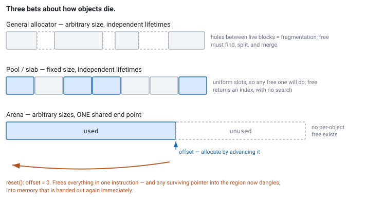

<!--
chapter: c3-arenas-and-allocators
state: draft_created
contract: standards/chapter-contract.md
include_measurement_plan: false | include_quizzes: true | primary_artifact_mode: code
unresolved_markers: 0
-->

# Free Everything at Once

## Arenas, Slabs, and Custom Allocators

**Prerequisites:** [c2] Preallocation and object pools · [c1] Virtual memory and page faults
**Focus:** the right allocator follows from the *lifetime pattern* of the objects — and the biggest win available is arranging for many objects to die at the same moment

---

## A dozen objects that all die together

A feed handler parses a message. Doing so produces a handful of short-lived intermediates: a decoded header, a few field views, a small vector of repeating-group entries, a scratch buffer for a symbol lookup. None of them survives the message. The moment the update has been applied to the book, every one is garbage.

The pool from [c2] does not help. A pool holds one type at fixed size, and these are five different types with different sizes, several of which are containers that will allocate internally anyway. So the handler is back to calling the general allocator — a dozen times per message, for objects that live a couple of microseconds, at message rates in the hundreds of thousands per second.

Each call is individually cheap. The aggregate is not, and every one of them carries the tail risk from [c2].

But look at the *shape* of the problem rather than the count. These objects have nothing in common except the one thing that matters: **they all become garbage at the same instant.** That is a fact the allocator does not know and cannot exploit, and it is the entire opportunity.

## Where you will actually meet this

Wherever work has a natural cycle and everything scoped to that cycle dies at its end:

- **Per-message scratch** in a feed handler — the case above ([d1]).
- **Per-batch working memory** when messages are processed in groups ([d4]).
- **Per-session state** in an order gateway, released wholesale on disconnect ([a2]).
- **Per-request context** in any request/response service, which is where most engineers first meet arenas.

In interviews this is less commonly asked directly than pools, and it makes a strong answer when it fits, because reaching for an arena demonstrates reasoning about lifetime rather than reaching for a familiar tool.

## The mental model

Allocators differ in what they make cheap, and each is a bet on how objects are born and how they die.

**The general allocator** assumes arbitrary sizes and arbitrary, independent lifetimes. Any object may be freed at any time in any order, so it must track free regions, split and merge them, and handle fragmentation. That generality is exactly where its slow paths come from.

**A pool** ([c2]) assumes fixed size, independent lifetimes. Because every slot is interchangeable, allocation is an index operation.

**An arena** assumes arbitrary sizes, **shared lifetime**. It allocates by advancing a pointer and does not free individual objects at all. When the cycle ends, the pointer resets to the start and the entire region is available again.

That last one is worth stating plainly, because it is the trick:

> An arena makes deallocation cost **O(1) for the whole region** instead of O(1) per object — by refusing to support per-object deallocation at all.

A dozen objects per message, freed by resetting one pointer. Not twelve cheap frees. One.


*Figure c3-1 — Three bets about how objects die. The arena has no holes because it never frees individually; that is the trade, not a bonus.*

```cpp
// code-c3-1 | RUNNABLE | C++20 | examples/, target: arena
class Arena {
public:
    explicit Arena(std::byte* base, std::size_t capacity)
        : base_(base), capacity_(capacity) {}

    void* allocate(std::size_t bytes, std::size_t alignment) noexcept {
        const std::size_t aligned = (offset_ + alignment - 1) & ~(alignment - 1);
        if (aligned + bytes > capacity_) return nullptr;   // overflow — see below
        offset_ = aligned + bytes;
        if (offset_ > high_water_) high_water_ = offset_;
        return base_ + aligned;
    }

    void reset() noexcept { offset_ = 0; }   // frees EVERYTHING. See the hazard.

    std::size_t used()       const noexcept { return offset_; }
    std::size_t high_water() const noexcept { return high_water_; }

private:
    std::byte*  base_;
    std::size_t capacity_;
    std::size_t offset_{0};
    std::size_t high_water_{0};
};
```

`allocate` is an add, a mask, a compare, and a store. There is no free list, no size class, no lock, and no branch that leads anywhere expensive. As with the pool, the point is not that it is fast — it is that the **worst case equals the average case**.

The `base_` memory is preallocated and pre-touched at startup ([c1]), so the arena also never faults during trading. It is the same discipline as [c2], applied to a different lifetime shape.

## Part 1 — What the arena forbids

Everything above is the upside. The cost is severe and specific: **you cannot free one object.**

That is not a limitation to work around; it is the deal. Accept it where lifetimes genuinely coincide, and do not use an arena anywhere else.

Two consequences follow, and both bite people.

**Destructors do not run.** `reset()` moves a pointer. It does not call anything. For trivially destructible types — the field views, headers, and PODs that make up most parsing scratch — that is exactly right and there is nothing to do. For a type holding a resource, resetting the arena leaks whatever it held. The usual discipline is to **restrict arena-allocated types to trivially destructible ones**, enforced with a `static_assert`, and to keep anything owning a resource out. Where that is not possible, the arena must track destructors to run at reset, which costs most of what made it attractive.

**A reference that outlives the reset is a dangling pointer into memory that will be reused immediately.** This is worse than a heap use-after-free, where the memory might sit untouched for a while and the bug might stay latent. An arena hands the same bytes to the very next allocation, so the corruption is prompt and certain.

So the ordering discipline is:

1. **Drop every reference into the arena.**
2. **Run destructors** if any type needs them (better: arrange that none do).
3. **Reset.**

Getting that order wrong produces silent corruption — the next message's header written over data the previous message's handler is still reading — and it will not fail in a way that points at the arena.

The structural defence is to make the reset a property of the *cycle* rather than something anyone calls by hand:

```cpp
// code-c3-2 | ILLUSTRATIVE — reset is tied to the cycle, not to a call site
class ArenaScope {
public:
    explicit ArenaScope(Arena& a) : arena_(a) {}
    ~ArenaScope() { arena_.reset(); }
    ArenaScope(const ArenaScope&) = delete;
private:
    Arena& arena_;
};

void on_message(const Packet& p) {
    ArenaScope scope(per_message_arena_);    // resets on every exit path
    auto* header = parse_header(p, per_message_arena_);
    auto  fields = parse_fields(p, per_message_arena_);
    apply_to_book(header, fields);
}   // <- everything above is freed here, in one instruction
```

Now nothing that escapes `on_message` can point into the arena, because there is no way to return one of these objects without the compiler complaining about a dangling reference — provided you do not defeat it by storing raw pointers somewhere longer-lived. Which is the remaining hazard, and the thing to look for in review.

---

**Quiz 1**

Choose an allocation strategy for each, and say why:

1. Order objects, created when an order is sent, destroyed when the venue reports a terminal state — which may be milliseconds or hours later, in any order.
2. Decoded field views and scratch buffers during the parsing of one message.
3. Per-session state for a venue connection: sequence numbers, buffers, a map of live orders. Lives for the session, discarded on disconnect.
4. The `std::vector` inside a strategy that is resized once at startup and then never again.

> **Answer**
>
> **1 — A pool ([c2]).** Fixed type, fixed size, and lifetimes that are genuinely independent: order A may terminate long before or long after order B, in no predictable order. That is exactly what per-object acquire and release is for, and precisely what an arena cannot express — there is no moment when all live orders die together.
>
> **2 — An arena.** Mixed types, mixed sizes, and one shared end point: the message. This is the opening scenario, and the ideal case.
>
> **3 — An arena, per session.** Less obvious, and it works for the same reason: everything scoped to a connection dies when the connection does. The cycle is longer — hours instead of microseconds — which changes only the sizing, not the argument. Note the map of live orders should hold *indices into the order pool*, not the order objects themselves, since orders can outlive a reconnect and must be reconciled afterwards ([a2], [e1]).
>
> **4 — The general allocator.** One allocation, at startup, off the hot path. Nothing here needs any of this machinery, and using it would add complexity for no measurable gain. This option is in the list because it is the right answer more often than allocator enthusiasm suggests.
>
> The pattern: **ask when the objects die, not how big they are or how many there are.** Independent deaths point at a pool; a shared death points at an arena; a single birth off the hot path points at leaving it alone.

---

## Part 2 — Slabs, and plumbing it in

**A slab allocator** is [c2]'s pool generalised: preallocated storage carved into fixed-size chunks, with a free list, serving one size class rather than one type. It fits the same lifetime pattern as a pool — independent deaths, uniform size — and is what you reach for when several types share a size, or when you want one mechanism serving many pools.

The comparison across all four:

| | General | Pool / slab | Arena |
|---|---|---|---|
| **Object sizes** | Arbitrary | Fixed | Arbitrary |
| **Lifetimes** | Independent | Independent | **Shared end point** |
| **Allocate** | Variable cost, occasional slow path | Index operation | Pointer bump |
| **Free one object** | Yes | Yes | **No** |
| **Free everything** | Per object | Per object | **One reset** |
| **Fragmentation** | Possible | None | None within a cycle |
| **Destructors** | Automatic | Yours to call | Not run — restrict to trivial types |
| **Fits** | Anything, off the hot path | Orders, buffers, book nodes | Per-message, per-batch, per-session scratch |

### Getting the allocator into your containers

An arena is not much use if `std::vector` still calls the global allocator. The standard mechanism for this is **`std::pmr`** — polymorphic memory resources — which lets containers take an allocator through a virtual interface rather than as a template parameter.

```cpp
// code-c3-3 | ILLUSTRATIVE | C++20
#include <memory_resource>

std::byte backing[64 * 1024];                       // preallocated, pre-touched

void on_message(const Packet& p) {
    std::pmr::monotonic_buffer_resource arena{backing, sizeof(backing)};

    std::pmr::vector<Entry> entries{&arena};        // allocates from the arena
    std::pmr::string        symbol{&arena};
    parse_into(p, entries, symbol);
    apply_to_book(entries, symbol);
}   // <- monotonic_buffer_resource releases everything; no per-object frees
```

`monotonic_buffer_resource` *is* an arena — it allocates by bumping and frees nothing until destroyed. `unsynchronized_pool_resource` is a pooling resource for single-threaded use. Both take a backing buffer you supply, so the memory can be preallocated and pre-touched.

The usual objection is that `pmr` is slow because the resource is polymorphic, and it is worth being precise: yes, there is a virtual call per allocation, and it replaces a call into the general allocator that was going to be more expensive and occasionally *much* more expensive. Against a bump allocation the virtual call is real overhead; against `malloc` it is a bargain. As always, the comparison that matters is against what you are actually replacing.

The alternative — templating every type on an allocator — avoids the virtual call and propagates the allocator type through every signature that touches those containers, which is a large and permanent cost to the codebase. `pmr` exists because that trade was usually not worth it.

---

**Quiz 2**

A feed handler uses a per-message arena, reset at the end of `on_message`. It runs correctly for months.

A developer adds a feature: when a message fails validation, a pointer to the decoded header is appended to a diagnostics list so the last hundred bad messages can be inspected from the admin interface.

Testing passes. In production, the diagnostics occasionally show a header whose fields belong to a completely different symbol. What happened, and what are the two ways to fix it?

> **Answer**
>
> **The header was allocated in the arena, and the arena was reset the moment `on_message` returned.** The diagnostics list holds a pointer into memory that is handed out again on the very next message — so the header's bytes are overwritten by the next message's parsing, and the list now shows the *next* message's data through a pointer labelled as the old one.
>
> Note what makes this so nasty. It is not a use-after-free that might sit harmlessly on an untouched heap block: **an arena guarantees prompt reuse**, so the corruption is certain and immediate rather than probabilistic. And it presents as *plausible* data — a well-formed header for the wrong symbol — so nothing crashes and nothing looks obviously broken. In testing, with low message rates and probably one message in flight at a time, the next message may not arrive before someone inspects the list, so it appears to work.
>
> **Fix one: copy out.** The diagnostics list owns its own storage and copies the header into it. Correct, simple, and it costs a copy on a path that is already failing validation, so the cost is irrelevant. **This is the right answer.**
>
> **Fix two: allocate diagnostics elsewhere.** If the diagnostic record must outlive the message, it does not belong in a per-message arena. Give it a pool ([c2]) or the general allocator, since this path is by definition not hot.
>
> The general lesson, and the reason this quiz exists: **an arena's boundary is invisible at the point of use.** `header` is an ordinary pointer, and nothing in its type says "dies at the end of this function." Every arena is one careless pointer-store away from this bug, which is why the reset should be tied to a scope and why arena-allocated types are worth naming or wrapping so the constraint is visible in review.

---

## Common mistakes

**Writing a custom allocator without measuring the general one.** It is a maintenance obligation forever, and the general allocator is adequate on most paths.

**Using an arena for independent lifetimes.** It is the wrong tool and will either leak or force per-object bookkeeping that removes the benefit.

**Letting a pointer escape the arena's cycle.** Quiz 2. The defining hazard.

**Allocating non-trivially-destructible types in an arena.** Reset does not run destructors, so anything holding a resource leaks it. `static_assert` on `std::is_trivially_destructible_v`.

**Assuming `pmr` is too slow to consider.** Compare it against what it replaces, not against a bump.

**No overflow policy.** An arena that runs out mid-message needs defined behaviour, and "fall back to malloc" reintroduces exactly what [c2] warned about.

**Sizing the arena from the average message.** Size it from the largest message the venue can send, and export the high-water mark.

## Going deeper elsewhere

*Optional. Not required for an interview answer; knowing it makes the baseline concrete.*

This chapter says the general allocator is "fast on average with occasional slow paths" without saying where those paths come from. Modern general allocators are sophisticated: they maintain per-thread caches so most allocations avoid synchronisation entirely, bucket requests into size classes to avoid searching, and manage larger regions from which those classes are carved. The slow paths are the transitions — a thread cache that has run dry, a size class with no free chunk, a region that must be obtained from the kernel — which is why the cost depends on state you cannot see.

Knowing this sharpens the judgement in this chapter, because it tells you what you must beat. A custom allocator that is faster than `malloc` in a microbenchmark is often only beating the thread-cache path, which was already fast; the value of an arena is that it removes the slow paths, not that it beats the fast one.

The published design documentation for widely used allocators such as **jemalloc** and **tcmalloc** describes their size classes, thread caches, and arena structures directly, and is the best available reading on what a production general allocator actually does.

## Operational behaviour

- **Export the arena's high-water mark per cycle.** It tells you whether the sizing survives the largest real message or session, and it is the only early warning of an overflow.
- **Alarm on overflow.** It means the sizing assumption was wrong, and whatever the fallback does, the fact of it is information.
- **Size per-session arenas for the longest plausible session**, not the median. A session that runs all day accumulates.
- **Assert the arena is empty at cycle start** in debug builds. A non-zero offset at the top of `on_message` means someone missed a reset.
- **Keep the backing memory pre-touched** ([c1]), and re-verify after any change to how it is allocated.

## When not to use a custom allocator

- **When the general allocator is not measurably a problem.** The most common case, and the answer that costs least ([a4]).
- **When lifetimes do not share an end point.** Then it is a pool question, not an arena question.
- **On cold paths.** Session setup, config, admin. Complexity with no return ([a1]).
- **When the objects need destructors and you cannot avoid it.** Tracking destructors for arena reset removes most of the benefit; use a pool or the general allocator.
- **When the team will not maintain it.** A custom allocator is a permanent obligation, and one that is subtly wrong is far more expensive than any allocation it saved.

## Interview mapping

- **Ask when the objects die** before proposing anything. It is the question that selects the tool, and asking it demonstrates the reasoning the interviewer is looking for.
- **State the arena's trade precisely**: deallocation becomes free because per-object deallocation becomes impossible.
- **Raise the dangling-reference hazard**, unprompted, and note that arenas reuse promptly so the bug is certain rather than latent.
- **Mention destructors are not run** and that arena types should be trivially destructible.
- **Know `pmr` exists** and what it solves — plumbing allocators through containers without templating everything.
- **Argue for the general allocator** where it is adequate. Candidates who want to write an allocator for everything reveal they have not maintained one.

## Summary

Allocators are bets about lifetimes. The general allocator bets on arbitrary sizes and independent deaths, and pays for that generality in slow paths you cannot predict. A pool bets on fixed size and independent deaths. An arena bets on the one pattern the others cannot exploit: **many objects, dying together.**

When that bet is right the payoff is large. Allocation becomes a pointer bump, deallocation becomes a single reset for the entire region, fragmentation disappears within a cycle, and — because the backing memory is preallocated and pre-touched — nothing faults during trading. The worst case equals the average case, which is the property this whole module is chasing.

The price is that per-object freeing is not merely discouraged but impossible, and that has two sharp edges. Destructors do not run, so arena types should be trivially destructible. And any reference that outlives the reset points at memory that is reused immediately, which makes the failure prompt, certain, and disguised as plausible data. Tie the reset to a scope so the cycle owns it rather than a call site.

Then, having built all this: check whether you needed it. The general allocator is the right answer on every path where its tail does not matter, and that is most paths in most systems.

**Related:** [c1] virtual memory · [c2] preallocation and pools · [c5] NUMA placement · [a3] latency and tail latency · [a4] measurement · [d1] market data and protocols · [d4] backpressure · [a2] order lifecycle · [a1] system anatomy

## References

- ISO/IEC. (2020). *ISO/IEC 14882:2020 — Programming languages — C++*. International Organization for Standardization. [`<memory_resource>` and the allocator model]
- Published design documentation for production general-purpose allocators such as jemalloc and tcmalloc. [size classes, thread caches, and where the slow paths are]
- Arpaci-Dusseau, R. H., & Arpaci-Dusseau, A. C. (2018). *Operating systems: Three easy pieces* (1.00 ed.). Arpaci-Dusseau Books. [free-space management]
