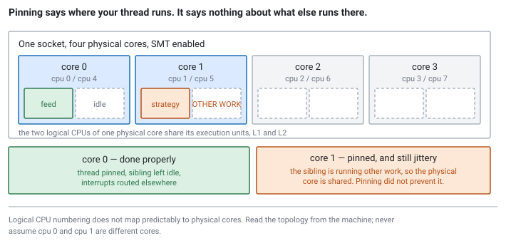

<!--
chapter: c4-thread-affinity
state: draft_created
contract: standards/chapter-contract.md
include_measurement_plan: true | include_quizzes: true | primary_artifact_mode: code
unresolved_markers: 0
-->

# Where Your Thread Actually Runs

## Thread Affinity and Scheduler Interaction

**Prerequisites:** [b5] Waiting strategies · [a4] Measurement and profiling · [c1] Virtual memory
**Focus:** pinning removes the scheduler's freedom to move your thread, but not the machine's ability to interfere with it — isolation is the larger half of the job

---

## Pinned, and still jittery

A team pins their feed handler and strategy threads to dedicated cores. The reasoning is sound and the implementation is correct: the threads are exactly where they were told to be, and a check confirms they are never migrated.

The median improves. The tail does not.

Every few seconds one of the threads takes a spike of tens of microseconds. There is no hot function, no lock, no allocation, no page fault ([c1]). The process is doing nothing unusual at those moments — which is the clue, because the interference is not coming from the process at all.

Pinning answered the question *"which core does my thread run on?"* The spikes are the answer to a different question nobody asked: **"what else runs on that core?"**

## Where you will actually meet this

Core assignment is part of the deployment specification at latency-sensitive firms, alongside interrupt routing and kernel boot parameters — not a code-level optimisation someone applies later. You will meet it as:

- **Feed handler and strategy placement** on dedicated cores, the case above.
- **A precondition for everything else in this module.** [b5]'s spinning requires a core nobody else wants; [c5]'s NUMA reasoning requires knowing where threads run before asking where memory lives.
- **A source of production mystery** when the deployment changes and the core map does not.

It is a standard interview topic, and it separates people quickly, because the naive answer stops at the pinning call and the real answer is mostly about everything else on the machine.

## The mental model

By default the scheduler places your thread wherever it likes and moves it whenever it likes. Two costs follow.

**Migration is expensive in a way that does not show up as CPU time.** A thread moved to another core arrives with cold caches: its working set is in the old core's L1 and L2, and every access now misses until it is pulled across ([a5]). If the new core is on another socket, that pull crosses the interconnect ([c5]). The thread is running the whole time — nothing is blocked, no time is "lost" in any profiler's accounting — it is simply slower for a while, and the profiler attributes that time to whatever code happened to be executing.

**Placement affects who you share with.** Cores are not independent. Two hyperthread siblings share one physical core's execution units, L1, and L2. Cores on one socket share a last-level cache and a memory controller. Where a thread runs determines what it competes with, and the scheduler makes that choice on criteria that have nothing to do with your latency budget.

Pinning fixes both by removing the scheduler's discretion.

And then — this is the part the opening scenario is about — **it stops.** Pinning is a statement about where *your* thread runs. It says nothing about what else may run there:

- **Timer interrupts**, which fire periodically on every core by default.
- **Device interrupts**, routed to cores by a policy that knows nothing about your threads. Network interrupts in particular can land on the core running your feed handler.
- **Kernel threads** doing reclaim, writeback, RCU work, and scheduled maintenance.
- **Other processes** — monitoring agents, log shippers, package managers, your own non-hot threads.
- **The sibling hyperthread**, running anything at all and competing for the same execution resources.

Each of those preempts your pinned thread or steals its resources, and none of them is prevented by pinning. Hence:

> **Pinning is keeping your thread on a core. Isolation is keeping everything else off it. The second is the larger job, and it is system configuration rather than code.**


*Figure c4-1 — A logical CPU is half a physical core. Pinning fixes where your thread runs and does nothing about what shares the core with it.*

## Part 1 — Doing the pinning, and the topology trap

The code is short. The hard part is choosing the number.

```cpp
// code-c4-1 | ILLUSTRATIVE | Linux-specific
// Pin the calling thread, then VERIFY. Assume nothing.
bool pin_to_cpu(int cpu) {
    cpu_set_t set;
    CPU_ZERO(&set);
    CPU_SET(cpu, &set);
    if (pthread_setaffinity_np(pthread_self(), sizeof(set), &set) != 0)
        return false;

    // Verify: a failed or ignored pin must not look like success.
    cpu_set_t check;
    CPU_ZERO(&check);
    if (pthread_getaffinity_np(pthread_self(), sizeof(check), &check) != 0)
        return false;
    return CPU_ISSET(cpu, &check) && CPU_COUNT(&check) == 1;
}
```

Verification matters because affinity can be silently constrained by the container or cgroup the process runs in, and a process that believes it is pinned when it is not will behave inconsistently for reasons nobody can see. **Assert at startup and refuse to run if placement is wrong** — a trading process that is quietly misplaced is worse than one that fails to start.

Now the number itself, which is where people get hurt.

**Logical CPU numbering does not map predictably to physical topology.** "CPU 0" and "CPU 1" may be two different physical cores, or they may be the two hyperthread siblings of a single physical core, depending on the machine, the firmware, and the kernel's enumeration. Pinning two hot threads to CPUs 0 and 1 might give each a full core — or might put both on one physical core, where they compete for the same execution units and each runs substantially slower than it would alone.

There is no portable convention. The only correct approach is to **read the topology from the machine** — `lscpu --extended` and the files under `/sys/devices/system/cpu/` report, for each logical CPU, its physical core and socket — and derive the core map from that at deploy time. Never hardcode a map from a previous machine, and never assume the pattern from one vendor's part applies to another.

---

**Quiz 1**

A dual-socket host reports 32 logical CPUs. A team pins their feed handler to CPU 0 and their strategy to CPU 1, reasoning that adjacent numbers mean adjacent cores and adjacency is good for the queue between them.

Give two distinct ways this can be badly wrong, and say how you would choose properly.

> **Answer**
>
> **Wrong one: CPUs 0 and 1 may be hyperthread siblings of the same physical core.** On many Linux systems the enumeration interleaves siblings, so consecutive logical CPUs are the two threads of one core. Both hot threads then share one core's execution units, L1, and L2 — so instead of two cores' throughput they get one core's, split, and each is slower than it would have been alone. This is the worst possible placement for two busy threads, and it was chosen because the numbers looked adjacent.
>
> **Wrong two: even if they are separate physical cores, they may be on the wrong socket relative to the NIC.** On a dual-socket host the network card is attached to one socket's PCIe complex. A feed handler on the far socket pays an interconnect crossing on every packet, before its code runs at all ([c5]). Adjacent CPU numbers say nothing about which socket they are on — the enumeration may group by socket or interleave across them.
>
> **How to choose:** read the topology. `lscpu --extended` gives the core and socket for each logical CPU, and `/sys/class/net/<iface>/device/numa_node` gives the NIC's socket. Then pick cores that are (a) on the NIC's socket, (b) distinct *physical* cores, and (c) ideally with their siblings left idle or reserved. Generate the map at deploy time from the machine's own report, and assert it at startup.
>
> **The trap is that both errors are invisible.** The threads are pinned, they never migrate, the pinning API returned success, and the system runs. It is simply slower than it should be, for two reasons that no amount of profiling the process will reveal — because the cost is in what the process is sharing, not in what it is doing.

---

## Part 2 — The isolation half

Pinning is done in a few lines. Keeping the core clear is a configuration exercise, and it is where the opening scenario's spikes actually live.

The pieces, roughly in order of how much they typically matter:

**Keep other processes off.** The kernel can be told at boot to exclude a set of CPUs from normal scheduling, so nothing lands there unless explicitly placed. Container and cgroup CPU sets do the same at a finer grain. Without this, every background process on the host is a candidate to preempt your feed handler.

**Route device interrupts away.** Interrupt affinity is configurable per IRQ. By default, interrupt distribution knows nothing about which cores you consider precious — and network interrupts are both frequent and, unhelpfully, correlated with the arrival of the data you care about. Routing them to non-isolated cores is one of the highest-value changes available.

**Reduce timer interrupts.** The kernel ticks periodically on each core for scheduling and accounting. Tickless configurations can suppress this on cores running a single runnable task, removing a periodic source of small stalls.

**Deal with the sibling hyperthread.** Two options, both defensible. Disable SMT entirely, which is simple and halves your logical CPU count. Or leave it enabled and ensure the sibling of each isolated core is also isolated and left idle, which keeps the cores available for non-critical work elsewhere on the machine while giving the hot thread the physical core to itself.

**Move your own non-hot threads.** Logging, telemetry, admin interfaces, and the metrics exporter should be explicitly placed on non-isolated cores. It is easy to isolate cores carefully and then let your own background threads land on them by default ([a1]).

None of this is code. All of it is deployment configuration with a hardware dependency, which makes it something that must be owned, documented, and re-derived when the hardware changes — a theme this module keeps returning to.

---

**Quiz 2**

Your feed handler is pinned to an isolated core with a verified affinity mask, migration count zero, interrupts routed elsewhere, and no other process placed on that core.

It still takes a 30µs spike roughly every few seconds.

Name three candidate causes and say how you would distinguish them.

> **Answer**
>
> **1 — The sibling hyperthread.** If SMT is on and the sibling logical CPU was not isolated, something is running there and competing for the physical core's execution units. *Distinguish:* check whether the sibling is in the isolated set; run with the sibling deliberately loaded and see whether the spike frequency rises; or disable SMT and re-measure.
>
> **2 — Transparent huge page compaction, or other kernel memory work** ([c1]). Compaction can stall the thread that triggers it while the kernel rearranges physical memory, and it fires unpredictably under fragmentation. *Distinguish:* check whether THP is enabled and in which mode; monitor compaction and fault counters and correlate them in time with the spikes. Timing correlation is the decisive evidence here.
>
> **3 — Something in your own process.** A background thread of yours that was never placed anywhere, a periodic metrics flush, a log rotation, an occasional allocation on a path you thought was clean ([c2]). *Distinguish:* list the process's own threads and their affinities — this is frequently the answer, and it is embarrassing precisely because the isolation work was done carefully everywhere except at home.
>
> **How I would actually proceed:** timestamp the path per stage and capture full traces for outliers only ([a4]), which localises the spike to a stage. Then correlate the outlier timestamps against kernel counters — context switches on that core, fault counts, compaction events. **A spike with no context switch and no fault points at the sibling; a spike with a fault points at memory; a spike with a context switch on an isolated core means something is running there that should not be.** <!-- CALLBACK: a4 -->
>
> The general lesson: once the obvious causes are excluded, the remaining ones are all *outside the process*, and finding them means correlating your latency events against the machine's counters rather than looking harder at your own code.

---

## Common mistakes

**Stopping at the pinning call.** It is the small half of the job.

**Assuming consecutive CPU numbers are separate cores.** Quiz 1. Read the topology.

**Not verifying the pin took effect.** Containers and cgroups can constrain affinity silently.

**Hardcoding a core map.** It is hardware-specific and changes with refresh, firmware settings, and BIOS options.

**Forgetting your own background threads.** Isolating cores and then letting the metrics thread land on one is common.

**Pinning before measuring.** If variance is not your problem, this buys complexity and nothing else ([a4]).

**Pinning on a shared or virtualised host.** You can pin to a virtual CPU that the hypervisor deschedules whenever it likes, which gives the appearance of control without the substance.

**Treating pinning as a throughput optimisation.** It is a variance control. The median may barely move ([a3]).

## Going deeper elsewhere

*Optional. Not required for an interview answer; knowing it makes the isolation configuration make sense rather than being a list of settings to copy.*

This chapter treats the scheduler as something to be excluded rather than understood. What it is actually doing — how it decides which runnable thread gets a core, how it balances load across cores, what it costs to migrate a thread and why it does so anyway — explains why the isolation parameters exist and what each one turns off.

The same material covers what a "tick" is and why suppressing it helps, which otherwise reads as folklore.

**Arpaci-Dusseau and Arpaci-Dusseau, *Operating Systems: Three Easy Pieces*** covers scheduling principles including multiprocessor scheduling and cache affinity, and is free online. The **Linux kernel documentation** is the authority for what the specific isolation mechanisms do on the kernel version you are running — and these differ enough between versions that a general description is not a substitute for the documentation of yours.

## Operational behaviour

- **Assert placement at startup and refuse to run if it is wrong.** Silent misplacement produces a slower system with no failure anyone can point at.
- **Export migration counts per thread.** They should be zero. A non-zero and rising count means the pin is not holding.
- **Own the core map as deployment configuration**, generated from the target machine's topology and re-derived at hardware refresh. It is exactly as much a part of the deployment as the binary.
- **Record the isolation configuration alongside results.** A latency figure from a host with different isolation settings is not comparable, and this is the most common reason two "identical" hosts behave differently.
- **Place your own non-hot threads explicitly**, rather than letting them default onto isolated cores.

## When not to pin

- **Before establishing that variance is the problem.** Measure first ([a4]).
- **On shared or virtualised hosts**, where a core cannot genuinely be dedicated and the hypervisor can deschedule your virtual CPU regardless.
- **For cold paths.** Logging, telemetry, and admin threads should be kept *off* the isolated cores, which is placement in the opposite direction.
- **When the operational cost exceeds the benefit.** A core map is a permanent, hardware-coupled obligation, and on a system whose tail is dominated by something else it is pure cost.

## Optional — if you want to see it for yourself

*Migration cost is invisible in every conventional measurement — the thread is running the whole time. That is precisely why it is worth provoking once, deliberately.*

The instructive experiment isolates migration from everything else. Run a thread with a working set that fits comfortably in L2, timing each iteration of a hot loop. Then, from another thread, periodically change its affinity to force a migration to a different physical core, and look at the latency distribution around those moments.

You will see a burst of slow iterations immediately after each migration, decaying as the working set is pulled into the new core's caches. Nothing was blocked and no time was "lost" — the thread was running throughout — which is exactly why this cost does not appear in any profile and why it has to be measured deliberately.

For the isolation half, the comparison is: same pinned thread, sibling hyperthread idle versus sibling running a busy loop. The spike frequency and tail will differ noticeably, and it is the cleanest way to see that pinning alone did not give you the core.

Two habits worth keeping:

- **Look at the distribution around the event**, not the average over the run. A few dozen slow iterations out of millions vanish in a mean ([a3]).
- **Record the topology and isolation settings** with the result. Without them the numbers are not reproducible on any other machine, including the same one after a firmware change.

## Interview mapping

- **Say what pinning does not fix**, unprompted. Interrupts, kernel threads, other processes, the sibling hyperthread. This is the differentiator and the naive answer stops before it.
- **Raise the hyperthread sibling trap.** Concrete, specific, and it demonstrates you have looked at real topology output.
- **Say logical CPU numbers do not map predictably to physical cores**, and that you would read the topology rather than assume.
- **Frame pinning as variance control**, not throughput. It connects to [a3] and shows the right mental model.
- **Mention verifying the affinity took effect**, especially under containers.
- **Note that this is deployment configuration with a hardware dependency.** It signals you have operated these systems rather than only built them.

## Summary

Left alone, the scheduler places your thread and moves it when convenient. Migration costs a cold cache on arrival — a cost that appears nowhere in a profile, because the thread is running the whole time — and placement determines what your thread shares execution resources, caches, and memory bandwidth with. Pinning removes that discretion.

And then it stops, which is the part that matters. A pinned thread can still be preempted by timer interrupts, device interrupts, kernel work, other processes, and its own sibling hyperthread. Keeping those off the core is a separate job, done in boot parameters, interrupt routing, and cgroup configuration rather than in code — and it is the larger half by a distance.

Choosing which core is its own trap, because logical CPU numbering carries no reliable information about physical topology. Two consecutive numbers may be one physical core's two threads, or two cores on different sockets. The map has to be derived from the machine's own report, asserted at startup, and re-derived when the hardware changes.

That last point is the theme of this whole module arriving again: these are not code changes but configuration tied to specific hardware, which makes them an operational artifact with an owner and a lifetime. [c5] is where thread placement and memory placement finally meet, and where getting either one wrong stops being a local cost and starts being an architectural one.

**Related:** [b5] waiting strategies · [c1] virtual memory · [c5] NUMA placement · [a3] latency and tail latency · [a4] measurement · [a5] cache locality · [a6] coherence · [b3] progress guarantees · [a1] system anatomy

## References

- Arpaci-Dusseau, R. H., & Arpaci-Dusseau, A. C. (2018). *Operating systems: Three easy pieces* (1.00 ed.). Arpaci-Dusseau Books. [scheduling, multiprocessor scheduling, and cache affinity — free online]
- Linux kernel documentation on CPU isolation, tickless operation, and IRQ affinity is the authority for the specific mechanisms and differs by kernel version. *(Stage 1 source pack to pin versions.)*
- `lscpu` and the `/sys/devices/system/cpu/` interface are the correct source for a machine's topology; vendor numbering conventions are not portable.
