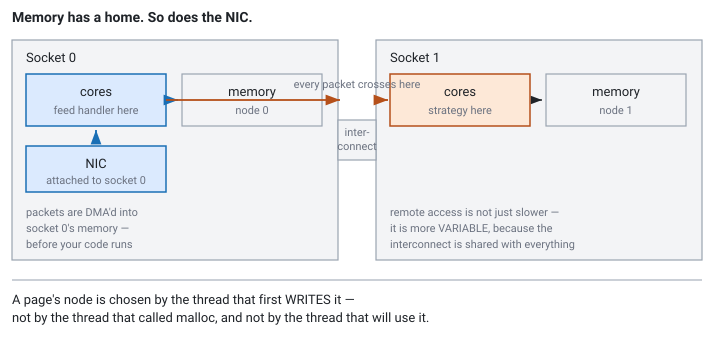

<!--
chapter: c5-numa-placement
state: draft_created
contract: standards/chapter-contract.md
include_measurement_plan: true | include_quizzes: true | primary_artifact_mode: code
evidence note: claim-c5-06 is the deliberate trap. No latency ratio appears anywhere
               in this chapter. See "A note on the missing numbers".
unresolved_markers: 0
-->

# The Server Upgrade That Made Things Worse

## NUMA-Aware Placement

**Prerequisites:** [c4] Thread affinity · [c1] Virtual memory and page faults · [a6] Cache coherence and false sharing
**Closes Module C** — carries the module review
**Focus:** where your memory physically lands, and how to tell whether NUMA is actually your problem

---

## The server upgrade that made things worse

A firm replaces its production trading host. The old box was a single-socket machine that had run out of cores. The new one is dual-socket: twice the cores, more memory channels, a newer generation. Same code, same feed, same strategy.

The NIC carrying the Nasdaq feed is plugged into socket 0. The feed handler is pinned to a core on socket 0, next to it. Socket 0 was getting crowded, so the strategy thread is pinned to socket 1 — plenty of idle cores over there.

Median tick-to-trade is fine. Slightly better than the old box, in fact.

The 99th percentile is roughly double what it was.

The team profiles it. No hot function. No lock contention. No allocation on the hot path — that was cleaned up years ago. The flame graph looks like the flame graph from the old machine. Every individual thing the code does is fast, and yet the tail is worse on hardware that is unambiguously better.

The cost is not in any one function. It is spread thinly across every memory access the strategy makes, because the buffers it reads were physically allocated on the other socket, and every one of those reads crosses the interconnect between the two.

## Where you will actually meet this

NUMA placement is not a general performance topic that trading happens to care about. It is close to the opposite: an obscure concern in most of the industry, and **standard operating procedure in this one**.

The reason is that the product here is the tail. A web service measured on throughput and median response time can absorb remote memory access without anyone noticing — it disappears into an average. A trading system is judged on tick-to-trade at the 99th percentile and beyond, and remote access hurts precisely there, because the interconnect is shared and its cost depends on what everything else on the machine is doing. NUMA effects and tail latency are the same problem viewed from two angles.

Concretely, this is where it shows up:

- **Colocated execution hosts.** The machine in the exchange data centre is expensive, space is limited, and it gets specified with as many cores as will fit — which means two sockets. NIC-to-handler co-location on those boxes is a deployment standard at latency-sensitive firms, not an optimisation someone gets around to.
- **Consolidated multi-desk servers.** One large host running feed handlers, strategies, and risk for several desks or several venues. Placement is what keeps them from interfering with each other, and a misplaced buffer on a shared box degrades a neighbour who has no way to see why.
- **Capacity growth.** The moment a strategy outgrows one socket, every thread-placement decision becomes a memory-placement decision too. This is the transition that produces the scenario at the top of this chapter, and it catches teams who were doing everything else right.
- **Hardware refresh.** New generation, different topology, same code, different tail. Firms that treat placement as configuration handle this in an afternoon; firms that treat it as folklore rediscover it every few years.

It is also a live interview topic at firms running this hardware, and it is asked as a *diagnostic* question — a tail regression with a clean profile — rather than as a definition. The scenario above is very close to the standard form.

One thing to establish before any of it applies: how many NUMA nodes the machine actually has. That is the first step of Part 2, and it is diagnosis rather than disclaimer — the answer determines whether you are looking at a placement problem or wasting a week on one.

## The mental model

On a multi-socket machine, memory is not one uniform pool. Each socket has memory controllers with DRAM attached directly, and the sockets are joined by an interconnect. A core reading memory attached to its own socket takes the short path. A core reading memory attached to the other socket goes over the interconnect and back.

A **NUMA node** is one such grouping — a set of cores plus the memory local to them. Local access is fast; remote access is slower, and, more importantly for us, **more variable**, because it shares the interconnect with every other cross-socket transaction on the machine: other threads' remote reads, cache-coherence traffic, DMA from devices.

Two consequences that people miss:

**Devices have locality too.** A NIC is attached to one socket's PCIe root complex. Packets it DMAs into memory arrive on that socket's side of the machine. A thread on the other socket reading those packets pays the crossing on every one, no matter where its own data structures live.

**Latency is not the main story — variance is.** A remote access being somewhat slower on average would be tolerable. The problem is that the interconnect is shared, so remote access time depends on what everything else on the machine is doing. That is exactly the shape of a tail-latency problem, and exactly why it does not show up as a hot function in a profile ([a3] latency and tail latency).


*Figure c5-1 — Both memory and devices have a socket. The crossing is a property of the path, not of the thread: it happens during DMA, before your code touches anything. No latency ratio is shown, deliberately — see "A note on the missing numbers" below.*

## Part 1 — Where your memory actually is

Here is the thing that surprises people: **`malloc` does not decide which NUMA node your memory lives on. It does not allocate physical memory at all.**

`malloc` hands back virtual addresses. No physical page exists yet. The physical page is allocated later, on the **first touch** — in practice the first *write* — when the access faults and the kernel must produce a real page. And the kernel's default policy is to allocate that page on the NUMA node of **the thread that faulted**.

So the placement rule is:

> A page lands on the node of the thread that **first writes to it**, not the thread that called `malloc`, and not the thread that will spend the rest of the session using it.

This is the source of most accidental NUMA problems, and it produces a specific, extremely common bug:

```cpp
// code-c5-1 | ILLUSTRATIVE | Linux, default first-touch policy
// THE TRAP — a tidy initialisation phase that places everything wrong.

int main() {
    auto buffers = allocate_all_buffers();   // virtual only, no placement yet

    // Main thread, running wherever the scheduler put it, touches everything.
    for (auto& b : buffers) {
        std::memset(b.data(), 0, b.size());  // <-- placement happens HERE
    }

    start_feed_handler_on_socket0(buffers);  // now using memory that may be
    start_strategy_on_socket1(buffers);      // on the wrong node, permanently
}
```

Every page in that program is now on whichever node the main thread happened to be running on during startup. Not by design. By accident, decided by the scheduler, and quite possibly different on the next restart.

The fix is not clever. It is to make **the thread that will use the memory be the thread that first touches it**:

```cpp
// code-c5-2 | ILLUSTRATIVE | Linux, default first-touch policy
// THE FIX — each worker faults in its own memory, after it is pinned.

void worker_main(Buffers& mine, int cpu) {
    pin_to_cpu(cpu);                         // pin FIRST — order matters
    std::memset(mine.data(), 0, mine.size());// now first touch is local
    run_hot_loop(mine);
}
```

Pin before touching. A thread that touches memory before it is pinned places that memory according to where it happened to start, and pinning it afterwards moves the thread but not the pages.

Two related facts worth carrying:

- **Pages do not follow threads.** Moving a thread to another socket leaves its memory behind. There is no automatic migration on pinning.
- **Reading is not always enough to place a page.** For freshly allocated anonymous memory, a read may be satisfied without committing a real page. Write to it if you intend to place it — which is why `memset` rather than a read loop appears in the fix above.

---

**Quiz 1 — did first-touch land?**
A process allocates one large buffer with `malloc` while running on socket 0. It then starts a worker thread, pins it to a core on **socket 1**, and the worker is the first code to write to the buffer.

Which node does the buffer's memory end up on, and why?

> **Answer**
>
> **Socket 1.** `malloc` reserved virtual address space only; no physical pages existed and no placement decision had been made. The first write came from the worker, which was already pinned to socket 1, so the page faults were serviced on socket 1 and the pages were allocated there.
>
> This is the correct outcome, and it happened *because* the worker was pinned before it touched the memory. Reverse those two steps — touch first, pin afterwards — and the pages land wherever the worker started, with the pin doing nothing to move them.
>
> The trap in this question is the `malloc` on socket 0. It is a red herring, and if it changed your answer, that is the misconception this section exists to remove.

---

## Part 2 — Is NUMA actually your problem?

The failure mode of this topic is not ignorance. It is engineers who have read about NUMA restructuring a working system on the assumption that it must be the cause, then finding the tail unchanged. Diagnosis first.

Four things to establish, in order. The first three are inspection, not measurement.

**1. Does this machine have more than one NUMA node?**
`numactl --hardware` and `lscpu` report the node count and which CPUs belong to each. If the answer is one node, stop — nothing in this chapter applies. Do check rather than assume: some server CPUs can be configured to expose *multiple* NUMA nodes within a single physical socket, so "it's a one-socket box" is not the same answer as "it has one NUMA node."

**2. Where is the NIC?**
Under `/sys/class/net/<interface>/device/numa_node`. If your feed handler is not on the node the NIC reports, every packet crosses the interconnect before your code sees it — and no amount of buffer placement fixes that, because the crossing already happened during DMA.

**3. Where did your hot memory actually land?**
`/proc/<pid>/numa_maps` shows per-mapping page counts per node, and `numastat -p <pid>` summarises per-process. This is where the first-touch bug becomes visible: you will see a large mapping sitting entirely on one node while the thread using it runs on another. Do this before changing any code. It is usually the whole diagnosis.

**4. Only then, does co-location change anything?**
Pin the producer and consumer to cores on the *same* node, re-run, and compare tail latency. If the tail improves, NUMA placement is implicated and the rest of this chapter is worth your time. If it does not, the tail is coming from somewhere else and NUMA work will be wasted.

That fourth step is the one people skip, and it is the only one that produces evidence rather than suspicion.

### Fixing it, in order of preference

**Co-locate.** Put the threads that talk to each other, and the NIC they depend on, on the same node. This is the largest and simplest win, and it is a deployment decision more than a code change. It is also the one that survives hardware refresh best.

**Fix first-touch discipline.** Each thread faults in its own working memory after being pinned, as in `code-c5-2`. Costs nothing at runtime and removes the accidental-placement class of bug entirely.

**Bind explicitly.** Where first-touch discipline is impractical — a buffer genuinely shared by threads on different nodes, or allocated by a framework you do not control — the platform offers explicit placement APIs to bind a region to a chosen node. More control, more configuration to keep correct.

**Interleave.** Spread pages across nodes round-robin. This *raises* your best case and *lowers* your worst case: no access is guaranteed local, but no thread is systematically penalised. Right for a structure genuinely shared by threads on several nodes. Wrong for per-thread data, where it converts a fully local access pattern into a half-remote one.

---

**Quiz 2 — the diagnosis**
Your feed handler is pinned to socket 1. Its packet buffers are confirmed to be on node 1 — you checked `numa_maps`. Memory access is entirely local. The tail latency is still bad, and you have ruled out allocation, locks, and contention.

What have you not checked, and why would fixing buffer placement never have helped?

> **Answer**
>
> **Where the NIC is.** If it is attached to socket 0, packets are DMA'd into socket 0's memory and then have to cross the interconnect to reach a thread on socket 1 — on every single packet.
>
> Your buffers being local to the handler is irrelevant to that crossing. It has already occurred by the time the handler touches anything. You optimised the second half of the path and left the first half untouched.
>
> The fix is to move the handler to the NIC's node, not to move memory. `/sys/class/net/<interface>/device/numa_node` would have told you this in one command, before any code changed.
>
> The general lesson: **device locality and memory locality are separate problems**, and the one people check is usually the one that matters less.

---

## A note on the missing numbers

You may have noticed this chapter contains no figure for how much slower remote access is. No ratio, no nanosecond count, no "roughly N times."

That is deliberate. Those numbers depend on CPU generation, interconnect design, memory configuration, node distance, and what else is running on the machine — they vary enough between systems that a number quoted here would be more likely to mislead you than help. This handbook has no representative multi-socket hardware to measure on, so rather than repeat a figure from somewhere else and dress it up as established, the chapter states the mechanism and shows you how to get the number for your own machine.

Which is the better outcome anyway. In an interview, "remote access is slower and more variable, and I would measure the ratio on the target hardware because it varies by platform" is a stronger answer than a memorised figure — and a memorised figure that turns out to be wrong for the hardware being discussed is worse than no figure at all.

Where numbers do matter, get them from your vendor's architecture documentation for the specific part, or measure. Both beat recall.

## Going deeper — automatic balancing and sub-socket nodes

*A refinement on the above. Skip on a first read.*

**Automatic NUMA balancing.** Linux can detect that a thread is repeatedly accessing remote pages and migrate those pages to its node. Helpful for general-purpose workloads with unpredictable access patterns. For latency-sensitive ones it is a hazard: migration is not free, it happens at times you do not control, and the cost lands as an occasional spike — precisely the thing you are trying to eliminate. If you have done placement deliberately, the kernel's help is redundant at best. Know whether it is enabled on your hosts (`/proc/sys/kernel/numa_balancing`) and record that as part of the machine's configuration, because a host where it silently differs from the others will behave differently and nobody will know why.

**Sub-socket NUMA nodes.** Modern server CPUs are internally divided, and several vendors let firmware expose those divisions as separate NUMA nodes within a single socket. A one-socket machine can therefore present two or four nodes, and the locality reasoning in this chapter applies inside it. This is why step 1 of the diagnosis says *check the node count* rather than *count the sockets* — the two questions have different answers on hardware where this is enabled, and the firmware setting is not something you can infer from the part number.

## Common mistakes

**Assuming `malloc` places memory.** It reserves address space. First write places. Nearly every accidental placement bug traces back to this.

**Touching before pinning.** Pin, then fault in. The reverse order silently does nothing useful.

**Assuming pages follow threads.** They do not. Moving a thread leaves its memory where it was.

**Optimising for NUMA without confirming NUMA is the problem.** The four diagnostic steps take minutes. Restructuring a working system on a hunch takes days and often changes nothing.

**Checking memory locality and forgetting device locality.** Quiz 2. The NIC's node is one file read.

**Interleaving everything.** It is a hedge for genuinely shared structures. Applied to per-thread data it makes locality worse than doing nothing.

**Assuming one socket means one node.** Check the node count, not the socket count.

**Treating placement as a one-time fix.** It is configuration tied to a specific topology, and topology changes with hardware refresh.

## Operational behaviour

- **Assert placement at startup.** The process should verify the topology it was configured for — node count, its threads' nodes, the NIC's node — and refuse to start, or log loudly, if reality disagrees. Silent misplacement is the failure mode here, and it produces a system that is merely slower, which nothing will alert on.
- **Record the topology with your results.** A latency measurement without the topology it was taken on cannot be compared with anything.
- **Expect environments to differ.** Development, staging, and production hosts frequently have different socket counts and firmware settings. Configuration correct in one may be wrong in another, and the symptom is a performance difference nobody can explain.
- **Own the configuration.** Placement is an operational artifact with a topology dependency. It needs an owner and it needs revisiting at hardware refresh.

## When not to use this

- **Single-node machines.** One command settles it. If there is one node, every technique here is a no-op and the latency you are chasing is somewhere else.
- **When the working set is cache-resident.** If the hot data stays in cache, where its home node sits barely matters ([a5] cache locality).
- **Before thread affinity and measurement are in place.** NUMA tuning on an unpinned system measures the scheduler, not your placement. Do [c4] and [a4] first.
- **When co-locating solves it.** If moving threads onto one node fixes the tail, stop. You do not need explicit binding, interleaving, or a placement configuration file.
- **When the operational cost exceeds the win.** Topology-specific configuration is a permanent maintenance obligation. On a system where the tail is dominated by something else, it is pure cost.

## Optional — if you want to see it for yourself

*This chapter gives you no numbers on purpose. Here is how to get your own — and "how would you know?" is the question that follows the answer you just prepared.*

If you have access to a multi-node machine, one experiment gives you almost everything:

Take a thread and a buffer. Run a memory-bound access loop over the buffer with both on the **same** node. Then run the identical loop with the thread on one node and the buffer bound to another. The code is the same; the only variable is placement. Compare.

That comparison is worth more than any figure this chapter could have printed, because it is *your* hardware, and the number you get is the one that applies to the systems you will actually tune.

Two habits matter more than the result:

- **Report the distribution, not the mean.** The remote case's variance is the point. A mean hides exactly the effect you are looking for.
- **State the environment.** Part number, node count, whether sub-socket nodes are enabled, whether automatic balancing is on, how you bound the memory, what else was running. A NUMA number without its environment is not a result — it is the thing this chapter declined to print.

The transferable pattern, which is what an interviewer is probing: identify the suspected cost, construct the smallest comparison that isolates it, and be explicit about what the measurement does and does not establish. Here it establishes a local-versus-remote cost on one machine under one load. It does not establish a portable ratio, and you should say so.

## Interview mapping

- **Explain first-touch, unprompted**, when asked how memory gets placed. It is the core mechanism and the source of most real bugs.
- **Predict placement from a code sketch.** Quiz 1 is a standard form of this question.
- **Diagnose a tail regression with no hot function.** The scenario at the top of this chapter is the standard scenario. Walk through the checks in order.
- **Raise device locality without being asked.** Most candidates discuss memory only. Mentioning the NIC's node is a strong signal.
- **Say you would measure before optimising** — and be able to name what you would measure and on what.
- **Decline to quote a ratio.** "It varies by platform, I would measure it on the target" is the better answer, and it is correct.
- **Argue against the optimisation** when the evidence does not support it. Candidates who reach for NUMA tuning on a single-node box reveal that they have read about it rather than done it.

## Summary

On a multi-socket machine, memory has a home, and so do devices. A page's home is decided by first touch — the thread that first writes to it — not by whichever thread called `malloc`, which makes accidental placement the default outcome for any program with a tidy centralised initialisation phase. Remote access is not merely slower on average; it is more variable, because the interconnect is shared, which is why the damage shows up in the tail and never as a hot function in a profile.

The discipline is diagnosis before optimisation: count the nodes, find the NIC, look at where your pages actually landed, and confirm that co-locating changes something. Only then reach for first-touch discipline, explicit binding, or interleaving.

Get that discipline right and it is worth real money on the hardware this industry actually runs — the two-socket colocated hosts where tick-to-trade tail is the product, and where NIC-to-handler placement is treated as part of the deployment rather than as tuning. Get it wrong in the other direction, by restructuring a system that was never NUMA-bound, and you have spent a week moving memory around a machine that had one node all along.

**Related:** [c4] thread affinity · [c1] virtual memory and page faults · [a6] cache coherence and false sharing · [a5] cache locality and data-oriented layout · [a3] latency and tail latency · [a4] measurement and profiling · [d6] kernel bypass · [c3] arenas and allocators

## References

- Linux kernel documentation: memory policy, NUMA, and automatic balancing. *(Stage 1 source pack to pin exact documents and versions.)*
- Vendor architecture and optimisation guides for the specific CPU family in use — the correct source for any locality figure, and the reason none appears in this chapter.
- Drepper, U. (2007). *What every programmer should know about memory*. Red Hat. [mechanism and background; dated, and its figures should not be treated as current]


---

# Module C in review

*You have now taken apart the assumption Module B rested on: that memory appears when you ask for it and threads run where you expect. This section is consolidation rather than new material — read it now, and again before an interview.*

## The arc

**[c1] Virtual memory.** `malloc` returns address space, not memory. Physical pages arrive one at a time on first touch, through a kernel fault — so the cost is paid at whatever moment first use happens, which is why the morning is slow. Translation has its own cache, and a working set beyond TLB reach pays a page walk on every access even when locality is perfect.

**[c2] Preallocation and pools.** The general allocator is fast on average and conditionally slow, and every condition worsens under load. A pool replaces it with an operation whose worst case equals its average. The design work is not the pool — it is the exhaustion policy, the sizing from worst case, and the return discipline that survives error paths.

**[c3] Arenas and allocators.** Allocators are bets about lifetimes. An arena bets on the one pattern the others cannot exploit — many objects dying together — and makes deallocation free by making it impossible per object. The price is that any escaping reference points at memory reused immediately.

**[c6] mmap and zero copy.** A copy moves bytes; a mapping installs page-table entries. mmap trades copies for faults, changes errors from return values into signals, and — across a process boundary — introduces a failure mode in-process queues never had: one participant continuing without the other.

**[c4] Thread affinity.** Migration costs a cold cache that appears in no profile. Pinning removes the scheduler's discretion and nothing else; keeping interrupts, kernel work, other processes, and the sibling hyperthread off the core is the larger job and lives in configuration.

**[c5] NUMA placement.** Memory has a physical home, chosen by whichever thread first *writes* the page. Devices have homes too. Remote access is not merely slower but more variable, which is why it damages the tail and never appears as a hot function.

## The recurring ideas

**1. The machine is not uniform, and the defaults do not know about you.** Pages land where the first toucher was ([c1], [c5]). Threads run where the scheduler likes ([c4]). Interrupts land where the routing policy says ([c4]). Every default in this module was chosen for general-purpose workloads, and each one is a decision made on your behalf by something that does not know your latency budget.

**2. Placement is decided earlier than you think, and by the wrong actor.** The NUMA node is fixed by the first write, not by `malloc` ([c5]). The page exists from the first touch, not the allocation ([c1]). The core is chosen at thread start unless you say otherwise ([c4]). In each case the decision is made before the code that cares about it runs — which is why the fixes are all about doing something *deliberately and early* rather than optimising the hot path.

**3. Bounded worst case beats better average.** The pool is not faster than `malloc`; it is *predictable* ([c2]). The arena is not faster per object; it removes the slow paths ([c3]). Pre-faulting does not reduce work; it reschedules it out of trading hours ([c1]). This is [a3]'s argument arriving in a new domain, and it is the reason none of these techniques look impressive in a throughput benchmark.

**4. Every fix here is configuration with a hardware dependency.** Core maps, isolation parameters, huge page settings, NUMA placement, shared segment layouts — none of it is code, all of it is coupled to a specific machine, and all of it silently becomes wrong at hardware refresh. That makes each one an operational artifact needing an owner, a document, and a startup assertion. **A trading process that is quietly misconfigured is worse than one that refuses to start.**

**5. Diagnose before optimising, because the symptom does not name the cause.** Every chapter here has a failure that looks like something else: allocator stalls look like slow code, faults look like nothing at all, migration looks like nothing at all, false sharing looks like a slow instruction, NUMA looks like a tail with no hot function. In every case the resolution came from correlating against counters the process does not produce — faults, migrations, interrupts, node placement — rather than from looking harder at the code.

## Where the memory should come from

| Situation | Use |
|---|---|
| Fixed-size objects, independent lifetimes | Pool, preallocated and pre-touched ([c2]) |
| Mixed types, one shared end point | Arena, reset per cycle ([c3]) |
| Large read of an immutable, complete file | mmap, if it fits comfortably in RAM ([c6]) |
| Sequential pass over a file larger than RAM | `read()` into a reusable buffer ([c6]) |
| A file someone else is still writing | `read()` — never mmap ([c6]) |
| Cross-process handoff, measured need | Shared-memory ring, plus liveness and versioning ([c6]) |
| Cross-process handoff, no measured need | A local socket ([c6]) |
| Anything off the critical path | The general allocator ([c3]) |

## Check yourself

1. What does `malloc` actually give you, and when does the memory appear?
2. Why must pre-faulting write rather than read?
3. What is TLB reach, and what symptom does exhausting it produce?
4. Why is "no allocation on the hot path" a statement about the tail rather than the mean?
5. Your pool is empty. What are the four options, and which is almost always wrong?
6. Why is a pool leak invisible to memory monitoring, and what do you watch instead?
7. When is an arena the right choice, and what does it forbid?
8. What does mmap change about the error model?
9. What does a shared-memory queue add beyond an in-process one?
10. What does pinning fix, and what does it not?
11. Which thread decides which NUMA node a page lives on?
12. You have a tail regression with no hot function in the profile. Name four candidate causes from this module and how you would tell them apart.

## What comes next

Module C stayed inside one machine. **Module D** leaves it: market data arrives over a network that drops packets ([d2], [d3]), protocols have to be decoded at rates the machine can barely sustain ([d1], [d4]), timestamps come from clocks that disagree ([d5]), and the receive path can bypass the kernel entirely ([d6]) — which is [c6]'s copy counting and [c1]'s page behaviour applied to the wire.

The habits transfer directly. The network has its own defaults chosen by someone who did not know about you, its own placement decisions made before your code runs, and its own failures that look like something else.
