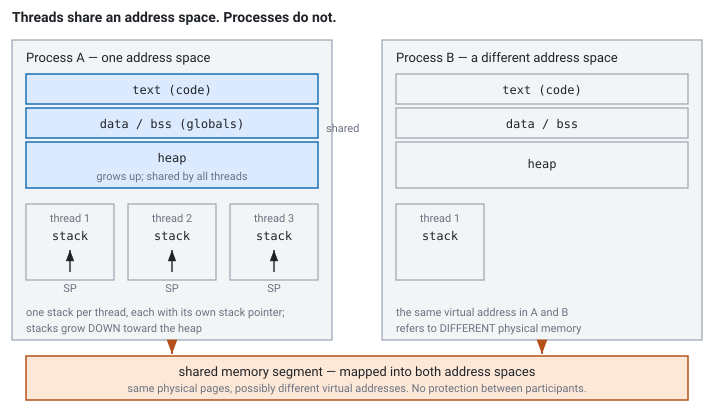

<!--
chapter: c6-mmap-and-zero-copy
state: draft_created
contract: standards/chapter-contract.md
include_measurement_plan: false | include_quizzes: true | primary_artifact_mode: code
unresolved_markers: 0
-->

# Counting the Copies

## mmap, Shared Memory, and Zero-Copy Claims

**Prerequisites:** [c1] Virtual memory and page faults · [b2] SPSC ring buffers
**Focus:** "zero-copy" is a claim to be checked by counting copies in the actual path — and mmap does not remove work so much as change when and how it is paid

---

## The replay tool that started dying

A team maintains a replay tool: it reads a day's captured market data from a file and pushes it through the strategy for testing. It uses `read()` into a buffer, which is unremarkable and works.

Someone reads that mmap is zero-copy, changes the tool to map the file instead, and measures. Throughput improves noticeably. The change is merged and everyone is pleased.

Some weeks later the tool starts dying — not with an error, but with a signal nobody on the team recognises — when it is pointed at a capture file that the capture process is still writing. The old code handled this: a short read was a return value, checked, handled, logged. The new code has nothing to check. The failure arrives as a fault on an ordinary memory access, at a line that reads a struct field.

The performance claim was true. It was also not the whole story, and the part left out was the part that mattered at three in the morning.

## Where you will actually meet this

- **Capture-file replay**, for backtesting and incident reconstruction ([e4]).
- **Shared-memory transports** between processes on one host — a feed handler in one process, several strategies in others.
- **Kernel-bypass receive paths**, where the NIC writes into memory your process has mapped ([d6]).

And in interviews, as a question that rewards precision: *what does zero-copy mean here?* The phrase is used loosely enough that asking what it refers to is often the correct first response.

## First: what a process actually is

This chapter is the first in the book where the **process** boundary matters rather than the thread boundary, so it is worth spending a page on the distinction. Most of it you met in an operating systems course; it is repeated here because every claim in this chapter depends on it, and because the difference between "another thread" and "another process" turns out to be the difference between a working design and a subtly broken one.

A **process** owns an address space. The page tables from [c1] belong to it, so a virtual address means something only relative to a particular process — address `0x7f00_0000` in one process and the same address in another refer to entirely different physical memory, and neither can reach the other's.

Within that address space:

- **Text** — the machine code. Read-only, and typically shared physically between processes running the same binary.
- **Data and BSS** — globals and statics, fixed size, established at load time.
- **Heap** — dynamic allocation, growing upward. This is what [c2] and [c3] were carving up.
- **Stacks** — one per thread, growing downward, each with its own stack pointer.

A **thread** is a schedulable execution context *inside* a process. Threads of one process share text, data, and heap — completely, with no protection between them — and each has its own stack and registers.


*Figure c6-1 — Threads share everything except their stacks. Processes share nothing by default. A shared segment is the deliberate exception: the same physical pages, reachable from both, possibly at different virtual addresses.*

Three consequences drive the rest of this chapter.

**Sharing between threads is free and unprotected.** A pointer passed from one thread to another just works, because both are looking at the same page tables — which is why every queue in Module B could pass raw pointers around without ceremony, and equally why a bug in one thread can corrupt any other's data.

**Sharing between processes must be arranged, and it is partial.** Two processes share nothing unless they map a common region. When they do, the shared pages are the *only* thing they have in common — so a pointer stored inside that region is meaningless to the other process unless both map the segment at the same address, which is not guaranteed. Shared-memory structures therefore use **offsets from the segment base**, not pointers.

**Isolation is also a failure boundary.** When a thread dies from a fault, the whole process dies with it — producer and consumer together. When a *process* dies, the other keeps running, holding a mapping into memory whose writer no longer exists. That asymmetry is the subject of Part 3, and it is the thing most often missed when an in-process design is moved across the boundary.

## The mental model

Two different things get conflated, and separating them resolves most of the confusion.

**A copy** moves bytes from one place to another. It costs time proportional to size, plus cache pollution — the bytes displace something else on the way through.

**A mapping** installs page-table entries so that a range of your virtual addresses refers to some physical pages. It moves no data. It costs a system call to set up, and then a page fault on first touch of each page ([c1]).

`read()` copies: the kernel gets the data into the page cache, then copies from the page cache into your buffer. `mmap` maps: your addresses now refer to the page cache pages directly, and touching them faults the mapping into place.

So the honest statement of what mmap does is:

> mmap replaces **one copy per byte** with **one page fault per page**.

That is often a good trade — a fault covers 4 KB, and copying 4 KB is not free — but it is a trade, not an elimination. Whether it wins depends on size, access pattern, and whether you touch every page. And it changes the *shape* of the cost from steady and proportional to bursty and per-page, which matters on a latency-sensitive path even when the total is lower.

Two consequences that follow immediately.

**mmap does not avoid the kernel.** People say this and it is wrong. Setting up the mapping is a syscall; every page fault is a kernel entry. You have replaced explicit, batched kernel entries with implicit, scattered ones. For streaming access this is usually favourable; it is not an escape from the kernel.

**mmap does not avoid I/O.** If the data is not in the page cache, the fault is a *major* fault and the kernel reads from disk while your thread waits ([c1]). With `read()` that wait was visible at a call you knew was I/O. With mmap it happens at a memory access.

## Part 1 — Counting copies in a real path

The discipline is to count, not to trust the label. Take the receive path for a market-data packet.

**Conventional path, kernel networking:**

1. NIC DMAs the packet into a kernel buffer. *(No CPU copy — the device wrote it.)*
2. Kernel processes headers, places the payload in the socket receive queue.
3. `recv()` **copies** from kernel memory into your buffer. **← copy 1**
4. Your parser reads fields out of that buffer, possibly **copying** into a normalised message struct. **← copy 2**
5. You **copy** the message into the queue slot for the strategy thread ([b2]). **← copy 3**

Three copies, plus a syscall and its mode switch.

**With kernel bypass ([d6]):**

1. NIC DMAs directly into a ring buffer your process has mapped.
2. You parse fields **in place** from that ring.
3. You copy the normalised message into the strategy queue. **← copy 1**

One copy. Which is what "zero-copy networking" usually means: **the kernel-to-user copy was eliminated.** Not all copies — the phrase is shorthand for removing one specific and expensive one, and stating which one is what makes the claim meaningful.

Notice too that step 2 changed character. Parsing in place is only safe while the NIC has not wrapped around and overwritten that ring slot, so you have acquired a lifetime constraint you did not have when you owned a private copy. That is the recurring pattern of this chapter: **removing a copy converts an ownership question into a timing question.**

---

**Quiz 1**

Your replay tool reads a 40 GB capture file sequentially, parsing each record and pushing it to the strategy. The machine has 32 GB of RAM.

Count the copies for `read()` into a reusable buffer versus `mmap` over the whole file. Which is better here, and what changes if the file is 100 MB instead?

> **Answer**
>
> **`read()` into a reusable buffer:** kernel reads from disk into the page cache, then copies page-cache → your buffer. **One copy per byte**, plus one syscall per buffer-full — a few thousand syscalls for the whole file, which is negligible.
>
> **`mmap` over the file:** no copies. One page fault per 4 KB page touched — about **10 million faults** for 40 GB. Each is a kernel entry; the ones that miss the page cache also wait for disk.
>
> **For the 40 GB file, `read()` is likely better**, and the reason is not copy counting — it is that the file is larger than RAM. With mmap, the kernel must evict mapped pages as you advance, and a sequential pass over a mapping much larger than memory generates continuous reclaim pressure that affects the whole machine. `read()` into a small reusable buffer has a bounded, predictable footprint: the buffer stays cache-hot and resident, and readahead keeps the pipeline full. It is also the case where the copy is cheapest, since the destination is always the same warm buffer.
>
> **For a 100 MB file, mmap is the better choice.** It fits comfortably in memory, so the faults are minor, the copy is genuinely eliminated, and you get to parse records in place rather than out of a staging buffer.
>
> **What decides it is not the copy count but whether the working set fits.** That is worth carrying: the copy-versus-fault trade is the first-order model, and it is dominated by memory pressure whenever the mapping is large relative to RAM.
>
> Either way, the tool should tell the kernel its access pattern is sequential, so readahead is aggressive and pages behind the cursor are dropped promptly. That advice is cheap and helps both designs.

---

## Part 2 — What mmap changes about failure

The performance discussion is the easy half. The opening scenario failed for a different reason, and it is the one that gets skipped.

**Errors stop being return values.**

```cpp
// code-c6-1 | ILLUSTRATIVE — the error models, side by side

// read(): every failure is a value you can check, at a call you know can fail.
ssize_t n = ::read(fd, buffer, len);
if (n < 0)  return handle_error(errno);   // I/O error
if (n == 0) return handle_eof();          // end of file
if (n < len) return handle_short_read(n); // file shorter than expected

// mmap(): the mapping call can fail, and after that, failures are SIGNALS.
void* base = ::mmap(nullptr, len, PROT_READ, MAP_PRIVATE, fd, 0);
if (base == MAP_FAILED) return handle_error(errno);   // the last checkable point

auto* record = static_cast<Record*>(base) + i;
uint64_t seq = record->sequence;   // <-- I/O error or truncation arrives HERE,
                                   //     as a signal, not a return value
```

If the file is truncated while mapped — which is what the capture process did — accessing a page beyond the new end of file raises **SIGBUS**. If the underlying storage returns an error, the same. Your code has no way to check for either at the point it happens, because the point it happens is an ordinary struct field read.

Handling this properly means either installing a signal handler (awkward, and recovering safely from SIGBUS is genuinely difficult) or **making the situation impossible**: map only files that are complete and immutable, and use `read()` for anything being written concurrently.

That is the actionable rule, and it is what the team in the opening scenario eventually adopted. mmap is excellent for finished capture files. It is the wrong tool for a file someone else still has open for writing.

Two smaller hazards worth knowing. Writes through a shared mapping reach disk on a schedule you do not control unless you ask explicitly, so "I wrote it" and "it is durable" are further apart than they look. And a large mapping competes for the page cache with everything else on the machine, which is a whole-host effect rather than a per-process one.

## Part 3 — Shared memory between processes

The other major use is a queue between two processes on one host: map the same region into both, put a ring buffer in it, and you have the [b2] handoff across a process boundary with no kernel involvement per message.

The mechanics carry over almost unchanged — indices, memory ordering, cache-line separation are all identical, because coherence works on physical memory regardless of which process is looking at it. What does *not* carry over is the failure model, and this is the part worth thinking hard about.

**In-process, a crashed thread means a crashed process.** Producer and consumer die together, and the queue's state dies with them. There is no scenario where a live consumer faces a half-written slot from a dead producer.

**Cross-process, one side can die and the other continue.** So:

- A producer that dies mid-write leaves a slot **partially written**, with an index that may or may not have been published. The consumer is still running and still reading.
- A consumer that dies stops draining, and the producer fills the queue and blocks or drops — with no signal that the peer is gone rather than slow.
- A misbehaving process can write anything anywhere in the shared region. There is no memory protection between participants; **shared memory is a trust boundary with no enforcement.**
- The segment **outlives both processes**. A restart finds a region full of stale state, with no automatic reinitialisation.

Which means a cross-process queue needs machinery an in-process one does not: a header with a magic number and a version so a restarting process can tell a valid segment from a stale one, per-record completion markers rather than an inferred index, liveness detection so a dead peer is distinguishable from a slow one, and a defined answer to "what do we do when we find the segment in a state that should be impossible."

None of that is exotic. All of it is missed by people who reason "it is just a ring buffer, in a different place."

---

**Quiz 2**

Two processes share a ring buffer in mapped memory: a feed handler producing, a strategy consuming, using [b2]'s SPSC design unchanged.

The feed handler is killed — `SIGKILL`, no cleanup — immediately after writing 40 bytes of a 64-byte message and before publishing the index.

What does the strategy see, what does it do, and what should the design have included?

> **Answer**
>
> **Immediately: nothing wrong.** The index was not published, so the consumer's acquire load does not see the new value and `try_pop` reports empty. [b2]'s release-acquire pair is doing its job — the half-written slot is not visible because the publish never happened. So far the design holds.
>
> **The problem is what happens next: nothing, forever.** The queue is empty and stays empty. The strategy sits in its consume loop seeing no data — and *an empty queue is exactly what a quiet market looks like.* The strategy cannot distinguish "no updates right now" from "my data source has been dead for four minutes," so it keeps quoting on a book that is frozen at the moment the producer died. That is far more dangerous than a crash would have been.
>
> **What the design needed:**
>
> - **Liveness, not just data.** A heartbeat sequence or timestamp the producer updates regularly, so a stalled producer is detectable during quiet periods. Without it, silence is ambiguous, and the ambiguity resolves in the most expensive direction.
> - **Peer death detection.** The OS can tell you a process has exited — via a lock the kernel releases on exit, a socket that closes, or a supervisor. This turns a four-minute mystery into an immediate event.
> - **A defined response**, which is the [d3] answer: treat the book as untrusted, stop quoting, and do not resume until the source is confirmed healthy. <!-- CALLBACK: d3 -->
> - **Segment validity on restart.** When the feed handler restarts it finds a segment with a stale index and a partially written slot. It needs a header — magic number, version, generation counter — so it can recognise the state and reinitialise deliberately rather than resuming into it.
>
> **The general lesson: the queue was correct and the system was not.** Moving [b2]'s design across a process boundary preserves its concurrency properties exactly and introduces a failure mode it never had to consider — one participant continuing without the other. In-process, that could not happen. The mechanism transferred; the assumptions did not.

---

## Common mistakes

**Treating "zero-copy" as a complete claim.** Ask which copy was eliminated. Usually it is the kernel-to-user copy and nothing else.

**Believing mmap avoids the kernel.** Setup is a syscall; every fault is a kernel entry.

**Using mmap on a file that is still being written.** SIGBUS at an ordinary memory access, with nothing to check. The opening scenario.

**Mapping a file much larger than RAM for a sequential pass.** Reclaim pressure dominates the copy saving. Quiz 1.

**Assuming a write to a shared mapping is durable.** It reaches disk when the kernel decides, unless you ask.

**Porting an in-process queue to shared memory unchanged.** Quiz 2. The concurrency is fine and the failure model is not.

**Forgetting that a shared segment outlives its processes.** Restart finds stale state; naming, versioning, and cleanup are your problem.

**Trusting the peer.** Shared memory has no protection between participants. A bug in one process corrupts the other.

## Operational behaviour

- **Name and version shared segments.** Include a magic number, a layout version, and a generation counter in the header, checked on every attach. Silent layout mismatch after a partial deploy is a genuinely horrible failure.
- **Clean up segments on restart**, deliberately, with a decision about whether existing state is salvageable. Do not resume into a segment you did not initialise.
- **Heartbeat every shared-memory link.** Data flow is not liveness, because quiet markets look exactly like dead producers.
- **Monitor major faults on mapped paths** ([c1]). A replay tool taking major faults is waiting on disk at a memory access.
- **Watch page-cache pressure** when large mappings are in use. It is a whole-machine effect and shows up as unrelated processes getting slower.

## When not to use mmap or shared memory

- **Small files.** The mapping setup costs more than reading them.
- **Files being written concurrently.** Use `read()`, where truncation is a short read rather than a signal.
- **Where you need explicit I/O error handling.** The error model is the deciding factor, not the performance.
- **Where a socket is fast enough.** A local socket between processes is vastly simpler than a shared-memory queue, and it gives you peer-death detection and a trust boundary for free. Use shared memory when you have measured that you need it ([a4]).
- **Across a trust boundary.** Shared memory offers no protection between participants; if you cannot trust the peer with your address space, do not share one.

## Interview mapping

- **Ask what "zero-copy" refers to.** The strongest opening move, because the phrase is genuinely ambiguous and precision reads as experience.
- **Count copies in the described path**, out loud. Naming which copy is removed by kernel bypass is the specific thing being tested.
- **Say mmap trades copies for page faults**, rather than eliminating cost.
- **Raise the error model unprompted.** Most candidates discuss performance only, and SIGBUS-on-truncation is a concrete detail that lands.
- **Name what shared memory adds beyond an in-process queue** — partial writes from a dead peer, liveness ambiguity, stale segments, no trust boundary.
- **Say a local socket is often enough.** It shows you weigh complexity against benefit rather than reaching for the impressive option.

## Summary

A copy moves bytes; a mapping installs page-table entries. mmap replaces one copy per byte with one page fault per page, which is frequently a good trade and never a free one — and which is dominated by whether the mapping fits in memory, since a sequential pass over a mapping larger than RAM turns into continuous reclaim pressure.

It also changes the error model, and that is the part that ends up mattering operationally. Failures that were return values at a call you knew could fail become signals raised at an ordinary field access, with nothing to check and no clean way to recover. The practical rule follows directly: map files that are complete and immutable, and read files someone is still writing.

Shared memory carries the whole of [b2] across a process boundary intact — the ordering, the indices, the cache-line separation all behave identically — and introduces a failure mode that could not previously exist: one participant continuing while the other is gone. An empty queue and a dead producer look the same from the consumer's side, which is why liveness has to be signalled rather than inferred.

Underneath all of it is the habit the chapter is named for. When someone says zero-copy, ask which copy. The answer is usually a specific and worthwhile elimination, and knowing which one tells you what the design actually bought.

**Related:** [c1] virtual memory · [b2] SPSC ring buffers · [b1] memory model · [d6] kernel bypass · [d3] gap recovery · [e4] deterministic replay · [a4] measurement · [a1] system anatomy

## References

- Arpaci-Dusseau, R. H., & Arpaci-Dusseau, A. C. (2018). *Operating systems: Three easy pieces* (1.00 ed.). Arpaci-Dusseau Books. [memory-mapped files, the page cache, and reclaim]
- Linux manual pages for `mmap`, `madvise`, `msync`, and `shm_overview` document the error model, advice flags, and segment lifetime rules referenced above. *(Stage 1 source pack to pin versions.)*
