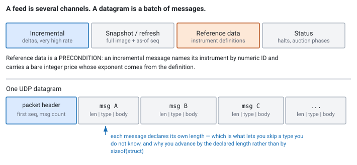

<!--
chapter: d1-market-data-and-protocols
state: draft_created
contract: standards/chapter-contract.md
include_measurement_plan: false | include_quizzes: true | primary_artifact_mode: code
unresolved_markers: 0
-->

# Reading the Wire

## Market Data and Exchange Protocols

**Prerequisites:** [a1] Anatomy of an electronic trading system · [a2] Order lifecycle
**Focus:** a feed is several channels with different jobs, and the bytes on each are a framing contract you must decode without allocating, copying, or trusting your assumptions about numbers

---

## Three hundred pages and no entry point

An engineer is handed an exchange's market-data specification and told to write a feed handler. The document is three hundred pages. It describes four multicast channels, a dozen message types, a retransmission service, and a set of instrument-definition messages that appear to be about something else entirely.

There is no obvious place to start. The temptation is to find the message that carries prices, write a parser for it, and get something on screen.

That produces a handler that appears to work and cannot be trusted, because the first real question is not how to parse a message. It is **which channels the system needs, and in what order, before any price means anything.**

## Where you will actually meet this

Every feed handler starts here, and the skill — reading a venue specification and identifying its framing, its channel structure, and its state assumptions — is a day-one expectation. You will do it again for every new venue, and venues differ enough that the second one is not much faster than the first.

Interviewers probe it obliquely rather than asking you to recite a protocol. The two reliable questions are about **how prices are represented** and **what a handler needs at cold start** — both of which reveal in one sentence whether you have built one of these.

## The mental model

A feed is not a stream of prices. It is a set of **channels**, each with a different job, and a handler needs several of them before it can produce anything.

**Incremental.** The high-rate channel: deltas describing what changed. This is what people mean by "the feed", and on its own it is useless — a delta is meaningless without a state to apply it to.

**Snapshot / refresh.** Periodic full images, each stamped with the sequence number it is current as of. This is how you obtain the state that the deltas apply to, at startup and after a gap ([d3]).

**Reference data (instrument definitions).** What instruments exist, their symbols, their tick sizes, their price scaling, their trading hours. Usually published at the start of the session and periodically thereafter.

**Status and control.** Trading halts, session state, auction phases. Not high rate, and ignoring it means quoting into a halted instrument.

The dependency that surprises people is the third one. An incremental message identifies its instrument by a numeric ID, not a symbol, and it carries a price whose interpretation depends on that instrument's declared scaling. **A message about an instrument you have not defined cannot be interpreted at all** — not partially, not approximately. Reference data is a prerequisite, not an enrichment.


*Figure d1-1 — The channels have different jobs and different rates. Below, one UDP datagram carries a packet header and several self-describing messages; framing is parsed before content.*

## Part 1 — Framing: what is actually in the packet

One UDP datagram is **not** one message. It typically carries:

- a **packet header** — a sequence number, a count of messages, often a timestamp;
- then **N messages**, each with its own small header giving its **length** and **type**, followed by a body whose layout depends on the type.

That structure exists for a reason worth internalising: the length field lets a receiver skip a message it does not understand. Venues add message types over time, and a handler that cannot skip an unknown type breaks on the day the venue deploys a new one — which they will do without asking you.

So parsing has two layers, and the outer one must be robust even when the inner one is not:

```cpp
// code-d1-1 | RUNNABLE | C++20 | examples/, target: framing
// Walk a datagram. Bounds-check everything; skip what we do not know.
void on_datagram(const std::byte* data, std::size_t len) {
    if (len < sizeof(PacketHeader)) return;              // malformed, count it

    PacketHeader ph;
    std::memcpy(&ph, data, sizeof(ph));                  // aligned copy, not a cast
    std::size_t off = sizeof(ph);
    Seq seq = be64(ph.first_sequence);

    for (std::uint16_t i = 0; i < be16(ph.message_count); ++i) {
        if (off + sizeof(MessageHeader) > len) return;   // truncated: stop, count it

        MessageHeader mh;
        std::memcpy(&mh, data + off, sizeof(mh));
        const std::size_t msg_len = be16(mh.length);

        if (msg_len < sizeof(mh) || off + msg_len > len) return;   // bad length

        dispatch(mh.type, data + off + sizeof(mh),
                 msg_len - sizeof(mh), seq + i);         // may ignore the type
        off += msg_len;                                  // ALWAYS advance by length
    }
}
```

Three things in that loop matter more than they look.

**Every read is bounds-checked against the received length.** A malformed or truncated packet must not walk off the end of the buffer. This is the one place in a feed handler where input is genuinely untrusted, and the venue is not the only thing that can produce a short packet — a truncated datagram is a normal consequence of network problems.

**Advance by the declared length, not by the size of the struct you parsed.** If you advance by `sizeof(TradeMessage)` you have hardcoded today's version of the message. Advancing by `msg_len` means a venue adding fields to the end of a message does not break you.

**`memcpy` into an aligned struct, not a `reinterpret_cast` over the buffer.** The cast is the idiom everyone reaches for and it is unsound: the buffer has no guaranteed alignment for the struct type, and forming a reference to an object that was never created there is undefined behaviour regardless of what the generated code happens to do. In practice compilers turn a small `memcpy` of a trivially copyable type into the same load instructions the cast would have produced, so this costs nothing and is correct. Do not trade correctness for a cost you did not measure ([a4]).

## Part 2 — Numbers on the wire

Two representation decisions, and getting either wrong produces errors that survive every test with plausible-looking output.

**Prices are integers.** A price of 178.42 is transmitted as the integer `17842` with a declared exponent of `-2`, or as `1784200000` with an exponent of `-7`. The exponent comes from reference data, per instrument.

The reason is exactness. Decimal fractions like 0.1 have no exact binary floating-point representation, so a `double` holds an approximation. Approximations accumulate: add a tick a thousand times and the result is not the same value you would have got by multiplying, comparisons that should be equal are not, and a price you send may not be a price the venue considers valid. Integer arithmetic with a fixed scale is exact, and exactness is not a nicety when the number is a price someone will be held to.

```cpp
// code-d1-2 | RUNNABLE | C++20 | examples/, target: framing
// A price is a scaled integer. The scale is per-instrument, from reference data.
struct Price {
    std::int64_t mantissa;      // 17842
    // exponent lives with the instrument definition, not in every message
    constexpr bool operator==(const Price&) const = default;   // exact comparison
};

// Convert only at the edges — for display, or for a venue that wants text.
// NEVER inside the book, the strategy, or the risk path.
double to_display(Price p, int exponent) {
    return static_cast<double>(p.mantissa) * std::pow(10.0, exponent);
}
```

**Byte order is the venue's choice, not yours.** Network protocols commonly use big-endian; several exchange protocols use little-endian precisely because most hosts are. Either way it is declared in the specification and must be converted explicitly. A handler that reads a field directly and happens to be right is a handler that will be silently wrong on the next venue.

---

**Quiz 1**

A team stores prices as `double` throughout their system — feed handler, book, strategy, and gateway — converting from the wire integer on receipt.

Everything works. Their book matches the venue's, their strategy quotes sensibly, and reconciliation passes. Name three ways this eventually hurts them.

> **Answer**
>
> **1 — Price comparison stops being reliable.** A price computed two different ways (best bid read from the book versus a level computed by adding ticks to a reference) can differ in the last bits, so `==` fails on values that are the same price. Every comparison then needs an epsilon, every epsilon is a judgement call, and one of them will eventually be wrong in the direction that matters.
>
> **2 — Orders get rejected for invalid prices.** Venues require prices on a tick boundary. Convert to `double`, do arithmetic, convert back, and you can produce a price a fraction of a tick off — which the venue rejects. It happens rarely, and it happens in the middle of a burst, and the rejection arrives when you most wanted the order live.
>
> **3 — Reconciliation and audit stop matching exactly.** Positions, P&L, and fills computed in floating point accumulate error across a day. The differences are tiny and they are non-zero, so every reconciliation needs a tolerance — and a tolerance hides the real break you were trying to catch.
>
> **The trap is that it works.** There is no failure at the point of the mistake; there is a slow accumulation of "close enough" that quietly removes your ability to assert anything exactly. Keep prices as scaled integers everywhere, and convert to floating point only for display or for computing something that is genuinely approximate anyway, such as a statistical estimate.

---

## Part 3 — What kind of feed is it?

One more distinction from the specification, because it determines how much work the handler does and what the strategy can see.

**Level-based (market by price).** The feed publishes aggregate size at each price level: *at 178.42 there are now 4,300 shares.* Compact, and directly what most strategies want. You cannot see individual orders, so you cannot tell whether that 4,300 is one order or forty.

**Order-based (market by order).** The feed publishes individual orders: *order 8891 added 300 at 178.42; order 8891 cancelled.* You build the levels yourself by aggregating. Much higher message rates and much more state, and in exchange you can see queue position — where your order sits in the line at a price level, which for some strategies is the entire edge.

The choice is usually made for you by what the venue offers, and it shapes [e2] substantially: an order-based feed means maintaining a map of live orders and their positions, which is a genuinely different data structure problem from maintaining a set of price levels.

---

**Quiz 2**

Your handler starts at 09:29:55, five minutes into the pre-open, and immediately begins receiving incremental messages.

What can it do with them, and what exactly does it need before it can publish a price the strategy may trade on?

> **Answer**
>
> **It can do one thing with them: buffer them.** It cannot apply them and it cannot interpret most of them.
>
> **What it needs, in order:**
>
> **1 — Reference data.** An incremental message identifies its instrument by a numeric ID and carries a price as a bare integer. Without the instrument definition you do not know which symbol the ID refers to, what exponent scales the price, or what the tick size is. The message is not partially usable; it is not usable.
>
> **2 — A snapshot.** Increments are deltas. With no state to apply them to, there is nothing to modify. You need a full image stamped with the sequence it is current as of ([d3]).
>
> **3 — The buffered increments, merged.** Discard everything at or below the snapshot's sequence — the snapshot already reflects them — and apply the rest in order. If the remainder is contiguous, you are synchronised; if it is not, you have a gap and are not.
>
> **4 — Session status.** If the instrument is halted or in an auction phase, a book that looks normal does not mean a market you can trade in.
>
> **The trap is step 1.** Most people get to the snapshot answer, because gap recovery makes it familiar. Reference data is the one that is easy to treat as configuration loaded at some point rather than as a hard precondition — and a handler that starts before it has definitions will happily apply messages to the wrong instrument, or scale a price by the wrong exponent, and produce a book that looks entirely plausible.
>
> This is also why **cold start is the same code path as gap recovery**: at 09:29:55 you have an infinite gap. Build it once.

---

## Common mistakes

**Prices as floating point.** Quiz 1. The most consequential representation error in this domain.

**Casting a struct pointer over the receive buffer.** Unaligned and undefined; `memcpy` into an aligned struct costs nothing and is correct.

**Advancing by `sizeof(struct)` rather than the declared length.** Breaks the day the venue extends a message.

**Failing to skip unknown message types.** Same failure, arriving sooner.

**Not bounds-checking against the datagram length.** Truncated packets are normal, and a parser that walks off the end is a crash on a bad network day.

**Treating reference data as configuration.** It is a precondition. Quiz 2.

**Assuming one datagram is one message.** It is a batch, and the count is in the header.

**Ignoring status messages.** Quoting into a halted instrument is a specific and avoidable embarrassment.

## Operational behaviour

- **Count malformed and truncated packets separately** from gaps. They point at different problems — the network versus the venue versus your parser.
- **Alarm on unknown message types.** Skipping them correctly is right; not noticing the venue deployed something new is not.
- **Reconcile instrument definitions at session start**, and alarm if the count or content changes unexpectedly. A changed tick size that nobody noticed is a bad afternoon.
- **Log the specification version you built against**, per venue. Venues issue notices; matching them to deployed handlers is otherwise guesswork.
- **Keep raw packets, not just parsed messages** ([e4]). When a parse looks wrong, the only way to settle it is the bytes.

## When not to write your own decoder

- **When the venue or a vendor ships one that meets your latency budget.** Their correctness is battle-tested across many participants, and protocol details are exactly the kind of thing that is tedious to get right and expensive to get wrong.
- **For a venue you are evaluating.** Write against a library first; optimise if the strategy proves out.
- **For low-rate channels.** Reference data and status arrive slowly and are off the critical path ([a1]). Simplicity wins there.

## Interview mapping

- **Say prices are scaled integers, and why.** Exactness, tick boundaries, reconciliation. The single most reliable signal in this chapter.
- **Describe packet framing** — packet header, message count, per-message length — and that the length is what lets you skip an unknown type.
- **Name reference data as a cold-start prerequisite.** Most candidates say "snapshot" and stop.
- **Note that cold start is gap recovery** with an infinite gap. It shows you see the shared mechanism.
- **Distinguish order-based from level-based** and say what queue position buys.
- **Mention `memcpy` over `reinterpret_cast`** if parsing comes up. Small, precise, and it signals you have read the standard rather than only the tutorials.

## Summary

A feed is not a stream of prices. It is several channels with different jobs, and the high-rate incremental channel — the one people mean when they say "the feed" — is the one that means least on its own. Deltas need a state to apply to, which is the snapshot channel, and both need instrument definitions before a numeric ID and a bare integer can be turned into a symbol and a price.

On the wire, a datagram is a batch: a packet header, then self-describing messages each carrying its own length. Parse the framing before the content, bounds-check everything against the received length, and advance by the declared length so that a venue extending a message or adding a type does not break you.

And the numbers are not what they look like. Prices are integers with a per-instrument exponent, because decimal values must round-trip exactly — through comparisons, through tick-boundary checks, and through end-of-day reconciliation. Storing them as `double` works, right up until the accumulated approximation removes your ability to assert that two things are equal.

Which leaves the question of how these channels reach you at all, and why the one carrying the most important data is also the one that can silently lose it. That is [d2].

**Related:** [a1] system anatomy · [a2] order lifecycle · [d2] transports · [d3] gap recovery · [d4] batching and overload · [e2] order-book construction · [e4] deterministic replay · [a4] measurement

## References

- Publicly available exchange market-data specifications are the authority for framing, message types, and price scaling; each venue differs and none of the details above should be assumed to apply to a specific one. *(Stage 1 source pack to identify redistributable examples and a candidate venue appendix per contract §3.12.)*
- ISO/IEC. (2020). *ISO/IEC 14882:2020 — Programming languages — C++*. [object lifetime and why `memcpy` is the sound idiom for reading a struct from a byte buffer]
