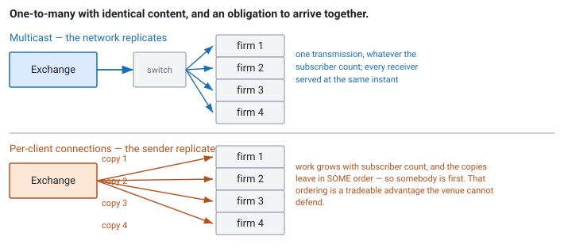

<!--
chapter: d2-tcp-udp-multicast
state: draft_created
contract: standards/chapter-contract.md
include_measurement_plan: false | include_quizzes: true | primary_artifact_mode: none
unresolved_markers: 0
-->

# Why the Exchange Does Not Reply to You

## TCP, UDP, and Multicast in Trading Systems

**Prerequisites:** [d1] Market data and exchange protocols · [a1] Anatomy of an electronic trading system
**Focus:** transport is chosen per channel from the failure you can tolerate — market data is unreliable by design because reliability would be *unfair*, and order entry is a session because you must know your order arrived

---

## Two choices that look backwards

A firm receives Nasdaq market data over UDP multicast and sends its orders over TCP.

Set out plainly, that looks like the wrong way round. The market data is what the strategy depends on — every price, every trade, the basis of every decision — and it arrives over a protocol that can drop packets silently and never mention it. The orders, meanwhile, travel over a protocol that will cheerfully stall for tens of milliseconds retransmitting a segment while everything behind it waits.

Both choices are correct, and neither is about speed. The reasoning is about **fan-out and fairness** on one side, and about **knowing what happened** on the other — and once you have those two arguments, the choice for any new channel makes itself.

## Where you will actually meet this

Every venue connection is one of these two shapes. The market-data side is multicast (or a unicast approximation of it from a vendor); the order-entry side is a TCP session. You will configure both, size their buffers, and eventually debug both.

"Why is market data multicast?" is a standard interview question, and the common answer — "UDP is faster than TCP" — is weak enough to cost you. It is not really about speed, and the person asking knows it.

## The mental model

Start with the shape of the problem rather than the protocols.

**Market data is one sender, hundreds of receivers, identical content.** Every participant gets the same bytes. Nobody is asking for anything; the exchange is announcing.

**Order entry is one sender, one receiver, unique content.** Your order is yours, it must arrive, and you must know whether it did.

Those are different problems, and they are solved by different transports. The rest of this chapter is the two arguments in full.

*Figure d2-1 — With multicast the network replicates and the sender's work does not grow with subscriber count. With per-client connections the sender does work proportional to subscribers, and each one is served at a slightly different moment.*

## Part 1 — Why market data is multicast, and unreliable on purpose

**Multicast** lets one sender transmit once, to a group address, and the network duplicates the packet toward every subscribed receiver. Switches and routers do the replication at the branch points. The sender transmits one copy regardless of whether five firms or five hundred are listening.

Two consequences follow, and the second is the one that matters.

**The sender scales.** The exchange's cost does not grow with subscriber count. With per-client connections it would, and it would grow with the busiest instant of the busiest day — which is precisely when they can least afford it.

**Everyone is served at the same instant.** This is the real argument. With unicast the exchange must send N copies, and they leave in *some order*, so somebody is first and somebody is last. That ordering would be a tradeable advantage handed out by the venue, and defending its fairness would be impossible.

Now the part that seems wrong. Multicast is built on UDP: no acknowledgements, no retransmission, no delivery guarantee. Why not add reliability?

Because **reliability requires per-receiver state**, and per-receiver state destroys both properties above. To retransmit to you, the sender must know what you received, which means tracking hundreds of receivers' progress and buffering for the slowest of them. And a receiver that lost a packet and got a retransmission has its data *later* than everyone else — so the moment loss occurs, participants stop being equal. Reliable multicast would reintroduce, as a failure mode, exactly the unfairness the design exists to prevent.

So the venue makes a different trade: **fire and forget, and give the receiver the tools to notice and recover on its own.** That is what sequence numbers and the recovery channels in [d3] are for. Loss is not an unfortunate side effect of a cheap protocol; it is the accepted cost of a design that treats every participant identically.

**And here is where the loss usually happens.** Not in the network. Multicast within a data centre on engineered infrastructure drops very little. The overwhelming majority of loss occurs in **your own receive path** — the NIC ring buffer, or the kernel socket buffer, filling because your handler did not drain it fast enough. Which makes most "packet loss" an application performance problem wearing a network costume ([d4]).

## Part 2 — Why order entry is a session

Now the other side, where every assumption reverses.

You are sending one message to one recipient, and it matters enormously whether it arrived. An order that vanished is not a gap you recover from — it is a position you think you have and do not, or one you think you do not have and do. So you need acknowledgement, ordering, and a way to resume after a disconnect: a **session**.

TCP provides delivery and ordering. The venue's protocol layers session semantics on top — its own sequence numbers, a login handshake, heartbeats, and a resend request — because TCP's guarantees end at the connection. **If the connection drops, TCP has no opinion about which of your orders the venue processed.** That is why the session has its own sequencing and why reconnection means reconciliation ([a2], [e1]).

### What reliability costs in the tail

TCP's guarantee is real and it is paid for at exactly the wrong moment.

**Head-of-line blocking.** TCP delivers a byte stream in order. If segment 5 is lost and segments 6, 7, and 8 arrive, the receiving kernel *has* those bytes and will not give them to your application — delivering them would break the ordering guarantee. Everything waits for the retransmission of 5.

For a stream of independent order acknowledgements, that is unfortunate: acknowledgements 6, 7, and 8 were sitting in the receiver's memory, complete, while your gateway believed those orders were still unacknowledged. A single lost segment stalls every message behind it for a full retransmission round trip.

**Retransmission timing.** Modern TCP recovers quickly from isolated loss using duplicate acknowledgements, without waiting for a timer. When there is nothing following the lost segment to trigger that — a quiet moment, the last message in a burst — recovery falls back to a timeout, which is a very long time in this context. So TCP's worst case appears when traffic is sparse, which is not when you would expect it.

**Nagle's algorithm** delays sending a small segment while an earlier one is unacknowledged, batching small writes into fewer packets. It is a sensible default for bulk transfer and wrong for order entry, where each message is small and urgent. Worse, it interacts pathologically with the receiver's **delayed acknowledgement** — the sender waits for an ACK, the receiver waits to piggyback that ACK on data it has not got, and the deadlock resolves only when the delayed-ACK timer fires. That produces a stall of tens of milliseconds, on a path budgeted in microseconds, appearing sporadically and only for small messages. Disabling it is close to universal practice, and [d4] covers that alongside the rest of the socket-level toolkit.

---

**Quiz 1**

A colleague proposes that the exchange should send market data over TCP: "It is reliable, we would never have gaps, and we could delete all the recovery code."

Give three reasons this does not work — and say which one is fundamental rather than practical.

> **Answer**
>
> **1 — The sender's cost becomes proportional to subscriber count.** Hundreds of connections, each with its own send buffer, congestion state, and retransmission timers, all driven by one high-rate stream. The load peaks exactly when the market does.
>
> **2 — Delivery stops being simultaneous.** With N connections the exchange writes N copies, in some order. Someone is first. That ordering is a tradeable advantage the venue is handing out, and no ordering policy makes it defensible.
>
> **3 — Head-of-line blocking makes your worst case worse, not better.** With UDP, a lost packet costs you those messages and the ones after it keep arriving — you detect the gap and recover while still consuming live data ([d3]). With TCP, a lost segment stalls *everything* behind it until retransmission completes. You have exchanged a detectable, recoverable gap for an undetectable stall, during which your book is silently stale rather than known-untrusted. **That is worse**, because you no longer know you have a problem.
>
> **Which is fundamental:** number 2. The first is engineering — you could throw hardware at it. The third is a real cost but arguably a trade some system might accept. Fairness is not negotiable: a venue cannot deliver the same public information to some participants before others, whatever the technology allows.
>
> The general lesson: **the transport choice follows from the problem's shape** — one-to-many with identical content and a fairness obligation — and not from a ranking of protocols by speed or reliability.

---

## Part 3 — The settings that actually matter

A short list, because these come up in interviews and in incidents.

**Receive buffer size.** The kernel socket buffer absorbs bursts between packet arrival and your handler reading them. Default sizes are tuned for general workloads and are usually far too small for a market-data feed. This is the single most common cause of "network" packet loss, and the fix is a configuration change ([d4]).

**Interrupt coalescing.** NICs batch interrupts to reduce CPU overhead, at the cost of holding packets briefly before notifying the kernel. Good for throughput, directly adds latency, and it is a per-interface setting most people never look at.

**Multicast group membership.** Joining a group is an explicit action, and a handler that fails to join silently receives nothing — which looks exactly like a quiet market ([c6]'s lesson: silence is ambiguous). Verify membership at startup rather than inferring it from data arriving.

**Where the counters live.** The kernel exposes per-socket and per-interface drop counters. They are how you distinguish "the network lost it" from "we did not read fast enough", and they are the first thing to look at when a gap appears ([d4]).

The full list of hot-path socket settings, and the question of when readiness notification helps rather than costs, belongs to [d4] — this chapter is about which transport to choose and why, not about tuning the one you chose.

---

**Quiz 2**

Your order gateway shows a stall of roughly 40 milliseconds, a handful of times a day, always on small messages, never under sustained load. TCP is not reporting any loss. The network team says the link is clean.

What is the most likely cause, and why does it only appear when traffic is light?

> **Answer**
>
> **Nagle's algorithm interacting with the receiver's delayed acknowledgement.**
>
> The mechanism: your gateway writes a small message. Nagle holds it back because a previous small segment is still unacknowledged. The receiver, meanwhile, is delaying its acknowledgement in the hope of piggybacking it on outbound data — and has none to send. So the sender is waiting for an ACK and the receiver is waiting for data on which to send the ACK. Nothing moves until the delayed-ACK timer expires, which is where the tens of milliseconds come from.
>
> **Why only under light traffic:** under sustained load there is always another message queued, so the send buffer stays non-empty and Nagle's condition never holds; there is also always data flowing back for the ACK to ride on. The deadlock needs a *quiet* moment with one small message in flight — which is why load testing does not find it and production does.
>
> **The fix** is to disable Nagle on the socket. It is close to universal practice on order-entry sessions, and this interaction is the reason rather than the batching itself.
>
> **The trap is that nothing is broken.** No loss, no errors, no retransmissions, a clean link, and both protocol implementations behaving exactly as specified. Two reasonable optimisations, each correct alone, combine into a stall. That is worth remembering as a shape: **the defaults were chosen for a different workload, and two of them can interact in ways neither author considered.**

---

## Common mistakes

**"UDP is used because it is faster."** It is used because market data is one-to-many with a fairness obligation. Quiz 1.

**Assuming loss happens in the network.** It usually happens in your receive buffers.

**Leaving Nagle enabled on order entry.** Quiz 2.

**Leaving default socket buffer sizes.** Tuned for general workloads, not for a burst of forty thousand messages.

**Believing TCP means your order arrived.** TCP delivered bytes to the peer's kernel. Whether the venue processed the order is a session-level question ([a2]).

**Treating silence as a quiet market.** A failed multicast join looks identical to nothing happening.

**Ignoring interrupt coalescing.** A per-interface setting that silently adds latency to every packet.

## Operational behaviour

- **Monitor kernel drop counters per socket and per interface**, separately from application-level gap counts. Together they tell you *where* the loss occurred, which is most of the diagnosis.
- **Verify multicast group membership at startup** and alarm if it is lost. Do not infer it from data arriving.
- **Record socket configuration** — buffer sizes, Nagle, coalescing — as part of the deployment, and assert it at startup. This is the [c4] lesson again: configuration with a hardware and kernel dependency, silently wrong after a change.
- **Alarm on TCP retransmissions** on order-entry sessions. They are rare on a healthy link and each one is a tail event on a critical path.
- **Track session-level sequence gaps separately from TCP.** TCP being healthy says nothing about the venue's session state after a reconnect.

## When these choices differ

- **Cloud environments.** Multicast is generally unavailable, so venues and vendors provide unicast fan-out instead — which reintroduces per-subscriber cost and ordering, and is one reason latency-sensitive trading is not typically done there.
- **Vendor consolidated feeds.** Often delivered over TCP from a nearby appliance, trading a little latency and fairness for far less integration work.
- **Crypto venues.** Frequently WebSocket over TCP, with all the consequences of a per-client connection ([d7]).
- **Internal buses.** Firms multicast normalised data internally and face exactly the same tradeoffs one layer down, usually with the same answers.

## Interview mapping

- **Answer the multicast question with fan-out and fairness**, not speed. This is the differentiator, and the fairness point is the one most candidates miss entirely.
- **Explain why reliable multicast is self-defeating** — per-receiver state, and retransmission making participants unequal.
- **Say where loss actually happens.** "Usually in our own receive buffers, and there is a counter for it" reads as operational experience.
- **Describe head-of-line blocking** and note that it makes the failure *undetectable* rather than merely slow.
- **Mention Nagle and delayed ACK** if order entry comes up. It is specific, real, and memorable.
- **Distinguish TCP delivery from venue acceptance.** Ties back to [a2] and shows the layers are separate in your head.

## Summary

The two transports in a trading system are chosen from the shape of the problem, not from a ranking of protocols. Market data is one sender to hundreds of receivers with identical content and an obligation to reach everyone at the same instant — so it is multicast, and it is unreliable *because* making it reliable would require per-receiver state and would deliver recovered data late to whoever lost it, turning a fairness guarantee into a fairness failure. The receiver is given sequence numbers and a recovery channel instead, and takes responsibility for noticing.

Order entry is one sender to one receiver with unique content that must arrive, so it is a session over TCP with the venue's own sequencing layered on top. That reliability is paid for in the tail: a lost segment blocks everything behind it, recovery is slowest when traffic is sparse, and two well-intentioned defaults — Nagle and delayed acknowledgement — can combine into a stall of tens of milliseconds that appears only when the system is quiet.

Most of what gets reported as network loss is not. It is a receive buffer that filled because something downstream was not fast enough, which is where [d4] picks up — because the question of what to do when the market outruns you cannot be answered by asking the exchange to slow down.

**Related:** [d1] market data and protocols · [d3] gap recovery · [d4] batching and overload · [d6] kernel bypass · [d7] WebSocket and HTTP · [a1] system anatomy · [a2] order lifecycle · [a3] latency and tail latency · [c4] thread affinity · [e1] idempotency

## References

- Kurose, J. F., & Ross, K. W. (2021). *Computer networking: A top-down approach* (8th ed.). Pearson. [multicast, TCP reliability mechanisms, and the delayed-ACK interaction]
- Stevens, W. R., Fenner, B., & Rudoff, A. M. (2003). *UNIX network programming, volume 1: The sockets networking API* (3rd ed.). Addison-Wesley. [socket options, multicast group management, and the Nagle interaction]
