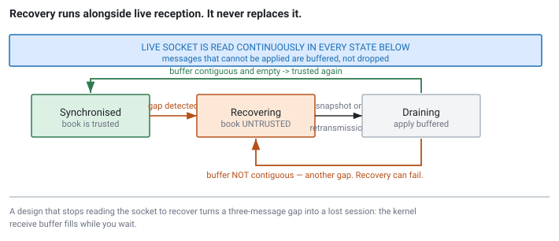
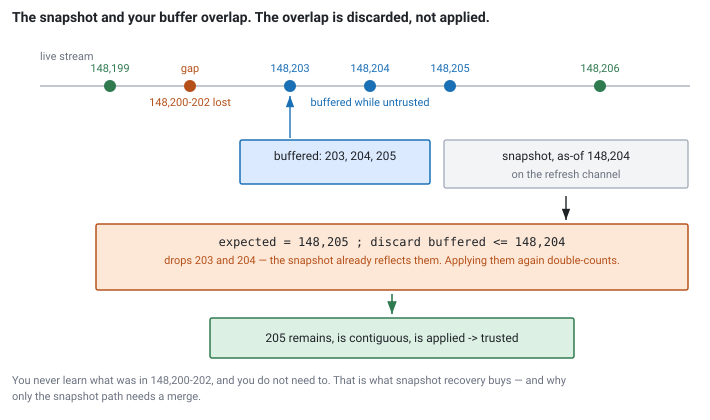

<!--
chapter: d3-sequence-and-gap-recovery
state: revised
revision: r1 — author feedback: concrete opening, explicit retransmission vs snapshot
           comparison, pseudocode instead of C++, two quizzes
contract: PROJECT_PLAN_V3.md sections 4.8, 4.9, 4.10
include_measurement_plan: false | include_quizzes: true | primary_artifact_mode: pseudocode
unresolved_markers: 0
-->

# The Book That Is Silently Wrong

## Sequence Numbers, Gap Detection, and Recovery

**Prerequisites:** [d2] TCP, UDP, and multicast in trading systems · [d1] Market data and exchange protocols
**Focus:** why a gap invalidates your book rather than merely delaying it, and how to recover without stalling live reception

---

## A busy morning

A market-making firm has a dedicated line into a Nasdaq data centre. Down that line comes the exchange's incremental market-data feed: a continuous stream of small messages saying *someone added 300 shares at this price, someone cancelled that order, this one traded*. The firm's machine applies each message as it arrives and maintains a running picture of the order book for every symbol it trades.

It is 09:31 on a busy morning. NVDA is moving. Thousands of messages a second are arriving for that symbol alone, and the firm's strategy is quoting against the book built from them.

The line is engineered to be reliable. It is not the public internet; it is dedicated fibre with capacity to spare. But somewhere along the path a switch hits a burst it cannot buffer, and three packets are discarded.

The messages arrive in order: 148,197, 148,198, 148,199 — and then 148,203.

The firm's order book for NVDA is now wrong. Nobody has told it so. The book still has prices in it, the spread still looks sensible, and the strategy is still quoting. **How does the machine know?**

That question, and what it must do next, is this chapter.

## Where you will actually meet this

Every market-data handler consuming an incremental feed contains this logic. Not as a defensive extra — as a core component, usually the one that takes longest to get right.

- **Feed handlers for exchange incremental feeds.** Your book is derived state; sequence handling is what tells you whether that derived state can be trusted.
- **Consumers of an internal replicated bus.** Firms multicast normalised data internally, and internal networks drop packets too.
- **Drop-copy and post-trade feeds**, where a missed message means your *position* record is wrong rather than your price.

Interviewers like this topic because it cannot be answered from a definition. It requires reasoning about a system that is already wrong and does not know by how much.

## The mental model

Three pieces of state, and one number tying them together.

- **`expected`** — the sequence number you need next. Your position in the stream.
- **A buffer** — messages that arrived with sequence numbers *above* `expected`, held until the hole in front of them fills.
- **A trusted flag** — whether the book derived from this stream can be published.

The first thing to internalise: **loss and reordering are the same problem.** Both present identically — a message arrives with a sequence number greater than `expected`, leaving a hole. If the hole fills a moment later, it was reordering. If it never fills, it was loss. You do not need two code paths, and building two is a good way to hide a bug in the rarer case.

A message *below* `expected` is a duplicate. Discard it. It carries no new information, and applying it twice corrupts the book.

## Part 1 — What a gap actually means

The instinct on seeing a first gap is that the book is *incomplete*: some updates were missed, the book is a bit stale, it will converge as new updates arrive.

This is wrong, and the reasoning matters more than the conclusion.

An incremental feed does not send state. It sends **deltas**. Each message says "add 300 at 101.25", "cancel the order at 100.75", "the resting size at 101.00 is now 50". Your book is the accumulated result of applying every delta in order from a known starting state. Miss three deltas and you have not missed three facts — you have **desynchronised the accumulator**.

The consequences follow from that framing:

- **The book looks fine.** Every level is populated, the spread is plausible, nothing is obviously broken. No local check can detect the problem, because there is nothing locally inconsistent about it.
- **It does not self-correct.** Later increments modify levels that are already wrong, so the error persists and compounds. A price level that should have been removed can sit in your book for the rest of the session while your strategy quotes against it.
- **You cannot bound the damage.** You do not know whether the missing messages were size tweaks deep in the book or the removal of the entire top of book.

So the correct response is not "carry on and catch up":

> **The book is untrusted from this moment. Stop publishing prices derived from it until it has been rebuilt from a known-good state.**

This is a state transition downstream consumers must observe. A strategy cannot infer untrustworthiness from the data — the data looks fine, that is the whole problem. You tell it explicitly, and it needs a defined behaviour for that condition: pull quotes, stop initiating, hold existing positions, whatever the desk's policy is.

**Publishing nothing is strictly better than publishing a book you know is wrong.** That sentence is most of what this chapter is trying to teach.

---

**Quiz 1 — does the mechanism work?**
`expected` is 500 and the book is trusted. Four messages arrive in this order: **503, 501, 502, 500.** What happens at each step?

> **Answer**
>
> - **503 arrives.** Above `expected`. Buffer it. There is now a hole at 500 → mark untrusted, signal downstream, start recovery. `expected` = 500.
> - **501 arrives.** Above `expected`. Buffer it. Still a hole at 500. `expected` = 500.
> - **502 arrives.** Buffer it. Still a hole at 500. `expected` = 500.
> - **500 arrives.** It equals `expected`. Apply it, then drain: 501, 502, 503 are sitting in the buffer contiguously, so apply all three. Buffer is now empty → **no hole → trusted again.** `expected` = 504.
>
> The stream was reordered, not lost, and the same mechanism recovered it without a single special case. Note that recovery was requested unnecessarily — the response will arrive for data you already have, and you will discard it as duplicate. Harmless but wasteful, which is why real handlers wait briefly before escalating a hole to a gap (see the note after the pseudocode).

---

## Part 2 — Two ways to recover, and they are not the same

You know you have a gap. You need to get back to a trusted book. Venues generally offer two mechanisms, and beginners mix them up constantly because both get called "recovery". They work differently, cost differently, and fail differently.

### Retransmission — fill the hole

You ask a dedicated service for *specific missing sequence numbers*: "send me 148,200 through 148,202." It sends back the same incremental messages you missed. You apply them exactly as if they had arrived normally, the hole closes, and you continue.

**Your book is never discarded.** It was correct up to 148,199 and it stays correct; you are patching a hole in the stream, not rebuilding state.

Costs and limits:

- **A request round trip.** You send a request and wait for a response, typically over a separate unicast or TCP connection.
- **A limited history window.** The service keeps only recent messages — a bounded buffer, or a few seconds. Detect the gap too late and the data is gone.
- **Rate limits.** Venues restrict how often you may ask, precisely to protect the service.
- **It is busiest exactly when you need it.** Whatever caused you to drop packets probably affected others, so everyone requests at once.

### Snapshot resync — rebuild from scratch

A separate channel periodically broadcasts a **full image** of the book, each image stamped with the sequence number it is current as of. You wait for the next one, throw your book away, and rebuild from the image.

**Your book is discarded entirely.** You never learn what was in the missing messages, and you do not need to — the snapshot already reflects their effects.

Costs and limits:

- **You wait for the cycle, not for a response.** Latency is bounded by how often snapshots are published, which for a venue with many symbols can mean waiting while the cycle works its way around to yours.
- **Snapshots are large.** A full book image is orders of magnitude bigger than an increment.
- **It requires a merge step** — described below, and it is where implementations go wrong.

### Which to use

| | Retransmission | Snapshot resync |
|---|---|---|
| **Recovers by** | Filling the missing sequences | Replacing the whole book |
| **Book preserved?** | Yes | No, discarded |
| **Wait bounded by** | Request round trip | Snapshot cycle period |
| **Data volume** | Tiny — just the gap | Large — full image |
| **Works for large gaps?** | No — history window | Yes |
| **Works if detected late?** | No | Yes |
| **Works at cold start?** | No | **Yes — the only option** |
| **Needs overlap merge?** | No | Yes |

The practical rule: **retransmission for small, freshly detected gaps; snapshot for everything else.** Many handlers try retransmission first and fall back to snapshot on timeout or refusal.

But check the actual numbers for the venue you are on. If the snapshot cycle is 50ms and the retransmission service typically responds in 200ms, the "cheap targeted fix" is four times slower than throwing the book away, and the sophisticated-looking design is the wrong one.

Note the last row of the table. When your handler starts mid-session you are in exactly the position of a handler with an infinite gap: no book, and increments arriving that you cannot apply. **Cold start is snapshot recovery.** The mechanism you build for gaps is the same one that gets you running in the morning — a good reason to get it right.

## Part 3 — Recovering without stalling the live feed

Now the part that separates people who have run these systems from people who have read about them. The naive implementation writes itself:

```
// BROKEN — shown because it is the intuitive design
on gap detected:
    missing = request_retransmission(from, to)   // blocks here
    apply(missing)
    resume reading the live socket
```

This turns a three-message gap into a lost session.

While you wait for that response — tens of milliseconds at best, over a network, to a service that is busy for the same reason you dropped packets — **nobody is reading the live socket.** The kernel receive buffer fills. Once full, the kernel discards everything arriving behind it. You return from recovery having retrieved three messages and lost several thousand. So you request recovery again, and stall again, and this time the buffer fills faster.

That is a recovery death spiral, and it converts a transient blip into a handler that is down for the session. It is also exactly what an interviewer is listening for: a candidate who describes recovery as a blocking call has never operated one of these under load.

The rule is absolute:

> **Live reception never stops.** Not while requesting, not while waiting, not while applying the response.

Which forces the design. If you are still receiving messages you cannot apply — they belong ahead of where your book is — you must **buffer** them. Same buffer as before, bigger job.


*Figure d3-1 — The states describe whether the book can be trusted, not whether the socket is being read. It always is.*


*Figure d3-2 — The snapshot boundary does not align with the gap boundary. The overlap is what makes the merge step necessary, and only the snapshot path has one.*

## The logic, as conditions and behaviour

This topic is examined as a discussion, not as a coding exercise. What you need is the mapping from *sequence number condition* to *behaviour*, precisely enough to say it out loud under questioning.

**Every live message, in every state:**

```
receive message with sequence S:

    S <  expected   ->  DUPLICATE
                        discard, no side effects

    S == expected   ->  IN ORDER
                        if trusted:    apply to book
                                       expected = expected + 1
                                       drain()
                        if untrusted:  buffer it   (cannot apply yet)

    S >  expected   ->  HOLE
                        buffer it
                        if trusted:    mark UNTRUSTED
                                       signal downstream
                                       begin recovery
```

**Draining — apply whatever is contiguous:**

```
drain():
    while buffer contains the message numbered `expected`:
        apply it
        remove it from the buffer
        expected = expected + 1

    if buffer is now empty:   no hole ahead        ->  TRUSTED
    else:                     hole at `expected`   ->  UNTRUSTED, recover again
```

**Retransmission path — no merge needed:**

```
begin recovery (retransmission):
    send request for [expected .. S_observed - 1]     // non-blocking
    keep reading live socket, keep buffering

on retransmitted message:
    handle it exactly like a live message   (the table above)
    // book is never reset, so there is no overlap to discard
```

**Snapshot path — merge required:**

```
begin recovery (snapshot):
    await the next image on the refresh channel       // non-blocking
    keep reading live socket, keep buffering

on snapshot with as_of = N:
    book     = snapshot image              // discard everything you had
    expected = N + 1
    discard every buffered message with sequence <= N     // <-- THE OVERLAP
    trusted  = true
    drain()                                // may immediately re-open a gap
```

Three observations.

**The overlap discard exists only on the snapshot path.** That is the cleanest way to keep the two mechanisms straight. Retransmission patches a hole in a book you keep, so nothing can be double-applied. A snapshot replaces the book, so anything you buffered from before its as-of point is already reflected in it, and applying it again double-counts. Get the comparison backwards, or use `<` where you need `<=`, and nothing crashes — the book is simply wrong again, in the same undetectable way as before.

**`drain()` at the end of the snapshot path can put you straight back into recovery.** A second gap during recovery is not unusual; the conditions that caused the first are usually still present. A design that assumes recovery succeeds first time breaks exactly when you need it.

**Escalate a hole to a gap after a short delay, not instantly.** The pseudocode above begins recovery the moment it sees a hole, which means genuine out-of-order delivery triggers unnecessary recovery — as in Quiz 1. Production handlers wait a short interval, sized from the network's observed reordering behaviour, before escalating. That is a timer, not a redesign.

---

**Quiz 2 — the step people get wrong**
Your handler is untrusted. The buffer holds messages **610, 611, and 615**. A snapshot arrives stamped **as of 611**.

After processing it: what is `expected`, what remains in the buffer, and are you trusted?

> **Answer**
>
> - **Reset the book** from the snapshot image, discarding whatever you had.
> - **`expected` = 612** (as-of plus one).
> - **Discard buffered messages ≤ 611** — that removes 610 and 611. Their effects are already in the snapshot; applying them would double-count. The buffer now holds only **615**.
> - **Drain:** the lowest buffered message is 615, but `expected` is 612. Not contiguous.
> - Buffer is not empty → **there is a hole at 612 → still UNTRUSTED.** Request recovery again for 612–614.
>
> The trap is assuming a snapshot always ends recovery. It ends recovery only if the buffer is contiguous from the as-of point onward. Here, 612 through 614 were lost *after* the snapshot's position, so one round was not enough. If your answer stopped at "trusted, `expected` = 612", you have the merge right and the failure edge missing — the more common of the two omissions.

---

## A worked trace

`expected` starts at 148,200 and the book is trusted — the situation from the opening.

| Event | State before | Action | `expected` after |
|---|---|---|---|
| Recv 148,203 | Trusted | Hole at 148,200. Buffer it. Mark untrusted, signal downstream, request recovery. | 148,200 |
| Recv 148,204 | Untrusted | Buffer. Do not apply. | 148,200 |
| Recv 148,205 | Untrusted | Buffer. | 148,200 |
| Recv 148,199 | Untrusted | Below `expected` — duplicate. Discard. | 148,200 |
| Snapshot, as-of 148,204 | Untrusted | Reset book. `expected` = 148,205. Discard buffered ≤ 148,204 — drops 148,203 and 148,204. | 148,205 |
| — | Draining | Buffer holds 148,205, contiguous. Apply. Buffer empty → **trusted**. Signal downstream. | 148,206 |
| Recv 148,206 | Trusted | In order. Apply. | 148,207 |

You never find out what was in 148,200 through 148,202. That is the point of snapshot recovery.

## Going deeper — redundant feeds

*A refinement on the above. Skip on a first read.*

Most venues publish identical incremental data on two multicast groups, conventionally A and B, from separate infrastructure. A handler subscribes to both and arbitrates: for each sequence number, apply whichever copy arrives first and discard the second.

Notice that arbitration needs **no new mechanism**. Feed B's copy of a message you already applied has a sequence number below `expected`, and the duplicate rule you already have discards it. Redundant feeds are, in code terms, close to free.

They are highly effective against independent loss — a drop on one path is covered by the other, and you never enter recovery. But they do not remove the need for any of this, because **loss correlates downstream of the point where the paths converge**: your NIC, your kernel receive buffer, your handler thread being late. If your process is the bottleneck, it drops both copies of the same message.

Two feeds protect you against the network. Nothing protects you against yourself. Candidates who say redundant feeds mean gaps never happen are describing a system they have not operated.

## Common mistakes

**Waiting for recovery on the receiving thread.** The one that ends sessions. Any design where "and then we wait for" appears in the same sentence as the receive loop is broken.

**Trusting the book through a gap.** Continuing to publish because the book still looks reasonable. It always looks reasonable — that is the nature of a desynchronised accumulator.

**Confusing the two recovery mechanisms.** Expecting a retransmission to reset your book, or a snapshot to need no merge. Different operations, different costs, different failure modes.

**Getting the snapshot overlap wrong.** Off-by-one at the discard step double-applies a delta and produces a book that is silently wrong in exactly the way you just spent effort recovering from.

**Assuming recovery succeeds first time.** No path from draining back to recovering. Breaks under the conditions that caused the original gap.

**Separate handling for reordering and loss.** Two code paths where one suffices, with the rarely-exercised path carrying the bug.

**Full resubscribe as the only recovery mechanism.** Tearing down and re-establishing the subscription on every gap is simple and, when gaps are frequent, worse than the loss — the churn costs more than the missing messages did.

## Operational behaviour

What this component must export, because it is how you find out before the desk does:

- **Time spent untrusted, per channel, at the tail.** The number that matters — how long the strategy was blind. Not the count of gaps.
- **Gap count per channel per session**, and whether it correlates with message rate. Correlation means capacity; no correlation means a fault.
- **Buffer high-water mark.** If it approaches its bound you need a defined policy, most likely abandoning incremental recovery and taking a fresh snapshot.
- **Failed recovery attempts** — transitions from draining back to recovering.
- **Which recovery mechanism was used**, so you can see retransmission failing over to snapshot and know how often.

Repeated gaps on one channel while its neighbours are clean is a network or capacity problem, not a handler problem. The metrics must make that distinguishable, or you will spend a day profiling code that is working correctly.

On recovery latency: it is dominated by the venue's snapshot cycle or retransmission response time, not by your processing. Both vary substantially across venues and are properties of their infrastructure, so this handbook offers no figures — measure the venues you connect to, and treat the result as a design input, because it sets the worst-case duration your strategy can be blind.

## When not to use this

- **Retransmission, when the venue's snapshot cycle is faster than its retransmission service.** Measure before choosing.
- **Full resubscribe on every gap**, unless gaps are genuinely rare on that channel.
- **Your own arbitration**, when the venue, a vendor feed, or the NIC already delivers a deduplicated stream. Inherit their correctness rather than debugging your own.
- **On a TCP feed.** TCP already provides ordered, gap-free delivery. The failure mode there is disconnection, and the question becomes "what state was I in when the session dropped" ([e1] idempotency and duplicate handling).

## Interview mapping

- **Say "keep reading the socket" unprompted.** The highest-signal statement in the whole answer.
- **Distinguish retransmission from snapshot resync** without being asked, including that only one needs a merge and only one works at cold start.
- **Explain why a gap invalidates rather than delays.** The accumulator argument, not just the conclusion.
- **State what a snapshot must carry** — the sequence number it is current as of. Without it, replay is guesswork.
- **Handle the overlap correctly** when walking through the merge, including which comparison and why.
- **Be precise about redundant feeds** — what they protect against and what they do not.
- **Know that loss and reordering unify.** Shows you understand the mechanism rather than a memorised procedure.

## Summary

A sequence number turns an unreliable stream into one where loss, duplication, and reordering are all detectable locally, with no cooperation from the sender. Detection is the easy half.

The hard half is what detection *means*. A gap desynchronises the accumulator that produces your book, so the book becomes untrusted rather than merely stale, and that state must be published to everything downstream. Recovery then comes in two forms that are easy to confuse: retransmission fills the hole and keeps your book, bounded by a request round trip and a history window; snapshot resync replaces your book entirely, bounded by the publication cycle, and is the only option for a large gap, a late detection, or a cold start. Whichever you use, it runs *alongside* live reception — buffering everything that arrives — because a design that stops reading in order to recover destroys itself under exactly the conditions that caused the gap.

Every incremental market-data handler you will work on contains this logic, and how carefully it was written decides whether a dropped packet is a footnote or an incident.

**Related:** [d1] market data and exchange protocols · [d2] TCP, UDP, and multicast · [d4] parsing, batching, and backpressure · [e2] order-book construction · [e1] idempotency and duplicate handling · [e4] deterministic replay · [c2] preallocation and pools

## References

- Exchange market-data specifications, recovery and retransmission sections. *(Stage 1 source pack to identify publicly redistributable specifications. Venue-specific protocol details are deliberately excluded from the prose; the opening scenario names a real venue for concreteness but attaches no protocol-specific claim to it.)*
- Kurose, J. F., & Ross, K. W. (2021). *Computer networking: A top-down approach* (8th ed.). Pearson. [multicast and reliable-delivery fundamentals]
