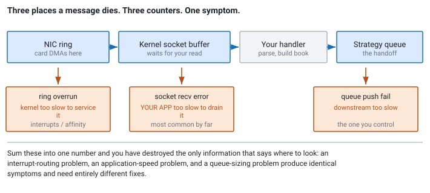
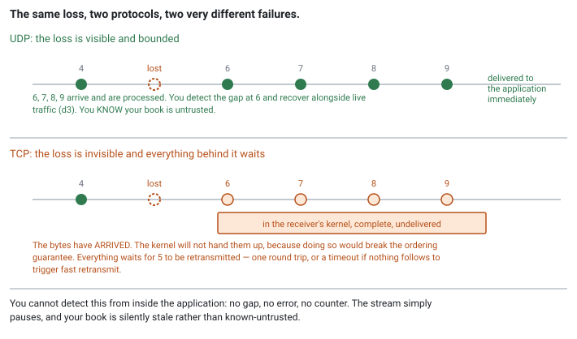

<!--
chapter: d4-parsing-batching-backpressure
state: draft_created
contract: standards/chapter-contract.md
include_measurement_plan: true | include_quizzes: true | primary_artifact_mode: pseudocode
unresolved_markers: 0
-->

# When the Market Outruns You

## Hot-Path Networking, Batching, and Overload

**Prerequisites:** [d2] Transports · [d3] Gap recovery · [a3] Latency and tail latency
**Focus:** you cannot apply backpressure to an exchange, so overload behaviour is a policy chosen in advance — go faster, drop deliberately, or stop — and "go faster" is mostly socket-level technique rather than better code

---

## The spiral

A feed handler keeps up comfortably. It has done for a year: average message rates leave it with plenty of headroom, and the queue between it and the strategy rarely holds more than a handful of messages.

On the morning of a rate decision the message rate rises tenfold for four seconds.

The handler falls behind. Its queue to the strategy fills. Unable to push, it stops draining the socket. The kernel receive buffer fills behind it, and the kernel begins discarding packets. Those discards are gaps, so the handler enters recovery — which means buffering live messages *and* requesting a snapshot *and* merging, which is more work than the steady state it was already failing to keep up with.

It falls further behind. More drops, more gaps, more recovery.

Four seconds of elevated rate has produced a handler that is still degraded minutes later. Nothing crashed and no single component is at fault: each one behaved exactly as designed when its input exceeded what it could process. **What was missing was a decision about what to do at that moment**, and in its absence every component chose the default, which was to keep trying.

## Where you will actually meet this

Every feed handler and every gateway, on the days that matter. Overload does not happen on quiet afternoons — it happens at the open, at economic releases, and during the events your strategy exists to trade. So the behaviour you get under overload is the behaviour you get precisely when the system's output is worth most.

This is also a favourite interview area, because it has a clean, slightly counterintuitive opening move that separates people immediately: **you cannot ask the exchange to slow down.**

## The mental model

In most software, overload has a standard answer: **backpressure.** The consumer signals it is full, the producer slows, the system reaches equilibrium. TCP does it, message brokers do it, and it is a reasonable reflex.

None of it applies here.

A multicast publisher has no idea you exist ([d2]). There is no connection, no acknowledgement, and no channel through which to say *wait*. The exchange transmits at whatever rate the market produces, and the only participants in the conversation are the market and physics.

So the equation is stark:

> **Input rate is given. Processing rate is yours. When input exceeds processing, something is lost — and your only real choice is what.**

Three options, and they are the entire space:

1. **Go faster** — raise processing rate so the crossover moves out of range.
2. **Drop deliberately** — decide in advance what to discard and what to keep.
3. **Stop** — declare the state untrusted and cease trading until you have caught up.

There is no fourth option, and "queue it" is not one of them. A queue converts a rate problem into a *delay* problem, which is fine for a transient burst and useless for a sustained one — and market data that arrives late is not merely late; it describes a market that has moved on.

## Part 1 — Knowing where you lost it

Before choosing a policy, know where drops actually occur. There are three distinct places, each with its own counter, and knowing which one moved is most of the diagnosis.


*Figure d4-1 — Three places a message can be lost, and a different meaning at each. The counters are how you tell them apart; without them, every one of these looks like "packet loss".*

**The NIC ring buffer.** The card writes packets into a ring in host memory. If the kernel does not service it fast enough, the ring wraps and packets are overwritten. Reported by the interface's driver statistics as receive overruns or missed packets. This one usually means interrupts are not being serviced — a core is saturated or interrupts are landing somewhere unhelpful ([c4]).

**The kernel socket buffer.** Packets accepted by the kernel wait here for your application to read them. If you do not read fast enough, the buffer fills and the kernel discards. Reported per socket as receive errors. This is the most common one by a wide margin, and it means your application is too slow — or its buffer is simply too small for the burst ([d2]).

**Your own queues.** The handler pushed to a full queue and the push failed. This is the one you control completely, and the only one where you get to choose the behaviour ([b2]).

Three failures, three meanings, and they call for entirely different responses. Which is why aggregating them into "we dropped packets" is a diagnosis-destroying habit: an application-speed problem, an interrupt-affinity problem, and a queue-sizing problem are indistinguishable once you have summed them.

## Part 2 — Batching, and its price

The first response to "go faster" is usually batching, and it is genuinely effective.

Reading packets one at a time costs a system call per packet. Processing them one at a time means the instruction cache, the branch predictors, and the data working set churn between messages. Doing many at once amortises all of it: one syscall for many packets, one warm pass through the parsing code, better use of every line you fetch ([a5]).

The cost is exactly what [a3] said it would be. The first message in a batch waits for the rest of the batch to arrive before anything happens to it. **Throughput up, latency up**, by the accumulation delay.

The resolution is to stop treating batch size as a constant:

```
// Adaptive batching: batch only when there is something to batch.
loop:
    n = receive_many(buffer, MAX_BATCH)    // one syscall, up to MAX_BATCH packets

    if n == 0:
        continue                            // nothing waiting; see b5 for what to do here

    for i in 0 .. n-1:
        process(buffer[i])                  // no accumulation delay: they had ALREADY arrived
```

The important property is subtle and worth stating plainly: **this adds no latency at all.** It does not wait for a batch to form. It asks for up to `MAX_BATCH` packets and processes whatever is already there. When the market is quiet, `n` is 1 and each message is handled immediately. When the market is busy, `n` is large — and the amortisation kicks in exactly when it is needed.

The batching happens *because* you are behind, not in order to get ahead. That is the design: **let load create the batches rather than creating them yourself.**

### The rest of the toolkit

Batching is one item. The others are configuration and API choices that cost nothing at runtime and are routinely left at defaults chosen for a different kind of workload.

**Disable Nagle on every hot-path TCP socket.** Nagle's algorithm holds a small write while an earlier segment is unacknowledged, batching small writes into fewer packets. Sensible for bulk transfer, wrong for order entry where every message is small and urgent. Worse is its interaction with the receiver's delayed acknowledgement: the sender waits for an ACK, the receiver delays the ACK hoping to piggyback it on data it does not have, and nothing moves until a timer fires — tens of milliseconds, on a path budgeted in microseconds, appearing only when traffic is light ([d2] works through the mechanism). Setting `TCP_NODELAY` on order-entry sockets is close to universal practice, and this interaction is the reason rather than the batching itself.

**Understand what head-of-line blocking costs, because you cannot fix it.** TCP delivers a byte stream in order. If a segment is lost and the ones behind it arrive, the receiving kernel *has* those bytes and will not hand them up — delivering them would break the ordering guarantee.


*Figure d4-2 — The same loss, two protocols, two different failures. Under UDP you get a gap you can detect and recover from. Under TCP you get silence.*

This inverts the usual intuition, which is why it is worth dwelling on: **the reliable protocol produces the failure that is harder to handle.** A UDP gap is detectable the moment it happens, and [d3]'s machinery turns it into a bounded, visible period of untrust. A TCP stall is not detectable at all from inside the application — no gap, no error, no counter moves. The stream pauses, and nothing distinguishes that from a quiet market ([d6] has the same ambiguity in a different costume).

There is no fix within one connection. The mitigations are structural: **separate connections for independent streams** where the venue permits, so a stall on one does not block the others; keeping messages small so a single loss costs one segment rather than many; and monitoring retransmissions so you at least know afterwards. Protocols that avoid head-of-line blocking exist and venues do not generally offer them, so this is a cost to know about rather than engineer away.

**Size the receive buffer deliberately.** The kernel socket buffer absorbs bursts between packet arrival and your handler reading. Defaults are tuned for general workloads and are usually far too small for a market-data feed — the single most common cause of drops, and a configuration change rather than a code change.

**Use batched receive calls.** Interfaces exist to take many datagrams in one system call, which is how the adaptive loop above is implemented in practice: one mode switch for many packets, no added latency.

**Know when you need readiness notification, and when you do not.** A process handling many sockets — a gateway with sessions to several venues, or anything with a control plane beside its data plane — needs to know *which* sockets have data without asking each in turn. That is what `epoll` is for on Linux: register the descriptors once, and each call returns only those that are ready. The older `select` and `poll` require passing the whole set on every call and scanning it on return, so their cost grows with the number of sockets watched whether or not anything happened; `epoll` keeps the interest set in the kernel and scales with the number of *ready* descriptors instead.

For the hot path the calculus reverses, and it is worth being explicit. **With one socket that is almost always ready, `epoll` is pure overhead** — a system call added to discover something a plain `recv` would have told you. A feed handler dedicated to one multicast group should read the socket directly, and if it can afford a core, busy-poll it ([b5]). `epoll` earns its place where the socket count is large and most are idle, which describes the gateway and the control plane rather than the feed handler.

A middle option exists: some stacks allow busy-polling from within the socket path, cutting interrupt and scheduling latency while staying inside the kernel and keeping the standard tooling. That is often the right move before considering anything more drastic ([d6]).

## Part 3 — Choosing what to lose

Suppose you are still behind. Now the policy question.

**Conflation** is the technique people reach for: if several updates for the same instrument are queued, keep only the latest and discard the rest. The strategy wanted the current price, and the current price is what it gets.

It is a genuinely good technique, and it is **only sound for messages that carry state.**

A level-based snapshot message says *the size at 178.42 is now 4,300*. That is state. An older one for the same level is strictly superseded, and discarding it loses nothing. Conflation is correct.

An incremental delta says *add 300 at 178.42*. That is not state, it is an instruction, and its effect depends on every instruction before it ([d3]). Discard one and the accumulator desynchronises — the book becomes silently wrong in exactly the way the whole of [d3] exists to prevent. **Conflation on an incremental feed is not a degradation, it is corruption.**

So the rule is:

> Conflate **state**, never **deltas**. If dropping a message changes the meaning of the messages after it, you may not drop it.

Where you cannot conflate, the honest options narrow to two: **drop and declare untrusted** — treat it exactly as a gap, because that is what it is, entering recovery and telling the strategy to stop ([d3]) — or **shed upstream**, reducing what you subscribe to so the input rate itself falls. Fewer instruments, fewer channels, a coarser feed if the venue offers one. This is the only lever that genuinely reduces input, and it is a decision to make before the morning of the event, not during it.

---

**Quiz 1**

Your handler reports gaps during the open. Three counters are available:

- NIC receive overruns: **0**
- Socket buffer receive errors: **12,400**
- Application queue push failures: **0**

What happened, what does the third number tell you, and what would you change?

> **Answer**
>
> **The application did not read the socket fast enough.** Packets arrived, the kernel accepted them into the socket buffer, and the buffer filled because nothing drained it in time.
>
> **The NIC counter being zero** rules out the interrupt path: the card and the kernel kept up fine, so this is not an affinity or interrupt-routing problem.
>
> **The third number is the interesting one.** Zero queue push failures means the handler was *never* blocked pushing to the strategy — so the strategy was keeping up, and the bottleneck is inside the handler itself: parsing, book building, or whatever else it does between reading the socket and pushing. If the queue had been full, the diagnosis would point downstream instead, and the fix would be somewhere completely different.
>
> **What I would change, in order:**
>
> 1. **Increase the socket buffer.** Cheapest possible change, absorbs the burst, and default sizes are almost always too small for a market-data feed ([d2]). This may be the whole fix.
> 2. **Batch the reads** — receive many packets per syscall, as in Part 2. Removes per-packet syscall overhead with no added latency.
> 3. **Then find the actual cost** inside the handler with per-stage timestamps ([a4]), because the first two buy headroom rather than throughput. If the handler is genuinely slower than the peak rate, headroom only delays the same failure.
>
> The general lesson: **three counters, three different problems, and the same symptom.** "We dropped packets" is not a diagnosis. Aggregating these numbers into one destroys the only information that tells you where to look.

---

**Quiz 2**

Your strategy only needs the top of book. During overload, someone proposes conflating: keep only the most recent update per instrument, drop the rest.

The venue publishes an **order-based incremental** feed — individual order add, modify, and cancel messages, from which you build the book yourself ([d1]).

Is the proposal sound?

> **Answer**
>
> **No, and it is not a partial loss — it is corruption.**
>
> An order-based feed sends instructions, not state. *Order 8891 added 300 at 178.42* only means something applied to a book containing every prior instruction. Drop the add and keep the cancel, and you cancel an order your book never had. Drop a cancel and keep a later add, and a phantom order stays in your book for the rest of the session.
>
> Crucially, **the result is not "approximately right"**. The book will look entirely normal — populated levels, sensible spread, nothing to check locally — and be wrong in a direction you cannot bound. That is the [d3] failure exactly: a desynchronised accumulator that never self-corrects.
>
> **What the proposal is confusing** is the strategy's *requirement* with the feed's *semantics*. It is true the strategy only reads the top of book. It does not follow that intermediate messages are discardable, because the top of book is *computed from* all of them. The information the strategy ignores is the information that makes its input correct.
>
> **What would make it sound:** a feed that publishes state rather than deltas. A level-based snapshot saying *size at 178.42 is now 4,300* supersedes any earlier statement about that level, so keeping only the latest per level is exactly correct — and some venues publish precisely this alongside the incremental feed, for consumers who want it.
>
> **What to do instead here:** treat the overload as a gap. Drop, mark the book untrusted, tell the strategy to stop, and recover through the snapshot channel ([d3]). Being loudly out of the market for 200 milliseconds is much better than quoting confidently from a corrupted book.
>
> The general lesson: **you may discard a message only if doing so does not change the meaning of the messages after it.** State supersedes; deltas accumulate.

---

## Common mistakes

**Trying to apply backpressure to a multicast feed.** There is nobody to signal.

**A bigger queue as the answer.** It buys time for a transient burst and nothing for a sustained one.

**Aggregating drop counters.** Quiz 1. Three different problems become one useless number.

**Fixed-size batching that waits for a batch.** Adds latency deliberately. Receive what is there, not what you hoped for.

**Conflating deltas.** Quiz 2. Silent corruption.

**Assuming keeping up on average is keeping up.** Overload is a peak phenomenon and averages hide peaks entirely ([a3]).

**Leaving Nagle enabled on order entry.** A default chosen for bulk transfer, on a path where every message is small and urgent.

**Reaching for `epoll` on a single hot socket.** It adds a syscall to learn what `recv` would have told you. `epoll` is for many sockets, most of them idle.

**Recovering into overload.** Recovery costs work. Entering it while already saturated is what makes the spiral, and it is a reason to shed upstream rather than recover repeatedly.

**Testing at average rates.** The behaviour you need to know about only appears above your processing rate, so a load test that never exceeds it tests nothing relevant.

## Operational behaviour

- **Export all three drop counters separately**, per interface, per socket, per queue. Never sum them.
- **Alarm on the first drop of the session.** Not a threshold — the first one. It means a margin you assumed was there was not.
- **Track catch-up time after a burst**, not just the drops. How long the system stays degraded after the input rate falls is the number that describes overload behaviour, and it is the one nobody records.
- **Record the peak message rate each session** and compare it to your measured processing rate. The ratio is your actual headroom, and it shrinks quietly as instruments and strategies are added.
- **Make the shed-upstream decision in advance.** Which instruments or channels are dropped first should be a configured, reviewed list, not an improvisation during an event.

## When this does not apply

- **Where you control the producer.** An internal bus can have real backpressure, and should.
- **On TCP channels.** Order entry has flow control built in; the failure mode there is a stalled stream, not loss ([d2]).
- **Where the peak rate is comfortably within processing rate** and the margin is measured rather than assumed.
- **On cold paths.** A telemetry pipeline that drops under load is fine, provided the drops are counted ([a1]).

## Optional — if you want to see it for yourself

*This is the one experiment in the book that has to be run at rates you hope never to see in production, which is exactly why it is worth running.*

Replay a captured session at increasing speed — 1×, 2×, 5×, 10× — and record all three drop counters plus end-to-end latency at each. Two numbers emerge that you cannot get any other way.

**The crossover:** the multiple at which the first counter moves. That is your real headroom, and it is almost always smaller than people expect, because processing rate is measured against peak arrival rather than average.

**The recovery time:** how long after the burst ends before the system is fully caught up and trusted again. Systems with similar crossovers can differ enormously here, and it is the number that decides whether a volatile open is an inconvenience or an outage.

Two habits worth keeping:

- **Watch which counter moves first**, not just that something dropped. The order in which they move tells you where the bottleneck is before you have profiled anything.
- **Record the catch-up curve**, not just the peak. Degradation that persists after the cause has gone is the failure mode that turns four seconds into four minutes.

## Interview mapping

- **Say backpressure does not exist on a multicast feed.** The opening move, and most candidates start by describing a backpressure scheme.
- **Name the three drop points and their counters.** Concrete, operational, and immediately credible.
- **Explain adaptive batching** and why it adds no latency — load creates the batches rather than you creating them.
- **State the conflation rule precisely:** state supersedes, deltas accumulate. Then say what breaks if you get it wrong.
- **Raise the recovery spiral.** Recognising that recovery costs work, and can therefore make overload worse, shows you have watched one happen.
- **Name the socket-level toolkit** — `TCP_NODELAY`, buffer sizing, batched receive, and `epoll` only where the socket count justifies it. Saying *when not to use `epoll`* is the part that distinguishes the answer.
- **Explain head-of-line blocking as a detectability problem**, not just a delay. That TCP converts a visible gap into invisible silence is the sharpest thing to say about it.
- **Choose "stop" as a legitimate answer.** Candidates who will not consider being out of the market reveal a poor sense of the relative costs.

## Summary

The exchange transmits at the rate the market produces, and there is no channel through which to ask it to stop. So the classical answer to overload is unavailable, and the space of real options is small: process faster, discard deliberately, or stand down.

Batching helps, provided it is adaptive — take whatever packets have already arrived rather than waiting for a batch to form, so amortisation appears exactly when load creates it and quiet periods pay nothing. Beyond that, discarding requires knowing what a message *is*: state may be superseded and conflated safely, deltas may not, and conflating an incremental feed produces a book that is silently and unboundedly wrong rather than merely stale.

Underneath both is the diagnostic discipline. Drops happen in the NIC ring, in the socket buffer, or in your own queues, and those are three different problems with three different fixes that produce one identical symptom. Keep the counters separate, alarm on the first drop rather than on a threshold, and measure the time to catch up — because the thing that turns a four-second burst into a four-minute degradation is recovery work arriving on a system that was already behind.

**Related:** [d1] market data and protocols · [d2] transports · [d3] gap recovery · [d5] clocks and timestamps · [d6] kernel bypass · [a3] latency and tail latency · [a4] measurement · [a5] cache locality · [b2] SPSC ring buffers · [b5] waiting strategies · [c4] thread affinity · [a1] system anatomy

## References

- Kurose, J. F., & Ross, K. W. (2021). *Computer networking: A top-down approach* (8th ed.). Pearson. [buffering, loss, and flow control]
- Stevens, W. R., Fenner, B., & Rudoff, A. M. (2003). *UNIX network programming, volume 1* (3rd ed.). Addison-Wesley. [batched receive interfaces and socket buffer behaviour]
