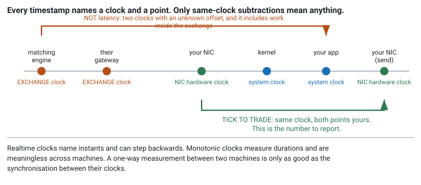

<!--
chapter: d5-clocks-and-timestamps
state: draft_created
contract: standards/chapter-contract.md
include_measurement_plan: false | include_quizzes: true | primary_artifact_mode: pseudocode
unresolved_markers: 0
-->

# Whose Clock Was That?

## Clock Synchronisation, Timestamp Semantics, and Time Domains

**Prerequisites:** [a3] Latency and tail latency · [a4] Measurement and profiling · [d2] Transports
**Focus:** every timestamp names a *clock* and a *point*, and a subtraction is only meaningful when both operands share a clock — which most latency numbers quoted in this industry quietly do not

---

## Forty microseconds of nothing

A team reports their tick-to-trade as forty microseconds. It appears in a weekly deck. It is stable week to week, it moves sensibly when they make changes, and everyone believes it.

They compute it by taking the timestamp the exchange put in the market-data message and subtracting it from the timestamp their application recorded when it sent the order.

That number is not a measurement of anything.

It mixes **two different clocks** — the exchange's and theirs — whose offset is unknown and drifting. And it spans a period that includes work that happened **inside the exchange**, before the packet reached the wire, which is not their latency and not something they can change.

The number is stable because both errors are roughly constant. It moves sensibly when they optimise because the part in the middle is real. It is, in effect, their true latency plus an unknown constant — which makes it usable for comparing Tuesday to Wednesday, and useless for comparing themselves to anyone, for sizing a budget, or for answering the question anyone actually asked.

## Where you will actually meet this

Three places, and all three matter:

- **Latency attribution.** Deciding which stage to optimise requires timestamps you can subtract from each other ([a4]).
- **Regulatory timestamping.** Jurisdictions impose requirements on the accuracy and granularity of recorded event times, with tighter obligations for faster trading. The details vary and change; the constant is that you must know how accurate your clocks are and be able to demonstrate it.
- **Replay and reconstruction.** Deciding the order in which events happened, after the fact, when they were recorded by different components ([e4]).

In interviews this appears as "how would you measure tick-to-trade," and the opening scenario is very close to the answer most candidates give.

## The mental model

One sentence, and everything follows from it:

> **A timestamp is not a time. It is a reading from a particular clock, taken at a particular point in the path.**

Lose either half and the number becomes uninterpretable — while still looking exactly like a number you can do arithmetic with. That is the whole hazard: nothing about a bare integer says which clock produced it, so an invalid subtraction produces a plausible result and no error.


*Figure d5-1 — Each capture point belongs to a clock. Points on the same clock may be subtracted; points on different clocks may not, without a known offset and error bound.*

### Which clock

**Realtime clock.** Names an instant in wall-clock terms. Disciplined by a synchronisation protocol, which means it can **step** — forwards or backwards — when corrected. Use it to record *when* something happened, and to compare across machines. Never use it to measure a duration: a backwards step during your interval produces a negative one.

**Monotonic clock.** Counts forward from an arbitrary origin and never steps backwards. Use it for durations. It is meaningless across machines, since its origin differs, and it says nothing about wall-clock time.

The rule that follows is simple and routinely violated: **durations from the monotonic clock, instants from the realtime clock.** Where you need both — and on an event you will later reconcile against a venue's records, you do — record both.

Underneath these sits the CPU's cycle counter, which is fast to read but carries caveats about constant rate and cross-core comparability that vary by hardware. Where its cost matters, know your platform's guarantees before relying on it.

### Which point

The other half. Between the matching engine and your strategy there are at least five plausible places to stamp:

1. **Exchange matching engine** — when the event occurred, in the venue's time.
2. **Exchange gateway** — when the packet left their infrastructure.
3. **Your NIC** — a hardware timestamp applied by the card as the packet arrives.
4. **Your kernel** — when the packet was processed by the network stack.
5. **Your application** — when your code read it.

The interval between 3 and 5 is your receive-path cost, which is yours to optimise. The interval between 1 and 2 is the exchange's internal latency, which is theirs. Mixing them is how you get a number that improves when the venue upgrades their infrastructure and looks like your win.

## Part 1 — Which subtractions are legal

The test is mechanical, and applying it is most of the skill.

**Legal: same clock, both points on your side.** NIC receive timestamp to NIC transmit timestamp, both from the card's clock. That is tick-to-trade, measured properly — the whole path including your software, excluding everything you do not control. This is the number to report.

**Legal: same clock, round trip.** Send at T1, receive the acknowledgement at T2, both on your monotonic clock. A round-trip time needs no synchronisation with anyone, because both readings come from one clock.

**Illegal without synchronisation: one-way, across machines.** Exchange timestamp to your timestamp. Two clocks, unknown offset. Whatever you compute is the true interval plus that offset, and the offset can easily exceed the interval you are trying to measure.

**Illegal always: across clock types.** Monotonic on one side, realtime on the other. The two count from different origins and are not commensurable at all.

```
// The discipline, expressed as data rather than as care.
struct Stamp {
    uint64_t  value;
    ClockId   clock;      // NIC_HW | MONOTONIC | REALTIME | EXCHANGE
    PointId   point;      // NIC_RX | APP_RX | APP_TX | NIC_TX | EXCHANGE_ME
};

duration(a, b):
    require a.clock == b.clock        // else: refuse. Not a warning — refuse.
    return b.value - a.value

one_way(a, b):
    require sync_established(a.clock, b.clock)
    offset, error = current_offset(a.clock, b.clock)
    return (b.value - a.value - offset) +/- error     // carry the error, always
```

The point of carrying `clock` and `point` alongside every value is that it makes the invalid subtraction **impossible to write** rather than merely inadvisable. A bare `uint64_t` gives you no protection, and the error it permits is silent — which is why this is the chapter's sequencing hazard: record the clock and the point *with* the value, at capture, or the information is gone and no downstream analysis can recover it.

## Part 2 — Synchronisation, and what it buys

If you need one-way measurements across machines, the clocks must be synchronised, and the achievable accuracy differs by orders of magnitude between approaches.

**NTP** synchronises over the ordinary network and typically achieves accuracy in the **milliseconds**. Entirely adequate for log correlation and for knowing what hour something happened. Useless for measuring a path budgeted in microseconds — the synchronisation error alone would be a hundred times the quantity you are measuring.

**PTP** uses hardware timestamping in switches and network cards to remove software and queueing delay from the calculation, and achieves **sub-microsecond** accuracy on suitable equipment. This is what makes one-way measurement meaningful at trading timescales, and it requires the network to support it — every switch in the path must participate.

**A local reference** — a GPS-disciplined clock feeding a pulse signal into the host — provides a traceable time source without depending on the network path, which is the usual arrangement where accuracy must be demonstrable to a regulator.

The practical guidance: **know your synchronisation error before quoting any one-way number.** If it is 5 milliseconds, a 40-microsecond figure derived from two machines is noise with a decimal point. And it needs monitoring — synchronisation degrades quietly, and a clock that has drifted still returns times.

---

**Quiz 1**

Your team's weekly report shows tick-to-trade improving from 42µs to 38µs. It was computed as `app_send_time − exchange_message_timestamp`.

Name three distinct reasons this number could have improved without your system getting any faster.

> **Answer**
>
> **1 — Clock offset drifted.** The two clocks are independent, and if yours moved 4µs relative to the exchange's, the subtraction changes by 4µs with nothing else different. With NTP-level synchronisation the offset can wander by far more than the quantity being reported.
>
> **2 — The exchange got faster internally.** The interval includes everything between the matching engine stamping the message and the packet reaching you: their internal processing, their gateway, the wire. If they upgraded anything, your number improves and your system is untouched.
>
> **3 — The mix of messages changed.** If the exchange stamps at the matching engine and their internal path varies by message type, then a session with a different type mix produces a different average — again with nothing about your system altered.
>
> **And a fourth worth noticing:** if the report is a mean rather than a percentile ([a3]), a change in the *distribution* moves it while the typical case is unchanged.
>
> **What to measure instead:** NIC hardware receive timestamp to NIC hardware transmit timestamp. Same clock, both endpoints under your control, and it captures exactly the interval you can do something about. It will be a *larger* number than the one they were reporting in some setups and smaller in others — which is itself the point, because the old number was not measuring this quantity at all.
>
> The general lesson: **a number that responds to your changes is not thereby a measurement of your system.** This one contained a real signal plus two unknown terms, and no amount of stability in the reported value distinguishes them.

---

## Part 3 — Ordering, which is a separate problem

Timestamps are also used to decide what happened first, and this fails differently.

Two events recorded on **different machines** cannot be ordered by comparing their timestamps unless the synchronisation error is much smaller than the interval between them. With millisecond-accurate clocks, two events 100µs apart may be recorded in either order. Reconstruction will then produce a sequence that never occurred — an order you sent apparently arriving before the market-data message that caused it.

Sequence numbers order events **within a stream** exactly and cheaply ([d3]), and they say nothing across streams. Timestamps order events **across streams** approximately, bounded by synchronisation error.

So for replay you generally want both: sequence numbers for within-stream order, one clock for cross-stream ordering wherever possible, and an explicit acknowledgement that events closer together than your synchronisation error are simply **not orderable** — a fact to record rather than to paper over ([e4]).

---

**Quiz 2**

You want to know how much of your tick-to-trade is spent in the kernel receive path versus in your own code.

You have: NIC hardware timestamps, the kernel's software receive timestamp, and your application's own reading of the monotonic clock at the top of its handler.

Which subtractions can you make, and what does each tell you?

> **Answer**
>
> **NIC hardware receive → kernel software receive.** Different clocks — the NIC's oscillator and the system clock — so this is only valid if the card's clock is disciplined to the system clock, which is a configuration you must verify rather than assume. Where it is, this interval is **the kernel's network-stack processing**: interrupt handling, protocol processing, queueing to the socket. Where it is not, the subtraction is meaningless.
>
> **Kernel software receive → application monotonic reading.** Both derived from the system clock, so this is valid, and it measures **the wait to be scheduled plus the read itself** — how long the packet sat in the socket buffer before your code got to it. This is frequently the largest and most variable term, and it is the one that grows first under load ([d4]).
>
> **Application handler start → application send.** Same monotonic clock, so valid. **Your own processing.** This is the part everyone assumes dominates, and it usually does not.
>
> **NIC receive → NIC transmit.** Same clock, both ends yours. **The whole path**, and the number to report externally.
>
> **What you cannot do** is subtract the exchange's timestamp from any of these, and you should not subtract the application's monotonic reading from a realtime-based kernel timestamp without establishing they share a base.
>
> **The trap:** the middle interval — socket buffer wait — is the one people leave out, because it happens between two components that both feel like "not my code". It is frequently the dominant term, and omitting it produces an attribution where the parts do not sum to the whole and nobody notices.

---

## Common mistakes

**Subtracting the exchange's timestamp from yours.** Two clocks, unknown offset, plus their internal latency. The opening scenario.

**Measuring durations with the realtime clock.** It steps. A negative duration in a log is this, and a *slightly wrong* duration is this too and harder to spot.

**Comparing monotonic readings across machines.** Different origins; the comparison is meaningless.

**Quoting a one-way number without stating the synchronisation error.** If the error is larger than the quantity, the number is noise.

**Storing a bare timestamp.** Without the clock and the capture point, no later analysis can tell whether a subtraction is valid.

**Ordering cross-machine events by timestamp** when they are closer together than the synchronisation error.

**Assuming synchronisation is working.** It degrades quietly and the clock keeps returning times. Monitor the offset itself.

**Timestamping in the application and calling it tick-to-trade.** It omits the receive path, which is often the larger and more variable part.

## Operational behaviour

- **Monitor synchronisation offset and its error estimate as first-class metrics**, and alarm on degradation. A drifting clock produces wrong numbers rather than missing ones.
- **Record the clock source and capture point with every stored timestamp.** Storage is cheap; a corpus of unattributed timestamps is unanalysable.
- **Record both realtime and monotonic** for events you will reconcile externally: realtime to match the venue's records, monotonic to compute intervals safely.
- **Verify hardware timestamping is actually enabled** at startup. It fails open — you get software timestamps that look plausible and measure something else.
- **Log clock steps.** When the realtime clock is corrected, anything computed across that moment is suspect, and knowing it happened saves a long investigation.
- **Keep synchronisation evidence.** Where timestamp accuracy is a regulatory obligation, the ability to demonstrate it after the fact is part of the obligation.

## When this does not matter

- **Round-trip measurements on one machine.** One clock, no synchronisation needed. Prefer these when they answer the question.
- **Within-stream ordering.** Sequence numbers do it exactly and cheaply ([d3]).
- **Slower strategies.** If decisions take seconds, millisecond-accurate synchronisation is ample and PTP is unnecessary complexity.
- **Cold paths.** Log correlation is fine on NTP ([a1]).

## Interview mapping

- **Ask which clock a timestamp came from.** The single strongest move here, and it reframes the question immediately.
- **Explain why exchange-minus-local is not latency** — two clocks with unknown offset, plus an interval inside their system. Volunteering the second reason as well as the first is what distinguishes the answer.
- **Describe measuring tick-to-trade properly:** NIC hardware timestamps at both ends, one clock, whole path.
- **Distinguish monotonic from realtime** and say what each is for. Table stakes, and worth being crisp.
- **State that one-way cross-machine measurement needs synchronisation**, and name the accuracy difference between approaches.
- **Mention the socket-buffer interval.** Most candidates go straight from wire to application and skip the term that is often largest.

## Summary

A timestamp is a reading from a specific clock, taken at a specific point. Drop either half and you are left with an integer that supports arithmetic and no longer supports conclusions — which is exactly how a number like "forty microseconds of tick-to-trade" ends up in a weekly report while measuring an interval that includes another company's infrastructure and an unknown clock offset.

The mechanical test is: same clock, both points yours. NIC hardware receive to NIC hardware transmit satisfies it and measures the thing you can actually change. Round trips on one clock satisfy it. One-way measurements across machines do not, unless the clocks are synchronised well enough that the residual error is small compared with the interval — which rules out network-level synchronisation entirely at microsecond timescales and is why hardware-assisted protocols exist.

Ordering is a related but separate failure. Sequence numbers order a stream exactly; timestamps order across streams only as well as your synchronisation allows, and events closer together than that error are not orderable at all. Recording that honestly is better than producing a reconstruction in which an order precedes the message that caused it.

The defence is to make the invalid operation impossible rather than merely discouraged: carry the clock and the capture point with the value, and refuse subtractions that do not typecheck. [e4] depends on having done this, because a replay is only as trustworthy as the ordering of the events it replays.

**Related:** [a3] latency and tail latency · [a4] measurement · [d2] transports · [d3] gap recovery · [d4] batching and overload · [d6] kernel bypass · [e4] deterministic replay · [a1] system anatomy

## References

- Precision Time Protocol is specified by IEEE 1588; the standard is the authority for its mechanism and the accuracy it can achieve on conforming equipment. *(Stage 1 source pack to pin the edition.)*
- Regulatory clock-synchronisation and timestamp-granularity obligations differ by jurisdiction and change over time; consult the applicable rules for the venues you trade rather than any general summary.
- Kurose, J. F., & Ross, K. W. (2021). *Computer networking: A top-down approach* (8th ed.). Pearson. [clock synchronisation fundamentals and one-way delay measurement]
