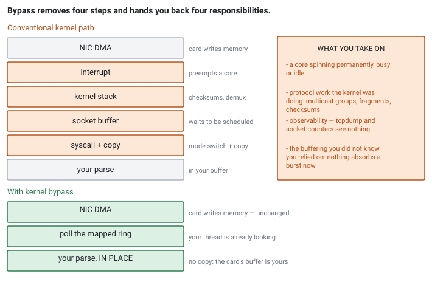

<!--
chapter: d6-kernel-bypass
state: draft_created
contract: standards/chapter-contract.md
include_measurement_plan: true | include_quizzes: true | primary_artifact_mode: none
note: final chapter of Module D — carries the module review per contract 3.15
unresolved_markers: 0
-->

# Taking the Kernel Out of the Path

## Kernel Bypass and User-Space Networking

**Prerequisites:** [d2] Transports · [c6] mmap and zero copy · [b5] Waiting strategies · [a4] Measurement
**Closes Module D** — carries the module review
**Focus:** what the kernel network path actually costs, which specific parts bypass removes, and the operational bill that arrives with it

---

## tcpdump shows nothing

A firm adopts kernel bypass. The receive path gets materially faster and the change is a success.

Six weeks later a production incident begins: the strategy is seeing no market data on one feed. An engineer does what engineers have done for twenty years and runs `tcpdump` on the host.

Nothing. Not the missing packets — that would at least be a clue — but nothing at all. Not the feed that is working fine either. The tool everyone reaches for first is watching a path the data no longer takes.

Every diagnostic reflex the team has is built on the kernel seeing the traffic. The kernel does not see the traffic any more. That was the deal, and nobody wrote down what it cost.

## Where you will actually meet this

Bypass is standard at the fastest tier of the industry — market makers and latency-sensitive prop firms — and unnecessary almost everywhere else. You will meet it as an existing part of a firm's stack more often than as a decision you make.

In interviews it is a good discriminator, because there are two very different answers available. The weak one is "it is faster because it skips the kernel." The strong one enumerates *what specifically* is removed, notes that a core is consumed permanently, and mentions that you have taken on work the kernel was doing.

## The mental model

Start with what the kernel path actually does, because "the kernel is slow" is not a mechanism and the kernel is not, in fact, badly written.

A packet arriving on a conventional path:

1. **NIC DMAs the packet** into a ring buffer in host memory. No CPU copy — the device wrote it.
2. **The NIC raises an interrupt.** A core stops what it was doing, saves state, and enters the handler.
3. **The kernel processes the packet**: validates headers, checks checksums, matches it to a socket, handles fragmentation and multicast group membership.
4. **The payload is queued** in the socket's receive buffer.
5. **Your application makes a system call** — a mode switch — and the kernel **copies** the payload into your buffer.
6. **Your application parses** what it now owns.

Each step is doing something necessary and each has both a mean cost and a variance. The interrupt preempts whatever was running. The syscall is a mode switch. The copy is proportional to size and pollutes cache ([a5]). And step 4's queue is where packets sit while your thread waits to be scheduled, which is often the largest and most variable term of all ([d4]).

**Bypass removes steps 2 through 5.** The NIC's queues are mapped directly into your process's address space ([c6]). Your code polls the ring, sees descriptors appear, and parses the packet **in place** — in the buffer the card wrote into.

No interrupt. No kernel protocol processing. No copy. No system call.

*Figure d6-1 — Bypass removes the interrupt, the kernel stack, the socket queue, and the copy. What it adds is a core spinning permanently and the protocol work you now own.*

## Part 1 — What it costs

Four costs, and the first is not optional.

**A core, permanently.** With no interrupt to wake you, the only way to notice a packet is to look. That means a polling loop, which means a dedicated core burning 100% whether the market is busy or silent ([b5]). This is not a tuning parameter — it is inherent to the design. On a host running several bypassed feeds, that is several cores gone before any work is done, which makes it a machine-level budgeting decision rather than a local optimisation.

**Protocol work you now own.** The kernel was doing real things in step 3. Multicast group membership. IP fragment reassembly. Checksum validation. Deciding which socket a packet belongs to. With bypass, that is your code — or your bypass library's, which is usually the sensible choice. Either way it is now yours to get right, and IP fragmentation in particular is a case people forget until a venue sends a message larger than the path MTU.

**Observability.** The opening scenario. `tcpdump`, `netstat`, per-socket counters, `ss` — all of it works by asking the kernel about traffic the kernel handles. Bypassed traffic is invisible to every one of them. You must rebuild equivalent visibility inside the application: packet counters, drop counters, ring occupancy, group membership state. **Rebuild it before you need it**, because the moment you need it is an incident.

**Operational coupling.** Bypass ties you to specific NIC hardware and a specific library and driver version. Hardware refresh becomes a software project. This is [c4] and [c5]'s theme arriving once more: another piece of configuration coupled to specific hardware, needing an owner.

## Part 2 — What to try first

Bypass is the largest available reduction on the receive path and it should not be the first thing you reach for. Several cheaper interventions recover a meaningful share of the benefit without leaving the kernel, and they are worth exhausting first — partly because they may be enough, and partly because if they change nothing, that is evidence the kernel path was not your problem.

**Measure the kernel path first.** With NIC hardware timestamps and a kernel receive timestamp you can measure exactly what steps 2 through 5 cost you ([d5]). Do this before anything else. If the kernel path is 3µs and your handler takes 40µs, bypass is optimising the wrong thing ([a4]).

**Size the socket buffer properly.** The single most common cause of drops, and a configuration change ([d2]).

**Turn off interrupt coalescing** on the latency-critical interface. It batches interrupts to save CPU and directly adds latency.

**Route interrupts deliberately.** Interrupts for the market-data NIC should land on a core that is not running your feed handler ([c4]).

**Use batched receive.** One syscall for many packets amortises the mode switch without changing anything structural ([d4]).

**Consider busy-polling on a normal socket.** Some stacks allow the application to poll the device from the socket path, cutting interrupt and scheduling latency while remaining inside the kernel — most of the wake-up benefit, without the observability loss.

Only when those are done, and the measurement still shows the remaining kernel path is a significant share of a latency budget that matters, does bypass earn its complexity.

---

**Quiz 1**

Your feed handler currently: takes an interrupt per packet, has the kernel process the packet, waits in the socket buffer, is scheduled, makes a syscall, receives a copy, and parses.

Under kernel bypass, which of those disappear, which remain, and what appears that was not there before?

> **Answer**
>
> **Disappears:**
> - **The interrupt** — you are polling, so nothing needs to notify you.
> - **Kernel protocol processing** — or rather, it moves into your process; the work still happens.
> - **The socket buffer wait and the scheduling delay** — your thread is already running, in a loop, looking. This is frequently the largest term removed and the one people leave out of the accounting.
> - **The system call and its mode switch.**
> - **The copy into your buffer** — you parse in place, in the ring the card wrote into.
>
> **Remains:**
> - **The DMA into host memory.** The card still writes the packet; that was never a CPU cost.
> - **Parsing.** Unchanged ([d1]).
> - **Everything downstream** — book building, strategy, risk. Bypass touches the receive path only, and if those dominate, your tick-to-trade barely moves.
>
> **Appears:**
> - **A core spinning permanently**, whether or not data arrives ([b5]).
> - **A new failure mode: ring wrap.** Nothing buffers for you now. If your loop is slow, the NIC overwrites descriptors you have not read, and the data is gone. The kernel's socket buffer was absorbing bursts on your behalf; that absorption is now your responsibility and your ring is typically much smaller.
> - **The protocol work** the kernel was doing.
> - **Blindness** to all standard kernel tooling.
>
> **The trap is the socket buffer.** People count the copy and the syscall — the visible costs — and forget that the kernel was also *buffering* for them. Removing it removes a shock absorber, so a handler that was merely slow becomes a handler that loses data ([d4]).

---

**Quiz 2**

Bypass is live. During an incident the strategy reports no market data on one feed. `tcpdump` shows nothing; kernel socket counters show nothing; the interface counters look normal.

What can you actually check, and what should have been built beforehand?

> **Answer**
>
> **What the kernel can still tell you:** the interface's own driver statistics — link state, and packets the card received — because those come from the hardware, not from the network stack. That distinguishes "no packets are arriving at the card" from "packets are arriving and something above is wrong", which is the first fork in the diagnosis.
>
> **What it cannot tell you:** everything after that. Whether the multicast group is joined. Whether packets are being delivered to *your* ring. Whether your loop is reading them. Whether they are being parsed. All of that now happens in your process, so only your process can report it.
>
> **What should have been built:**
>
> - **Per-ring packet and byte counters**, exported like any other metric.
> - **Ring occupancy and wrap counters.** A wrap is a silent data loss and the only place it is visible is here.
> - **Explicit multicast group membership state**, reported and verified at startup — a failed join looks exactly like a quiet market ([c6], [d2]).
> - **A packet-capture facility inside the application**: a ring of recent raw packets, dumpable on demand. This is `tcpdump` rebuilt where the data now lives, and it is the single most valuable thing on this list during an incident ([e4]).
> - **A heartbeat or staleness check per feed**, so "no data" is an alarm rather than an inference from silence.
>
> **The real lesson is the shape of the mistake.** The team traded latency for observability without noticing the second half was part of the price. That is not an argument against bypass — it is an argument for **counting the whole bill**, and for building the replacement visibility *at the same time as the bypass*, not after the first incident demonstrates it was needed.

---

## Common mistakes

**"Bypass skips the kernel and is therefore fast."** True and not a mechanism. Name what is removed.

**Forgetting the dedicated core.** It is inherent, not incidental, and it is a machine-level cost.

**Not accounting for lost buffering.** Quiz 1. The socket buffer was absorbing bursts, and now nothing is.

**Deploying without replacement observability.** Quiz 2. The tooling loss is discovered during the first incident.

**Bypassing before measuring the kernel path.** If your handler dominates, this optimises the wrong thing entirely ([a4]).

**Skipping the cheaper interventions.** Buffer sizing, coalescing, interrupt routing, and batching are configuration changes that may be sufficient.

**Assuming bypass helps the send path equally.** The transmit path has a different profile, and the receive side is usually where the win is.

**Ignoring fragmentation.** The kernel reassembled fragments for you. Now you do.

## Operational behaviour

- **Export counters that the kernel used to give you**: packets, bytes, drops, ring occupancy, ring wraps, per feed. Treat their absence as an outage of your monitoring, not a detail.
- **Build in-application packet capture** before going live. A ring of recent raw packets, dumpable on demand, is the replacement for `tcpdump` and it is worth more than everything else on this list combined.
- **Verify group membership at startup** and alarm on loss. Silence is ambiguous.
- **Pin the polling thread and account for its core** in the machine's budget, documented as deployment configuration ([c4]).
- **Version-lock the NIC firmware, driver, and library together**, and test upgrades as a unit. This stack is tightly coupled and mismatches fail in confusing ways.
- **Keep a kernel-path fallback** if you can. Being able to run degraded but observable during an incident is worth a great deal.

## When not to use bypass

- **When the kernel path is not a significant share of your latency budget.** Measure it ([d5], [a4]).
- **When you cannot dedicate a core**, or the host runs enough feeds that the core cost is prohibitive.
- **On shared or virtualised infrastructure**, where you do not control the NIC.
- **When the team cannot own the operational surface** — hardware coupling, version locking, rebuilt observability. A bypass stack nobody understands is worse than a kernel path everybody does.
- **For anything off the critical path.** Order entry, drop copy, telemetry, and control-plane traffic should stay on the kernel stack where the tooling works ([a1]).

## Optional — if you want to see it for yourself

*The interesting measurement here is not how fast bypass is. It is how much of your latency the kernel path was actually responsible for — a number that decides whether the rest of this chapter applies to you at all.*

With NIC hardware receive timestamps and a timestamp at the top of your handler, you can measure the kernel path directly: the interval covers interrupt, protocol processing, socket queueing, scheduling, syscall, and copy ([d5]). Take the distribution, not the mean — the variance here is the interesting part, and the socket-queue term is what makes it large.

Then, before touching bypass, apply the cheap interventions one at a time and re-measure: buffer size, coalescing off, interrupt affinity, batched receive. Each is a single change, so you learn what each is worth on your hardware and your load.

Two habits worth keeping:

- **Measure under burst, not steady state.** The socket-queue term is near zero when quiet and dominant under load, which is exactly backwards from what a calm benchmark will tell you.
- **Report the distribution.** The mean of a kernel-path measurement hides the scheduling delay that motivated the whole exercise ([a3]).

## Interview mapping

- **Enumerate the kernel path** — interrupt, protocol processing, socket queue, scheduling, syscall, copy — and say which parts bypass removes. The enumeration is what distinguishes a real answer.
- **Raise the dedicated core unprompted.** Most candidates do not, and it is inherent to the design.
- **Mention the lost buffering.** Removing the socket buffer removes a shock absorber, and this is the sharpest thing you can say here.
- **Name the observability loss.** It signals you have operated one of these rather than read about it.
- **Propose the cheaper interventions first**, and say you would measure the kernel path before deciding.
- **Note that bypass touches the receive path only.** If book building dominates, the end-to-end improvement is small.

## Summary

The kernel receive path costs an interrupt, protocol processing, a wait in the socket buffer, a scheduling delay, a system call, and a copy. Bypass removes all of them by mapping the NIC's queues into your process and polling: packets are read where the card wrote them, parsed in place, with no kernel involvement at all.

The bill has four lines. A core burns permanently, because polling is the only way to notice a packet with no interrupt. The protocol work the kernel was doing becomes yours. Every standard diagnostic tool goes blind, because they all work by asking the kernel about traffic it no longer sees. And the stack couples you to specific hardware and versions in a way that makes a refresh a project.

The line that surprises people is one that is not obviously a cost at all: the socket buffer was absorbing bursts on your behalf, and now nothing is. A handler that was merely slow becomes a handler that silently loses data when its ring wraps.

None of which is an argument against bypass at the tier of the industry where it belongs. It is an argument for counting the whole bill, for exhausting the configuration-level interventions first, and for building the replacement observability at the same time as the bypass rather than after the incident that proves it was needed.

---

# Module D in review

*Module D left the machine. Everything here concerns data that arrives from somewhere you do not control, at a rate you cannot influence, timed by a clock that is not yours. This section consolidates it — read it now, and again before an interview.*

## The arc

**[d1] Market data and protocols.** A feed is several channels with different jobs, and the high-rate one means nothing alone. Deltas need state, state needs reference data, and prices are scaled integers because decimal values must round-trip exactly. Parse framing before content and advance by the declared length.

**[d2] Transports.** Market data is multicast and unreliable *because* reliability would require per-receiver state and would deliver recovered data late — turning a fairness guarantee into a fairness failure. Order entry is a session because you must know your order arrived, and TCP's reliability is paid for in the tail. Most loss happens in your own buffers.

**[d3] Gap recovery.** A gap desynchronises the accumulator, so the book becomes untrusted rather than stale. Recovery runs alongside live reception, never instead of it, and retransmission and snapshot resync differ in what they preserve and what they need.

**[d4] Batching and overload.** You cannot slow the exchange, so overload is a policy: go faster, drop deliberately, or stop. Adaptive batching lets load create the batches. Conflate state, never deltas.

**[d5] Clocks and timestamps.** A timestamp names a clock and a point. Same clock, both points yours, or the subtraction means nothing — which is why most quoted tick-to-trade figures measure an interval that includes someone else's infrastructure.

**[d6] Kernel bypass.** Removes the interrupt, the stack, the socket queue, the syscall, and the copy. Costs a core, the protocol work, the observability, and the buffering you did not realise you were relying on.

## The recurring ideas

**1. Silence is ambiguous, and it resolves in the expensive direction.** A quiet market and a dead feed look identical ([d2], [d6]). A failed multicast join looks like nothing happening. An empty queue looks like a slow market. In every case the system must be *told* it is healthy — through heartbeats, membership checks, staleness timers — because the absence of data is not evidence of anything.

**2. The failure is usually inside your own machine.** Loss attributed to the network is nearly always a receive buffer that filled ([d2], [d4]). Latency attributed to the exchange is often your socket queue ([d5]). The instinct to look outward is strong and usually wrong, and the counters that settle it are already there.

**3. State supersedes; deltas accumulate.** This single distinction decides whether you can conflate ([d4]), what a gap costs you ([d3]), which recovery mechanism needs a merge ([d3]), and what a snapshot is for ([d1]). Ask of any message: does dropping it change the meaning of the messages after it?

**4. Every number needs its provenance.** Which clock, which point ([d5]). Which counter, which stage ([d4]). Which channel, which venue ([d1]). A bare number in this module supports arithmetic and not conclusions, and the errors are silent because the arithmetic always succeeds.

**5. Cold start is the same code path as recovery.** At startup you have an infinite gap ([d1], [d3]). Building them separately means the rarely-exercised path is the one you need during an incident. Build it once and exercise it every morning.

## Choosing a transport and a policy

| Situation | Answer |
|---|---|
| Public data, many receivers, fairness matters | UDP multicast, unreliable by design ([d2]) |
| Orders, must know it arrived | TCP session with its own sequencing ([d2]) |
| Detected a gap, small and fresh | Retransmission — keeps your book ([d3]) |
| Gap large, detected late, or cold start | Snapshot resync — replaces your book ([d3]) |
| Overloaded, feed carries state | Conflate: keep the latest per key ([d4]) |
| Overloaded, feed carries deltas | Drop, declare untrusted, recover ([d4]) |
| Measuring your own latency | One clock, both points yours ([d5]) |
| Kernel path measured and dominant | Bypass, with the full bill counted ([d6]) |
| Anything off the critical path | Kernel stack, where the tooling works ([d6]) |

## Check yourself

1. Why are prices integers rather than doubles, and what breaks if they are not?
2. What does a handler need, in order, before it can publish a trustworthy price at cold start?
3. Why is market data unreliable *by design* rather than for speed?
4. What is head-of-line blocking, and why does it make a failure harder to detect than packet loss?
5. Where do packets actually get dropped, and which counter tells you which?
6. Why can you not apply backpressure to a multicast feed, and what are the three real options?
7. When is conflation sound, and what exactly does it corrupt when it is not?
8. Why is exchange-timestamp minus your-timestamp not a latency measurement — give two reasons?
9. Which subtractions between timestamps are legal, and why?
10. Enumerate the kernel receive path. Which parts does bypass remove, and what appears in their place?
11. Your feed has gone silent. Name four things that produce that symptom.

## What comes next

Module D delivered a trustworthy stream of market data into the process. **Module E** is what the system does with it and with the orders it sends back: building the book that the data describes ([e2]), handling duplicates and retries without doubling a position ([e1]), the risk checks that stand between a decision and the wire ([e3]), and reconstructing afterwards what the system saw and why ([e4]) — which is only possible because [d5] made the ordering of events meaningful.

**Related:** [d1] market data and protocols · [d2] transports · [d3] gap recovery · [d4] batching and overload · [d5] clocks and timestamps · [d7] WebSocket and HTTP · [a1] system anatomy · [a3] latency · [a4] measurement · [b5] waiting strategies · [c4] thread affinity · [c6] mmap and zero copy · [e1] idempotency · [e2] order-book construction · [e4] deterministic replay

## References

- Vendor documentation for the specific kernel-bypass stack in use is the authority for its API, its protocol coverage, and its hardware requirements; these differ substantially between implementations. *(Stage 1 source pack to pin candidates.)*
- Stevens, W. R., Fenner, B., & Rudoff, A. M. (2003). *UNIX network programming, volume 1* (3rd ed.). Addison-Wesley. [the kernel path this chapter is measured against]
- Arpaci-Dusseau, R. H., & Arpaci-Dusseau, A. C. (2018). *Operating systems: Three easy pieces* (1.00 ed.). Arpaci-Dusseau Books. [interrupts, system calls, and the user/kernel boundary]
