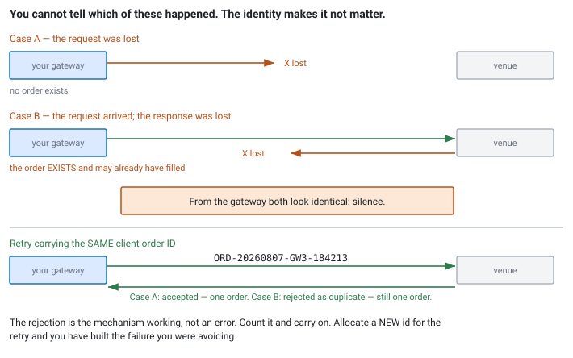

<!--
chapter: e1-idempotency-and-duplicates
state: draft_created
contract: standards/chapter-contract.md
include_measurement_plan: false | include_quizzes: true | primary_artifact_mode: pseudocode
unresolved_markers: 0
-->

# Sending It Twice

## Idempotency, Duplicate Handling, and Retry Semantics

**Prerequisites:** [a2] Order lifecycle · [d3] Gap recovery
**Focus:** a timeout tells you nothing about whether your message was processed, so safety comes from a client-assigned identity that makes a repeat harmless — never from checking first and then acting

---

## Two hundred milliseconds of silence

An order gateway sends a new order to buy 500 shares and waits for the acknowledgement.

Two hundred milliseconds pass. Normal is under a millisecond, so something is wrong — the message was lost, or the session is degraded, or the venue is struggling. The gateway does the sensible thing and retries.

Both copies arrive. The firm now holds 1,000 shares.

The strategy believes it holds 500, because it sent one order and counted one order. The risk engine counted one order's exposure ([e3]). The position is wrong by a factor of two, and nothing in the system reported an error — both orders were valid, both were accepted, and both were filled exactly as instructed.

The bug is not the retry. Retrying was reasonable, and doing nothing would also have been a decision with consequences. The bug is that **the retry was not safe to make**, and nobody had arranged for it to be.

## Where you will actually meet this

Every order gateway, on every reconnection, and in every fill handler. It is the least glamorous correctness problem in the system and among the most expensive to get wrong, because the failures are financial rather than technical.

For interviews it is standard material in execution roles. The reliable probes are the client-order-ID scheme and the cancel-versus-new asymmetry, and both are answerable in a sentence if you have the model and not at all if you do not.

## The mental model

Start with the fact that generates everything else:

> **A timeout is indistinguishable from a slow response.**

When your acknowledgement does not arrive, exactly one of these is true, and you cannot tell which:

- the request never reached the venue;
- the request reached the venue and was processed, and the response was lost;
- the request reached the venue and is still being processed;
- the request reached the venue, was processed, and the response is on its way.

In three of those four, the order exists. Waiting longer does not resolve the ambiguity — it only makes the window larger. And there is no clever protocol that fixes this: the impossibility is fundamental to a network where messages can be delayed or lost, not an artifact of any particular design.

So the question is not *how do I find out what happened*. It is **how do I make the retry safe regardless of what happened.**

### Exactly-once does not exist; exactly-once *effect* does

The phrase "exactly-once delivery" is a category error. You cannot guarantee a message is delivered precisely once over an unreliable channel — any number of acknowledgement rounds leaves the same ambiguity one level up.

What you can guarantee is **exactly-once effect**: the operation may be delivered any number of times, and the resulting state is the same as if it were delivered once. That is idempotency, and it is achieved by attaching a **stable identity** to the operation so the recipient can recognise a repeat.

Which is why the fix is not on your side at all. It is a contract with the venue.

## Part 1 — The client order ID

Every order carries an identifier that **you** assign, before sending. The venue records it and rejects any subsequent order bearing an ID it has already seen.

That single mechanism turns the retry from dangerous into safe: send the same order twice with the same ID and the second is rejected as a duplicate. One order exists. The rejection is not an error — it is the mechanism working.


*Figure e1-1 — The client cannot distinguish a lost request from a lost response. A stable client-assigned identity makes both cases converge on the same end state.*

The scheme has requirements, and each one is a way people get it wrong.

**Assigned by the client, not the venue.** A venue-assigned ID cannot help: you would need the response in order to know it, and the missing response is the problem.

**Unique forever, not per session.** The tempting design is a counter that starts at 1 for each session. It fails on restart: the new process issues ID 1, the venue has already seen ID 1 from this morning, and either it rejects your legitimate order or — worse, depending on the venue's retention window — it accepts it and you now have two different orders sharing an identity. Compose the ID from something that cannot repeat: a date, a session or instance identifier, and a monotonic counter.

**Recorded before sending.** This is the chapter's sequencing hazard and it is silent:

1. **Generate the ID.**
2. **Persist it as used.**
3. **Send.**

Send before recording, and a crash between the two leaves an order live at the venue with an identifier the restarted process does not know. You cannot ask about it, you cannot cancel it, and you will not find it until reconciliation. It is not merely an untracked order — it is an *unmanageable* one ([a2]).

**Never reused, even for an order you believe failed.** "That one was rejected, I will reuse the ID" is exactly the reasoning that produces two live orders when the rejection you saw was for a different copy.

## Part 2 — Not everything needs this equally

There is a useful asymmetry, and noticing it unprompted is a strong interview signal.

**A new order is not idempotent.** Sending it twice creates two orders. It needs an identity and venue-side deduplication.

**A cancel is naturally idempotent.** Cancelling an order that is already cancelled leaves it cancelled. The end state after one cancel and after five is identical. So retrying a cancel is safe by construction, and the "failure" you get back — *unknown order* or *already done* — is the correct outcome rather than an error to escalate.

That asymmetry has a practical consequence worth stating plainly: **when in doubt, cancelling is the safe direction.** If your state is uncertain after a disconnect, sending cancels for everything you believe might be live is a bounded, safe action; sending new orders is not. It is the same principle as [c2]'s reserved pool for cancels — risk-reducing operations should be the ones that are always available.

**A replace or modify sits in between**, and its safety depends on the venue's semantics. If a modify is expressed as *set the quantity to 300*, it is idempotent — applying it twice gives the same result. If it is expressed as *reduce the quantity by 200*, it is a delta and it is not ([d3]'s state-versus-delta distinction, arriving in the order path). Read the specification rather than assuming.

## Part 3 — Duplicates arriving at you

The same problem runs in the other direction, and it is easier to overlook because it does not involve a decision on your part.

Venues redeliver. A session resend after a disconnect, a retransmission, a drop-copy feed carrying the same fills as the primary session — all of these can hand you a message you have already processed. Apply a fill twice and your position is wrong in exactly the way the opening scenario produced, without anyone retrying anything.

The defence is the same idea reflected: **apply each message once, keyed by an identity in the message.** Fills carry an execution identifier from the venue; keep the set of applied identifiers and discard repeats.

The practical question is how long to keep them. Unbounded growth is not acceptable on a long-running process, and the answer follows from the venue's semantics: retention needs to cover the window in which the venue could plausibly redeliver — a session, a trading day — rather than forever. Preallocate for the worst case ([c2]) and treat exhaustion as an incident rather than a reason to start forgetting.

```
// The shape of the whole chapter, in both directions.

on send_new_order(order):
    id = next_client_order_id()        // unique across restarts
    persist_as_used(id)                // BEFORE the send — see the hazard
    record_exposure(order)             // BEFORE the send — see e3
    send(order, id)

on send_timeout(order, id):
    resend(order, id)                  // SAME id. Safe: the venue deduplicates.
    // do NOT allocate a new id, and do NOT query-then-decide

on venue_rejects_duplicate(id):
    // not an error: the original arrived. Count it and carry on.
    metrics.duplicate_rejected += 1

on fill(exec_id, order_id, qty):
    if applied.contains(exec_id): return      // redelivery; already counted
    applied.insert(exec_id)
    apply_to_position(order_id, qty)

on session_reconnected():
    // Local state is a belief and it is now stale (a2).
    request_order_status_or_drop_copy()
    reconcile_against(local_orders)           // divergence is a defect, log it
```

### Why "check, then act" is not a substitute

The natural alternative is to query the venue — *do you have my order?* — and send only if it says no.

It does not work, and the reason generalises well beyond trading. The query and the send are two round trips with a gap between them, and the state can change in that gap: your original may arrive at the venue *after* your query was answered. You have not removed the race, you have moved it and made it harder to see. Worse, the query itself can time out, leaving you exactly where you started with an extra round trip spent.

**Check-then-act across a network is not atomic.** Idempotency works because it needs no atomicity: the operation is safe to repeat, so there is nothing to coordinate.

---

**Quiz 1**

Your gateway times out on two messages during a degraded session: a **new order** for 500 shares, and a **cancel** for a different order.

For each, say whether retrying is safe, what the worst case is, and what you would actually do.

> **Answer**
>
> **The cancel: retry it, immediately, without hesitation.** Cancel is idempotent — the end state after one cancel and after three is the same order, cancelled. The worst case is a rejection saying the order is unknown or already done, which is information rather than damage. And the cost of *not* retrying is an order you believe is cancelled that is still live and can fill.
>
> **The new order: do not retry blindly.** If you have no client order ID scheme with venue-side deduplication, the worst case is two live orders and double the intended position — the opening scenario. With such a scheme, retrying with the **same ID** is safe: the venue rejects the second copy, and you get the correct end state either way.
>
> **What I would actually do without a dedup scheme:** treat it as [a2]'s unknown state. The order stays in `PendingNew`, and it is not cancellable because you have no identifier the venue recognises. Reconcile as soon as the session recovers, and — the real answer — **fix the design**, because a system that cannot safely retry a new order has no good options in this situation, only bad ones ranked by taste.
>
> **The asymmetry is the point.** Operations that reduce risk are naturally idempotent and safe to repeat; operations that create it are not and need machinery. That is not a coincidence — it is because creating something is a state change and removing something is a state assertion. Notice it and you get the right answer for a whole class of operations without enumerating them.

---

**Quiz 2**

A team assigns client order IDs from a counter starting at 1 when the process starts. Orders are `SESSION-1`, `SESSION-2`, and so on, where `SESSION` is a fixed string.

Name three distinct ways this fails, and design a scheme that does not.

> **Answer**
>
> **1 — Restart collision.** The process restarts mid-session and begins issuing `SESSION-1` again. The venue has already seen it. Either it rejects a legitimate order — confusing, and the strategy is now stuck — or, if its dedup window has expired, it accepts it, and you have two distinct orders sharing an identity. Every subsequent message referring to `SESSION-1` is ambiguous, including fills and cancels.
>
> **2 — You cannot reconcile after a disconnect.** On reconnection you ask the venue what is live and it answers with client order IDs. If those IDs are not unique over time, you cannot map the answers onto your own records, so the reconciliation that [a2] requires is impossible to perform correctly.
>
> **3 — Multiple processes collide.** The moment there is a second gateway instance — for capacity, for redundancy, or accidentally during a deploy — both issue `SESSION-1`. Same failure, without any restart, and it appears the first time someone runs two instances.
>
> **A scheme that works** composes three parts:
>
> ```
> <date>-<instance-id>-<monotonic-counter>
> 20260807-GW3-000184213
> ```
>
> - **Date** bounds reuse and makes IDs readable in an incident.
> - **Instance ID** — from configuration, not the hostname, since hosts get replaced — separates concurrent processes.
> - **Monotonic counter**, persisted before use, that never restarts within the date. Crash recovery reads the last persisted value and continues **past** it, with a deliberate jump forward rather than a resume, so an unflushed write cannot cause a repeat.
>
> Check the venue's length and character constraints before designing this; they are usually tighter than you expect and discovering that after implementation is annoying.
>
> **The general lesson: uniqueness must hold across every dimension the ID is used in** — across time, across restarts, and across instances. A counter is unique in one dimension only, which is why it feels sufficient and is not.

---

## Common mistakes

**Treating a timeout as evidence that nothing happened.** In three of four cases the order exists.

**Retrying a new order without deduplication.** The opening scenario.

**Allocating a new ID for a retry.** It becomes a different order, which is exactly what you were avoiding.

**Per-session counters.** Quiz 2.

**Sending before persisting the ID.** Leaves an unmanageable order after a crash.

**Query-then-send.** Two round trips with a race between them; not atomic and harder to reason about.

**Treating a duplicate rejection as an error.** It is the mechanism working. Count it; do not alarm on it.

**Forgetting inbound duplicates.** Redelivered fills double a position with no retry involved.

**Unbounded dedup state.** It must be sized and preallocated like anything else ([c2]).

## Operational behaviour

- **Count duplicate rejections and discarded fills separately.** Both are normal in small numbers; a rising rate means retries or redelivery are happening more than you think.
- **Alarm on reconciliation divergence.** If the venue's list of live orders and yours differ after a reconnect, that is a defect, and it is much cheaper to find in the afternoon than at settlement.
- **Monitor dedup-set occupancy.** It is preallocated, so exhaustion is a hard failure and the high-water mark predicts it ([c2]).
- **Log every client order ID at generation**, before the send. That log is the only record of orders that may exist at the venue but not in your state.
- **Test the restart path deliberately.** Kill the gateway mid-session in a test environment and verify no ID is reused. This is not something to discover in production.

## When this does not apply

- **Genuinely idempotent operations.** Cancels, and modifies expressed as absolute values, are already safe.
- **Where the venue does not deduplicate.** Then retrying a new order is unsafe regardless of your scheme, and the correct behaviour is not to retry — reconcile instead. Know which case you are in before designing the retry logic.
- **Read-only queries.** Repeating a position query is harmless.
- **Within a process.** In-process handoffs have no lost-response problem; that is a distributed-systems failure and Module B's queues do not have it ([b2]).

## Interview mapping

- **Say a timeout carries no information** about whether the request was processed. The opening move, and it frames everything after it.
- **Distinguish exactly-once delivery from exactly-once effect** and say the first is impossible. Precise, correct, and it signals the distributed-systems framing.
- **Design the client order ID out loud** — date, instance, monotonic counter — and say it is persisted before the send.
- **Raise the cancel-versus-new asymmetry** unprompted, and note that risk-reducing operations tend to be the naturally idempotent ones.
- **Explain why check-then-act fails.** Two round trips with a race between them.
- **Mention inbound duplicates.** Most candidates only consider the outbound direction, and redelivered fills are the same bug arriving from the other side.

## Summary

When an acknowledgement does not arrive, four things could have happened and in three of them your order exists. No amount of waiting or querying resolves that, because check-then-act across a network is not atomic and the ambiguity is fundamental rather than incidental.

So safety does not come from finding out what happened. It comes from making the repeat harmless: a client-assigned identity, unique across time and restarts and instances, persisted before the message is sent, that the venue uses to reject a second copy. Delivery is then allowed to happen any number of times, and the *effect* happens once — which is the only version of "exactly once" that is achievable.

The same idea reflected handles the inbound direction, where redelivered fills would otherwise double a position with no retry involved: apply each message once, keyed by the venue's execution identifier.

And there is an asymmetry worth carrying beyond this chapter. Operations that create risk are not idempotent and need machinery; operations that reduce it usually are, and are safe to repeat. When your state is uncertain, that tells you which direction to move — the same conclusion [c2] reached about reserved capacity and [e3] will reach about kill switches.

**Related:** [a2] order lifecycle · [d3] gap recovery · [e3] pre-trade risk · [e4] deterministic replay · [c2] preallocation and pools · [d2] transports · [b2] SPSC ring buffers · [a1] system anatomy

## References

- Venue order-entry specifications define client order ID constraints, deduplication windows, and modify semantics; all three differ by venue and must be read rather than assumed. *(Stage 1 source pack.)*
- Kurose, J. F., & Ross, K. W. (2021). *Computer networking: A top-down approach* (8th ed.). Pearson. [reliable delivery and the limits of acknowledgement]
