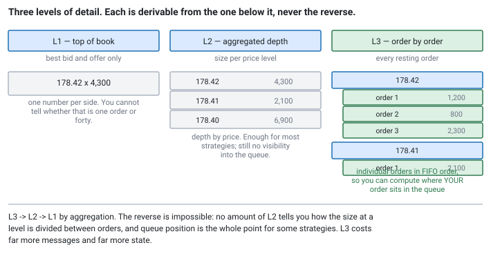
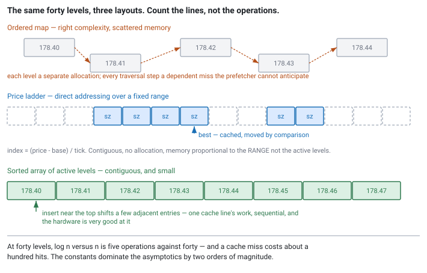
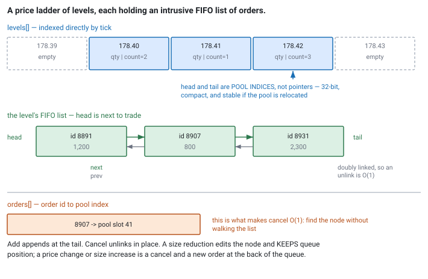

<!--
chapter: e2-order-book-construction
state: draft_created
contract: standards/chapter-contract.md
include_measurement_plan: true | include_quizzes: true | primary_artifact_mode: code
unresolved_markers: 0
-->

# The Structure Everything Reads

## Order-Book Representation and Construction

**Prerequisites:** [d1] Market data and protocols · [d3] Gap recovery · [a5] Cache locality and layout
**Focus:** the representation follows from the *access pattern*, and at these sizes the deciding factor is cache lines touched, not asymptotic complexity

---

## The obviously correct implementation

A team builds their order book the way any competent engineer would. Two `std::map`s, one per side, keyed by price. Insert a level, erase a level, `begin()` for the best price. The complexity is right — logarithmic updates, constant-time access to the top — the code is thirty lines, and it is obviously correct.

At production rates the book update becomes the largest single component of tick-to-trade.

The profile is unhelpful in a familiar way ([a4]): time is spread across the map's internals, tree traversal and node allocation, with nothing that looks like a mistake. Nobody wrote a slow function. The data structure was chosen on the criterion everyone is taught to use, and that criterion turns out not to be the one that governs here.

## Where you will actually meet this

The book is the central data structure of the market-data path. Everything downstream reads it, it is updated on every message, and the strategy's decision is a function of what it says. If Module D was about getting a trustworthy stream of messages, this is what those messages are *for*.

It is also a favourite interview question, because the reasoning is testable on a whiteboard and the naive answer is confidently wrong in an interesting way. An interviewer who asks "how would you represent an order book" is not checking whether you know what a tree is.

## What kind of book are you building?

Before the access pattern, a distinction the specification will assume you know. Market data comes in three levels of detail, and they are not three qualities of the same thing — they are three different amounts of information.

**L1 — top of book.** Best bid, best offer, their sizes, and usually the last trade. One number per side. You cannot tell whether that 4,300 shares is one order or forty.

**L2 — aggregated depth (market by price).** Total size at each price level, several levels deep. This is what most people picture when they say "order book", and it is enough for most strategies.

**L3 — order by order (market by order).** Every individual resting order: its identifier, its price, its size, and its position in the queue at that level. You build the L2 view yourself by aggregating.


*Figure e2-2 — Aggregation runs one way only. No amount of L2 tells you how the size at a level is divided between orders.*

The relationship is strictly one-directional: **L3 aggregates to L2, and L2 aggregates to L1.** The reverse is impossible at any cost, which is why the choice matters.

What L3 buys is **queue position** — how much size sits ahead of your order at your price level. For a strategy whose edge depends on getting filled rather than on predicting direction, that is not a detail, it is the entire question. Being third in the queue at 178.42 and being thirtieth are completely different propositions, and L2 cannot distinguish them.

What it costs is substantial. Message rates are far higher, since every individual add, cancel, and modify is a message rather than a net change to a level. State is far larger, because you hold every resting order rather than a number per level. And the processing per message is more involved, as the rest of this chapter shows.

So the honest rule: **take L3 only if something actually uses queue position.** A strategy that reads the top five levels and never asks where it sits in the queue is paying for L3 and consuming L2.

## The mental model

Before choosing a structure, characterise the access pattern honestly. Four operations, wildly different frequencies:

**Read the top of book.** Best bid, best offer, and their sizes. Read on essentially every strategy evaluation, which means at least once per update and often more. **By far the most frequent operation.**

**Apply an update at a price.** Add, modify, or remove interest at some price level. Once per message.

**Iterate the top few levels.** Some strategies look at depth — the nearest five or ten levels. Common but much less frequent than reading the touch.

**Reach a deep level.** Rare. Most books have interest at hundreds of price points and almost nothing reads level ninety.

Now the fact that shapes everything, and it is worth stating as a claim rather than an aside: **updates cluster near the top of book.** The interest that changes most is the interest closest to the market, because that is where participants are actively competing. Deep levels are stale by comparison — placed and left.

So the structure you want is **fast near the touch, and merely adequate deep.** That is a very different requirement from "uniformly logarithmic", and it is why the textbook answer underperforms.

## Part 1 — Four representations


*Figure e2-1 — The same book, three layouts. What differs is not the number of operations but how many cache lines each one touches, and whether the prefetcher can help.*

**Ordered map (`std::map`).** Correct, ordered, logarithmic. Every level is a separately allocated node reached by a pointer chase, so a traversal of five levels is five dependent cache misses that the prefetcher cannot anticipate ([a5]). Every new price level is an allocation on the hot path, which [c2] rules out on its own. The complexity is fine and the constant factors are not.

**Hash map from price to level.** Constant-time update and no ordering at all, so the top of book requires either a scan of every level or a separately maintained best price. Same allocation and locality problems as the map, with the ordering removed. Rarely the right answer for the book itself.

**Price-indexed array — the "ladder".** Preallocate an array covering a price range, index it by `(price - base) / tick`. Update is a direct index. Top of book is a scan outward from the last known best, which is short because the best price moves by a tick or two at a time.

```cpp
// code-e2-1 | RUNNABLE | C++20 | examples/, target: book
// Price ladder: direct addressing, contiguous, no allocation after construction.
class Ladder {
    static constexpr std::size_t kLevels = 8192;
    std::array<std::uint64_t, kLevels> size_{};   // resting size at each tick
    std::int64_t base_tick_{0};                   // price of index 0
    std::size_t  best_{0};                        // cached, maintained incrementally

public:
    void set(std::int64_t tick, std::uint64_t size) noexcept {
        const auto i = static_cast<std::size_t>(tick - base_tick_);
        if (i >= kLevels) { out_of_range(tick); return; }   // see below
        size_[i] = size;
        if (i == best_ && size == 0) best_ = scan_outward(best_);  // touch emptied
        else if (better_than(i, best_) && size > 0) best_ = i;     // new touch
    }
    std::uint64_t best_size() const noexcept { return size_[best_]; }
};
```

Constant-time update, contiguous memory, no allocation, and a best-price update that is usually a comparison. The costs are real: memory proportional to the price range times the instrument count, and a decision about what to do when the market moves outside the range. That last one is not hypothetical — a limit-up move or an instrument with a wide range will exceed any window you pick — and the answer is usually to re-base the array around the new market, which is an expensive operation you accept because it is rare.

**Sorted array of active levels.** Keep only the levels that actually have interest, in a contiguous array sorted by price. Insertion and deletion shift elements, which is linear and sounds disqualifying.

It usually is not, for two reasons. First, active levels are far fewer than the price range, so the array is small. Second — and this is the point — **inserts happen near the top, so the shifted region is short.** Moving a handful of adjacent 16-byte entries is a single cache line's worth of work that the hardware does very well, whereas the map's "cheaper" logarithmic insert was several dependent misses. A `memmove` of 200 bytes beats three pointer chases, and that is not a close contest.

The general shape of the answer, and the thing to say in an interview: **contiguity beats complexity at these sizes**, and the deciding measurement is lines touched per operation, not operations counted ([a5]).

## Part 2 — The full version: a ladder of intrusive lists

Everything so far assumed a level holds a number. For an L3 book it holds a **queue of orders**, and the structure that handles it well is the price ladder with an intrusive doubly-linked list at each level.

Three pieces:

- **The ladder** — an array indexed by tick, as before, but each entry now holds an aggregate (total size, order count) plus the **head and tail** of that level's order list.
- **The order pool** — preallocated storage for order nodes, handed out by index ([c2]).
- **An order-id index** — from the venue's order identifier to the pool slot holding it.


*Figure e2-3 — The three structures an order-by-order book needs. The id index is what makes cancellation constant time; the doubly-linked list is what makes the unlink constant time.*

```cpp
// code-e2-2 | RUNNABLE | C++20 | examples/, target: l3book
// Indices, not pointers: 32-bit, compact, and stable if the pool is relocated.
inline constexpr std::uint32_t kNil = 0xFFFF'FFFFu;

struct OrderNode {                 // one resting order
    std::uint64_t order_id;
    std::uint64_t quantity;
    std::int32_t  tick;
    std::uint32_t prev{kNil}, next{kNil};   // intrusive links within the level
};

struct Level {
    std::uint64_t total_quantity{0};
    std::uint32_t order_count{0};
    std::uint32_t head{kNil}, tail{kNil};   // FIFO: head trades first
};
```

The FIFO discipline is not a design choice. It reflects how price-time priority works at the venue: at a given price, the order that arrived first trades first. The list order *is* the queue.

### Add — append at the tail

```cpp
// code-e2-3 | RUNNABLE | C++20 | examples/, target: l3book
void L3Book::add(std::uint64_t id, std::int32_t tick, std::uint64_t qty) {
    const std::uint32_t n = pool_.acquire();       // bounded; see c2
    pool_[n] = OrderNode{id, qty, tick, kNil, kNil};
    index_.insert(id, n);                          // id -> slot

    Level& lv = levels_[to_index(tick)];
    pool_[n].prev = lv.tail;                       // link at the BACK
    if (lv.tail != kNil) pool_[lv.tail].next = n;
    else                 lv.head = n;              // first order at this level
    lv.tail = n;

    lv.total_quantity += qty;                      // aggregate maintained
    ++lv.order_count;                              //  -> the L2 view, for free
    update_best_on_add(tick);
}
```

Note that the aggregates are maintained as you go. That is how you serve L2 queries from an L3 book without recomputing anything: the L2 view is a by-product of keeping the list.

### Cancel — unlink in place

```cpp
// code-e2-4 | RUNNABLE | C++20 | examples/, target: l3book
bool L3Book::cancel(std::uint64_t id) {
    const std::uint32_t n = index_.find(id);
    if (n == kNil) return false;                   // unknown order: see below

    OrderNode& o = pool_[n];
    Level& lv = levels_[to_index(o.tick)];

    if (o.prev != kNil) pool_[o.prev].next = o.next; else lv.head = o.next;
    if (o.next != kNil) pool_[o.next].prev = o.prev; else lv.tail = o.prev;

    lv.total_quantity -= o.quantity;
    --lv.order_count;

    index_.erase(id);
    pool_.release(n);
    if (lv.order_count == 0) update_best_on_empty(o.tick);
    return true;
}
```

This is where the two auxiliary structures earn their place. The **id index** finds the node without walking the level, and the **backward link** lets you unlink without walking to find the predecessor. Drop either and cancellation becomes linear in the queue depth — which matters enormously, because on most venues **cancels are the most common message type by a wide margin.** Orders are placed and pulled continuously; comparatively few trade.

A cancel for an unknown id is not a no-op to swallow. It means your book and the venue's disagree, which is the [d3] failure: report it and resynchronise.

### Modify — and the queue-position rule

The interesting one, because the venue's semantics decide what your code must do.

```cpp
// code-e2-5 | RUNNABLE | C++20 | examples/, target: l3book
void L3Book::modify(std::uint64_t id, std::int32_t new_tick, std::uint64_t new_qty) {
    const std::uint32_t n = index_.find(id);
    if (n == kNil) { report_unknown_order(id); return; }
    OrderNode& o = pool_[n];

    const bool keeps_priority = (new_tick == o.tick) && (new_qty < o.quantity);

    if (keeps_priority) {
        levels_[to_index(o.tick)].total_quantity -= (o.quantity - new_qty);
        o.quantity = new_qty;                      // edit in place, position kept
        return;
    }
    cancel(id);                                    // loses queue position
    add(id, new_tick, new_qty);                    // ... back of the queue
}
```

The rule this encodes is standard across venues and worth committing to memory:

> **Reducing size at the same price keeps queue priority. Increasing size, or changing price, loses it.**

The reasoning is fairness. Reducing your order takes nothing from anyone behind you, so you keep your place. Increasing it, or moving to a better price, would let you jump ahead of orders that were there first — so you go to the back.

That single asymmetry has real consequences for strategy: a system that wants to adjust size downward can do so freely, while one that wants to increase must accept losing a position it may have waited a long time to earn. **Confirm your venue's rule from its specification rather than assuming this one**, since a handful differ, and getting it wrong means your model of your own queue position is quietly wrong.

### Execute — consume from the head

```cpp
// code-e2-6 | RUNNABLE | C++20 | examples/, target: l3book
void L3Book::execute(std::int32_t tick, std::uint64_t qty) {
    Level& lv = levels_[to_index(tick)];
    while (qty > 0 && lv.head != kNil) {
        OrderNode& front = pool_[lv.head];
        const std::uint64_t take = std::min(qty, front.quantity);
        front.quantity      -= take;
        lv.total_quantity   -= take;
        qty                 -= take;
        if (front.quantity == 0) cancel(front.order_id);   // fully filled: unlink
    }
    if (qty > 0) report_over_execution(tick);   // more traded than we had: desync
}
```

And the payoff, which is why anyone builds this:

```cpp
// code-e2-7 | RUNNABLE | C++20 | examples/, target: l3book
// How much size is ahead of my order at its price level?
std::uint64_t L3Book::quantity_ahead(std::uint64_t my_id) const {
    const std::uint32_t me = index_.find(my_id);
    if (me == kNil) return 0;
    std::uint64_t ahead = 0;
    for (std::uint32_t n = levels_[to_index(pool_[me].tick)].head;
         n != kNil && n != me; n = pool_[n].next)
        ahead += pool_[n].quantity;
    return ahead;
}
```

That walk is linear in the number of orders ahead, which is acceptable when queried occasionally and not when queried per update. If a strategy needs it constantly, cache it per own-order and maintain it incrementally — the same reasoning as the top of book in the next section.

**Everything here is preallocated.** The pool is fixed-size and pre-touched, the ladder is an array, and the id index is a preallocated open-addressing table sized for the worst case. Not one of these operations may allocate, because all of them run on the critical path ([c2], [c1]).

## Part 3 — Maintain the top, do not recompute it

Whatever the representation, one optimisation is close to unconditional: **keep the best bid and offer as maintained state, not as a computed query.**

The touch is read far more often than it changes. An update that lands away from the touch cannot change it at all, and an update that lands at the touch usually moves it by one level. So the maintenance is a comparison in the common case and a short scan in the uncommon one — while recomputation, on a structure with any ordering cost, pays on every read.

The subtle part is the emptying case. When the level at the touch goes to zero, the new best is found by scanning outward. That scan is short in a liquid instrument and can be long in a sparse one, which is the one place a price ladder's cost is not bounded. If that matters, a bitmap of occupied levels alongside the ladder turns the scan into a bit-scan instruction over a word at a time — a standard refinement, and worth knowing exists.

## Part 4 — Publish whole packets, not whole messages

Here is a correctness hazard that has nothing to do with representation and catches people who got everything else right.

A single packet frequently contains several messages that together perform one logical change. A price improvement often arrives as a **delete of the old level followed by an add of the new one**. Between those two messages, the book has no best offer at all — or worse, an offer worse than the bid, so the book is *crossed*.

That intermediate state never existed at the venue. It is an artifact of how the change was framed into messages.

So the sequencing rule:

1. **Apply every message in the packet.**
2. **Update the cached top of book.**
3. **Publish to consumers.**

Publishing after each message exposes states that were never real, and a strategy reading one of them may act on a price that never existed. The failure is timing-dependent — it needs the strategy to read in exactly that window — so it is rare, load-correlated, and essentially impossible to reproduce ([b7]).

### Invariants worth checking

The book is derived state, and [d3] established that derived state can be silently wrong. A few checks cost almost nothing and catch desynchronisation that no check on the data itself would reveal:

- **Crossed book** — best bid at or above best offer, *within one venue's book*. This should be impossible; the matching engine would have traded them. If you see it, your book is wrong.
- **Negative or absurd size** — an update took a level below zero, meaning you applied a delta to a state that did not match.
- **Removing a level that is not there** — same conclusion.

Each of these is a symptom of the [d3] failure: an accumulator that has drifted from the venue's actual state. Treat them the way you treat a sequence gap — **mark the book untrusted and resynchronise** — rather than clamping the value and continuing, which converts a detectable fault into a silent one.

---

**Quiz 1**

You are choosing a book representation. The instrument is liquid: around 40 active price levels per side, updates arriving at high rate, and roughly 80% of updates landing within three ticks of the touch. The strategy reads best bid and offer on every update and the top five levels occasionally.

Rank `std::map`, a hash map, a price ladder, and a sorted array — and give the reason that decides it.

> **Answer**
>
> **Sorted array first, ladder close behind, then hash map, then `std::map`.**
>
> **Sorted array.** Forty levels of, say, 16 bytes is 640 bytes — ten cache lines for the entire side, so the hot region is permanently resident. An update near the touch shifts a few adjacent entries: one or two lines, sequential, prefetchable. Reading the top five levels is one contiguous walk. Its linear insert is on an array small enough that the linear term is irrelevant.
>
> **Price ladder.** Constant-time update and no allocation, and it wins on updates landing far from the touch since there is no shifting at all. It loses slightly here because the array spans the whole price range rather than the 40 active levels, so iterating the top five means skipping empty entries, and the working set is larger. Excellent choice; marginally worse fit for *this* pattern.
>
> **Hash map.** Constant-time update, but no ordering — so the top five levels require maintaining a separate sorted structure, and you now have two things to keep consistent. Plus allocation and scattered nodes.
>
> **`std::map` last**, despite having exactly the right complexity. Forty nodes scattered across the heap; every level is a dependent miss; every new price is an allocation on the hot path ([c2]).
>
> **The reason that decides it:** at n = 40, the difference between log n and n is about five operations against forty — and a cache miss costs on the order of a hundred times a hit. **The constant factors dominate the asymptotics by two orders of magnitude at this size**, so the structure with the best locality wins even when it does the most operations. This is [a5]'s lesson arriving in its most consequential form.
>
> If the instrument had ten thousand active levels the ranking would change. Ask about size before answering.

---

**Quiz 2**

Your book reports a crossed state: best bid 178.45, best offer 178.43. A colleague proposes suppressing the publish when crossed and waiting for the next update to fix it.

What has actually happened, and what should you do?

> **Answer**
>
> **First, distinguish two causes**, because the response differs.
>
> **Cause 1 — you published mid-packet.** The delete-then-add pair from Part 3. The cross is transient and an artifact of your own publishing, not of your state. The fix is to publish per packet rather than per message. The colleague's proposal accidentally masks this one, which is why it will appear to work.
>
> **Cause 2 — your book is desynchronised.** You missed or misapplied a message, so your accumulated state no longer matches the venue's ([d3]). The cross is the *symptom*, and the underlying book is wrong in ways you cannot bound — a crossed touch is simply the one error visible enough to notice.
>
> **Why the proposal is dangerous:** it suppresses the symptom in both cases. Under cause 2, the book is wrong, the strategy stops seeing the one signal that would have told you, and it keeps trading from corrupted state — with the error now invisible. That is strictly worse than publishing the cross, because a crossed book at least stops a sane strategy from acting.
>
> **What to do:** treat a cross exactly as a gap. Mark the book untrusted, tell consumers, and resynchronise from a snapshot ([d3]). Count it — a nonzero and rising crossed-book count is a serious defect. Then fix the publishing boundary so cause 1 cannot produce false positives, because a check that fires spuriously will be disabled by someone within a month.
>
> **One caveat worth knowing:** across *different venues* a crossed market is perfectly normal, and arbitrage strategies exist precisely because of it. The invariant here applies within a single venue's book, where the matching engine would have executed the crossing interest.

---

## Common mistakes

**Choosing by complexity.** Quiz 1. At these sizes constants dominate by orders of magnitude.

**Allocating per price level.** A new level on the hot path is a call to the allocator ([c2]).

**Recomputing the top of book.** It is read far more often than it changes.

**Publishing per message rather than per packet.** Exposes states that never existed at the venue.

**Clamping an invariant violation instead of reporting it.** Converts a detectable desynchronisation into a silent one.

**Assuming deep levels matter.** They exist; almost nothing reads them.

**Taking L3 without using queue position.** Far more messages and far more state, consumed as L2.

**A singly-linked order list.** Cancellation becomes linear in queue depth, on the most frequent message type there is.

**Treating a modify as always cancel-and-add.** A size reduction at the same price keeps priority; collapsing them loses queue position you actually still hold, and your model of your own position goes wrong.

**Swallowing a cancel for an unknown order.** It means your book disagrees with the venue ([d3]).

**Ignoring the ladder's out-of-range case.** The market will eventually move outside your window and the behaviour must be designed rather than discovered.

**Benchmarking at unrealistic depth.** A book with three levels behaves nothing like a book with forty, and the ranking changes with size ([a4]).

## Operational behaviour

- **Count invariant violations** — crossings, negative sizes, unknown removals — per instrument. A nonzero count is a correctness defect, never noise.
- **Export book depth and update-depth distribution.** How far from the touch updates land is what justifies your representation, and it changes as instruments and venues change.
- **Alarm on ladder re-basing.** It is expensive and rare; a rising rate means the range is wrong.
- **Track time spent untrusted per instrument** ([d3]). A book that resynchronises frequently is a book nobody should be trading from.
- **Keep the raw packets** ([e4]). When a book looks wrong, the only way to settle it is to replay the messages that built it.

## When to use something else

- **L2 rather than L3, when nothing uses queue position.** The structure in Part 2 is real work and real memory. If no strategy asks `quantity_ahead`, build the simpler book and take the cheaper feed.
- **Instruments with unbounded or very wide price ranges.** The ladder's memory becomes prohibitive; the sorted array does not care.
- **Very large instrument counts.** Per-instrument memory is multiplied by tens of thousands, which rules the ladder out on aggregate memory alone even where it is ideal per instrument.
- **Off-path books.** A research or reporting book can use whatever is clearest ([a1]).

## Optional — if you want to see it for yourself

*The ranking in Quiz 1 depends on a claim about your data — that updates cluster near the touch — and that claim is measurable in an afternoon from captured sessions.*

Take a day of captured messages and plot the **distribution of update depth**: how many ticks from the current best each update lands. That histogram is the justification for the whole chapter, and it differs by instrument and venue. If it turns out flat for your instruments, the reasoning here does not apply to you and the conclusions change.

Then implement two representations behind one interface and replay the same captured session through both, measuring per-update cost and total lines touched if your platform exposes the counters. Replaying real messages matters: synthetic uniform updates will make the ladder look better than it is, because they remove exactly the clustering the sorted array exploits.

Two habits worth keeping:

- **Sweep the depth.** Test at three, forty, and four hundred active levels. The ranking changes, and knowing where it changes is the useful output ([a5]).
- **Use captured data, not generated data.** The access pattern is the whole question, and synthetic data has whatever pattern you gave it.

## Interview mapping

- **Ask about the access pattern** before proposing a structure — read frequency at the touch, update depth distribution, whether depth is used. It is the question that determines the answer.
- **Say contiguity beats complexity at these sizes**, and give the arithmetic: forty elements, log n versus n is five versus forty, and a miss costs a hundred hits.
- **Propose the sorted array or the ladder**, and name the tradeoff between them rather than picking dogmatically.
- **Mention incremental top-of-book maintenance.** Small, and few candidates volunteer it.
- **Raise the publish-per-packet hazard.** It is a correctness point in a question people treat as a performance question, and it lands well.
- **Distinguish L1, L2, and L3**, and say that aggregation runs one way. Knowing that queue position is unavailable from L2 at any cost is the point.
- **Describe the L3 structure** — ladder, intrusive doubly-linked list, id index — and say what each one buys. A common follow-up is "why doubly linked", and the answer is O(1) unlink on the most frequent message type.
- **State the modify rule**: reduce at the same price keeps priority; increase or reprice loses it, for fairness reasons.
- **Explain what a crossed book means** — your state, not the market — and that the response is to resynchronise rather than to clamp.

## Summary

Market data arrives at one of three detail levels, and they are three different amounts of information rather than three qualities of one thing: L3 aggregates to L2 and L2 to L1, never the reverse. So the first decision is whether anything you build actually uses queue position — because that is the only thing L3 provides that L2 cannot, and it costs far more messages, far more state, and the whole apparatus of Part 2.

Given that, the order book is chosen by access pattern, and the pattern is lopsided: the top of book is read constantly, updates cluster within a few ticks of it, and deep levels are almost never touched. That argues for a structure that is excellent near the touch and merely adequate elsewhere — which is not what a uniformly logarithmic container gives you.

At forty active levels the asymptotics are simply the wrong lens. A sorted contiguous array shifting a few adjacent entries beats a tree doing fewer operations across scattered nodes, because a cache miss costs about a hundred times a hit and the tree takes several dependent ones per traversal. A price ladder trades memory for direct addressing and wins where updates land far from the touch. The map, which has the best complexity on paper, is last.

Two things then matter regardless of representation. Maintain the top of book incrementally, since it is read far more often than it changes. And publish per *packet*, not per message, because a delete-then-add pair passes through a state the venue never had — a rare, load-correlated, effectively unreproducible bug for anyone who gets it wrong.

For an order-by-order book the same reasoning produces a ladder of intrusive FIFO lists, with an id index so cancellation is constant time — which matters because cancels, not trades, are the most common message on most venues. The queue is the list, in arrival order, because that is what price-time priority means; and the venue's modify rule follows from fairness, so reducing size at a price keeps your place and increasing it or repricing sends you to the back.

Finally, the book is derived state, so it can be silently wrong ([d3]). Crossings, negative sizes, and phantom removals are cheap to check and are symptoms of desynchronisation rather than data to clean up. Report them, resynchronise, and never clamp — because clamping is how a detectable fault becomes an invisible one.

**Related:** [d1] market data and protocols · [d3] gap recovery · [a5] cache locality and layout · [a4] measurement · [c2] preallocation and pools · [e1] idempotency · [e4] deterministic replay · [b7] testing concurrent code · [a1] system anatomy

## References

- Exchange market-data specifications define whether a feed is order-based or level-based and how price levels are addressed; the representation choice depends on that. *(Stage 1 source pack.)*
- Vendor optimisation manuals document cache line size and prefetcher behaviour, which is where the constant factors in this chapter come from. *(Stage 1.)*
