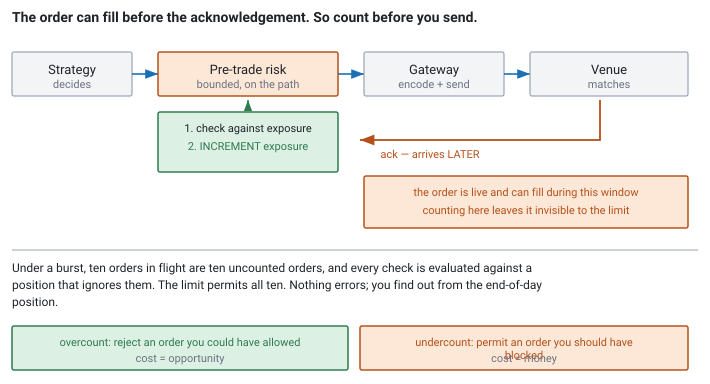

<!--
chapter: e3-pretrade-risk-engine
state: draft_created
contract: standards/chapter-contract.md
include_measurement_plan: false | include_quizzes: true | primary_artifact_mode: code
unresolved_markers: 0
-->

# The Check You Cannot Skip

## Pre-Trade Risk-Engine Foundations

**Prerequisites:** [a2] Order lifecycle · [a3] Latency and tail latency · [c2] Preallocation and pools
**Focus:** pre-trade risk is the one thing on the critical path that cannot be moved off it, so it must be *bounded* rather than merely fast — and the ordering of exposure accounting is what makes it correct rather than decorative

---

## The orders that were not wrong

A strategy reads a reference price that has gone stale — a snapshot that failed to refresh, a fallback value used when a lookup missed. Its model concludes that the market is far below fair value and starts buying.

Every order it produces is well-formed. The quantity is reasonable, the symbol is valid, the session is healthy, and the gateway encodes and sends each one correctly. Nothing in the system is malfunctioning. The strategy is doing exactly what it was told to do, with an input that happens to be wrong.

The only thing between that bug and a very expensive morning is a handful of checks that run in the microseconds before each order reaches the wire.

That is what this chapter is about, and it is worth being clear on the framing: **pre-trade risk is not there to catch bad orders. It is there to catch a bad system**, including the parts of the system you wrote, tested, and believe in.

## Where you will actually meet this

Every firm has this, much of it is mandated, and it sits on the critical path of every order. You will meet it as the component nobody wants to make slower and nobody is allowed to remove.

It is a good interview topic because it forces a genuine tension into the open: a hard correctness requirement placed directly on the latency budget. The weak answer treats it as overhead to minimise. The strong answer explains why it cannot be moved, what "bounded" means as distinct from "fast", and when exposure is counted.

## The mental model

Two ideas, and the second is the one people get wrong.

**It cannot be asynchronous.** The obvious latency optimisation — send the order and check in parallel — is not a risk check at all. By the time the check completes, the order is at the venue and may already have filled. You have built something that *reports* on orders after they are irreversible, which is monitoring, not control. Monitoring is valuable and it is a different thing.

So the check is on the path, and it is the only thing in this handbook that gets to be there for a reason other than being unavoidable work.

**It must be bounded, not fast.** This is the [a3] distinction in its sharpest form. A check with an excellent average and an occasional slow path is unacceptable, because the slow path will occur during a burst, when the strategy is sending most and the orders matter most. What is required is a **stated worst case** — no allocation, no lock, no lookup that might rehash or resize, no I/O, no path that can take a different amount of time depending on state you do not control ([c2]).

In practice that means every limit and every piece of state the checks need is preallocated, laid out for direct indexing, and touched at startup ([c1]). The checks become a fixed sequence of comparisons against values already in cache.

## Part 1 — What is actually checked

The list varies by firm and jurisdiction. The shape does not.

**Price sanity.** Is this price plausible relative to a recent reference? The classic fat-finger check, and the one that would have caught the opening scenario. Requires a reference price that is itself maintained and — critically — *known to be fresh*, since a stale reference is precisely what caused the problem.

**Maximum order size and notional.** Per instrument, per order. A single comparison.

**Position and exposure limits.** Would this order, if it filled entirely, take the position beyond the limit? Requires live position state, which is the interesting part.

**Message rate limits.** Both self-imposed and venue-imposed. A runaway strategy sending thousands of orders a second is a specific and well-known failure mode, and the venue will disconnect you for it if you do not stop yourself first.

**Restricted instruments.** Things the firm may not trade, for compliance reasons. A lookup against a preloaded set.

**Self-trade prevention.** Would this order trade against the firm's own resting order? Often supported by the venue, and often also checked locally.

**Duplicate detection.** Is this the same order sent twice, in the [e1] sense? Cheap, and it catches a class of bug that would otherwise be expensive.

```cpp
// code-e3-1 | RUNNABLE | C++20 | examples/, target: risk
// Every check is a comparison against preallocated, pre-touched state.
// No allocation, no locks, no lookup that can resize. Worst case == average case.
enum class Reject : std::uint8_t {
    None, PriceBand, OrderSize, Notional, Position, RateLimit, Restricted, Duplicate
};

class PreTradeRisk {
public:
    // Returns Reject::None if the order may proceed. Bounded: a fixed
    // sequence of comparisons over data already resident in cache.
    Reject check(const Order& o) const noexcept {
        const InstrumentLimits& lim = limits_[o.instrument_index];  // direct index

        if (lim.restricted)                              return Reject::Restricted;
        if (o.quantity > lim.max_order_qty)              return Reject::OrderSize;
        if (o.quantity * o.price > lim.max_notional)     return Reject::Notional;

        const Price ref = reference_[o.instrument_index];
        if (!within_band(o.price, ref, lim.band_ticks))  return Reject::PriceBand;

        const auto projected = exposure_[o.instrument_index]
                             + signed_qty(o.side, o.quantity);
        if (std::abs(projected) > lim.max_position)      return Reject::Position;

        if (rate_[o.instrument_index].would_exceed())    return Reject::RateLimit;
        return Reject::None;
    }

private:
    std::array<InstrumentLimits, kMaxInstruments> limits_;    // preallocated
    std::array<Price,            kMaxInstruments> reference_; // pre-touched
    std::array<std::int64_t,     kMaxInstruments> exposure_;
    std::array<RateWindow,       kMaxInstruments> rate_;
};
```

Two things about that code are the point rather than incidental. **The instrument is a dense index, not a symbol string** — resolved once when the order is created, so the check does no lookup at all ([a5]). And **every array is preallocated and touched at startup**, so no page fault occurs here during trading ([c1]).

There is also a division worth naming, because it determines what you can make fast:

- **Checks against precomputed state** — limits, restricted flags, size caps. These are configuration, changing rarely, and can live in exactly the layout that makes them cheap.
- **Checks against live state** — position, exposure, rate. These change with every order and every fill, which makes their maintenance the real engineering problem.

## Part 2 — When exposure is counted

Here is the ordering that makes the difference between a limit that works and one that looks like it works. It appeared in [a2] and it belongs here in full.

1. **Evaluate the checks** against current exposure.
2. **Increment exposure.**
3. **Send.**
4. **Release exposure** only on a *terminal* rejection.

Not: send, then count on acknowledgement.

The reason is the pending window from [a2]. Between the send and the acknowledgement the order is **live at the venue and can fill**. Count on acknowledgement, and during that window the order exists, can trade, and contributes nothing to the number your limit is checked against.

One order, once, is survivable. The failure mode is a burst: a strategy firing ten orders in rapid succession, each one live and uncounted while the next is being checked, every check evaluated against a position that ignores the nine orders already in flight. The limit permits all ten. It was supposed to stop after three.

And it fails **silently**. Nothing errors, nothing logs, no check reports a problem. The limit simply permits more than it should, precisely when it is doing the most work, and you find out from the end-of-day position.


*Figure e3-1 — Exposure must be counted before the order can fill, which means before the send rather than on acknowledgement. The window between send and acknowledgement is exactly where an uncounted order can trade.*

The corollary is that **overcounting is the safe error**. If the order is rejected, you briefly overstate exposure and reject a subsequent order you could have permitted — an opportunity cost. If you undercount, you permit an order you should have blocked — a real loss. When designing anything in this component, prefer the direction that fails toward blocking.

---

**Quiz 1**

Your risk engine's position check reads exposure from a `std::unordered_map<Symbol, Position>` keyed by the symbol string, and the map is shared with a position-tracking thread that updates it on every fill, guarded by a mutex.

Name three distinct reasons this is unacceptable on the critical path, and say which is the most dangerous.

> **Answer**
>
> **1 — The mutex.** [b3] in full: if the position thread is descheduled while holding the lock, every order stops until the scheduler returns to it — potentially milliseconds, during a burst, on the path that must not stall. The critical section being short does not help; preemption does not care.
>
> **2 — The hash map.** Hashing a string is work proportional to its length; the lookup is a pointer chase into a scattered node; and if the map ever rehashes, that operation allocates and rebuilds. Unbounded worst case on a path that requires a bound ([c2]).
>
> **3 — The string key.** Symbols should have been resolved to a dense index when the order was created. Comparing and hashing strings on the hot path is work you did once already and are now repeating ([a5]).
>
> **The most dangerous is the mutex**, and not because it is the slowest. The other two are bad averages with bad tails — they make orders late. The mutex makes orders **stop**, for an interval determined by the operating system rather than by your code, and it does so most readily under load. A late order is a cost; a stalled risk path during a volatile open is an outage of the whole trading system.
>
> **The fix** is a dense array indexed by instrument, updated by a single owner, published to the risk path through a lock-free mechanism — or, more simply, **owned by the risk path itself**, with fills delivered to it as messages rather than as shared mutable state ([a1]'s state-ownership rule). The second is usually right: the risk engine is the natural owner of exposure, and letting anything else write it creates the problem this quiz describes.

---

## Part 3 — Two layers, and a switch that always works

**Defence in depth.** The in-process check above is fast and it is not the only risk control. Firms run an independent system — often on separate infrastructure, sometimes provided by the broker or the venue — that also sees the order flow and can halt it.

They serve different purposes and neither replaces the other. The in-process check is **fast enough to be on the path**, and it shares fate with the process it lives in: a bug in that process can, in principle, produce orders that bypass it. The independent system is **authoritative and survives your process being wrong**, at the cost of being too slow to be pre-trade in the same sense. Having only the first means a single process failure is unbounded; having only the second means every check is after the fact.

**The kill switch.** Every system needs a way to stop everything, and the requirement that shapes it is uncomfortable:

> It must work when the trading system is broken. Therefore it cannot depend on the trading system.

A kill switch implemented as a command handled by the gateway's control thread fails exactly when the gateway is the problem — spinning, deadlocked, or out of memory. The mechanisms that actually work do not route through the failing component: cancel-on-disconnect provided by the venue, so that dropping the session cancels resting orders; a broker or venue-side halt invoked out of band; a network-level cut; and, at some firms, a physical switch. The unglamorous versions are the reliable ones.

The [c2] and [e1] principle appears again: **risk-reducing actions must not depend on the machinery that might be failing.** A kill switch that needs the gateway to be healthy is a kill switch for the cases you were not worried about.

And it must be **tested on a schedule**. An untested kill switch is a belief, not a control.

---

**Quiz 2**

To reduce latency, a team proposes: send the order immediately, run the full risk check in parallel, and if the check fails, send a cancel.

They point out that cancels are fast, the check takes under a microsecond, and the window is tiny.

What is wrong with this?

> **Answer**
>
> **The order can fill inside the window, and a fill cannot be cancelled.**
>
> That is the whole answer and it is not a matter of degree. A marketable order sent to a busy venue can execute in the time it takes the acknowledgement to come back. The check completing in a microsecond does not help, because the relevant race is not check-versus-cancel-send — it is **cancel-arrives versus order-executes**, and the order got a head start of a full network leg.
>
> It is [a2]'s cancel/fill race, deliberately engineered into the design. And the orders most likely to fill instantly are the aggressive, marketable ones — exactly the ones a price-band check exists to stop.
>
> **What the proposal actually builds** is a system that detects bad orders shortly after they become irreversible. That is monitoring, and monitoring is genuinely valuable — it belongs in the independent layer above. It is not a *pre-trade* control, and calling it one means the firm believes it has a protection it does not have. **That belief is more dangerous than having no check at all**, because it is what a limit is sized against.
>
> **What to do instead:** make the check bounded and cheap enough that the question does not arise. Preallocated arrays, dense indices, no locks, no lookups that can resize — a fixed sequence of comparisons over cache-resident data ([c2], [a5]). Then measure it. The usual finding is that a properly implemented check is a small fraction of the path and the latency concern was speculative.
>
> **The general lesson: you cannot parallelise a check whose purpose is to prevent an irreversible action.** The check must complete before the action, by definition. If it is too slow, make it faster — moving it after the point of no return does not make it a check.

---

## Common mistakes

**Making risk asynchronous.** Quiz 2. It stops being a control.

**Counting exposure on acknowledgement.** The silent one, and it fails during bursts.

**Locks or hash maps on the risk path.** Quiz 1. Unbounded worst case where a bound is required.

**Symbol strings instead of dense indices.** Work repeated on every order.

**Undercounting as the safe direction.** It is the opposite. Prefer to fail toward blocking.

**A kill switch that depends on the gateway.** It fails when the gateway is the problem.

**Never testing the kill switch.** A belief, not a control.

**Trusting a stale reference price.** A price-band check against a stale reference blocks good orders and permits bad ones. Freshness is part of the check.

**Assuming the strategy already checked.** The strategy is what you are protecting against.

## Operational behaviour

- **Count every rejection by reason.** A rising count for one reason is a strategy bug, a stale limit, or a market that has moved — three very different problems, distinguishable only if you count them separately.
- **Alarm on any rejection at all in some categories.** A price-band rejection should be rare enough that each one is looked at.
- **Make limits reloadable without a restart, and audit changes.** Someone will need to change a limit during the session, and the record of who changed what matters afterwards.
- **Monitor reference-price staleness** as a first-class metric. It is a silent dependency of the price-band check.
- **Export the check's own latency distribution.** It is on the critical path and it must be bounded; that claim needs evidence ([a4]).
- **Reconcile exposure against actual position continuously.** Divergence means the counting is wrong somewhere, and finding it before the limit matters is the whole point.

## When not to add a check here

- **When an independent system can do it.** Anything not needed to prevent an irreversible action belongs off the critical path ([a1]).
- **When it needs data that cannot be made bounded.** A check requiring a lookup you cannot make constant-time does not belong on the path; restructure the data or move the check.
- **When it duplicates a venue-side control** you already rely on, unless defence in depth genuinely justifies the cost.
- **For discretionary policy that changes often.** Frequently-changing rules on a latency-critical path are a source of both risk and outages; put them in the independent layer.

## Interview mapping

- **Say risk cannot be asynchronous**, and explain why: the order is irreversible before the check completes. This is the differentiator.
- **Distinguish bounded from fast.** A good average with an occasional slow path is unacceptable, because the slow path arrives during a burst ([a3]).
- **State when exposure is incremented** — before the send — and why. Volunteering this is a strong signal.
- **Say overcounting is the safe error.** It shows you have thought about which direction to fail in.
- **Describe a kill switch that does not depend on the trading system**, and say it must be tested.
- **Mention defence in depth**, and be precise that the two layers do different jobs rather than one being a backup for the other.

## Summary

Pre-trade risk exists to catch a bad system rather than bad orders — the strategy that read a stale price, the bug that survived review, the configuration nobody checked. It is the one component that must sit on the critical path, because a check that completes after the order is irreversible is monitoring rather than control.

That placement imposes a specific requirement: not fast, but **bounded**. A check with a good average and an occasional slow path will take that path during a burst, when the strategy is sending most and the orders matter most. So everything the check touches is preallocated, pre-touched, and directly indexed, and nothing on the path takes a lock or a lookup that might resize.

The ordering is what makes it correct. Exposure is counted **before the send**, because the order can fill before the acknowledgement returns, and counting on acknowledgement leaves a window in which live orders are invisible to the limit. That failure is silent and it compounds under exactly the burst conditions the limit exists for. Prefer to overcount: rejecting an order you could have allowed is an opportunity cost, and permitting one you should have blocked is a loss.

Around all of it sits the principle this module keeps returning to. Risk-reducing actions must not depend on the machinery that might be failing — which is why cancels get reserved capacity ([c2]), why retrying a cancel is safe ([e1]), and why a kill switch that routes through the gateway is a kill switch for the cases you were not worried about.

**Related:** [a2] order lifecycle · [a3] latency and tail latency · [a5] cache locality · [c1] virtual memory · [c2] preallocation and pools · [b3] progress guarantees · [e1] idempotency · [e4] deterministic replay · [a1] system anatomy · [a4] measurement

## References

- Pre-trade risk control obligations differ by jurisdiction and venue and change over time; the applicable rules for the markets you trade are the authority, and no general summary substitutes for them.
- Venue specifications define the risk controls the venue itself provides — cancel-on-disconnect, self-trade prevention, rate limits — which determine what your own layer must duplicate. *(Stage 1 source pack.)*
