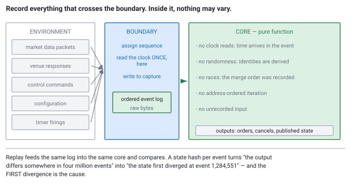
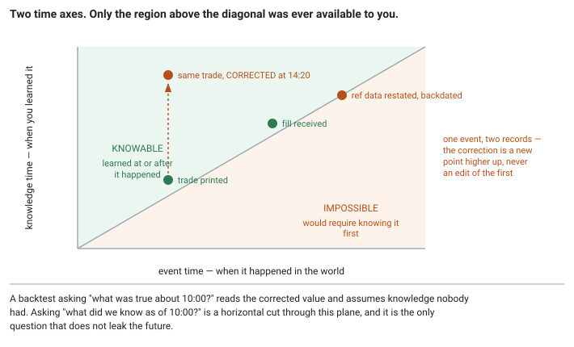

<!--
chapter: e4-deterministic-replay
state: draft_created
contract: standards/chapter-contract.md
include_measurement_plan: false | include_quizzes: true | primary_artifact_mode: pseudocode
note: final chapter of Module E and of release 1 — carries the module review and the closing section
unresolved_markers: 0
-->

# What Did It See, and Why Did It Do That?

## Deterministic Replay and Incident Reconstruction

**Prerequisites:** [d3] Gap recovery · [d5] Clocks and timestamps · [e1] Idempotency
**Closes Module E and release 1** — carries the module review
**Focus:** determinism is designed in rather than discovered, and the sources of nondeterminism are a short and known list

---

## An order nobody can explain

At 09:41 a strategy sent an order that surprised everyone. It was not wrong exactly — it filled, it was within limits, it lost a modest amount of money — but nobody can say why the strategy wanted it.

The logs show the order and its acknowledgement. They do not show the sixty market-data messages that arrived in the two milliseconds before it, or the state of the book at the instant of the decision, or which of the three conditions in the strategy's logic evaluated true. A senior engineer spends a day reading code and constructs a plausible story. It is plausible and it is not evidence.

The conditions will not recur on demand. Nobody can make the strategy do it again, which means nobody can be sure the fix works — or that there was anything to fix.

This is the difference between a system you can **describe** and one you can **explain**, and it is a design property rather than a logging problem. No amount of additional log lines produces it, because the thing you need is not a record of what the system did. It is the ability to make the system do it again.

## Where you will actually meet this

Three uses, and the second is the one that pays for it daily:

- **Incident reconstruction.** The scenario above. Also the version with a regulator or a risk committee asking, where "we believe it was probably" is not a satisfactory answer.
- **Regression testing against real sessions.** Replay a captured day through a modified strategy and diff the outputs. This is a far stronger test than any synthetic scenario, and it is available every day.
- **Strategy debugging.** Attach a debugger to a replay of the exact moment, with the exact inputs, as many times as you like.

Interviews probe it as "how would you debug something that happened once in production," and the strong answer is structural rather than a list of logging improvements.

## The mental model

Replay works when this is true:

> **output = f(recorded inputs, initial state)**

The processing core must be a **pure function** of things you captured. If any output depends on something you did not record, the replay diverges, and a replay that diverges is worse than none — it tells you a confident and wrong story.

So the design question is: what makes a real system fail to be that function? The answer is a short, enumerable list, which is the encouraging part of this chapter.

**Reading the clock.** The most common one. A strategy that branches on the current time produces different behaviour on replay by construction, because the replay happens later.

**Randomness.** Any unseeded or time-seeded source.

**Thread interleaving.** Two threads writing to shared state produce an order determined by the scheduler. Even with correct synchronisation ([b1]), *which* thread won is not reproducible.

**Iteration over addresses.** Iterating a hash container whose ordering depends on pointer values, or sorting with an address-based tiebreak. Address-space layout randomisation makes this differ per run.

**Uninitialised memory.** Behaviour depending on whatever was in a buffer.

**Unrecorded inputs.** The one people miss, and the one that produces the most confusing divergences. Configuration read at startup, a control command a human sent mid-session, a venue response, a timer firing, a file on disk. **If it enters the core and you did not record it, it is a source of nondeterminism** — regardless of how boring it is.

## Part 1 — Designing for it

The design has three parts, and the first is the one that makes the rest possible.

**Draw a boundary and record everything that crosses it.** Everything outside is the environment; everything inside must be pure. The boundary is usually just inside the network and I/O layer — raw packets in, orders out, plus every control input.

```
// The shape. Everything the core sees arrives as a recorded event.
struct Event {
    Seq        seq;            // total order, assigned at the boundary
    Timestamp  captured_at;    // the clock is DATA, not something the core reads
    EventType  type;           // market data | venue response | control | timer
    bytes      payload;        // the raw bytes, not a parsed structure
};

// Live
loop:
    ev = read_from_environment()      // socket, control channel, timer
    ev.seq = next_seq()
    ev.captured_at = clock.now()      // read HERE, at the boundary, once
    capture.write(ev)                 // off the critical path (b2)
    core.apply(ev)                    // pure: no clock, no random, no I/O

// Replay
for ev in capture.read_all():
    core.apply(ev)                    // identical inputs, identical outputs
```

**Make time an input.** The core never calls `now()`. It receives the timestamp as part of the event and uses that. This single change removes the largest source of nondeterminism, and it has a pleasant side effect: the core becomes trivially testable, because you can hand it any time you like.

Timers need the same treatment. A timer firing is an *event* with a recorded sequence position, not a callback that happens whenever the OS gets around to it.

**Make the merge order a recorded fact.** The thread-interleaving problem sounds like it forces a single-threaded design, and it does not quite. What it forces is that **the order in which inputs reach the core must be recorded rather than raced.** One thread assigns sequence numbers at the boundary and the core consumes that ordered stream. Feed handlers can still run on their own threads; what they may not do is decide the merge order by winning a race.

This is why the [b2] queue and the single-writer discipline matter here as well as for performance: a design where one thread owns the ordering is a design that can be replayed. <!-- CALLBACK: b2 -->


*Figure e4-1 — Everything crossing the boundary is recorded, including the boring inputs. Inside, the core reads no clock, wins no races, and depends on nothing that was not captured.*

**Capture raw bytes, not parsed structures.** If you record the parsed message, you cannot replay a parser bug — the replay uses the record your parser produced, so it reproduces the misinterpretation without revealing it. Record the wire bytes and let the replay parse them again ([d1]).

## Part 2 — What replay cannot do

An important limit, and getting it wrong is how replay gets over-trusted.

**Replay reproduces your system. It does not reproduce the market.**

The captured session records how the market behaved *given the orders you actually sent*. If you replay with a modified strategy that sends a different order, everything after that point in the capture is wrong — the venue would have responded differently, other participants would have reacted, and your fill may not have occurred at all.

So replay answers *"what would my system have done with these inputs?"* with complete fidelity, and *"what would have happened if I had traded differently?"* not at all. The second question is simulation, needs a market model, and is where backtesting's hardest problems live (deferred to release 2).

Which gives a clean rule: **replay is exact for output comparison and unreliable for counterfactuals.** Regression testing sits firmly in the first category — same inputs, same code path, diff the outputs — which is why it is the highest-value routine use.

---

**Quiz 1**

Find the sources of nondeterminism:

```cpp
void Strategy::on_book_update(const Book& book) {
    auto now = std::chrono::system_clock::now();
    if (now - last_quote_time_ < std::chrono::milliseconds(50)) return;

    for (const auto& [symbol, position] : positions_) {      // unordered_map
        if (position.size > limit_) reduce(symbol);
    }

    if (book.best_bid() > fair_value_ + spread_) {
        const auto id = "ORD-" + std::to_string(rand());
        send_order(id, book.best_bid(), size_);
    }
    last_quote_time_ = now;
}
```

> **Answer**
>
> **Four, and they are not equally obvious.**
>
> **1 — `system_clock::now()`.** The replay runs at a different wall-clock time, so the 50ms throttle evaluates differently and a different set of updates is skipped. *Fix:* take the timestamp from the event.
>
> **2 — `rand()`.** Unseeded or time-seeded, and it produces a different order ID — which also violates [e1]'s uniqueness requirement, so this is a live bug as well as a replay one. *Fix:* the deterministic scheme from [e1]: date, instance, monotonic counter.
>
> **3 — Iteration over `positions_`.** An `unordered_map`'s iteration order depends on hashing and insertion history, and for pointer-like keys it varies with address layout between runs. So `reduce()` may be called on symbols in a different order — and if `reduce` has any order-dependent effect, such as consuming a shared budget, the outcome differs. *Fix:* iterate a sorted or insertion-ordered container, or sort the keys.
>
> **4 — `last_quote_time_` is state carried across calls.** Not nondeterministic in itself, but it means the core has hidden state, so replay must start from a **known initial state** rather than from whatever the process happened to hold. *Fix:* snapshot the core's state at capture start, or begin the capture from a defined reset point.
>
> **The one people miss is number 3.** The clock and the random are obvious once you are looking. Container iteration order is invisible at the call site, produces a divergence far from its cause, and is entirely reproducible *within* a run — so it hides in testing and surfaces only when you compare two runs.

---

## Part 3 — Two times, and why research needs both

Everything so far treats an event as having *a* time. In a research system it has two, and conflating them is how a backtest quietly learns the future.

**Event time** is when the thing happened in the world: the exchange stamped the trade at 10:00:03.

**Knowledge time** — also called transaction time, or as-of time — is when *your system learned it*: the trade arrived and was recorded at 10:00:03.0004.

Most of the time they differ by a network hop and nobody cares. The cases where they differ a lot are the ones that matter:

- **A trade is reported late, or corrected** hours after the fact. The event time stays 10:00:03; the correction has a knowledge time of 14:20.
- **Reference data is restated** — a tick size, a lot size, a symbol mapping, a corporate action — backdated to be effective from a past date and published today.
- **A fill is amended** by the venue after a trade break.
- **A position is restated** during end-of-day reconciliation.

In each case there are now **two records describing one event**, differing in what was known and when.


*Figure e4-2 — A fact sits at a point in two dimensions. Only the region on or above the diagonal was ever available to you, and a correction is a new point higher up rather than an edit of the original.*

### Why this is a lookahead problem, not a bookkeeping one

A researcher backtests a strategy over yesterday. At 10:05 in the simulation, the strategy asks for the trade price at 10:00:03.

If the store is keyed by event time alone, it returns the **corrected** price — the one published at 14:20. The strategy decides using a number that did not exist for another four hours. The backtest looks slightly better than reality, and there is no error anywhere to find.

That is **lookahead bias** in its most insidious form. Not a bug in the strategy, not a bug in the backtester, not visible in any test — a property of the question the storage layer was asked. And it compounds: restated fundamentals, an instrument list that reflects who survived, a symbol mapping that already knows about a later merger. Each contributes a small optimism, and the result is a strategy that performs beautifully in research and disappoints in production for reasons nobody can isolate.

The fix is to store both times and make the query state which one it means:

- **"What was true about time T?"** — event time only. Correct for post-hoc analysis, reporting, and reconciliation, where you want the best information available *now*.
- **"What did we know as of time T?"** — a horizontal cut through the plane above, filtered to records whose knowledge time is at or before T. **The only question a backtest may ask.**

```
// Bitemporal record: never updated in place, only appended.
struct Record {
    Timestamp event_time;        // when it happened in the world
    Timestamp knowledge_time;    // when we learned it
    Value     value;
};

// Point-in-time query: what a system running at as_of would have seen.
value_as_of(key, event_time, as_of):
    candidates = records(key)
                 where r.event_time     <= event_time
                   and r.knowledge_time <= as_of        // <-- the whole point
    return latest_by(candidates, r.knowledge_time)      // newest thing we knew THEN

// Current-best query: for reporting. Never for a backtest.
value_now(key, event_time):
    return latest_by(records(key) where r.event_time <= event_time, r.knowledge_time)
```

Two design consequences follow, and they are the parts engineers own.

**Storage is append-only.** A correction never overwrites the original; it is a new row with a later knowledge time. Overwriting destroys the ability to answer the point-in-time question at all — permanently, and with no repair afterwards, because the information is simply gone. This is the single most common way research infrastructure is built wrong, and it is usually done for the entirely reasonable-sounding reason that the new value is the correct one.

**The point-in-time query must be the default.** This is the interface decision that determines whether the discipline survives contact with a deadline. If `get_price(symbol, time)` returns the current best value and a separate `get_price_as_of(symbol, time, knowledge_time)` exists for the careful case, then under time pressure people call the first — their backtest is optimistic, and nobody notices for months. **Make the safe call the short one**, and make the unsafe one require an explicit argument a reviewer can see.

### How this relates to replay

Replay and backtesting use the two times differently, and the distinction clarifies both.

**Replay is a knowledge-time exercise.** The capture from Part 1 *is* a knowledge-time log — events in the order your system learned them, which is precisely what makes replay faithful. A correction that arrived at 14:20 is replayed at 14:20, and your system reacts to it there, because that is what it did.

**Backtesting is an event-time exercise constrained by knowledge time.** It steps through market events in event-time order, and every lookup it performs must be filtered by knowledge time so it cannot read the future.

Which gives a clean division: **replay answers "what did my system do?" exactly**, while **backtesting asks "what would a system have done?"** — a question that requires reconstructing the information state at every moment, and one that is only answerable if the data was stored bitemporally in the first place.

That is why this sits in an engineering handbook rather than a research one. Researchers ask the questions; whether the questions are answerable was decided by an engineer years earlier, when they chose whether corrections would be appended or applied in place. Backtesting methodology proper is deferred to release 2 — the storage decision that makes it possible cannot be, because it is unrecoverable.

---

## Part 4 — When the replay diverges

It will, and how quickly you localise it determines whether replay is a tool or a curiosity.

The technique is **state hashing**. After processing each event, compute a cheap hash of the core's state — positions, book checksums, strategy variables — and record it alongside the event during capture. On replay, compute the same hash and compare.

```
// Capture: record a state fingerprint per event.
core.apply(ev)
capture.write_hash(ev.seq, core.state_hash())

// Replay: compare, and stop at the FIRST divergence.
core.apply(ev)
if core.state_hash() != capture.hash_for(ev.seq):
    report_divergence(ev.seq)        // the first one is the cause
    break                            // everything after is consequence
```

That turns "the output is different somewhere in four million events" into "the state first diverged at event 1,284,551", which is a debuggable question. Without it you are bisecting by hand.

**The first divergence is the cause; everything after it is consequence.** Chasing a later, larger discrepancy is a common way to lose a day.

And when a routine replay diverges, the default assumption should be that **the system has a nondeterminism defect**, not that the replay tool is broken. That is the finding, and it is usually one of the five sources.

---

**Quiz 2**

Your nightly regression replays yesterday's session through the current build. It has passed every night for months. Tonight it diverges at event 2.4 million of 4 million.

The strategy code has not changed. The build differs only in a library upgrade.

How do you proceed, and what does the divergence most likely indicate?

> **Answer**
>
> **First, trust the divergence.** The replay passing for months establishes that the harness works and the system was deterministic. A new divergence is evidence about the *change*, not about the tool.
>
> **Localise before theorising.** The state hashes give the first diverging event. Dump the core's state at the preceding event from both runs and diff them — which component's state differs first is usually enough to identify the cause without reading any code.
>
> **What it most likely indicates:** the library upgrade introduced nondeterminism the strategy was unknowingly relying on. Common causes, roughly in order of likelihood:
>
> - **A container's iteration order changed** — a different hash function or growth policy in the new version. Quiz 1's number 3, arriving via a dependency rather than your own code. If the strategy iterates and the order affects the outcome, this is it.
> - **Floating-point results changed** — a math function implemented differently, or different instruction selection, altering the last bits. A comparison against a threshold then flips, and the divergence appears far from the arithmetic ([d1]'s argument for integer prices applies here too).
> - **A default changed** — a seed, a thread count, an ordering guarantee that was never guaranteed but happened to hold.
>
> **The important reframing:** this is not a broken test. **The nightly replay just found a real behaviour change that no other test would have caught**, and it found it before it reached production. That is precisely what it is for. The strategy's behaviour depended on something unspecified, the dependency changed, and the behaviour changed with it.
>
> The fix is to remove the dependency on the unspecified thing — sort the iteration, use exact arithmetic, pin the seed — rather than to update the expected output, which is the tempting response and destroys the value of the test.

---

## Common mistakes

**Believing detailed logs are equivalent.** Logs record what happened; replay makes it happen again.

**Reading the clock in the core.** The largest single source, and the easiest to fix.

**Recording parsed messages instead of raw bytes.** Makes parser bugs unreplayable.

**Forgetting non-market inputs.** Configuration, control commands, timers, venue responses. All inputs.

**Letting the merge order be a race.** Record the order; do not reproduce a race.

**Deciding to add determinism later.** It is a structural property. Retrofitting means changing how every component gets its inputs.

**Trusting replay for counterfactuals.** It reproduces your system, not the market.

**Storing one timestamp in research data.** Corrections then overwrite history, and the point-in-time question becomes permanently unanswerable.

**Making the current-best query the convenient one.** People reach for the short name under deadline, and the backtest silently reads the future.

**Chasing a later divergence.** The first one is the cause.

**Updating expected output when a replay diverges.** Quiz 2. It converts a working detector into decoration.

## Operational behaviour

- **Capture off the critical path**, and never let a slow capture sink stall trading. Same handoff-and-policy question as any other off-path work ([a1], [d4]).
- **Record the binary identity with the capture** — build hash, version, configuration. A capture you cannot pair with the code that produced it is much harder to use.
- **Run replay nightly against the previous session.** It is the highest-value routine test available and it costs nothing once the capture exists.
- **Treat any divergence as a defect** until proven otherwise, and never by editing the expected result.
- **Retain captures long enough to cover your inquiry window** — incidents are sometimes raised long after the day in question.
- **Keep raw packets**, not only decoded messages ([d1]).

## When not to build this

- **For components whose failures are cheap to reproduce.** A config loader does not need it.
- **Where the design constraint outweighs the benefit.** Purity has a cost, and some components are not worth restructuring for it.
- **For counterfactual questions.** That is simulation and needs a market model.
- **As a substitute for tests.** Replay shows the system behaves as it did; it says nothing about whether that was correct ([b7]).

## Interview mapping

- **Say determinism is designed in**, and enumerate the sources: clock, randomness, thread interleaving, address-dependent iteration, unrecorded inputs. The enumeration is the answer.
- **Say the clock must be an input.** Concrete, high-value, and it demonstrates you have built this.
- **Describe the capture boundary** and that raw bytes are recorded rather than parsed structures.
- **Raise state hashing** for localising divergence. Few candidates offer it and it is what makes replay practical.
- **State what replay cannot establish** — counterfactuals. Volunteering a limit of your own technique reads as senior.
- **Mention nightly regression against real sessions.** It reframes replay from an incident tool to a daily one.
- **Raise event time versus knowledge time** if research data comes up. Say that corrections are appended rather than applied, and that the point-in-time query should be the default — it is a design decision with an unrecoverable failure mode, which is exactly the kind of thing an interviewer wants to hear an engineer worry about.

## Summary

The difference between a system you can describe and one you can explain is whether you can make it do the thing again. That is not a logging property — it is the structural property that the core is a pure function of recorded inputs and a known initial state.

Getting there means enumerating what breaks purity, and the list is short: reading the clock, randomness, thread interleaving, iteration whose order depends on addresses, uninitialised memory, and inputs you did not think to record. Each has a standard remedy. Time becomes an event field rather than a call. Ordering becomes a sequence number assigned at a boundary rather than the outcome of a race. Every input crossing the boundary is captured as raw bytes, including the boring ones — configuration, control commands, timers, venue responses.

The payoff is larger than incident reconstruction, which is what motivates it. A nightly replay of yesterday's session through today's build is the strongest regression test available, because the inputs are real, and it catches behaviour changes — a container's iteration order, a floating-point result, a changed default — that no synthetic test would produce.

There is a second time axis that matters the moment this data reaches research. A fact has an event time and a knowledge time, and only storing the first means a correction overwrites what you used to believe — which makes the question a backtest must ask, *what did we know then*, permanently unanswerable. Append corrections rather than applying them, and make the point-in-time query the one with the short name, because the convenient call is the one people make under deadline.

And it has an honest limit worth stating: replay reproduces your system, not the market. It answers what your system would have done with these inputs, exactly. It cannot answer what would have happened had you traded differently, because the market's response to a different order is not in the recording.

---

# Module E in review

*Module E is what the system does with the data Module D delivered, and what it must be able to say afterwards. Read this now, and again before an interview.*

## The arc

**[e2] Order-book construction.** The representation follows from the access pattern: the touch is read constantly, updates cluster near it, deep levels are dead weight. At these sizes contiguity beats complexity by two orders of magnitude. Maintain the top incrementally, publish per packet rather than per message, and treat a crossed book as evidence of desynchronisation rather than data to clean up.

**[e1] Idempotency.** A timeout is indistinguishable from a slow response, so retries go into an unknown state. Exactly-once delivery does not exist; exactly-once *effect* does, through a client-assigned identity persisted before the send. Cancels are naturally idempotent and new orders are not.

**[e3] Pre-trade risk.** The one check that cannot leave the critical path, because a check completing after the order is irreversible is monitoring rather than control. Bounded rather than fast. Exposure counted before the send, released only on terminal rejection, and overcounting as the safe direction.

**[e4] Deterministic replay.** Determinism is designed in. Time becomes an input, ordering becomes a recorded fact, and every input crossing the boundary is captured as raw bytes — which turns incident reconstruction from storytelling into evidence and yields a nightly regression test with real data.

## The recurring ideas

**1. Risk-reducing operations must always be available.** Cancels get reserved pool capacity ([c2]), retrying a cancel is safe by construction ([e1]), and a kill switch must not route through the system it stops ([e3]). The asymmetry is structural rather than a convention: creating exposure is a state change and removing it is a state assertion, so the second is naturally idempotent and the first is not.

**2. Derived state is silently wrong, so check invariants.** The book is derived from a message stream ([e2]), exposure is derived from orders sent ([e3]), and local order state is derived from venue responses ([a2]). Each can drift, none announces it, and cheap invariant checks — crossed book, exposure versus position, live-order counts — are the only things that surface the drift. **Report violations; never clamp them.**

**3. Identity is what makes repetition safe.** A client order ID makes a retry harmless ([e1]); an execution ID makes a redelivered fill harmless ([e1]); a sequence number makes a duplicate packet harmless ([d3]). In each case the fix is not to prevent repetition but to make it recognisable.

**4. Prefer the error that fails toward safety.** Overcount exposure ([e3]). Cancel when uncertain ([e1]). Mark the book untrusted rather than publishing it ([e2], [d3]). In each case one direction costs opportunity and the other costs money, and knowing which is which is the engineering judgement.

**5. If you cannot make it happen again, you cannot claim to understand it.** [e4]'s thesis, and it applies backwards through the whole book: the concurrency bug you cannot reproduce ([b7]), the latency spike you cannot attribute ([a4]), the book that is wrong for reasons you cannot reconstruct ([d3]). Reproducibility is what turns a plausible story into a finding.

## Choosing under uncertainty

| Situation | Do this |
|---|---|
| Timeout on a new order | Retry with the **same** client order ID; never a new one ([e1]) |
| Timeout on a cancel | Retry freely — idempotent by construction ([e1]) |
| State unknown after reconnect | Reconcile against the venue; assume nothing ([a2], [e1]) |
| Book invariant violated | Untrusted, resynchronise, count it ([e2], [d3]) |
| Exposure counting ambiguous | Overcount ([e3]) |
| Order path uncertain, risk rising | Cancel — the safe direction ([e1], [e3]) |
| Cannot reproduce an incident | The system is not replayable; that is the defect ([e4]) |

## Check yourself

1. Why does a sorted array beat `std::map` for an order book at forty levels?
2. Why publish per packet rather than per message?
3. What does a crossed book tell you, and what should you do?
4. Why does a timeout carry no information about whether your order exists?
5. Why is exactly-once delivery impossible and exactly-once effect achievable?
6. Design a client order ID that survives restarts and concurrent instances.
7. Why is retrying a cancel safe when retrying a new order is not?
8. Why can pre-trade risk not run asynchronously?
9. When is exposure incremented, and what fails if you get it wrong?
10. Enumerate the sources of nondeterminism in a trading process.
11. Why record raw bytes rather than parsed messages?
12. What can replay not tell you?

---

# Release 1 complete

That is the whole map from [a1] filled in.

A packet arrives from an exchange over a transport chosen for fairness rather than speed ([d2]). It is decoded from a framing contract into prices that are integers because they must be exact ([d1]), checked against a sequence number that tells you whether your accumulated view is still trustworthy ([d3]), and handed between threads through a queue whose correctness rests on two release-acquire pairs ([b1], [b2]) and whose performance rests on two words sitting on different cache lines ([a6]).

It updates a book whose representation was chosen by counting cache lines rather than comparing complexity ([e2], [a5]), on memory that was preallocated and pre-touched so nothing faults during trading ([c1], [c2]), on a thread pinned to a core the scheduler cannot take away ([c4]), on a socket whose home node was decided by whichever thread first wrote to the page ([c5]).

A strategy reads it and decides. A risk check that cannot be moved off the path and must be bounded rather than fast lets it through, counting the exposure before the message leaves ([e3]). An order goes out carrying an identity that makes a retry harmless ([e1]), and the system records enough to explain afterwards exactly what it saw and why it did that ([e4]).

None of it is exotic. It is operating systems, computer architecture, networks, data structures, concurrency, and distributed systems — applied under a constraint that changes which answer is correct, and measured against a worst case rather than an average, because the worst case is when the market is moving and the decisions are worth the most.

**Deferred to release 2:** backtesting methodology and columnar storage — the research side, which needs everything here and asks different questions of it.

**Related:** [e1] idempotency · [e2] order-book construction · [e3] pre-trade risk · [a1] system anatomy · [a2] order lifecycle · [a4] measurement · [b2] SPSC ring buffers · [b7] testing concurrent code · [d1] market data and protocols · [d3] gap recovery · [d4] batching and overload · [d5] clocks and timestamps

## References

- Venue specifications define drop-copy and order-status facilities, which are what a capture must be reconciled against. *(Stage 1 source pack.)*
- Regulatory record-keeping and reconstruction obligations vary by jurisdiction and are the authority for retention periods and required fidelity.
